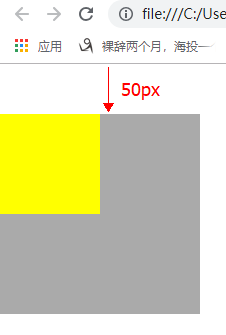

# BFC的概念及案例

## BFC的概念

BFC(Block formatting context)直译为“块级格式化上下文”。它是一个独立的渲染区域，只有Block-level box（块）参与， 它规定了内部的Block-level Box如何布局，并且与这个区域外部毫不相干。

### BFC的布局规则

- 内部的Box会在垂直方向，一个接一个地放置。
- Box垂直方向的距离由margin决定。属于同一个BFC的两个相邻Box的margin会发生重叠
- 每个元素的margin box的左边， 与包含块border box的左边相接触
- BFC的区域不会与float box重叠。
- BFC就是页面上的一个隔离的独立容器，容器里面的子元素不会影响到外面的元素。
- 计算BFC的高度时，浮动元素也参与计算，所以会清除浮动。

### 哪些元素或属性能触发BFC

- 根元素 html
- float属性不为none
- position为absolute或fixed
- display为inline-block, table-cell, table-caption, flex, inline-flex
- overflow不为visible


## 案例一：两栏布局

**要求：左边固定宽度，右边宽度可变。**

**方式一：**

思路：左边固定宽度，浮动；右边不设置宽度，设置margin-left空出左边的宽度。

```html
<!DOCTYPE html>
<html>

<head>
    <meta charset="UTF-8">
    <title>Document</title>
    <style>
        * {
            margin: 0;
            padding: 0;
        }

        .dv1 {
            width: 200px;
            height: 500px;
            background-color: pink;
            float: left;
        }

        .dv2 {
            margin-left: 200px;
            height: 500px;
            background-color: peru;
        }
    </style>
</head>

<body>
    <div class="dv1"></div>
    <div class="dv2"></div>
</body>

</html>
```


**方式二：**

思路：BFC的区域不会与float box重叠。所以将右边设置为BFC区域。

这里是有 absolute 绝对定位。

```css
body {
	position: relative;
}

.dv1 {
  width: 200px;
  height: 500px;
  background-color: pink;
  float: left;
}

.dv2 {
  height: 500px;
  background-color: peru;
  position: absolute;
  left: 200px;
  right: 0;
}
```

注意：右边一定要加 right:0;


**方式三：**

思路：使用 overflow不为visible 将右边设置为BFC区域。

```css
.dv1 {
  width: 200px;
  height: 500px;
  background-color: pink;
  float: left;
}

.dv2 {
  height: 500px;
  background-color: peru;
  overflow: hidden;
}
```


## 案例二：三栏布局

**要求：左边固定宽度，右边固定宽度，中间宽度自适应。**


**方案一：**

思路：使用两栏布局的方案一

```html
<!DOCTYPE html>
<html>

<head>
    <meta charset="UTF-8">
    <title>Document</title>
    <style>
        * {
            margin: 0;
            padding: 0;
        }

        .dv1 {
            width: 200px;
            height: 500px;
            background-color: pink;
            float: left;
        }

        .dv2 {
            height: 500px;
            background-color: peru;
            margin-left: 200px;
            margin-right: 200px;
        }

        .dv3 {
            width: 200px;
            height: 500px;
            background-color: pink;
            float: right;
        }
    </style>
</head>

<body>
    <div class="dv1"></div>
    <div class="dv2"></div>
    <div class="dv3"></div>
</body>

</html>
```

可以看到 dv3 掉了下来？？？


为什么呢？因为dv2是块级元素，单独占一行，所以dv3只能显示在下一行。

怎么办呢？我们将dv2和dv3的顺序调换一下，就好了：

```html
<div class="dv1"></div>
<div class="dv3"></div>
<div class="dv2"></div>
```


**方案二：**

思路：使用两栏布局的方案二

```css
body {
  position: relative;
}

.dv1 {
  width: 200px;
  height: 500px;
  background-color: pink;
  float: left;
}

.dv2 {
  height: 500px;
  background-color: peru;
  position: absolute;
  left: 200px;
  right: 200px;
}

.dv3 {
  width: 200px;
  height: 500px;
  background-color: pink;
  float: right;
}
```


**方案三：**

思路：使用两栏布局的方案三

```css
.dv1 {
  width: 200px;
  height: 500px;
  background-color: pink;
  float: left;
}

.dv2 {
  height: 500px;
  background-color: peru;
  overflow: hidden;
}

.dv3 {
  width: 200px;
  height: 500px;
  background-color: pink;
  float: right;
}
```

结果也是dv3 被挤了下来。调换dv2和dv3的顺序即可。


**方案四：**

思路：使用弹性布局

```html
<!DOCTYPE html>
<html>

<head>
    <meta charset="UTF-8">
    <title>Document</title>
    <style>
        * {
            margin: 0;
            padding: 0;
        }

        body {
            display: flex;
        }

        .dv1 {
            width: 200px;
            height: 500px;
            background-color: pink;
        }

        .dv2 {
            width: 100%;
            height: 500px;
            background-color: red;
            flex: 1;
        }

        .dv3 {
            width: 200px;
            height: 500px;
            background-color: pink;
        }
    </style>
</head>

<body>
    <div class="dv1"></div>
    <div class="dv2"></div>
    <div class="dv3"></div>
</body>

</html>
```


## 案例三：解决父元素与子元素之间的margin-top问题

原文链接：https://www.cnblogs.com/ranyonsue/p/5461749.html


### 问题描述

父元素的盒子包含一个子元素盒子，给子元素盒子一个垂直外边距margin-top的时候，父元素盒子也会往下走margin-top的值，而子元素和父元素的边距则没有发生变化，如下图：


 


源代码：

```html
<!DOCTYPE html>
<html lang="en">

<head>
  <meta charset="UTF-8">
  <meta name="viewport" content="width=device-width, initial-scale=1.0">
  <meta http-equiv="X-UA-Compatible" content="ie=edge">
  <title>Document</title>
  <style>
    body,
    html {
      padding: 0;
      margin: 0;
    }

    .parent {
      width: 200px;
      height: 200px;
      background-color: #aaa;
    }

    .children {
      width: 100px;
      height: 100px;
      background-color: yellow;
      margin-top: 50px;
    }
  </style>
</head>

<body>
  <div class="parent">
    <div class="children"></div>
  </div>
</body>

</html>
```


### 原文分析

官方介绍：

In this specification, the expression *collapsing margins* means that adjoining margins (no non-empty content, padding or border areas or clearance separate them) of two or more boxes (which may be next to one another or nested) combine to form a single margin. 

**所有毗邻的两个或更多盒元素的margin将会合并为一个margin共享之。**

毗邻的定义为：同级或者嵌套的盒元素，并且它们之间没有非空内容、Padding或Border分隔。

这就是原因了。“嵌套”的盒元素也算“毗邻”，也会 Collapsing Margins。这个合并Margin其实很常见，就是文章段落元素`<p/>`，并列很多个的时候，每一个都有上下1em的margin，但相邻的`<p/>`之间只会显示1em的间隔而不是相加的2em。


### 解决办法

这个问题的避免方法很多，只要破坏它出现的条件就行。给 **Outer Div** 加上 padding/border，或者给 **Outer Div / Inner Div** 设置为 float/position:absolute(CSS2.1规定浮动元素和绝对定位元素不参与Margin折叠)。


1、修改父元素的高度，增加 padding-top 样式模拟（padding-top：1px；常用）  

2、为父元素添加 overflow: hidden；样式即可（完美）  

3、为父元素或者子元素声明浮动（float：left；可用）  

4、为父元素添加 border-top（border-top: 1px solid transparent; 可用） 

 5、为父元素或者子元素声明绝对定位 。


## 案例四：清除浮动

来自笔记：CSS/03-链接伪类、背景、行高、盒子模型、浮动


清除浮动不是不用浮动，清除浮动产生的问题。
> 问题：当父盒子没有定义高度，嵌套的盒子浮动之后，下边的元素发生位置错误（占据父盒子的位置）。


### 方法一

**额外标签法：**在最后一个浮动元素后添加标签。

```css
clear: left  |  right  | both  /*用的最多的是clear:both;*/
```


### 方法二

给浮动元素的父集元素使用`overflow:hidden;`

> 注意：如果有内容出了盒子，不能使用这个方法。


### 方法三（推荐使用）

伪元素清除浮动。

> : after 相当于在当前盒子后加了一个盒子。


### 清除浮动总结：

1. 给父元素高度，缺点：高度无法自适应
2. 父元素加 overflow:hidden; 缺点：超出会被隐藏
3. 父元素加定位，absolute/fixed，缺点：脱离文档流。
4. 父元素加浮动，缺点：可能父元素的父元素继续塌陷
5. 父元素加inline-block，缺点：行内块的缺点。
6. 浮动元素的最后加一个额外标签，标签使用clear:both; 缺点：结果冗余
7. 万能清除法，伪元素清除浮动。

```css
content: ".";
display: block;
height: 0;
visibility: hidden;
clear:both;
overflow: hidden;
```