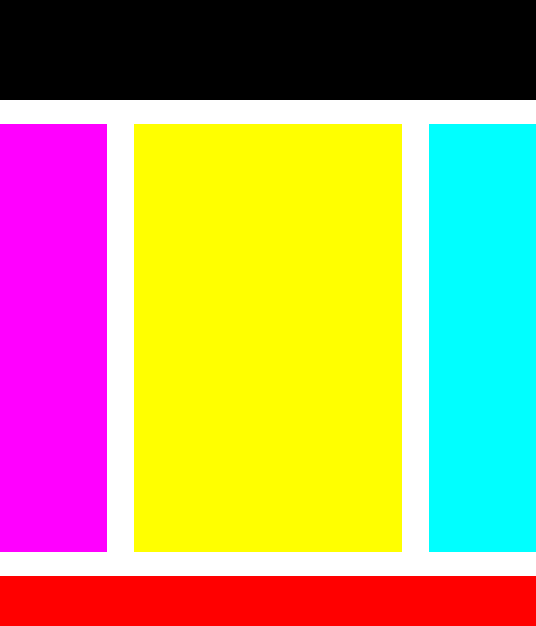
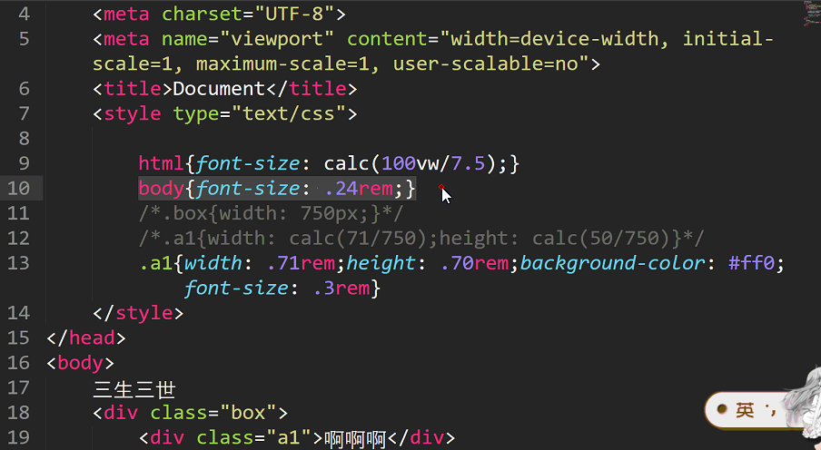

1、弹性布局，子元素设置宽度，但是不设置高度的话，**子元素的高度继承父元素的高度**。

2、主要看css3的属性，display不是css3的，flex才是。

```css
display: -webkit-flex;
display: -moz-flex;
display: -ms-flex;
display: -o-flex;
display: flex;

-webkit-transition:1s;
-moz-transition:1s;
-ms-transition:1s;
-o-transition:1s;
transition:1s
```


3、主轴方向为横向时，如果一个div同时设置了width和flex:1;的话，按谁的来？

- **不论设置的宽度大于或者小于剩余的宽度，这个div都是按照flex，占据剩余的空间。**
- **如果两个div，a和b，设置的宽度大于剩余的空间，并且a的flex:1; b的flex:2;那么a和b都会缩放，缩放后a和b的宽度比为 1:2.**
- **如果两个div，a和b，设置的宽度小于剩余的空间，并且a的flex:1; b的flex:2;那么a和b都会放大，放大后a和b的宽度比为 1:2.**


4、三栏布局，左右固定宽度，中间自适应，但是和左右有间距。

- 方式1：左右宽度固定，中间flex:1; 然后设置margin值。
- 方式2：左右宽度固定，中间flex:0.9; 然后在三栏布局的父盒子设置 justify-content:space-between; 即可。

代码：

```html
<!DOCTYPE html>
<html>

<head>
    <meta charset="UTF-8">
    <meta name="viewport" content="width=device-width, initial-scale=1.0">
    <meta http-equiv="X-UA-Compatible" content="ie=edge">
    <title>Document</title>
    <style>
        * {
            padding: 0;
            margin: 0;
        }

        html,
        body {
            height: 100%;
        }

        body {
            display: -ms-flex;
            display: -webkit-flex;
            display: -o-flex;
            display: -moz-flex;
            display: flex;
            flex-direction: column;
            justify-content: space-between;
        }

        header {
            width: 100%;
            height: 100px;
            background-color: #000;
        }

        main {
            width: 100%;
            flex: 0.9;
            background-color: #fff;

            display: flex;
            justify-content: space-between;
        }

        footer {
            width: 100%;
            height: 50px;
            background-color: #f00;
        }

        .left {

            flex: 0.2;
            background-color: #f0f;
        }

        .middle {
            flex: 0.5;
            background-color: #ff0;
        }

        .right {
            flex: 0.2;
            background-color: #0ff;
        }
    </style>
</head>

<body>
    <header></header>
    <main>
        <div class="left"></div>
        <div class="middle"></div>
        <div class="right"></div>
    </main>
    <footer></footer>
</body>

</html>
```




5、`width: -webkit-calc(100%/2 - 2px);` 属性：可以接受加减乘除。

**注意：减号之间要有空格。记得加-webkit-等。**


6、支付宝上下固定，中间可以滑动。示例图如下：


思路1：

- 上下 fixed 定位。


思路2：

- 上中下三栏布局，上下固定，中间 flex:1;
- 设置中间内容 overflow-y:scroll; 如果内容超出了就可以上下滑动。


​	

7、设置字体随着页面的缩放而缩放。

如下图：UI设计稿为750px。a1的宽高在UI设计稿的尺寸为71px和70px。

如下代码可在不同尺寸的显示器上，图片字体等都可以等比例缩放。

如果




示例：上面支付宝的稿件UI尺寸为750px，使用上面的方式进行代码编写。

代码：

```html
<!DOCTYPE html>
<html>

<head>
    <meta charset="UTF-8">
    <meta name="viewport" content="width=device-width, initial-scale=1.0">
    <meta http-equiv="X-UA-Compatible" content="ie=edge">
    <title>Document</title>
    <link rel="stylesheet" href="./css/base.css">

    <style>
        html {
            font-size: calc(100vw/7.5);
        }

        body {
          /*由于UI是2倍图。字体大小为12px，所以这里是24/100*/
            font-size: 0.24rem;
        }

        html,
        body {
            height: 100%;
            display: flex;
            flex-direction: column;
        }

        .header {
            width: 100%;
        }

        .header li {
            height: 2.52rem; /*li的高度是可变的，测量原图li的高度为252px*/
            text-align: center;
            width: 25%;
            float: left;
            background-color: #3F454F;
            display: flex;
            flex-direction: column;
            justify-content: center;
            align-items: center;
        }

        .header li i {
            display: inline-block;
            width: 0.7rem;                  /*原背景图的宽高为70px和69px*/
            height: 0.69rem;
            background: url('./images/sys.png') no-repeat;
            background-size: 0.7rem 0.69rem;
            margin-bottom: 0.3rem;
        }

        .header li p {
            color: #fff;
        }

        .main {
            flex: 1;
            width: 100%;
            overflow-y: scroll;
            opacity: 0.5;
        }

        .main li {
            float: left;
            width: 25%;
            height: 1.79rem;
            border-right: 1px solid #ccc;
            border-bottom: 1px solid #ccc;
            box-sizing: border-box;
            display: flex;
            flex-direction: column;
            justify-content: center;
            align-items: center;
        }

        .main li i {
            display: inline-block;
            width: 0.49rem;
            height: 0.49rem;
            background: url('./images/fly.png') no-repeat;
            background-size: 0.4rem 0.49rem;
            margin-bottom: 0.3rem;
        }

        .main li p {
            color: #3F454F;
        }

        .main li:nth-of-type(4n) {
            border-right: 0;
        }

        .main li:nth-last-of-type(-n+4) {
            border-bottom: 0;
        }

        .footer {
            width: 100%;
            border-top: 1px solid #ccc;
        }

        .footer li {
            height: 1rem;
            width: 25%;
            float: left;
            display: flex;
            flex-direction: column;
            justify-content: center;
            align-items: center;
        }

        .footer li i {
            display: inline-block;
            width: 0.44rem;
            height: 0.44rem;
            background: url("./images/zfb.png") no-repeat;
            background-size: 0.44rem 0.44rem;
        }

        .footer li p {
            color: #00AAEE;
        }
    </style>
</head>

<body>
    <div class="header">
        <ul class="clearfix">
            <li>
                <i></i>
                <p>扫一扫</p>
            </li>
            <li>
                <i></i>
                <p>扫一扫</p>
            </li>
            <li>
                <i></i>
                <p>扫一扫</p>
            </li>
            <li>
                <i></i>
                <p>扫一扫</p>
            </li>
        </ul>
    </div>
    <div class="main">
        <ul>
            <li>
                <i></i>
                <p>机票火车票</p>
            </li>
            <li>
                <i></i>
                <p>机票火车票</p>
            </li>
            <li>
                <i></i>
                <p>机票火车票</p>
            </li>
            <li>
                <i></i>
                <p>机票火车票</p>
            </li>
            <li>
                <i></i>
                <p>机票火车票</p>
            </li>
            <li>
                <i></i>
                <p>机票火车票</p>
            </li>
            <li>
                <i></i>
                <p>机票火车票</p>
            </li>
            <li>
                <i></i>
                <p>机票火车票</p>
            </li>
            <li>
                <i></i>
                <p>机票火车票</p>
            </li>
            <li>
                <i></i>
                <p>机票火车票</p>
            </li>
            <li>
                <i></i>
                <p>机票火车票</p>
            </li>
            <li>
                <i></i>
                <p>机票火车票</p>
            </li>
            <li>
                <i></i>
                <p>机票火车票</p>
            </li>
            <li>
                <i></i>
                <p>机票火车票</p>
            </li>
            <li>
                <i></i>
                <p>机票火车票</p>
            </li>
            <li>
                <i></i>
                <p>机票火车票</p>
            </li>
            <li>
                <i></i>
                <p>机票火车票</p>
            </li>
            <li>
                <i></i>
                <p>机票火车票</p>
            </li>
            <li>
                <i></i>
                <p>机票火车票</p>
            </li>
            <li>
                <i></i>
                <p>机票火车票</p>
            </li>
            <li>
                <i></i>
                <p>机票火车票</p>
            </li>
            <li>
                <i></i>
                <p>机票火车票</p>
            </li>
            <li>
                <i></i>
                <p>机票火车票</p>
            </li>
            <li>
                <i></i>
                <p>机票火车票</p>
            </li>
        </ul>
    </div>
    <div class="footer">
        <ul class="clearfix">
            <li>
                <i></i>
                <p>支付宝</p>
            </li>
            <li>
                <i></i>
                <p>支付宝</p>
            </li>
            <li>
                <i></i>
                <p>支付宝</p>
            </li>
            <li>
                <i></i>
                <p>支付宝</p>
            </li>
        </ul>
    </div>
</body>

</html>
```

演示：

