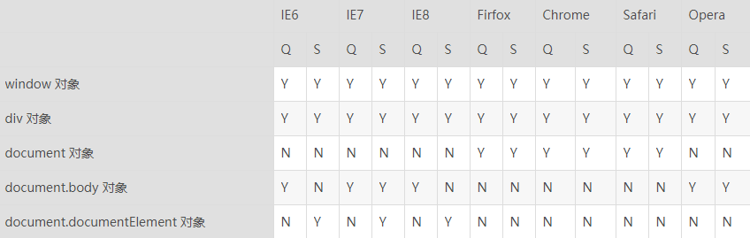

1、下面代码执行结果为：

```js
var a = 123;
fn(a);
function fn(a) {
    a = 456;
}
console.log(a); // 123
```

> a = 123  形参是局部变量，不会影响实参的值。（传值与传址的区别）


2、下面代码的执行结果是：

```js
var a = 1&&2;
var b = true || false;
var c = a*b+3;
console.log(c); 
```

> c = 2*1+3; 1&&2不是true，而是2.


3、下列字符串符合该 `/.\.\d/` 正则对象的有（ABD）

A：“&.123ab”

B: “123.&.1.23ac”

C: “bbc123”

D: “?.123?”

> 正则开头没有^，结尾没有$，则只需要包含即可。 


4、判断是否为真数组的方法：

> - **Array.isArray(xxx);**
> - **Array == instanceof(xxx)**
> - **判断xxx是否存在数组中的方法。如 if(xxx.sort)**


5、下列函数的结果为：

```js
function say(a,b,b) {
    alert(a+b+b);
}
say(1,2,3);
```

> 结果为7.a=1,b=2之后b=3将之前b的值覆盖了。


6、下面那个方法没有兼容问题？（D）

A: getElementsByClassName

B: nextSibiling

C: childNodes

D: parentNode

> A: IE8 不兼容getElementByClassName和 indexOf函数 
>
> 封装代码：
>
> function daotin_indexOf(str, list) {
>
> ​    var index = -1;
>
> ​    for (var i = 0; i < list.length; i++) {
>
> ​        if (str == list[i]) {
>
> ​            return i;
>
> ​        }
>
> ​    }
>
> ​    return index;
>
> };
>
> function daotin_getElementByClassName(className) {
>
> ​    var allEle = document.getElementsByTagName("*");
>
> ​    var list = [];
>
> ​    for (var i = 0; i < allEle.length; i++) {
>
> ​        if (allEle[i].className) {
>
> ​            var classList = allEle[i].className.split(" "); //["ll", "haha"]
>
> ​            // if (classList.indexOf(className) != -1) {
>
> ​            if (daotin_indexOf(className, classList) != -1) {
>
> ​                list.push(allEle[i]);
>
> ​            }
>
> ​        }
>
> ​    }
>
> ​    return list;
>
> }
>
> B,C 都有可能获得文本节点。
>
> 所以本题答案：D


7、给整个页面绑定一个滚动事件的最好的写法（A）

A: window.onscroll

B: document.onscroll

C: window.document.onscroll

D: document.body.onscroll

> 除了A，其他都有兼容性问题。




8、下面方法没有兼容问题的是（D）

A: window.event

B: returnValue

C: keyCode

D: onclick

> A 的兼容写法：window.event || e
>
> B 是阻止默认事件的兼容写法如下：
>
> function stopDefault(e) {
>
> ​    var e = window.event || e;
>
> ​    if (e.preventDefault) {
>
> ​        e.preventDefault();
>
> ​    } else {
>
> ​        e.returnValue = false;
>
> ​    }
>
> };
>
> C e.which || e.keyCode
>
> D 不是兼容性问题，addEventListerner只是绑定多个事件的时候用的，和兼容性没关系。


9、处理兼容性正确的是：（ABD）

A: window.event||e

B: e.which||e.keyCode

C: document.documentElement||document.body

D: document.documentElement.scrollTop||document.body.scrollTop

> C 这两个属性都是存在的，只不过scrollLeft和scrollTop的属性在不同的浏览器下有的存在于document.documentElement，有的存在于document.body。所以只看C是不存在兼容问题的。

