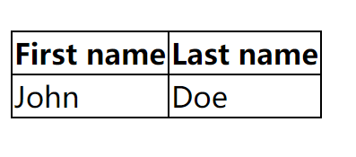
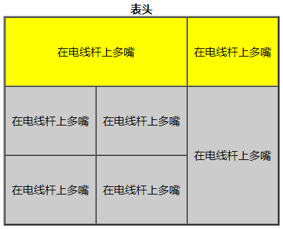

## 1、表格

在HTML中 ，我们可以使用`table`标签来展示表格数据。

### 1.1、标准结构

```html
<table>
  <caption>表格标题</caption>   <!--表头（表格标题）-->
  <!--定义表格的列头行。-->
  <thead>
    <tr>
        <td>列头行1</td>
        <td>列头行2</td>
    </tr>
  </thead>

  <!--定义表格的主体行-->
  <tbody>
    <tr>
        <td>主体行1</td>
        <td>主体行2</td>
    </tr>
  </tbody>

  <!--定义表格中各列的汇总行-->
  <tfoot>
    <tr>
        <td>汇总行1</td>
        <td>汇总行2</td>
    </tr>
  </tfoot>
</table>
```

> 注意：写 `<thead>，<tbody>，<tfoot>`对SEO更好，不写也没问题。 

```html
<table>
  <tr>
    <th>First name</th>
    <th>Last name</th>
  </tr>
  <tr>
    <td>John</td>
    <td>Doe</td>
  </tr>
</table>
```



**快捷写法：**

> VSCode快捷写法：`table>tr*2>td*3 + tab` ： 建立2行3列的表格 

> 注意：`td`可以换成`th`，th会自动加粗，并且水平居中对齐 


### 1.2、常见属性

>`width`：（宽度）
>
>`height`：（高度）
>
>`border`：（边框宽度） 
>
>`cellspacing`：（单元格与单元格的间距）// 还可以使用css属性border-spacing设置单元格间隔，相当于cellspacing，但是border-spacing优先级更高。
>
>`cellpadding`：（单元格内容距边框的距离）
>
>`bordercolor`：table边框颜色（只能在table使用，在tr或者td使用无效）
>
>`bgcolor`：表格背景颜色，可以采用预先定义的字符串或者 6 位的十六进制编码（black = "#000000"）
>
>`align="left | right | center"`：
>
>- 如果直接给table使用align=”center” ，则表格居中
>- 如果给tr或者td使用 ，tr或者td内容居中。 

示例：

```html
<table width="300px" height="300px" border="5" cellspacing="10px" cellpadding="0" bgcolor="pink" align="center" >
		<tr>
			<td>窗外的麻雀</td>
			<td>窗外的麻雀</td>
			<td>窗外的麻雀</td>
		</tr>
		<tr>
			<td>窗外的麻雀</td>
			<td>窗外的麻雀</td>
			<td>窗外的麻雀</td>
		</tr>
		<tr>
			<td>窗外的麻雀</td>
			<td>窗外的麻雀</td>
			<td>窗外的麻雀</td>
		</tr>
	</table>
```


## 3、其他属性

**内容上下方向对齐方式**

```html
<tr>
	<td valign="bottom">张三</td>
</tr>
```

> `valign="top | middle | bottom"`


**无内容时单元格的设置**

```css
empty-cells:show/hide  /* 当单元格无内容时，是否显示该单元格的边框区域，当不使用边框合并的时候才会生效*/
```

**单元格宽度使用固定**

```css
table-layout:auto/fixed;
/*定义表格的布局算法，设置为fixed，内容超出单元格的宽度则固定不变，如果没有设置宽度则平均分配；设置auto时则随内容宽度而定。*/
```

**细线表格**

`border-collapse`决定表格的边框是分开的还是合并的。在分隔模式下，相邻的单元格都拥有独立的边框。在合并模式下，相邻单元格共享边框。

```css
table {
	border-collapse:collapse|separate;
}
```


**合并单元格**

`<td colspan=“2”>填写内容</td>`：将两列合并成1列

`<td rowspan=“3”>填写内容</td>` ：将三行合并成1行

```html
<table border="2" cellspacing="0" width="400" height="100" align="center">
	<caption><strong>表头</strong></caption>
    <tr align="center" bgcolor="yellow" height="100">
        <td colspan="2">在电线杆上多嘴</td>
        <td>在电线杆上多嘴</td>
        <!-- <td>在电线杆上多嘴</td> -->
    </tr>

    <tr align="center" bgcolor="#CCC" height="100">
        <td>在电线杆上多嘴</td>
        <td>在电线杆上多嘴</td>
        <td rowspan="2">在电线杆上多嘴</td>
    </tr>

    <tr align="center" bgcolor="#CCC" height="100">
        <td>在电线杆上多嘴</td>
        <td>在电线杆上多嘴</td>
        <!-- <td>在电线杆上多嘴</td> -->
    </tr>
</table>
```

