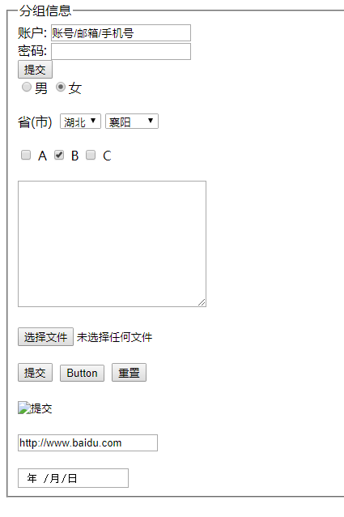

## 1、表单组成

我们经常注册/登录的界面就是一个表单。

一个常见的表单，由左侧`提示文本`和右侧`表单控件`组成。


### 1.3、表单域

表单域：文档中填写表单的一个区域。也就是上面提示信息和表单控件等所在的区域 。该区域包含交互控件，用于向 Web 服务器提交信息。

我们用 `form` 标签来表示表单域。

```html
<form action="http://xxx.com/1.php" method="get" name="" autocomplete="off"></form>
```

> `action`：处理表单提交的地址URL，表示表单要提交到什么地方进行处理
>
> `method`=”get | post”，表示浏览器使用哪种方式来提交表单
>
> - get 通过地址栏提交表单数据，表单数据会附加在 `action` 属性的 URL 中，并以 '?' 作为分隔符（可以在地址栏里看到你提交的内容，比如账号和密码），安全性差。
> - post 表单数据会包含在表单体内然后发送给服务器，安全性高。 
>
> `name`: 表单的名称。
>
> `autocomplete`：表示是否能够自动补全上次的输入内容。


## 2、表单控件-输入框

输入框使用`input`标签。

`<input>`的工作方式在很大程度上取决于`type`属性的值，不同的 type 值会表现出不同的样式。默认`type="text"`。

### 2.1、文本输入框

```html
<input type="text"
	name="username"
	maxlength="6"
	readonly="readonly"
	disabled="disabled"
	value="用户名">
```

> `type`：text：输入的是文本内容
>
> `name`：输入框的名字
>
> `maxlength`：文本框能输入的最大字符数。
>
> `minlength`：文本框能输入的最小字符数。
>
> `readonly`：文本框只读
>
> `disabled`：文本框禁用
>
> `value`：输入框中的默认内容
>
> `placeholder`：输入框中的提示语


### 2.2、密码输入框

```html
<input type="password" name="pwd">
```

> PS：文本输入框的所有属性对密码输入框都有效 


### 2.3、数字输入框

```html
<input type="number" name="num" step="2">
```

> `step`：默认情况下，向上和向下按钮可以将值增加或减小 1。通过使用step 属性来更改此步长值。
>
> `min`：最小值
>
> `max`：最大值
>
> 注意：min和max只是点击上下按钮不会让你低于 min 或高于 max 的值，但是可以通过手动输入数字。


### 2.3、单选框

```html
<input type="radio" name="gender" checked="checked">男
<input type="radio" name="gender">女
```

> `checked=”checked”或者直接写checked` 设置默认选择项。
>
> PS：当有多个单选框是如何设置只能有一个被选中？
> 只有**将 name 的值设置相同的时候**，才能实现单选效果。 


***20181009***

**设置单选框的样式：**

由于单选框的样式是只能设置大小，不能设置颜色，更不能设置样式。所以，一般我们自定义单选框的样式。

**实现原理：**

在单选框的后面加上label标签（需要设置为inline-block或者block），在点击单选框的时候，使用 + 选择器选中label标签，设置label标签的宽高和颜色代替单选框，将单选框display:none；


代码：

```html
<!DOCTYPE html>

<head>
    <meta charset="UTF-8">
    <title>Document</title>
    <style>
        input {
            display: none;
        }
        label {
            display: inline-block;
            width: 30px;
            height: 30px;
            background-color: #ccc;
            border-radius: 50%;
            vertical-align: middle;
        }
        input:checked + label {
            background-color: red;
        }
    </style>
</head>

<body>
    <input type="radio" name="sex" id="a"><label for="a"></label>男
    <input type="radio" name="sex" id="b"><label for="b"></label>女
    <input type="radio" name="sex" id="c"><label for="c"></label>保密
</body>

</html>
```


label实现选项卡：

代码如下：

```html
<!DOCTYPE html>

<head>
    <meta charset="UTF-8">
    <title>Document</title>
    <style>
        * {
            padding: 0;
            margin: 0;
        }
        ul {
            position: relative;
        }
        li {
            list-style: none;
            float: left;
        }
        input {
            outline: none;
        }
        input[type="radio"] {
            display: none;
        }
        label {
            display: block;
            text-align: center;
            line-height: 42px;
            width: 124px;
            height: 42px;
            color: rgb(227,64,5);
            border-bottom: 1px solid rgb(227,64,5);
            cursor: pointer;
        }
        input:checked + label {
            background-color: rgb(227,64,5);
            color: #fff;
        }
        li .dv1,
        li .dv2 {
            width: 248px;
            height: 50px;
            /* background-color: #ddd; */
            position: absolute;
            display: none;
        }

        .dv1 {
            position: relative;
            left: 0;
            top: 42px;
        }
        .dv2 {
            left: 0;
            top: 42px;
        }

        input:checked + label + div {
            display: block;
        }

        .txt1 {
            position: absolute;
            width: 200px;
            height: 30px;
            left: 50%;
            top: 50%;
            margin-left: -100px;
            margin-top: -15px;
        }
        .txt1 input[type="text"] {
            width: 150px;
            height: 30px;
            vertical-align: top;
            float: left;
            box-sizing: border-box;
            border: 1px solid rgb(227,64,5);
            border-radius: 10px 0 0 10px;
            padding-left: 5px;
        }
        .txt1 input[type="submit"] {
            width: 50px;
            height: 30px;
            float: left;
            border: 1px solid rgb(227,64,5);
            border-radius: 0 10px 10px 0;
            margin-left: -1px;
            background-color: rgb(227,64,5);
            color: white;
        }
        .txt2 {
            position: absolute;
            width: 200px;
            height: 30px;
            left: 50%;
            top: 50%;
            margin-left: -100px;
            margin-top: -15px;
        }
        .txt2 input[type="text"] {
            width: 150px;
            height: 30px;
            vertical-align: top;
            float: left;
            box-sizing: border-box;
            border: 1px solid rgb(227,64,5);
            border-radius: 10px 0 0 10px;
            padding-left: 5px;
        }
        .txt2 input[type="submit"] {
            width: 50px;
            height: 30px;
            float: left;
            border: 1px solid rgb(227,64,5);
            border-radius: 0 10px 10px 0;
            margin-left: -1px;
            background-color: rgb(227,64,5);
            color: white;
        }
    </style>
</head>

<body>
    <div class="box">
        <form action="">

            <ul class="uu">
                <li>
                    <input type="radio" name="yz" id="a" checked>
                    <label for="a">客服验证</label>
                    <div class="dv1">
                        <div class="txt1">
                            <input type="text" placeholder="请输入需要验证的QQ号">
                            <input type="submit" value="验证">
                        </div>
                    </div>
                </li>
                <li>
                    <input type="radio" name="yz" id="b">
                    <label for="b">网址验证</label>
                    <div class="dv2">
                        <div class="txt2">
                            <input type="text" placeholder="请输入需要验证的网址">
                            <input type="submit" value="验证">
                        </div>
                    </div>
                </li>
            </ul>
        </form>
    </div>

</body>

</html>
```

效果：


### 2.4、多选框

```html
第一个多选框：<input type="checkbox" checked="checked" value="one">
第二个多选框：<input type="checkbox" checked>
```

> `value`：指定 input 的值。如果省略，通过JS获取该元素的值的结果为字符串"on"。


### 2.5、文本上传控件

```html
<input type="file">
```

> `accept`：表示允许的文件类型（accept="image/*,.pdf"  表示任何图片文件或者pdf文件。
>
> `multiple`：如果出现，则表示用户可以选择多个文件


**20181009 修改文本上传控件的样式：**

实现原理：

**由于上传控件的大小和颜色等是无法直接修改的，若想要修改的话，可以另外添加一个div，将div的大小设置和file控件的大小一致，将div定位，之后file文件也进行定位，覆盖到div之上（可以设置z-index），然后设置file控件的opacity为0即可。**


示例：

```html
<!DOCTYPE html>

<head>
    <meta charset="UTF-8">
    <title>Document</title>
    <style>
        input {
            width: 180px;
            height: 60px;
            background-color: pink;
            position: absolute;
            left: 0;
            top: 0;
            z-index: 1;
            opacity: 0;
        }
        div {
            width: 180px;
            height: 60px;
            background-color: #37f;
            color: white;
            text-align: center;
            line-height: 60px;
            position: absolute;
            left: 0;
            top: 0;
        }
    </style>
</head>

<body>
    <input type="file">
    <div>点击上传</div>
</body>

</html>
```


### 2.6、文件提交按钮

```html
<input type="submit">
```

> 可以实现信息提交功能 


### 2.7、按钮

```html
<!--用来创建一个没有默认值的可点击按钮。已经在 HTML5 被 `<button>`元素取代。-->
<input type="button" value="input按钮"> 

<button>button按钮</button>
```

> 区别：`<button>`在form里面，默认可以进行提交操作，除非设置type=button；而input按钮需要配合JS进行提交。


### 2.8、重置按钮

```html
<input type="reset">
```

> 将表单中的所有输入重置为其初始值。


## 3、下拉列表

```html
<select multiple="multiple">
  <optgroup lable="分组名称">
    <option>下拉列表选项</option>
    <option selected="selected">下拉列表选项</option>
  </optgroup>
</select>
```

> `name`：下拉列表名称
>
> `multiple=”multiple”`： 将下拉列表设置为多选
>
> `selected=”selected”`：设置默认选中项目
>
> `<optgroup></optgroup>` 对下拉列表进行分组。
>
> `Label="分组名称"` 分组名称。
>
> `disabled`：禁用下拉列表（如果用在选项上，表示禁用该项

**PS：select可以设置宽高等，但是option不可以设置。**


## 4、文本域

```html
<textarea cols="130" rows="10" placeholder=""></textarea>
```
文本域大部分属性和input相同。但是有一些独有的属性：
> `cols`：控制输入字符的长度 
>
> `rows`：控制输入字符的行数 

注意：

- cols和rows一般不用，直接使用width和height来设置宽高。
- 对css 设置 `resize:none; `不可改变大小。

```css
textarea {
  	width: 100px;
    height: 100px;
  	resize: none;
}
```


## 5、表单信息分组

```html
<form action="http://xxx.com/1.php" method="post">
    <fieldset>
        <legend>分组1</legend>
    </fieldset>
</form>
```

> `<fieldset></fieldset>`：对表单信息分组 
>
> `<legend></legend>`：表单信息分组名称 


## 6、html5补充表单控件

```html
<input type="url">网址控件
<input type="date">日期控件 
<input type="time">时间控件
<input type="email">邮件控件
<input type="color">颜色控件
<input type="number" step="5">数字控件
<input type="range" step="50">滑块控件
...
```

> 参考链接：https://developer.mozilla.org/zh-CN/docs/Web/HTML/Element/Input

**补充示例：**

```html
<!-- 表单域 -->
	<form action="1.php" method="post">
	<!-- 对表单信息分组 -->
	<fieldset>
	<!-- 表单信息分组名称 -->
	<legend>分组信息</legend>
	    <!-- 文本输入框 -->
		账户: <input type="text" name="User" value="账号/邮箱/手机号">
		<br>
		<!-- 密码输出框 -->
		密码: <input type="password" name="Pwd">
		<br>
		<!-- 文件提交按钮 -->
		<input type="submit">
		<br>
		<!-- 单选框 -->
		<input type="radio" name="gender">男
		<input type="radio" name="gender" checked="checked">女

		<br>
		<br>
		<!-- 下拉列表 -->
		省(市)&nbsp; <select>
			<!-- 下拉列表选项 -->
			<option value="">北京</option>
			<option value="">山东</option>
			<option value="">广东</option>
			<option value="">福建</option>
			<option value="">河南</option>
			<option value="" selected="selected">湖北</option>
		</select>

		<select>
			<!-- 对下拉列表分组 -->
			<optgroup label="湖北省">
				<option value="">武汉</option>
				<option value="" selected="selected">襄阳</option>
				<option value="">天门</option>
				<option value="">荆州</option>
				<option value="">仙桃</option>
			</optgroup>
		</select>

		<br><br>
		<!-- 多选框 -->
		<input type="checkbox"> A
		<input type="checkbox" checked="checked"> B
		<input type="checkbox"> C

		<br><br>
		<!-- 多行文本框 -->
		<textarea cols="30" rows="10"></textarea><br><br>
		<!-- 文本上传控件 -->
		<input type="file"><br><br>

		<input type="submit">&nbsp;
		<!-- 普通按钮 -->
		<input type="button" value="Button">&nbsp;	
		<!-- 重置按钮 -->
		<input type="reset"><br><br>
		<!-- 图片按钮 -->
		<input type="image" src="1.png" width="100"><br><br>
		<!-- 网址控件 -->
		<input type="url" value="http://www.baidu.com"><br><br>
		<!-- 日期控件 -->
		<input type="date">
        <!-- 颜色控件 -->
		<input type="color">

    </fieldset>
	</form>
```




