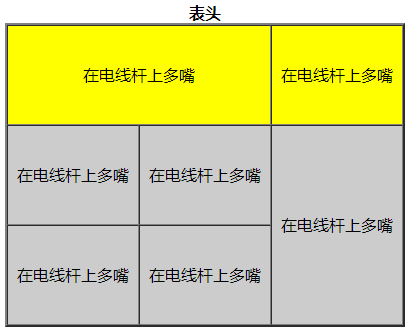
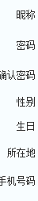
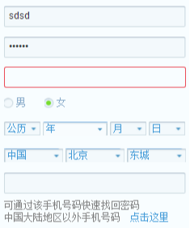
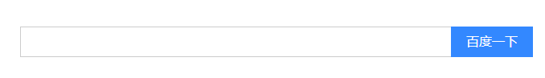
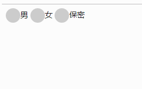
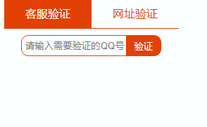
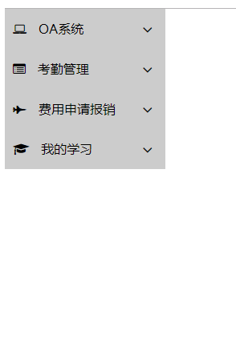
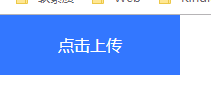
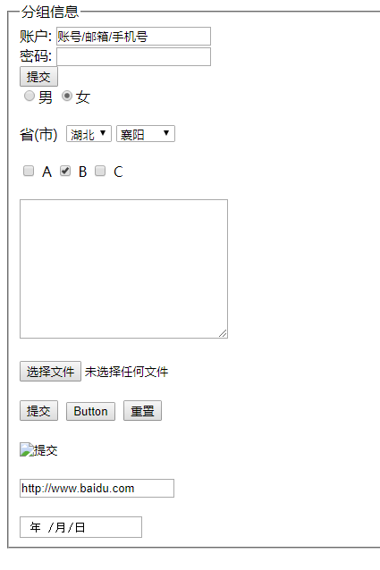

# 一、表格

## 1、表格的结构

### 1.1、标准结构

```html
<table>
  <caption>表格标题</caption>
  
  <thead>
    <tr>
    <td></td>
    <td></td>
    </tr>
  </thead>

  <tbody>
    <tr>
    <td></td>
    <td></td>
    </tr>
  </tbody>

  <tfoot>
    <tr>
    <td></td>
    <td></td>
    </tr>
  </tfoot>
</table>
```

> 写 `<thead> <tbody> <tfoot>`对SEO更好，不写也没问题。 


### 1.2、常见写法

```html
<table width="300px" height="300px" border="5" cellspacing="10px" cellpadding="0" bgcolor="pink" align="center" >
		<tr>
			<td>窗外的麻雀</td>
			<td>窗外的麻雀</td>
			<td>窗外的麻雀</td>
		</tr>
		<tr>
			<td>窗外的麻雀</td>
			<td>窗外的麻雀</td>
			<td>窗外的麻雀</td>
		</tr>
		<tr>
			<td>窗外的麻雀</td>
			<td>窗外的麻雀</td>
			<td>窗外的麻雀</td>
		</tr>
	</table>
```

>width（宽度）
>height（高度）
>border（边框宽度） 
>cellspacing（单元格与单元格的距离）
>cellpadding（内容距边框的距离）
>bgcolor（表格背景颜色）
>align=”left | right | center”
>​	如果直接给表格用align=”center” 表格居中
>​	如果给tr或者td使用 ，tr或者td内容居中。 


## 2、快速建表格的方式

`table>tr*3>td*5 + tab` ： 建立3行5列的表格 


## 3、表头

`<caption></caption>`：位于table标签和tr标签之间

```html
<table>
		<caption>表头</caption>
		<tr>
			<td></td>
			<td></td>
			<td></td>
		</tr>
		<tr>
			<td></td>
			<td></td>
			<td></td>
		</tr>
		<tr>
			<td></td>
			<td></td>
			<td></td>
		</tr>
	</table>
```


## 4、单元格合并

`<td colspan=“2”>填写内容</td>`：合并到同一行的单元格，合并行数为2 

`<td rowspan=“3”>填写内容</td>` ：合并到同一列的单元格，合并列数为3 

```html
<table border="2" cellspacing="0" width="400" height="100" align="center">
	<caption><strong>表头</strong></caption>
		<tr align="center" bgcolor="yellow" height="100">
			<td colspan="2">在电线杆上多嘴</td>
			<!-- <td><strong>2</strong></td> -->
			<td>在电线杆上多嘴</td>
		</tr>

		<tr align="center" bgcolor="#CCC" height="100">
			<td>在电线杆上多嘴</td>
			<td>在电线杆上多嘴</td>
			<td rowspan="2">在电线杆上多嘴</td>
		</tr>

		<tr align="center" bgcolor="#CCC" height="100">
			<td>在电线杆上多嘴</td>
			<td>在电线杆上多嘴</td>
			<!-- <td><strong>3</strong></td> -->
		</tr>
	</table>
```




## 5、表格标题

```html
<tr>
  <th></th>
  <th></th>
  <th></th>
</tr>
```

> 注意：将td改为th 
>
> 特点：标题的文字自动加粗水平居中对齐 


## 6、边框颜色

```html
<table bordercolor=""></table>
```


## 7、内容在上下方向的对齐方式

```html
<tr>
	<td valign="bottom">张三</td>
</tr>
```

> `valign="top | middle | bottom"`


## 8、补充

**细线表格：**

```html
<table width="500" height="300" bgcolor="green" cellspacing="1" >
		<tr bgcolor="white">
			<td></td>
			<td></td>
			<td></td>
			<td></td>
		</tr>
		<tr bgcolor="white">
			<td></td>
			<td></td>
			<td></td>
			<td></td>
		</tr>
		<tr bgcolor="white">
			<td></td>
			<td></td>
			<td></td>
			<td></td>
		</tr>
		<tr bgcolor="white">
			<td></td>
			<td></td>
			<td></td>
			<td></td>
		</tr>
	</table>
```

> 将背景作为边框来实现。


**单元格间隔**：

```css
border-spacing: 10px;
```


**无内容时单元格的设置：**

```css
empty-cells:show/hide  /* 当单元格无内容时，是否显示该单元格的边框区域*/
```

定义单元格行和列的算法（加快运行速度）

```css
table-layout:auto/fixed;
/*定义表格的布局算法，设置为fixed，内容超出单元格的宽度则固定不变，如果没有设置宽度则平均分配；设置auto时则随内容宽度而定。*/
```


**20181010 补充：**

设置表格较小，但是内容过大的话，为了不使的表格被撑大，可以设置一个属性：`table-layout:fixed;` 固定表格的宽高，加快计算机的运行速度。


# 二、表单


## 1、组成

### 1.1、文本（提示信息）




### 1.2、表单控件



### 1.3、表单域

上面提示信息和表单控件等所在的区域 。

```html
<form action="1.php" method="get" name=""></form>
```

> action：处理信息，提交到什么地方
>
> method=”get | post”
>
> - get通过地址栏提供（传输）信息（可以在地址栏里看到你输入的账号和密码），安全性差。
> - post 通过文件例如1.php来处理信息，安全性高。 
>
> name: 表单名称。


## 2、文本输入框

```html
<input type="text"
	name="username"
	maxlength="6"
	readonly="readonly"
	disabled="disabled"
	value="用户名">
```

> type：输入的是文本内容
> name：输入框的名字
> maxlength：限定输入文本长度
> readonly：文本框只读
> disabled：文本框未激活
> value：输入框中的默认内容


**一般做一个搜索框+搜索按钮的布局如下：**

使用一个div包裹input文本框和按钮，然后input左浮动，提交按钮右浮动。输入框的边框去除，用div的边框代替。


示例：百度搜索框

```html

<!DOCTYPE html>

<head>
    <meta charset="UTF-8">
    <meta name="viewport" content="width=device-width, initial-scale=1.0">
    <meta http-equiv="X-UA-Compatible" content="ie=edge">
    <title>Document</title>
    <style>
        input {
            border: none;
            padding: 0;
            margin: 0;
            outline: none;
        }
        form {
            position: relative;
        }
        .search {
            position: absolute;
            width: 638px;
            height: 38px;
            left: 0;
            right: 0;
            top: 0;
            bottom: 0;
            margin: auto;
        }
        .left {
            width: 536px;
            height: 38px;
            box-sizing: border-box;
            /* background-color: pink; */
            float: left;
            border: 1px solid #ccc;
            border-right: #38f;
            position: relative;
            z-index: 10;
        }
        .left:hover {
            border-color: #b8b8b8;
        }
        .left:focus {
            border-color: #38f;
            
        }
        
        .txt {
            width: 500px;
            height: 36px;
            line-height: 36px;
            padding-left: 10px;
            box-sizing: border-box;
            border: 1px solid transparent;
            font: 400 16px/38px "microsoft yahei"; 
        }
       
        .left span {
            position: absolute;
            top: 10px;
            right: 8px;
            width: 18px;
            height: 18px;
            background: url("./camera_new_5606e8f.png") no-repeat 0 0;
        }
        .left span:hover {
            position: absolute;
            top: 10px;
            right: 8px;
            width: 18px;
            height: 18px;
            background: url("./camera_new_5606e8f.png") no-repeat 0 -20px;
            cursor: pointer;
        }
        .left .file {
            position: absolute;
            top: 7px;
            right: 0;
            width: 18px;
            height: 18px;
            background-color: purple;
            cursor: pointer;
            /* opacity: 0; */
        }
        .right {
            float: right;
        }
        .sub {
            width: 102px;
            height: 38px;
            line-height: 38px;
            background-color: #38f;
            color: white;
            font-size: 16px;
            float: left;
            cursor: pointer;
            
            /* vertical-align: top; */
        }
        .sub:hover {
            box-shadow: 1px 1px 1px #ccc;
            background-color: #317ef3;
        }
        
        

    </style>
</head>

<body>
    <div class="search">
        <div class="left">
            <input class="txt" type="text">
            <!-- <input class="file" type="file"> -->
            <span></span>
        </div>
        <div class="right">
            <input class="sub" type="submit" value="百度一下">
        </div>
    </div>
</body>

</html>
```

如下图：




## 3、密码输入框

```html
<input type="password" name="pwd">
```

> PS：文本输入框的所有属性对密码输入框都有效 


## 4、单选框

```html
<input type="radio" name="gender" checked="checked">男
```

> `checked=”checked”` 设置默认选择项。
>
> PS：当有多个单选框是如何设置只能有一个被选中？
> 只有将 name 的值设置相同的时候，才能实现单选效果。 


20181009

**设置单选框的样式：**

由于单选框的样式是只能设置大小，不能设置颜色，更不能设置样式。所以，一般我们自定义单选框的样式。

**实现原理：**

在单选框的后面加上label标签（需要设置为inline-block或者block），在点击单选框的时候，使用 + 选择器选中label标签，设置label标签的宽高和颜色代替单选框，将单选框display:none；


代码：

```html
<!DOCTYPE html>

<head>
    <meta charset="UTF-8">
    <title>Document</title>
    <style>
        input {
            display: none;
        }
        label {
            display: inline-block;
            width: 30px;
            height: 30px;
            background-color: #ccc;
            border-radius: 50%;
            vertical-align: middle;
        }
        input:checked + label {
            background-color: red;
        }
    </style>
</head>

<body>
    <input type="radio" name="sex" id="a"><label for="a"></label>男
    <input type="radio" name="sex" id="b"><label for="b"></label>女
    <input type="radio" name="sex" id="c"><label for="c"></label>保密
</body>

</html>
```




label实现选项卡：

代码如下：

```html
<!DOCTYPE html>

<head>
    <meta charset="UTF-8">
    <title>Document</title>
    <style>
        * {
            padding: 0;
            margin: 0;
        }
        ul {
            position: relative;
        }
        li {
            list-style: none;
            float: left;
        }
        input {
            outline: none;
        }
        input[type="radio"] {
            display: none;
        }
        label {
            display: block;
            text-align: center;
            line-height: 42px;
            width: 124px;
            height: 42px;
            color: rgb(227,64,5);
            border-bottom: 1px solid rgb(227,64,5);
            cursor: pointer;
        }
        input:checked + label {
            background-color: rgb(227,64,5);
            color: #fff;
        }
        li .dv1,
        li .dv2 {
            width: 248px;
            height: 50px;
            /* background-color: #ddd; */
            position: absolute;
            display: none;
        }

        .dv1 {
            position: relative;
            left: 0;
            top: 42px;
        }
        .dv2 {
            left: 0;
            top: 42px;
        }

        input:checked + label + div {
            display: block;
        }

        .txt1 {
            position: absolute;
            width: 200px;
            height: 30px;
            left: 50%;
            top: 50%;
            margin-left: -100px;
            margin-top: -15px;
        }
        .txt1 input[type="text"] {
            width: 150px;
            height: 30px;
            vertical-align: top;
            float: left;
            box-sizing: border-box;
            border: 1px solid rgb(227,64,5);
            border-radius: 10px 0 0 10px;
            padding-left: 5px;
        }
        .txt1 input[type="submit"] {
            width: 50px;
            height: 30px;
            float: left;
            border: 1px solid rgb(227,64,5);
            border-radius: 0 10px 10px 0;
            margin-left: -1px;
            background-color: rgb(227,64,5);
            color: white;
        }
        .txt2 {
            position: absolute;
            width: 200px;
            height: 30px;
            left: 50%;
            top: 50%;
            margin-left: -100px;
            margin-top: -15px;
        }
        .txt2 input[type="text"] {
            width: 150px;
            height: 30px;
            vertical-align: top;
            float: left;
            box-sizing: border-box;
            border: 1px solid rgb(227,64,5);
            border-radius: 10px 0 0 10px;
            padding-left: 5px;
        }
        .txt2 input[type="submit"] {
            width: 50px;
            height: 30px;
            float: left;
            border: 1px solid rgb(227,64,5);
            border-radius: 0 10px 10px 0;
            margin-left: -1px;
            background-color: rgb(227,64,5);
            color: white;
        }
    </style>
</head>

<body>
    <div class="box">
        <form action="">

            <ul class="uu">
                <li>
                    <input type="radio" name="yz" id="a" checked>
                    <label for="a">客服验证</label>
                    <div class="dv1">
                        <div class="txt1">
                            <input type="text" placeholder="请输入需要验证的QQ号">
                            <input type="submit" value="验证">
                        </div>
                    </div>
                </li>
                <li>
                    <input type="radio" name="yz" id="b">
                    <label for="b">网址验证</label>
                    <div class="dv2">
                        <div class="txt2">
                            <input type="text" placeholder="请输入需要验证的网址">
                            <input type="submit" value="验证">
                        </div>
                    </div>
                </li>
            </ul>
        </form>
    </div>

</body>

</html>
```

效果：




## 5、下拉列表

```html
<select multiple="multiple">
  <optgroup lable="分组名称">
    <option>下拉列表选项</option>
    <option selected="selected">下拉列表选项</option>
  </optgroup>
</select>
```

> `multiple=”multiple”`： 将下拉列表设置为多选
> `selected=”selected”`：设置默认选中项目
> `<optgroup></optgroup>` 对下拉列表进行分组。
> `Label="分组名称"` 分组名称。


**PS：select可以设置宽高等，但是option不可以设置。**


## 6、多选框

```html
<input type="checkbox" checked="checked">
```

> Checked=”checked” 设置默认选中项 


**多选框实现下拉菜单：**

代码如下：

```html
<!DOCTYPE html>
<html lang="en">

<head>
    <meta charset="UTF-8">
    <meta name="viewport" content="width=device-width, initial-scale=1.0">
    <meta http-equiv="X-UA-Compatible" content="ie=edge">
    <title>Document</title>
    <link href="https://cdnjs.cloudflare.com/ajax/libs/font-awesome/4.7.0/css/font-awesome.css" rel="stylesheet">
    <style>
        * {
            padding: 0;
            margin: 0;
        }
        input {
            outline: none;
        }
        li {
            list-style: none;
        }
        #cb1,#cb2,#cb3,#cb4 { /*预留四个*/
            display: none;
        }
        .dd {
            width: 200px;
            height: 0;
            overflow: hidden;
            background-color: pink;
            transition: height 0.5s;
        }
        label {
            display: block;
            width: 200px;
            height: 50px;
            background-color: #ccc;
            line-height: 50px;
            cursor: pointer;
            position: relative;
        }
        label:hover {
            background-color: #b8b8b8;
        }
        label .left-span {
            margin: 0 10px;
        }
        label .right-span {
            position: absolute;
            top: 16px;
            right: 16px;
            font-size: 20px;
            transform: rotate(0deg);
            transition: transform 0.5s;
        }
        #cb1:checked + label + .dd {
            height: 100px;
        }
        #cb1:checked + label .right-span {
            transform: rotate(-180deg);
            transition: transform 0.5s;
        }
    </style>
</head>

<body>
    <div class="box">
        <form action="">
            <ul>
                <li>
                    <input type="checkbox" id="cb1">
                    <label for="cb1">
                        <span class="fa fa-laptop left-span"></span>
                        <span>OA系统</span>
                        <span class="fa fa-angle-down right-span"></span>

                    </label>
                    <dl class="dd">
                        <dt>1</dt>
                        <dt>2</dt>
                        <dt>3</dt>
                        <dt>4</dt>
                    </dl>
                </li>
            </ul>
        </form>
    </div>
</body>

</html>
```

效果演示：



## 7、文本域

```html
<textarea cols="130" rows="10" placeholder=""></textarea>
```

> cols：控制输入字符的长度 
>
> rows：控制输入字符的行数 
>
> placeholder: 提示文本

**PS：cols和rows一般不用，直接使用width和height来设置宽高。**

**对css 设置resize:none; 不可改变大小。**


## 8、文本上传控件

```html
<input type="file">
```


20181009 修改文本上传控件的样式：

实现原理：

**由于上传控件的大小和颜色等是无法直接修改的，若想要修改的话，可以另外添加一个div，将div的大小设置和file控件的大小一致，将div定位，之后file文件也进行定位，覆盖到div之上（可以设置z-index），然后设置file控件的opacity为0即可。**


示例：

```html
<!DOCTYPE html>

<head>
    <meta charset="UTF-8">
    <title>Document</title>
    <style>
        input {
            width: 180px;
            height: 60px;
            background-color: pink;
            position: absolute;
            left: 0;
            top: 0;
            z-index: 1;
            opacity: 0;
        }
        div {
            width: 180px;
            height: 60px;
            background-color: #37f;
            color: white;
            text-align: center;
            line-height: 60px;
            position: absolute;
            left: 0;
            top: 0;
        }
    </style>
</head>

<body>
    <input type="file">
    <div>点击上传</div>
</body>

</html>
```




## 9、文件提交按钮

```html
<input type="submit">
```

> 可以实现信息提交功能 


## 10、普通按钮

```html
<input type="button" value="普通按钮">
```

> 不能提交信息，配合JS使用 


## 11、图片按钮

```html
<input type="image" src="">
```

> 图片按钮可实现信息提交功能 


## 12、重置按钮

```html
<input type="reset">
```

> 将信息重置到默认状态 


## 13、表单信息分组

```html
<form action="1.php" method="post">
<fieldset>
	<legend>分组1</legend>
</fieldset>
</form>
```

> `<fieldset></fieldset>`：对表单信息分组 
>
> `<legend></legend>`：表单信息分组名称 


## 14、html5补充表单控件

```html
<input type="url">网址控件
<input type="date">日期控件 
<input type="time">时间控件
<input type="email">邮件控件
<input type="number" step="5">数字控件
<input type="range" step="50">滑块控件
```


## 补充示例：

```html
<!-- 表单域 -->
	<form action="1.php" method="post">
	<!-- 对表单信息分组 -->
	<fieldset>
	<!-- 表单信息分组名称 -->
	<legend>分组信息</legend>
	    <!-- 文本输入框 -->
		账户: <input type="text" name="User" value="账号/邮箱/手机号">
		<br>
		<!-- 密码输出框 -->
		密码: <input type="password" name="Pwd">
		<br>
		<!-- 文件提交按钮 -->
		<input type="submit">
		<br>
		<!-- 单选框 -->
		<input type="radio" name="gender">男
		<input type="radio" name="gender" checked="checked">女

		<br>
		<br>
		<!-- 下拉列表 -->
		省(市)&nbsp; <select>
			<!-- 下拉列表选项 -->
			<option value="">北京</option>
			<option value="">山东</option>
			<option value="">广东</option>
			<option value="">福建</option>
			<option value="">河南</option>
			<option value="" selected="selected">湖北</option>
		</select>

		<select>
			<!-- 对下拉列表分组 -->
			<optgroup label="湖北省">
				<option value="">武汉</option>
				<option value="" selected="selected">襄阳</option>
				<option value="">天门</option>
				<option value="">荆州</option>
				<option value="">仙桃</option>
			</optgroup>
		</select>

		<br><br>
		<!-- 多选框 -->
		<input type="checkbox"> A
		<input type="checkbox" checked="checked"> B
		<input type="checkbox"> C

		<br><br>
		<!-- 多行文本框 -->
		<textarea cols="30" rows="10"></textarea><br><br>
		<!-- 文本上传控件 -->
		<input type="file"><br><br>

		<input type="submit">&nbsp;
		<!-- 普通按钮 -->
		<input type="button" value="Button">&nbsp;	
		<!-- 重置按钮 -->
		<input type="reset"><br><br>
		<!-- 图片按钮 -->
		<input type="image" src="1.png" width="100"><br><br>
		<!-- 网址控件 -->
		<input type="url" value="http://www.baidu.com"><br><br>
		<!-- 日期控件 -->
		<input type="date">

    </fieldset>
	</form>
```





## 15、表单的状态

focus：表单独有，div等没有

checked：单选框，多选框独有。

disabled：表单独有，div等没有。


# 三、表单bug

**1、表单的默认样式清除：**

```css
input {
  border: 1px solid #ccc;
  outline-style: none;
  padding: 0;
}
```

**2、设置相同高度时，输入框和按钮的高度不相同：**

input文本框和按钮显示模式不同：

文本框是标准盒模型（box-sizing: content-box; ），

而按钮是怪异盒子（box-sizing: border-box;）。

也就是设置相同的宽高时，文本框的实际宽高要更大，而按钮的实际宽高更小。


3、input文本框在IE8及以下浏览器默认不是垂直居中显示的，IE8以上和chrome是默认居中显示的。


4、表单元素不会继承任何属性，字体大小，颜色，宽高等。


5、border:0 与 border: none;

border:0; 只是border-width:0;

而 border:none; 是 border-color,border-style,border-width 都为 none，效率更低。


6、一行文字在宽度显示不够的时候，显示三个点的省略符号：

```css
width: xxxpx; /*设置显示宽度*/
white-space: nowrap; /*文本一行显示*/
overflow: hidden;    /*超出宽度范围不显示*/
text-overflow: ellipsis;  /*超出宽度部分用三个点代替*/
```


7、表单才有focus，div没有focus。


8、单选框和多选框才有选中状态：checked，在设置css的时候，可以使用 input:checked 来设置已经被选中的input标签，进行样式设置。


9、表单还有 disabled状态 。input:disabled {/*设置样式*/}


# 四、标签语义化

好的语义化的网站标准就是去掉样式表文件(css文件)之后，结构依然很清晰。
根据内容的结构化（内容语义化），选择合适的标签（代码语义化）

> 什么用？
> 1：网页结构合理。
> 2：有了良好的结构和语义你的网页内容自然容易被搜索引擎抓取。
> 3：方便其他设备解析（如屏幕阅读器、盲人阅读器、移动设备）。
> 4：便于团队开发和维护。
>
> 怎么做？
> 1：尽可能少的使用无语义的标签div和span。（比如使用p是段落标签）
> 2：在语义不明显时，既可以使用div或者p时，尽量用p, 因为p在默认情况下有上下间距，对兼容特殊终端有利。
> 3：不要使用纯样式标签，如：b、font、u等，改用css设置。
> 4：需要强调的文本，可以包含在strong或者em标签中。 


