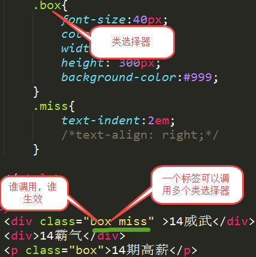

## 1、什么是 CSS？

CSS 全称为 Cascading Style Sheets，中文翻译为“层叠样式表”，简称 CSS。在网页制作时采用 CSS 技术，可以有效地对页面的布局、字体、颜色、背景和其它效果实现更加精确的控制。只要对相应的代码做一些简单的修改，就可以改变同一页面的不同部分的外观和格式。


## 2、CSS 的作用

简单地来讲，CSS 能对你制作的网页进行布局、颜色、背景等样式进行控制，让网页更加美观漂亮。


## 3、样式表书写位置

### 3.1、行内式

```html
<head>
	<meta charset="UTF-8">
	<title>Document</title>
</head>
<body>
    <p style="color:red; font-size:20px"></p>
</body>
```

### 3.2、内嵌式

```html
<head>
	<meta charset="UTF-8">
	<title>Document</title>
	<style type="text/css">
	    /* 样式表内容 */
		div {
		  color: red;
		}
	</style>
</head>
```

### 3.3、外链式1

```html
<head>
	<meta charset="UTF-8">
	<title>Document</title>
	<link rel="stylesheet" href="common.css">
</head>
```

### 3.4、外链式2

```html
<head>
	<meta charset="UTF-8">
	<title>Document</title>
	<style type="text/css">
	    @import url(./common.css);
	</style>
</head>
```


**link和@import的区别：**

- 从属关系区别
	- @import是 CSS 提供的语法规则，只有导入样式表的作用；link是HTML提供的标签，不仅可以加载 CSS 文件，还可以定义 RSS、rel 连接属性等。
- 加载顺序区别
	- 加载页面时，link标签引入的 CSS 被同时加载；@import引入的 CSS 将在页面加载完毕后被加载。
- 兼容性区别
	- @import是 CSS2.1 才有的语法，故只可在 IE5+ 才能识别；link标签作为 HTML 元素，不存在兼容性问题。

> 参考链接：https://juejin.cn/post/6844903581649207309

## 4、选择器
### 什么是选择器？
选择器是用来指定网页上我们想要样式化的HTML元素。

## 5、基础选择器
基础选择器分为：
- 标签选择器
- 类选择器
- ID 选择器
- 通配符选择器

### 5.1. 标签选择器
语法：
```css
标签 {
	属性：值;
}
```

> 特点：标签选择器定义之后，会将页面所有匹配到的元素都执行这个标签样式。

```html
<!DOCTYPE html>
<html lang="en">
<head>
	<meta charset="UTF-8">
	<title>Document</title>
	<style type="text/css">
		div{
			font-size: 50px;
			color: red
		}
	</style>
</head>
<body>
	<div>青花瓷</div>
	<div>等你下课</div>
</body>
</html>
```


**补充：颜色的显示方式**

- 1、直接写颜色的名称（比如：red，green等）。查看所有颜色：https://www.w3school.com.cn/cssref/css_colors.asp
- 2、十六进制显示颜色

	- （#000000; 前2为代表红色，中间2位代表绿色，后边2位代表蓝色。
	- PS：#333333 => #333）

- `rgb(120, 120, 120)`
- `rgba`：a代表alpha 不透明度，值 0~1（比如：`rgba(120,120,120. 0.5)`）


### 5.2. 类选择器

语法：
```css
.自定义类名{
	属性:值;
}
```




> 1、谁调用，谁生效。
>
> 2、一个标签可以调用多个类选择器。多个标签可以调用同一个类选择器。

**类选择器命名规则**

- 不能用`纯数字`或者`数字开头`来定义类名；
- 不能使用`特殊符号`或者`特殊符号开头`（_ 除外）来定义类名；
- 不建议使用汉字来定义类名；


### 5.3. ID选择器
语法：
```css
#自定义名称{
	属性:值;
}
```

> 特点：
>
> 1、一个 ID 选择器**最好**在一个页面只能使用一次。如果使用2次或者2次以上，不符合 w3c 规范。
>
> 2、一个标签只能使用一个 ID 选择器。
>
> 3.一个标签可以同时使用类选择器和 ID 选择器。


### 5.4. 通配符选择器

```css
*{
	属性:值;
}
```

> 特点：给所有的标签都使用相同的样式。


## 6、复合选择器

**两个或者两个以上的基础选择器通过不同的方式连接在一起使用。**


### 6.1. 交集选择器
语法：
```css
标签+类（ID）选择器{
	属性：值；
}
```

> 特点：即要满足使用了某个标签，还要满足使用了类选择器或者ID选择器。


### 6.2. 后代选择器

```css
选择器+[空格]+选择器{
	属性：值;
}
```

> 后代选择器首选要满足包含（嵌套）关系。
>
> 父集元素在前边，子集元素在后边。
>
> **特点：无限制隔代。（只要是后代都会生效）**


只要能代表标签，标签、类选择器、ID选择器自由组合。


### 6.3. 子代选择器
语法：
```css
选择器>选择器{
	属性:值;
}
```
> 特点：只能选中直接下一代元素，下下一代就选不中了（不能隔代选择）。


### 6.4. 并集选择器

```html
选择器，
选择器，
选择器{
	属性:值;
}
```
> 特点：一次可以设置多条选择器规则。


