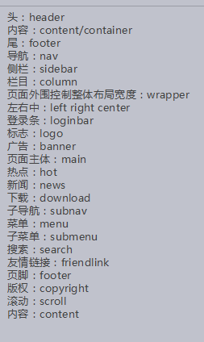
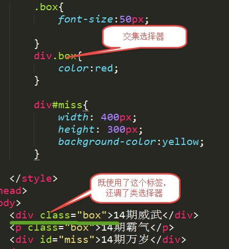
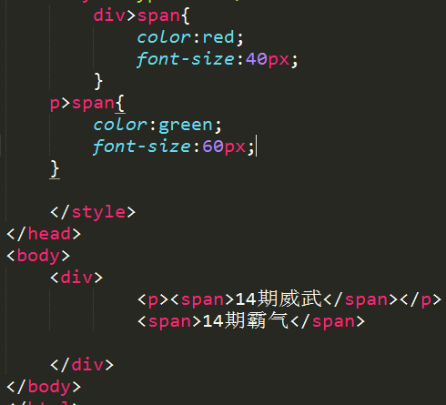

>大家好，这里是「 从零开始学 Web 系列教程 」，并在下列地址同步更新......
>
> - github：https://github.com/Daotin/Web
> - 微信公众号：[Web前端之巅](https://github.com/Daotin/pic/raw/master/wx.jpg)
> - 博客园：http://www.cnblogs.com/lvonve/
> - CSDN：https://blog.csdn.net/lvonve/
>
> 在这里我会从 Web 前端零基础开始，一步步学习 Web 相关的知识点，期间也会分享一些好玩的项目。现在就让我们一起进入 Web 前端学习的冒险之旅吧！


# 一、CSS概念

## 1、什么是 CSS？

CSS 全称为 Cascading Style Sheets，中文翻译为“层叠样式表”，简称 CSS 样式表，所以称之为层叠样式表（Cascading Stylesheet）简称 CSS。在网页制作时采用 CSS 技术，可以有效地对页面的布局、字体、颜色、背景和其它效果实现更加精确的控制。只要对相应的代码做一些简单的修改，就可以改变同一页面的不同部分，或者页数不同的网页的外观和格式。


## 2、CSS 的作用

简单地来讲，CSS 能对你制作的网页进行布局、颜色、背景、宽度、高度、字体进行控制，让网页按您的美工设计布局的更加美观漂亮。 样式是用来控制页面外观、设置元素对象属性的工具，使用样式可使页面产生各种特殊的效果。


## 3、样式表书写位置

### 3.1、行内式

```html
<head>
	<meta charset="UTF-8">
	<title>Document</title>
</head>
<body>
    <p style="color:red; font-size:20px"></p>
</body>
```

### 3.2、内嵌式

```html
<head>
	<meta charset="UTF-8">
	<title>Document</title>
	<style type="text/css">
	    /* 样式表内容 */
	</style>
</head>
```

### 3.3、外链式1

```html
<head>
	<meta charset="UTF-8">
	<title>Document</title>
	<link rel="stylesheet" href="../css/a.css">
</head>
```

### 3.4、外链式2

```html
<style type="text/css">
    @import url(../css/a.css);
</style>
```


**link和@import的区别：**

- link是XHTML标签，除了加载CSS外，还可以定义RSS等其他事务；@import属于CSS范畴，只能加载CSS。
- link引用CSS时，在页面载入时同时加载；@import需要页面网页完全载入以后加载。
- link是XHTML标签，无兼容问题；@import是在CSS2.1提出的，低版本的浏览器不支持。
- link支持使用Javascript控制DOM去改变样式；而@import不支持。


# 二、选择器

**选择器是一个选择谁（标签）的过程。**


```html
选择器{属性:值; 属性:值; ......}
```

| 解释                      | 属性：值                          |
| ----------------------- | ----------------------------- |
| 宽                       | width: 20px;                  |
| 高                       | height: 20px;                 |
| 背景颜色                    | background-color: red;        |
| 文字大小                    | font-size: 24px;              |
| 内容的水平对齐方式               | text-align: left center right |
| 首行缩进(1em = 一个汉字的长度16px) | text-indent: 2em;             |
| 文字颜色                    | color: red;                   |


## 1、基础选择器

### a. 标签选择器

```html
标签{属性：值;}
```

> 特点：标签选择器定义之后，会将页面所有的元素都执行这个标签样式。

```html
<!DOCTYPE html>
<html lang="en">
<head>
	<meta charset="UTF-8">
	<title>Document</title>
	<style type="text/css">
		div{
			font-size: 50px;
			color: red
		}
	</style>
</head>
<body>
	<div>等你下课</div>
</body>
</html>
```


**颜色的显示方式**

- 直接写颜色的名称（比如：red，green等）
- 十六进制显示颜色

（#000000; 前2为代表红色，中间2位代表绿色，后边2位代表蓝色。

   PS：  #EEE == #EEEEEE； #333 == #333333）

- `rgb(120, 120, 120)`
- A代表alpha 不透明度，值 0~1（比如：`rgb(120,120,120. 0.5)`）

​      不透明度也可以使用：`opacity:0.2;` 来设置。


### b. 类选择器（重点）

```html
.自定义类名{属性:值;  属性:值; }
```


> 1、谁调用，谁生效。
>
> 2、一个标签可以调用多个类选择器。多个标签可以调用同一个类选择器。


**类选择器命名规则**

- 不能用纯数字或者数字开头来定义类名；
- 不能使用特殊符号或者特殊符号开头（_ 除外）来定义类名；
- 不建议使用汉字来定义类名；
- 不推荐使用属性或者属性的值来定义类名。


**类选择器常用的命名**




### c. ID选择器

```html
#自定义名称{属性:值;}
```

> 特点： 
> 1、一个 ID 选择器在一个页面只能使用一次。如果使用2次或者2次以上，不符合 w3c 规范，JS 调用会出问题。
> 2、一个标签只能使用一个 ID 选择器。
> 3.一个标签可以同时使用类选择器和 ID 选择器。


### d. 通配符选择器

```css
*{属性:值;}
```

> 特点：给所有的标签都使用相同的样式。
> **PS：★不推荐使用，增加浏览器和服务器负担。**


## 2、复合选择器

**两个或者两个以上的基础选择器通过不同的方式连接在一起。**


### a. 交集选择器

```html
标签+类（ID）选择器{属性：值；}
```

> 特点：即要满足使用了某个标签，还要满足使用了类选择器或者ID选择器。




### b. 后代选择器（重点）

```html
选择器+空格+选择器{属性：值;}
```

> 后代选择器首选要满足包含（嵌套）关系。
>
> 父集元素在前边，子集元素在后边。
>
> **特点：无限制隔代。（下面都会生效）**


只要能代表标签，标签、类选择器、ID选择器自由组合。


### c. 子代选择器

```html
选择器>选择器{属性:值;}
```




> 选中直接下一代元素，下下一代就选不中了。


### d. 并集选择器

```html
选择器+，+选择器+，选择器{属性:值;}
```


