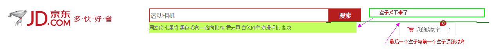
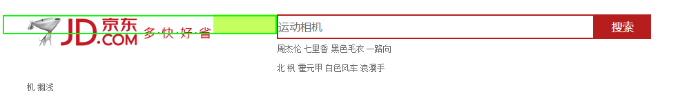
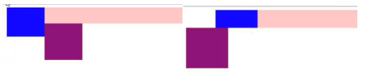

>大家好，这里是「 从零开始学 Web 系列教程 」，并在下列地址同步更新......
>
> - github：https://github.com/Daotin/Web
> - 微信公众号：[Web前端之巅](https://github.com/Daotin/pic/raw/master/wx.jpg)
> - 博客园：http://www.cnblogs.com/lvonve/
> - CSDN：https://blog.csdn.net/lvonve/
>
> 在这里我会从 Web 前端零基础开始，一步步学习 Web 相关的知识点，期间也会分享一些好玩的项目。现在就让我们一起进入 Web 前端学习的冒险之旅吧！

## 其他总结

1、高和行高也可以撑开盒子，背景图不行。

2、文字不设置行高，是包含文字的盒子的行高。

3、行内元素有定位就可以直接设置宽高

4、文字不在设置的行高等背景里面是因为没有设置行高

5、如果给了定位，但是没有给left，top等值，默认会腾出行内元素、padding的位置，有的时候我们可以使用这些特性，有的时候我们不熟悉的话可能产生bug。

6、较少功能使用较少代码（a代替ui>li>a）

7、如果盒子都是左对齐的话，最后一个盒子在右边的位置不够的话，会掉下来，如果第一个盒子A比第二个盒子B高，那么最后一个盒子C掉下来后跟第二个盒子B左对齐，而不是跟第一个盒子A左对齐。如果最后一个盒子C后面还有一个盒子D的话，D盒子的顶端跟C对齐。

8、标准流中的文字不会被浮动的盒子遮挡住。所以一个大盒子中的小盒子要么都浮动要么都不浮动。

9、父盒子高度为0 ，子盒子如果是浮动的话不占位置，下面的标准流盒子将会跑到子盒子下面。或者，父盒子高度为0，然后子绝父相，下面的标准流盒子依然会跑到子盒子下面。（这个可以做类似京东的侧边栏，如果侧边栏挡住了跑上来的标准流盒子，那么把包含标准流的整个大盒子定位：position:relative ，因为定位的层级高，所以就可以显示标准流的所有内容了。）

10、想要盒子随着界面变大变小，而盒子随着界面的中线能够移动的时候（类似定位/脱标的盒子居中对齐），不要加版心。

11、父盒子有高度，但是子盒子太高，父盒子会被撑破；如果父盒子没有高度，那么父盒子会被撑开，是所有子盒子最高的高度。撑开的盒子可能会产生影响。**（不要让浮动的盒子超出父盒子）**

12、浮动盒子的相互影响，不管是否在一个大盒子里面（蓝盒子是包含在粉红盒子里面的，紫盒子和粉红盒子是并列的）。

 

13、定位的时候，left的权限比right权限高，top比bottom高，提高权限也没用。

14、行高可以继承。

15、如果一个大盒子装的是li标签，而且li标签是浮动的，如果li里面的内容超过了大盒子的话，会有li标签掉下来，如何使得所有的li标签在一行显示呢？

用一个辅助盒子装下所有的li标签，然后大盒子只装辅助盒子，这样对于大盒子来说，所有的li标签都会在一行显示，即使大盒子很小。而辅助盒子可以使用ul来代替，给ui一个所有li加起来的宽度即可。

16、行内元素给了定位，不需要转block，唯有static, relative不行。

17、background: url("spirit.png") -135px 0;

关于背景の问题：

有时候我发现background后面两个px可以调节位置，有的时候又必须使用left，top等调位置。其实后面的两个px本来就是调位置的，而且调的是整个背景的位置，当需要整张图片的时候，调节这两个px就可以了，但是精灵图因为需要的只是某一个区域的图，调节这两个px只是将选中的区域移动到原点，这样方便使用left，top等来调到具体的位置。

 

18、.current类选择器：给谁用，谁显示。

