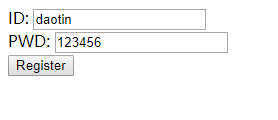
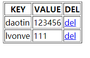

## 一、什么是cookie

cookie 就是一种特殊的字符串。是存放于**指定网站的指定浏览器下面的文件夹下**。用来帮助页面记录用户操作（会话跟踪技术）

**cookie可以跨越一个域名下的多个网页，但不能跨越多个域名使用。**

cookie不支持本地文件，只能是网站下文件。

cookie 需要注意的属性有：名称，内容，域名，路径，创建时间，到期时间。


## 二、cookie 的创建与保存

使用document对象的cookie属性，cookie是以键值对（key=value）字符串的方式保存在文件里的。

```js
// 定义语法 document.cookie = "名称=内容"
document.cookie = "myname=Daotin";
document.cookie = "myage=18";
```

> 
> 在cookie 里面，名称是唯一的标识；
>
> 如果定义的时候改变了名称，那么cookie会被覆盖；
>
> 如果定义的时候改变了名称后面的内容，那么cookie取到的内容也会改变。


## 三、cookie的读取

```js
// 取值，返回值为字符串
console.log(document.cookie); //"myname=Daotin; myage=18" (使用服务器模式打开网页才可以看到)
```


## 四、cookie失效时间

Cookie总是保存在客户端中，按在客户端中的存储位置，可分为内存（非持久）Cookie和硬盘（持久）Cookie。

- 内存Cookie由浏览器维护，保存在内存中，**浏览器关闭**（不是页面关闭）后就消失了，其存在时间是短暂的。
- 硬盘Cookie保存在硬盘里，有一个过期时间，除非用户手工清理或到了过期时间，硬盘Cookie不会被删除，其存在时间是长期的。如果 cookie 包含到期日期，则可视为持久性 cookie。 在指定的到期日期，cookie 将从磁盘中删除。


如果设置的是一个过期的时间，会自动删除。

```js
// 设置cookie 到期时间
var date = new Date();
date.setDate(date.getDate()+7); // 设置7天后的时间点
document.cookie = "myage=18; expires=" + date; 	
```


## 五、cookie注意点（中文编码问题）

- 一次创建多个cookie，可以使用 “&”进行分割：

- 在cookie 的名或值中不能有：分号（;）、逗号（,）、等号（=）以及空格。

- 对于中文怎么办？

  1、中文编码 `encodeURIComponent("中文")` ，解码： `decodeURIComponent("%E4%B8%AD%E6%96%87")`

  2、中文编码 `escape("中文")` ，解码：`unescape("%u4E2D%u6587")`

  3、中文编码 `encodeURI("中文")` ，解码：`decodeURI("%E4%B8%AD%E6%96%87");`


- **同一路径下，cookie的key是唯一的，但是不同路径下，key的值可以重复。**


## 六、常见cookie应用

- 日期cookie ：

当我们访问某些网站时，首页会显示：“你上次访问的时间是：2018.11.20” 的时候，日期是在 cookie 中保存着。

- 保存用户登录状态：

将用户id存储于一个cookie内，这样当用户下次访问该页面时就不需要重新登录了。

- 跟踪用户行为：

一个天气预报网站，能够根据用户选择的地区显示当地的天气情况。如果每次都需要选择所在地是烦琐的，当利用了 cookie后就会显得很人性化了，系统能够记住上一次访问的地区，当下次再打开该页面时，它就会自动显示上次用户所在地区的天气情况。

- 定制页面（如 md2all 网站）：

如果网站提供了换肤或更换布局的功能，那么可以使用cookie来记录用户的选项，例如：背景色、分辨率等。当用户下次访问时，仍然可以保存上一次访问的界面风格。 


## 七、封装函数实现cookie的增删改查

```js
// cookie的增加，删除，修改
function setCookie(key, value, days) {
    if (days) {
        var date = new Date();
        date.setDate(date.getDate() + days);
        document.cookie = key + "=" + value + ";expires=" + date;

    } else {
        document.cookie = key + "=" + value;
    }
};

// cookie 的查找
function getCookie(key) {
    var cookie = document.cookie;
    if (cookie) {
        var cookieStr = cookie.split("; ");
        var item = cookieStr.filter(function (ele) {
            return ele.split("=")[0] == key;
        })[0];

        if (item) {
            return item.split('=')[1];
        } else {
            return "";
        }
    } else {
        return "";
    }
};
```


## 八、cookie 的路径问题

同一路径下的网页及其子目录下的网页可以共享cookie，路径不同时，不能访问 。

默认情况下，如果在某个页面创建了一个cookie，那么该页面所在目录中的其它页面也可以访问该cookie。

如果这个目录下还有子目录，则在子目录中也可以访问。

例如在 www.xxxx.com/html/a.html 中所创建的cookie，可以被 www.xxxx.com/html/b.html 或 www.xxx.com/ html/some/c.html 所访问，但不能被 www.xxxx.com/d.html 访问。

如果想控制cookie可以访问的目录，需要使用path参数设置cookie，语法：

` document.cookie="name=value; path=cookieDir";` 其中cookieDir表示可访问cookie的目录。

```js
例如：
document.cookie="userId=007; path=/temp"; //就表示当前cookie仅能在temp目录下使用。 
document.cookie="userId=007; path=/";     //表示cookie在整个网站根目录下可用.
```


## 九、cookie的域名问题

必须在绑定域名的服务器上才可以设置域名.

并且只能设置绑定的域名，也就是说，不同服务器间的cookie文件不共享。主机名是指同一个域下的不同主机。

例如：www.google.com 和 www.gmail.google.com 就是两个不同的主机名。

默认情况下，一个主机中创建的cookie在另一个主机下是不能被访问的，但可以通过 domain参数来实现对其的控制，其语法格式为： `document.cookie="name=value; domain=cookieDomain";`

```js
// 以 google 为例，要实现跨主机访问，可以写为：
document.cookie="name=value;domain=.google.com"; 
```

这样，所有google.com下的主机都可以访问该cookie。


## 十、示例：利用cookie记录注册信息

**cookie_register**

注册用户信息，然后跳转到登录界面。

```html
<!DOCTYPE html>
<html lang="en">

<head>
    <meta charset="UTF-8">
    <meta name="viewport" content="width=device-width, initial-scale=1.0">
    <meta http-equiv="X-UA-Compatible" content="ie=edge">
    <title>Document</title>
</head>

<body>
    ID: <input type="text" name="" id="txt"><br>
    PWD: <input type="text" name="" id="pwd"><br>
    <button>Register</button>
</body>
<script src="../js/daotin.js"></script>
<script>
    var txt = document.getElementById("txt");
    var pwd = document.getElementById("pwd");
    var btn = document.getElementsByTagName("button")[0];


    btn.onclick = function () {
        var username = txt.value;
        var userpwd = pwd.value;

        if (username != "" && userpwd != "") {

            if (!getCookie("username_" + username)) {
                setCookie("username_" + username, username, 7);
                setCookie("userpwd_" + username, userpwd, 7);
                window.location.href = "cookie_login.html";
            }
            txt.value = "";
            pwd.value = "";
        } else {
            alert("username or userpwd can not empty.");
        }
    };
</script>

</html>
```



**cookie_login**

在登录界面校验登录时输入的用户信息是否合法，合法则跳入所有cookie列表。

```html
<!DOCTYPE html>
<html lang="en">

<head>
    <meta charset="UTF-8">
    <meta name="viewport" content="width=device-width, initial-scale=1.0">
    <meta http-equiv="X-UA-Compatible" content="ie=edge">
    <title>Document</title>
</head>

<body>
    ID: <input type="text" name="" id="txt"><br>
    PWD: <input type="text" name="" id="pwd"><br>
    <button>Login</button>
</body>
<script src="../js/daotin.js"></script>
<script>
    var txt = document.getElementById("txt");
    var pwd = document.getElementById("pwd");
    var btn = document.getElementsByTagName("button")[0];

    btn.onclick = function () {
        var username = txt.value;
        var userpwd = pwd.value;

        if (getCookie("username_" + username)) {
            if (getCookie("userpwd_" + username) == userpwd) {
                window.location.href = "user_pwd_list.html";
            } else {
                alert("password is wrong.");
            }
        } else {
            alert("username is not exist.");
        }
    };
</script>

</html>
```


**userInfo_list**

展示所有cookie信息。点击删除时，删除列表对应的cookie和浏览器中的对应cookie文件。

```html
<!DOCTYPE html>
<html lang="en">

<head>
    <meta charset="UTF-8">
    <meta name="viewport" content="width=device-width, initial-scale=1.0">
    <meta http-equiv="X-UA-Compatible" content="ie=edge">
    <title>Document</title>
</head>

<body>
    <div id="box"></div>
    <table border="1">
        <tr>
            <th>KEY</th>
            <th>VALUE</th>
            <th>DEL</th>
        </tr>
    </table>
</body>
<script src="../js/daotin.js"></script>
<script>
    var box = document.getElementById("box");
    var tableObj = document.getElementsByTagName("table")[0];
    var delList = document.getElementsByTagName("a");

    var cookie = document.cookie;
    var cookieList = cookie.split("; ");

    var itemList = cookieList.filter(function (item) {
        return item.indexOf("username_") == 0;
    });

    // ["username_lvonve=lvonve", "username_daotin=daotin", "username_feng=feng"]
    itemList.forEach(function (item) {
        var itemName = item.split("=")[1];

        var trObj = document.createElement("tr");
        tableObj.appendChild(trObj);

        var tdUserName = document.createElement("td");
        var tdUserPwd = document.createElement("td");
        var tdDel = document.createElement("td");

        tdUserName.innerHTML = itemName;
        tdUserPwd.innerHTML = getCookie("userpwd_" + itemName);
        tdDel.innerHTML = "<a href='javascript:;'>del</a>";

        trObj.appendChild(tdUserName);
        trObj.appendChild(tdUserPwd);
        trObj.appendChild(tdDel);
    });

    for (var i = 0; i < delList.length; i++) {
        delList[i].onclick = function () {
            var pwd = this.parentNode.previousElementSibling || this.parentNode.previousSibling;
            var uname = pwd.previousElementSibling || pwd.previousSibling;

            console.log(pwd.innerHTML);

            setCookie("username_" + uname.innerHTML, "", -1);
            setCookie("userpwd_" + uname.innerHTML, "", -1); //"userpwd_lvonve=111"

            this.parentNode.parentNode.remove(); // 删除tr

            window.location.reload();
        };
    }
</script>

</html>
```



