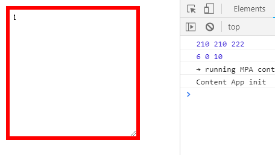
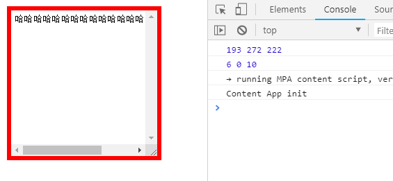
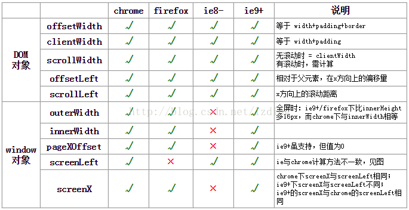

## *(added in 20210813)*

最新内容已更新至博客：[一文搞懂JavaScript中各种宽高位置（全）](https://daotin.github.io/2021/08/08/%E4%B8%80%E6%96%87%E6%90%9E%E6%87%82JavaScript%E4%B8%AD%E5%90%84%E7%A7%8D%E5%AE%BD%E9%AB%98%E4%BD%8D%E7%BD%AE.html)（更新日期：2021-08-08）

以下内容为旧的，可以不必查看。


---


## 一、问题由来

刚开始学 DOM 操作中对于元素距离元素的距离问题总是迷迷糊糊的，虽然有万能的 getCurrentStyle 方式来取得所需要的属性，但是有时看别人的代码的时候，总会遇到很多简写的方式，或者有的时候为了简洁，关键字的方式更加合适，但是要求我们对这些属性的区别要特别清楚。

比如下面要说的 offset 系列，scroll 系列，client系列的距离，还有事件发生时 offsetX，clientX，pageX 等等的一些距离的总结，可以在我们忘记的时候翻翻一翻这篇文章，然后花最短的时间搞清楚它们之间的区别。


## 二、元素位置之间的距离

先看下示例代码：

```html
<!DOCTYPE html>
<html lang="en">

<head>
    <meta charset="UTF-8">
    <meta name="viewport" content="width=device-width, initial-scale=1.0">
    <meta http-equiv="X-UA-Compatible" content="ie=edge">
    <title>Document</title>
    <style>
        * {
            margin: 0;
            padding: 0;
        }

        textarea {
            width: 200px;
            height: 200px;
            border: 6px solid red;
            padding: 5px;
            margin: 10px;
            /* overflow: scroll; */ /*加不加滚动条*/
            white-space: nowrap;    /*强制不换行*/
        }
    </style>
</head>

<body>
    <textarea>1</textarea>
</body>
<script>
    var textarea = document.querySelector("textarea");

    console.log(textarea.clientWidth, textarea.scrollWidth, textarea.offsetWidth);
    console.log(textarea.clientLeft, textarea.scrollLeft, textarea.offsetLeft);
</script>

</html>
```





> textarea.clientWidth = 200(可见区域) + 5(padding) + 5(padding)
>
> textarea.scrollWidth = 200(可见区域) + 5(padding) + 5(padding)
>
> textarea.offsetWidth = 200(可见区域) + 5(padding) + 5(padding) + 6(border) + 6(border)
>
> textarea.clientLeft = 6(border-left)
>
> textarea.scrollLeft = 0(横向滚动条滚动的距离)
>
> textarea.offsetLeft = 10(元素左外border距离父元素左内border的距离)


当我把滚动条加上的时候：


> textarea.clientWidth = 200(可见区域) + 5(padding) + 5(padding) - 17(滚动条宽度)
>
> textarea.scrollWidth = 200(可见区域) + 5(padding) + 5(padding) - 17(滚动条宽度)
>
> textarea.offsetWidth = 200(可见区域) + 5(padding) + 5(padding) + 6(border) + 6(border)
>
> textarea.clientLeft = 6(border-left)
>
> textarea.scrollLeft = 0(横向滚动条滚动的距离)
>
> textarea.offsetLeft = 10(元素左外border距离父元素左内border的距离)


当文字过长滚动条可以滑动的时候：



> textarea.clientWidth = 200(可见区域) + 5(padding) + 5(padding) - 17(滚动条宽度)
>
> textarea.scrollWidth = 280(整个内容，包括不可见区域) + 5(padding) + 5(padding) - 17(滚动条宽度)
>
> textarea.offsetWidth = 200(可见区域) + 5(padding) + 5(padding) + 6(border) + 6(border)
>
> textarea.clientLeft = 6(border-left)
>
> textarea.scrollLeft = 0(横向滚动条滚动的距离)
>
> textarea.offsetLeft = 10(元素左外border距离父元素左内border的距离)


由于每次打开时，滚动条的位置不变，所以我需要 js 设置滚动滚动条的时候，看每个值的变化：

```js
textarea.onscroll = function () {
    console.log(textarea.clientWidth, textarea.scrollWidth, textarea.offsetWidth);
    console.log(textarea.clientLeft, textarea.scrollLeft, textarea.offsetLeft);
};
```


我们可以发现，只有 scrollLeft 是在改变的。


上面是 width 系列 和 left 系列的一些值的情况，那么相应的 height 系列和 top 系列的值也是一样的。


### 1、总结一下


### 1.1、client系列

> **clientWidth = width（可见区域）+ padding - 滚动条宽度（如果有）**
>
> **clientHeight = height（可见区域）+ padding - 滚动条宽度（如果有）**
>
> **clientLeft：相当于元素左border(border-left)的宽度**
>
> **clientTop：相当于元素上border（border-top）的宽度**


### 1.2、scroll系列

> **scrollWidth = width（内容实际宽度，包括不可见区域） + padding**
>
> **scrollHeight = height（内容实际高度，包括不可见区域） + padding**
>
> **scrollLeft：指当前元素可见区左部，到完整内容左部的距离（也就是横向滚动条滚动的距离）。**
>
> **scrollTop：指当前元素可见区顶部，到完整内容顶部的距离（也就是纵向滚动条滚动的距离）。**


### 1.3、offset系列

在此之前，我们先看看一个属性：offsetParent。

offset是偏移的意思，既然是偏移就要有一个参照物，这个参照物就是 offsetParent。它指的是距离当前元素最近的定位父元素（position != static），这个定位父元素就是我们计算所有offset属性的参照物。

元素的 offsetParent 的获取方式：

- 通过元素的`offsetParent`属性直接获取。
- 元素`position:fixed`，则其`offsetParent`的值为`null`，此时相对视口定位。
- 元素非`fixed`定位，其父元素无位设置定位，则`offsetParent`均为`<body>`。
- 元素非`fixed`定位，其父元素中有设置定位的，则其中离当前元素最近的父元素为`offsetParent`。
- `<body>`的`offsetParent`为`null`，相对视口定位。


> **offsetWidth = width（可见区域） + padding + border**
>
> **offsetHeight = height（可见区域） + padding + border**
>
> **offsetLeft：元素左外边框距离父元素左内边框的距离（简单来说就是元素相对父元素左边的距离）**
>
> **offsetTop：元素上外边框距离父元素上内边框的距离（简单来说就是元素相对父元素上边的距离）**


下面有张图对上面的内容进行了总结，并给出了不同浏览器下的兼容性：




## 三、鼠标事件相关的坐标距离

鼠标事件中有很多描述鼠标事件发生时的坐标信息的，给大家介个图看看：


这么多的坐标位置到底有什么区别呢？下面两张图（来自网络）带你一眼看穿它们之间的区别：


### 1、总结一下

> **clientX** = 鼠标点击位置距离浏览器**可视区域**左边的距离
>
> **offsetX** = 鼠标点击位置距离元素左边的距离，不包括左border。
>
> **pageX** = scrollLeft + clientX （**但是IE8不支持**）
>
> **layerX** = offsetX + 左border + 左边滚动条滚动的距离
>
> **x** = 鼠标点击位置距离浏览器可视区域的左边距离（相当于 clientX）。
>
> **screenX** = 鼠标点击位置距离电脑屏幕左边的距离。


同样，上面都是 X 系列的位置比较，Y的方向上也是一样的。


看完这些，你对 DOM 元素的距离相关的属性都了解了吗？
