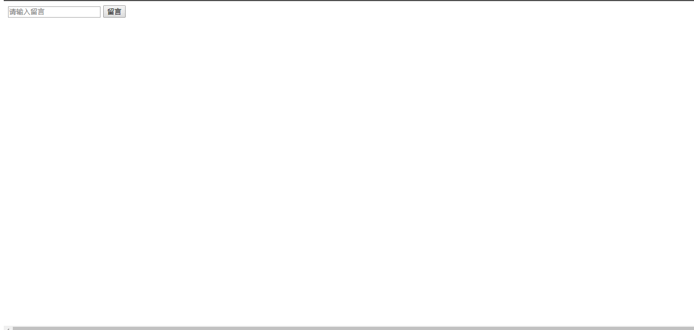

1、选项卡

要求：点击对应的标签，显示对应的选项卡

```html
<!DOCTYPE html>
<html lang="en">

<head>
    <meta charset="UTF-8">
    <title>Title</title>
    <style>
        * {
            margin: 0;
            padding: 0;
        }

        li {
            list-style: none;
        }

        div {
            width: 400px;
            margin: 0 auto;
            background-color: #ccc;
        }

        #nav {
            width: 400px;
            height: 50px;
        }

        #nav li {
            width: 25%;
            height: 50px;
            line-height: 50px;
            text-align: center;
            float: left;
            border: 1px solid red;
            box-sizing: border-box;
            cursor: pointer;
        }

        #nav li:hover {
            background-color: yellow;
        }

        #content {
            width: 400px;
            height: 400px;
            position: relative;
        }

        #content li {
            width: 100%;
            height: 100%;
            position: absolute;
            left: 0;
            top: 0;
        }

        #content li img {
            width: 100%;
        }

        .active {
            z-index: 10;
        }
    </style>
</head>

<body>
    <div>
        <ul id="nav">
            <li>1</li>
            <li>2</li>
            <li>3</li>
            <li>4</li>
        </ul>
        <ul id="content">
            <li class="active"></li>
            <li></li>
            <li></li>
            <li></li>
        </ul>


    </div>


</body>
<script>
    var ulObj1 = document.getElementsByTagName("ul")[0];
    var ulObj2 = document.getElementsByTagName("ul")[1];
    var liList1 = ulObj1.getElementsByTagName("li");
    var liList2 = ulObj2.getElementsByTagName("li");

    for (let i = 0; i < liList2.length; i++) {
        liList2[i].setAttribute("index", i);
    }

    for (let i = 0; i < liList1.length; i++) {
        liList1[i].onclick = function () {
            for (let j = 0; j < liList2.length; j++) {
                liList2[j].setAttribute("class", "");

                var index = liList2[j].getAttribute("index");
                // console.log(i, index);

                if (index == i) {
                    liList2[j].className = "active";
                }
            }
        };
    }
</script>

</html>
```


2、购物车

要求：

- 点击全选按钮，选中所有商品
- 点击数量加号，数量加一，出现减号，小计累加
- 减号同理
- 点击删除，删除此行商品
- 选中的商品都会在最后的总金额更新。


```html
<!DOCTYPE html>
<html>

<head>
    <meta http-equiv="Content-Type" content="text/html; charset=utf-8" />
    <title>原生JS实现购物车结算功能代码</title>
    <link rel="stylesheet" href="../css/style.css" />
</head>

<body>
    <div class="catbox">
        <table id="cartTable">
            <thead>
                <tr>
                    <th><label>
                            <input class="check-all check" type="checkbox" />&nbsp;&nbsp;全选</label></th>
                    <th>商品</th>
                    <th>单价</th>
                    <th>数量</th>
                    <th>小计</th>
                    <th>操作</th>
                </tr>
            </thead>
            <tbody>
                <tr>
                    <td class="checkbox"><input class="check-one check" type="checkbox" /></td>
                    <td class="goods"><span>Casio/卡西欧 EX-TR350</span></td>
                    <td class="price">5999.88</td>
                    <td class="count"><span class="reduce"></span>
                        <input class="count-input" type="text" value="1" />
                        <span class="add">+</span></td>
                    <td class="subtotal">5999.88</td>
                    <td class="operation"><span class="delete">删除</span></td>
                </tr>
                <tr>
                    <td class="checkbox"><input class="check-one check" type="checkbox" /></td>
                    <td class="goods"><span>Canon/佳能 PowerShot SX50 HS</span></td>
                    <td class="price">3888.50</td>
                    <td class="count"><span class="reduce"></span>
                        <input class="count-input" type="text" value="1" />
                        <span class="add">+</span></td>
                    <td class="subtotal">3888.50</td>
                    <td class="operation"><span class="delete">删除</span></td>
                </tr>
                <tr>
                    <td class="checkbox"><input class="check-one check" type="checkbox" /></td>
                    <td class="goods"><span>Sony/索尼 DSC-WX300</span></td>
                    <td class="price">1428.50</td>
                    <td class="count"><span class="reduce"></span>
                        <input class="count-input" type="text" value="1" />
                        <span class="add">+</span></td>
                    <td class="subtotal">1428.50</td>
                    <td class="operation"><span class="delete">删除</span></td>
                </tr>
                <tr>
                    <td class="checkbox"><input class="check-one check" type="checkbox" /></td>
                    <td class="goods"><span>Fujifilm/富士 instax mini 25</span></td>
                    <td class="price">640.60</td>
                    <td class="count">
                        <span class="reduce"></span>
                        <input class="count-input" type="text" value="1" />
                        <span class="add">+</span></td>
                    <td class="subtotal">640.60</td>
                    <td class="operation"><span class="delete">删除</span></td>
                </tr>
            </tbody>
        </table>
        <div class="foot" id="foot">
            <label class="fl select-all"><input type="checkbox" class="check-all check" />&nbsp;&nbsp;全选</label>
            <a class="fl delete" id="deleteAll" href="javascript:;">删除</a>
            <div class="fr closing" onclick="getTotal();">结 算</div>
            <input type="hidden" id="cartTotalPrice" />
            <div class="fr total">合计：￥<span id="priceTotal">0.00</span></div>
            <div class="fr selected" id="selected">已选商品<span id="selectedTotal">0</span>件<span class="arrow up">︽</span><span
                    class="arrow down">︾</span></div>
            <div class="selected-view">
                <div id="selectedViewList" class="clearfix">
                    <div><span>取消选择</span></div>
                </div>
                <span class="arrow">◆<span>◆</span></span>
            </div>
        </div>
    </div>
</body>
<script src="../js/daotin.js"></script>
<script>
    var checkAllList = document.getElementsByClassName("check-all");
    var checkOne = document.getElementsByClassName("check-one");
    var addList = document.getElementsByClassName("add");
    var selectedTotalObj = document.getElementById("selectedTotal");
    var subtotalObj = document.getElementsByClassName("subtotal");
    var priceTotalObj = document.getElementById("priceTotal");
    var countInputObj = document.getElementsByClassName("count-input");
    var deleteList = document.getElementsByClassName("delete");
    var deleteAll = document.getElementById("deleteAll");

    var reduceList = document.getElementsByClassName("reduce");

    var choiceArr = [];
    var choiceNum = checkOne.length;
    var choiceTotalPrice = 0;

    function choiceCount() {
        choiceNum = checkOne.length;
        choiceTotalPrice = 0;
        var choiceObj = {};
        for (let i = 0; i < checkOne.length; i++) {
            if (!checkOne[i].checked) {
                choiceNum--;
            } else {
                choiceTotalPrice += checkOne[i].parentElement.parentElement.getElementsByClassName("subtotal")[0].innerHTML *
                    1;
            }

        }

        selectedTotalObj.innerHTML = choiceNum;
        priceTotalObj.innerHTML = choiceTotalPrice.toFixed(2);

        console.log(choiceNum);
        console.log(choiceTotalPrice.toFixed(2));

    };


    var checkCount = 0;
    var choiceFlag = false;
    for (let i = 0; i < checkAllList.length; i++) {
        checkAllList[i].onclick = function () {
            if (this.checked) {
                checkCount = checkOne.length;
                for (let i = 0; i < checkAllList.length; i++) {
                    checkAllList[i].checked = true;
                    choiceFlag = true;
                }
            } else {
                checkCount = 0;
                for (let i = 0; i < checkAllList.length; i++) {
                    checkAllList[i].checked = false;
                    choiceFlag = false;
                }
            }


            if (choiceFlag) {
                for (let i = 0; i < checkOne.length; i++) {
                    checkOne[i].checked = choiceFlag;
                }
            } else {
                for (let i = 0; i < checkOne.length; i++) {
                    checkOne[i].checked = choiceFlag;
                }
            }
            choiceCount();
        };
    }

    for (let i = 0; i < checkOne.length; i++) {

        checkOne[i].onclick = function () {
            if (this.checked) {
                checkCount++;
            } else {
                checkCount--;
            }

            if (checkCount == checkOne.length) {
                for (let i = 0; i < checkAllList.length; i++) {
                    checkAllList[i].checked = true;
                }

            } else {
                for (let i = 0; i < checkAllList.length; i++) {
                    checkAllList[i].checked = false;
                }
            }

            choiceCount();
        };
    }

    // for (let i = 0; i < countInputObj.length; i++) {
    //     selectedTotalObj.innerHTML = selectedTotalObj.innerHTML * 1 + countInputObj[i].value * 1;
    // }
    // selectedTotalObj.innerHTML = choiceCount().num;
    // priceTotalObj.innerHTML = choiceCount().price.toFixed(2);


    for (let i = 0; i < addList.length; i++) {
        addList[i].onclick = function () {
            let numObj = this.previousElementSibling || this.previousSibling;
            let subObj = numObj.previousElementSibling || numObj.previousSibling;
            let addFatherObj = this.parentElement;
            let unitPriceObj = addFatherObj.previousElementSibling || addFatherObj.previousSibling;
            let totalPriceObj = addFatherObj.nextElementSibling || addFatherObj.nextSibling;

            numObj.value = numObj.value * 1 + 1;

            totalPriceObj.innerHTML = (unitPriceObj.innerHTML * numObj.value).toFixed(2);
            priceTotalObj.innerHTML = (priceTotalObj.innerHTML * 1 + totalPriceObj.innerHTML * 1).toFixed(2);


            if (numObj.value > 1) {
                subObj.innerHTML = "-";
            }

            choiceCount();

            // subObj.onclick = function () {
            //     numObj.value = numObj.value * 1 - 1;
            //     // console.log("subObj.onclick:" + numObj.value);
            //     if (numObj.value <= 1) {
            //         numObj.value = 1;
            //         this.innerHTML = "";
            //         this.onclick = null;
            //     }
            //     totalPriceObj.innerHTML = (unitPriceObj.innerHTML * numObj.value).toFixed(2);
            //     // priceTotalObj.innerHTML = (priceTotalObj.innerHTML * 1 - totalPriceObj.innerHTML * 1).toFixed(2);
            //     choiceCount();
            // };
        };
    }

    for (let i = 0; i < reduceList.length; i++) {
        reduceList[i].onclick = function () {
            let numObj = this.nextElementSibling || this.nextSibling;
            var unitPriceObj = this.parentElement.previousElementSibling;
            var totalPriceObj = this.parentElement.nextElementSibling;

            if (numObj.value == 1) {
                this.innerHTML = "";
                // this.onclick = null;
                return;
            }

            numObj.value = numObj.value * 1 - 1;

            totalPriceObj.innerHTML = (unitPriceObj.innerHTML * numObj.value).toFixed(2);
            choiceCount();
        };
    }

    for (let i = 0; i < deleteList.length; i++) {
        deleteList[i].onclick = function () {
            this.parentElement.parentElement.remove();
            choiceCount();
        };
    }
</script>

</html>
```


3、动态留言板

```html
<!DOCTYPE html>
<html lang="en">

<head>
    <meta charset="UTF-8">
    <title>作业</title>
    <style>
        html,
        body {
            width: 100%;
            height: 100%;
            position: relative;
            /* background-color: #ccc; */
        }

        .tr {
            width: 400px;
            /* padding: 20px; */
            /* height: 100px; */
            border: 1px solid red;
            box-sizing: border-box;
            margin: 10px 0;
        }

        .tr p:first-child {
            color: blue;
        }

        .tr p:last-child {
            background-color: yellow;
        }

        .tr button {
            float: right;
        }

        .shadow {
            position: fixed;
            left: 0;
            top: 0;
            width: 100%;
            height: 100%;
            background-color: rgba(123, 123, 123, 0.5);
            display: table;
            display: none;
        }

        #reply {
            width: 400px;
            height: 400px;
            display: table-cell;
            vertical-align: middle;
            text-align: center;
        }
    </style>
</head>

<body>
    <div id="header">
        <input id="msg" placeholder="请输入留言">
        <button id="btn">留言</button>
    </div>
    <div id="content">
    </div>
    <div class="shadow">
        <div id="reply">
            <textarea cols="30" rows="10"></textarea><br>
            <button>回复</button>
        </div>
    </div>


</body>
<script src="../js/daotin.js"></script>
<script>
    var inpObj = $("#msg");
    var btn = $("#btn");
    var content = $("#content");
    var childBtn = content.getElementsByTagName("button");
    // console.log(childBtn);

    var shadowObj = $(".shadow");
    var replyInp = $("textarea", shadowObj);
    var replyBtn = $("button", shadowObj);

    btn.onclick = function () {
        if (inpObj.value != "") {
            var newDiv = document.createElement("div");
            newDiv.className = "tr";
            content.appendChild(newDiv);
            var newPtime = document.createElement("p");
            var newPcon = document.createElement("p");
            newPtime.innerHTML = dateFormat(new Date(), "yyyy-mm-dd hh:mm:ss");
            newPcon.innerHTML = inpObj.value + "<button>回复</button>";
            newDiv.appendChild(newPtime);
            newDiv.appendChild(newPcon);

            inpObj.value = "";

            this.disabled = true;
            this.innerHTML = "还有 3s 可以点击";

            var count = 3;

            btn.timer = setInterval(function () {
                // console.log(btn.value);
                count--;
                btn.innerHTML = "还有 " + count + "s 可以点击";

                if (count == 0) {
                    clearInterval(btn.timer);
                    count = 5;
                    btn.disabled = false;
                    btn.innerHTML = "回复";
                }
            }, 1000);
        }

        for (var i = 0; i < childBtn.length; i++) {
            let item = childBtn[i];
            item.onclick = function () {
                shadowObj.style.display = "table";
                document.body.style.backgroundColor = "#ccc";

                replyBtn.onclick = function () {
                    if (replyInp.value != "") {
                        var newP = document.createElement("p");
                        newP.innerHTML = replyInp.value;
                        // console.log(item);

                        item.parentNode.appendChild(newP);

                        shadowObj.style.display = "none";
                        document.body.style.backgroundColor = "";
                        replyInp.value = "";
                    }

                };
            };
        }
    };
</script>

</html>
```


