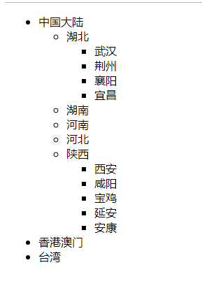

## 一、jQuery中的一些方法

### 1、使用css操作元素样式

#### 1.1、常规写法

```js
$("#dv").css("width", "200px"); 
$("#dv").css("backgroundColor", "red"); 
$("#dv").css("width", function(index,item){
    return index+1;
});
```

> $("#dv").css("width", 200); px加不加都可以
>
> $("#dv").css("background-color", "red"); 两种写法都可以

#### 1.2、链式写法

```js
$("#dv").css("width", "200px").css("height", "100px").css("background", "red");
```

#### 1.3、键值对写法

```js
var json = {"width":"200px", "height":"100px"; "backgroundColor":"red"};
$("#dv").css(json);
```

示例：

```html
<div></div>
<div></div>
<div></div>

<script>
    $("div").css({
        width:50,
        height:50,
        backgroundColor:function () {
            return randomColor();
        },
        position:"absolute",
        left:function (index) {
            return index*100;
        },
        top:function (index) {
            return index*100;
        }
    }).on("click",function (e) {
        $(this).css("backgroundColor",randomColor());
    });

    function randomColor() {
        var col="#";
        for(var i=0;i<6;i++){
            col+=Math.floor(Math.random()*16).toString(16);
        }
        return col;
    }
</script>
```


### 2、操作元素内容val,text,html

#### 2.1、value

```js
val(); // 获取或设置表单标签中的 value 值。
元素集合.val(); // 获取的是元素集合中第一个元素的value值
元素集合.val(function(index,item){return index;}); // 设置元素集合中每个元素的value为不同的值
```


#### 2.2、text

```js
text(); // 获取或设置标签的文本内容----相当于DOM中的innerText
元素集合.text(); // 当获取的时候，获取的是所有元素中所有html内容的拼接。
元素集合.text(function(index,item){ //text可以使用函数作为参数：设置元素集合中每个text的值。
    return index+"aaa"; // 使用return来设置text的值
});
```


#### 2.3、html

```js
html(); // 获取或设置标签的html内容----相当于DOM中的innerHTML
元素集合.html(); // 当获取的时候，获取的是所有元素中第一个元素里面的html内容
元素集合.html(function(index,item){return index;});
```

> 除了text的元素集合的获取内容是所有元素的内容拼接之外，其他的获取内容都是第一个元素的内容。


## 二、链式编程

### 1、什么是链式编程？

对象在调用方法后可以继续调用方法，直到海枯石烂，地老天荒，直到山无棱，天地合，冬雷震震夏雨雪，乃敢不链式O.o。


### 2、语法

```js
对象.方法().方法().方法().......
```


### 3、条件

链式编程的前提：对象调用方法后的返回值还是**当前对象**，那么就可以继续调用方法，否则不可以继续调用方法。


### 4、经验

在 jQuery 中，一般情况下，对象调用方法，如果这个方法是设置某个属性的话（方法有参数是设置属性的值），那么返回值几乎都是当前对象，就可以继续链式编程。

示例：

```js
$("#dv").css("width","10px").val("haha").css("height":"20px");
```


## 三、使用class操作元素样式

### 1、添加类样式

语法：

```js
$("#dv").addClass("类选择器");
```


如果需要应用多个类样式，可以使用链式编程或者在一个addClass中写两个类选择器，中间用空格隔开。

```js
// 链式编程
$("#dv").addClass("类选择器1").addClass("类选择器2");

// 或者
$("#dv").addClass("类选择器1 类选择器2")
```


### 2、移除类样式

语法：

```js
// 链式编程
$("#dv").removeClass("类选择器1").removeClass("类选择器2");

// 或者
$("#dv").removeClass("类选择器1 类选择器2")
```


### 3、判断是否采用类样式

语法：

```js
// 链式编程
$("#dv").hasClass("类选择器1").hasClass("类选择器2");

// 或者
$("#dv").hasClass("类选择器1 类选择器2")
```


### 4、切换类样式

语法

```js
$("#dv").toggleClass("类选择器");
```

判断是否应用类选择器，如果没应用就添加，应用了就移除。


>   注意：
>
>   1、`addClass`, `removeClass`,  `toggleClass` 方法不管有没有参数，返回值都是调用其的对象，都可以链式编程。
>
>   2、使用 CSS 方式是不能添加和移除类样式的。


## 四、动画相关方法

### 1、第一组

```js
// 参数1：时间（有两种写法：1. 1000ms，2. "normal","slow","fast"）
//        normal: 相当于400ms，slow：600ms，fast：200ms
// 参数2：函数（在动画执行完成之后调用）

// 这两个动画都是从左上角同时改变宽高来实现显示和隐藏的。
show(参数1，参数2);
hide(参数1，参数2);
```

示例：

```js
$("#btn1").click(function () {
    $("#dv").hide("slow", function () {
        alert("hide");
    });
});
$("#btn2").click(function () {
    $("#dv").show("slow", function () {
        alert("show");
    });
});
```


### 2、第二组

```js
// 参数和 show hide 一样
// 效果是上划入和划出
slideDown() // 显示
sildeUp()   // 隐藏
slideToggle(); // 隐藏和显示切换
```

示例：

```js
$("#btn1").click(function () {
    $("#dv").slideUp("slow", function () {
        alert("hide");
    });
});
$("#btn2").click(function () {
    $("#dv").slideDown("slow", function () {
        alert("show");
    });
});
```


案例：省市联动

```html
<!DOCTYPE html>
<html lang="en">

<head>
    <meta charset="UTF-8">
    <title>Title</title>
</head>

<body>
    <ul id="ulTop">
        <li>中国大陆
            <ul>
                <li>湖北
                    <ul>
                        <li>武汉</li>
                        <li>荆州</li>
                        <li>襄阳</li>
                        <li>宜昌</li>
                    </ul>
                </li>
                <li>湖南</li>
                <li>河南</li>
                <li>河北</li>
                <li>陕西
                    <ul>
                        <li>西安</li>
                        <li>咸阳</li>
                        <li>宝鸡</li>
                        <li>延安</li>
                        <li>安康</li>
                    </ul>
                </li>
            </ul>
        </li>
        <li>香港澳门</li>
        <li>台湾</li>
    </ul>

</body>
<script src="../js/jquery-1.12.4.js"></script>
<script>
    $("li").click(function (e) {
        e.stopPropagation(); // 阻止事件冒泡
        if (!this.firstElementChild) return;
        if (!this.bool) {
            $(this.firstElementChild).slideUp(1000);
            this.bool = true;
        } else {
            $(this.firstElementChild).slideDown(1000);
            this.bool = false;
        }
    })
</script>

</html>
```




### 3、第三组

```js
// 参数和hide show一样，只不过fade是透明度的改变
fadeIn();  // 显示
fadeOut(); // 隐藏
fadeToggle(); // 隐藏和显示切换

// 参数1：时间
// 参数2：需要到达的透明度值（比如：0.2）
fadeTo(参数1，参数2)
```

示例：

```js
$("#btn1").click(function () {
    $("#dv").fadeOut("slow", function () {
        alert("fadeOut");
    });
});
$("#btn2").click(function () {
    $("#dv").fadeIn("slow", function () {
        alert("fadeIn");
    });
});
```

> 不管是show，slideDown，fadeIn都有第二个参数，第二个参数是函数，动画完成后执行的函数。

## 4、综合动画方法

```js
// 一般三个参数
// 参数1：css键值对，属性集合
// 参数2：时间，单位ms
// 参数3：回调函数
animate({...}, 1000, function (){...})
```

示例：

```html
<script>
    $("#btn1").click(function () {
        $("#dv").animate({"width":"100px","height":"50px"}, 3000, function () {
            console.log("第一步");
        }).animate({"width":"1000px","height":"200px"}, 3000, function () {
            console.log("第二步");
        }).animate({"width":"300px","height":"150px"}, 3000, function () {
            console.log("第三步");
        });
    });
</script>
```

>   PS：貌似颜色，背景色不能动画。


