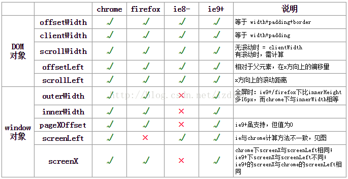
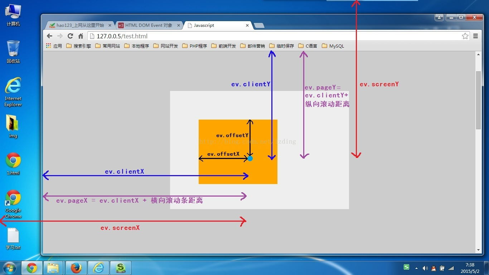
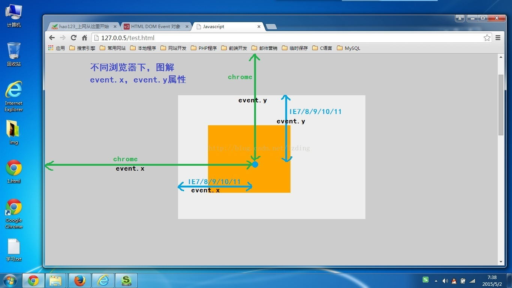

刚开始学 DOM 操作中对于元素距离元素的距离问题总是迷迷糊糊的，虽然有万能的 getCurrentStyle 方式来取得所需要的属性，但是有时看别人的代码的时候，总会遇到很多简写的方式，比如下面要说的 offset 系列，scroll 系列，client系列的距离，还有事件发生时 offsetX，clientX 等等的一些距离的总结，可以在我们忘记的时候花最短的时间搞清楚它们之间的区别。

## client系列

clientWidth = width（可见区域）+ padding - 滚动条宽度（如果有）

clientHeight = height（可见区域）+ padding - 滚动条宽度（如果有）

clientLeft：相当于元素左border(**border-left**)的宽度

clientTop：相当于元素上border（**border-top**）的宽度

## scroll系列

scrollWidth = width（内容实际宽度，包括不可见区域） + padding

scrollHeight = height（内容实际高度，包括不可见区域） + padding

scrollLeft：指当前元素可见区左部，到完整内容左部的距离（也就是横向滚动条滚动的距离）。

scrollTop：指当前元素可见区顶部，到完整内容顶部的距离（也就是纵向滚动条滚动的距离）。

## offset系列

在此之前，我们先看看一个属性：offsetParent。

offset是偏移的意思，既然是偏移就要有一个参照物，这个参照物就是 offsetParent。它指的是距离当前元素最近的定位父元素（position != static），这个定位父元素就是我们计算所有offset属性的参照物。

元素的 offsetParent 的获取方式：

- 通过元素的`offsetParent`属性直接获取。
- 元素`position:fixed`，则其`offsetParent`的值为`null`，此时相对视口定位。
- 元素非`fixed`定位，其父元素无位设置定位，则`offsetParent`均为`<body>`。
- 元素非`fixed`定位，其父元素中有设置定位的，则其中离当前元素最近的父元素为`offsetParent`。
- `<body>`的`offsetParent`为`null`，相对视口定位。

offsetWidth = width（可见区域） + padding + border

offsetHeight = height（可见区域） + padding + border

offsetLeft：元素左外边框距离父元素左内边框的距离

offsetTop：元素上外边框距离父元素上内边框的距离

## 鼠标事件相关

不同浏览器对获取鼠标横纵相关坐标的支持如下图：

一张图看懂：offsetX,clientX,pageX,screenX,lagerX,x的区别（图片来自网络）：

offsetX：鼠标点击位置距离元素左边的距离，不包括左border。

offsetY：鼠标点击位置距离元素上边的距离，不包括上border。

clientX：鼠标点击位置距离浏览器可视区域左边的距离

clientY：鼠标点击位置距离浏览器可视区域上边的距离

pageX：scrollLeft + clientX，但是IE8不支持。

pageY：scrollTop + clientY。

screenX：鼠标点击位置距离电脑屏幕左边的距离

screenY：鼠标点击位置距离电脑屏幕上边的距离

layerX：offsetX + 左border + 左边滚动条滚动的距离

layerY：offsetY + 上border + 上边滚动条滚动的距离

event.x：鼠标点击位置距离浏览器可视区域的左边距离。

event.y：鼠标点击位置距离浏览器可视区域的上边距离。