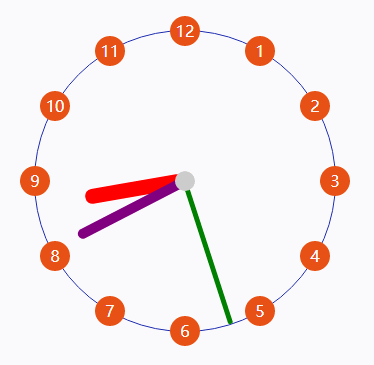
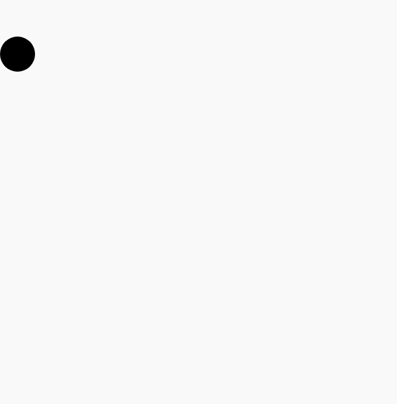

1、时钟案例

```html
<!DOCTYPE html>
<html lang="en">

<head>
    <meta charset="UTF-8">
    <meta name="viewport" content="width=device-width, initial-scale=1.0">
    <meta http-equiv="X-UA-Compatible" content="ie=edge">
    <title>Document</title>
    <style>
        * {
            margin: 0;
            padding: 0;
        }

        .box {
            width: 300px;
            height: 300px;
            margin: 100px auto;
            border: 1px solid rgb(23, 38, 175);
            border-radius: 50%;
            position: relative;
        }

        .circle {
            width: 30px;
            height: 30px;
            background-color: #e75115;
            border-radius: 50%;
            position: absolute;
            left: 140px;
            top: -10px;
            color: #fff;
            text-align: center;
            line-height: 30px;
        }

        .ball {
            width: 5px;
            height: 5px;
            background-color: #2c0aec;
            border-radius: 50%;
            position: absolute;
            left: 140px;
            top: -10px;
        }

        .dot {
            width: 20px;
            height: 20px;
            background-color: #ccc;
            border-radius: 50%;
            position: absolute;
            left: 50%;
            top: 50%;
            transform: translate(-50%, -50%);
            z-index: 1;
        }

        .hour {
            width: 15px;
            height: 100px;
            background-color: red;
            position: absolute;
            left: 142px;
            top: 50px;
            transform: rotate(0deg);
            transform-origin: 7px 100px;
            border-radius: 15px;
        }

        .min {
            width: 10px;
            height: 120px;
            background-color: purple;
            position: absolute;
            left: 145px;
            top: 30px;
            transform: rotate(0deg);
            transform-origin: 5px 120px;
            border-radius: 10px;
        }

        .sec {
            width: 5px;
            height: 150px;
            background-color: green;
            position: absolute;
            left: 148px;
            top: 0;
            transform: rotate(0deg);
            transform-origin: 2px 150px;
            border-radius: 5px;
        }
    </style>
</head>

<body>
    <div class="box">
        <div class="dot"></div>
        <div class="hour"></div>
        <div class="min"></div>
        <div class="sec"></div>
        <!-- <div class="circle"></div> -->
    </div>
</body>
<script src="../js/daotin.js"></script>
<script>
    var box = document.querySelector(".box");
    var dot = document.querySelector(".dot");
    var hour = document.querySelector(".hour");
    var min = document.querySelector(".min");
    var sec = document.querySelector(".sec");

    var R = parseInt(getStyle(box, "width")) / 2;
    var deg = 0;
    var PI = Math.PI;
    var circle = document.querySelector(".circle");
    var timer = 0;
    var secSpeed = 0;
    var minSpeed = 0;
    var hourSpeed = 0;

    var date = new Date();
    var dateHour = date.getHours();
    var dateMin = date.getMinutes();
    var dateSec = date.getSeconds();

    secSpeed = dateSec * 6;
    minSpeed = (dateMin + dateSec / 60) * 6;
    hourSpeed = (dateHour + dateMin / 60 + dateSec / 60 / 60) * 30;

    sec.style.transform = "rotate(" + secSpeed + "deg)";
    min.style.transform = "rotate(" + minSpeed + "deg)";
    hour.style.transform = "rotate(" + hourSpeed + "deg)";

    timer = setInterval(function () {
        var date = new Date();
        var dateHour = date.getHours();
        var dateMin = date.getMinutes();
        var dateSec = date.getSeconds();

        secSpeed = dateSec * 6;
        minSpeed = (dateMin + dateSec / 60) * 6;
        hourSpeed = (dateHour + dateMin / 60 + dateSec / 60 / 60) * 30;

        sec.style.transform = "rotate(" + secSpeed + "deg)";
        min.style.transform = "rotate(" + minSpeed + "deg)";
        hour.style.transform = "rotate(" + hourSpeed + "deg)";
    }, 1000);


    for (var i = 1; i <= 12; i++) {
        var circle = document.createElement("div");
        circle.className = "circle";
        circle.innerHTML = i;
        box.appendChild(circle);

        var circleWidth = parseInt(getStyle(circle, "width"));
        var circleHeight = parseInt(getStyle(circle, "height"));

        deg = i * 30 - 90;

        var x = R * Math.cos(2 * PI * deg / 360) + R - circleWidth / 2;
        var y = R * Math.sin(2 * PI * deg / 360) + R - circleHeight / 2;

        circle.style.left = x + "px";
        circle.style.top = y + "px";
    }
</script>

</html>
```




2、重力加速度小球

```html
<!DOCTYPE html>
<html lang="en">

<head>
    <meta charset="UTF-8">
    <meta name="viewport" content="width=device-width, initial-scale=1.0">
    <meta http-equiv="X-UA-Compatible" content="ie=edge">
    <title>Document</title>
    <style>
        * {
            margin: 0;
            padding: 0;
        }

        .box {
            width: 50px;
            height: 50px;
            border-radius: 50%;
            background-color: #000;
            position: absolute;
            left: 0;
            top: 100px;
        }
    </style>
</head>

<body>
    <div class="box"></div>
</body>
<script src="../js/daotin.js"></script>
<script>
    var box = document.querySelector(".box");

    document.onclick = function (e) {
        clearInterval(box.timerY);
        clearInterval(box.timerX);
        var e = window.event || e;

        var startLeft = parseInt(getStyle(box, "left"));
        var startTop = parseInt(getStyle(box, "top"));
        var targetLeft = 500;
        var targetTop = 1000;
        var maxHeight = (document.documentElement.scrollHeight || document.body.scrollHeight) - parseInt(getStyle(
            box, "height"));


        step = 0;

        box.timerY = setInterval(function () {
            step = step + 5;

            box.style.top = parseInt(getStyle(box, "top")) + step + "px";
            console.log(step);
            if (parseInt(getStyle(box, "top")) >= maxHeight) {
                box.style.top = maxHeight + "px";
                step = Math.floor(-step * 0.8);


                if (Math.abs(step) <= 3) {
                    box.style.top = maxHeight + "px";
                    clearInterval(box.timerY);
                    setTimeout(() => {
                        clearInterval(box.timerX);
                    }, 500);
                }
            }
        }, 50);

        box.timerX = setInterval(() => {
            box.style.left = parseInt(getStyle(box, "left")) + 5 + "px";
        }, 50);

    };
</script>

</html>
```

