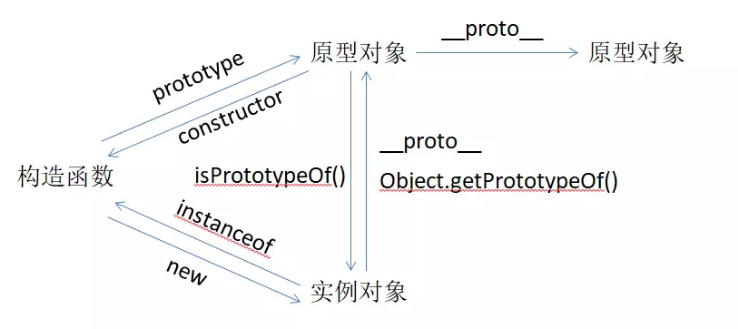

原型中的方法


### 1、hasOwnProperty

描述：hasOwnProperty() 方法会返回一个布尔值，指示对象自身属性中是否具有指定的属性

语法：`obj.hasOwnProperty(prop)`

示例：

```js
var obj = {
    a: 1
};
console.log(obj.hasOwnProperty("a")); // true
console.log(obj.hasOwnProperty("b")); // false
```


### 2、isPrototypeOf

描述：isPrototypeOf() 方法用于测试一个对象(prototypeObj)是否存在于另一个对象(object)的原型链上。

语法：`prototypeObj.isPrototypeOf(object)`

示例：

```js
var Box = (function () {
    function Box() {}
    Box.prototype = {}
    Box.prototype.constructor = Box;
    return Box;
})();

var box1 = new Box();
// Box.prototype 在 box1 对象的原型链上
console.log(Box.prototype.isPrototypeOf(box1)); // true
```


下面有张图：可以看看 `isPrototypeOf` 与 `getPrototypeOf` 的关系：




### 3、propertyIsEnumerable

描述：propertyIsEnumerable() 方法返回一个布尔值，表示指定的属性是否可枚举。

语法：`obj.propertyIsEnumerable(prop)`

示例：

```js
var Box = (function () {
    function Box(a) {
        this.a = a;
    }
    Box.prototype = {
        b: 2
    }
    Box.prototype.constructor = Box;
    return Box;
})();

var box1 = new Box();
console.log(box1.propertyIsEnumerable("a")); // true 可枚举
console.log(box1.propertyIsEnumerable("b")); // false 不可枚举
```


### 4、constructor

描述：返回创建实例对象的 Object 构造函数的引用。(可以通过调用对象的constructor重新执行对象的构造函数。)

示例：

```js
var o = {};
o.constructor === Object; // true

var o = new Object;
o.constructor === Object; // true

var a = [];
a.constructor === Array; // true

var a = new Array;
a.constructor === Array // true

var n = new Number(3);
n.constructor === Number; // true
```

> 字面量方式为什么constructor会指向Object?
>
> 因为Box.prototype={};这种写法其实就是创建了一个新对象。而每创建一个函数，就会同时创建它prototype,这个对象也会自动获取constructor属性。所以，新对象的constructor重写了Box原来的constructor,因此会指向新对象，那个新对象没有指定构造函数，那么就默认为Object.原型的声明是有先后顺序的，所以，重写的原型会覆盖之前的原型。
>
> 没看懂，以后再看 =_=#，我说我...


