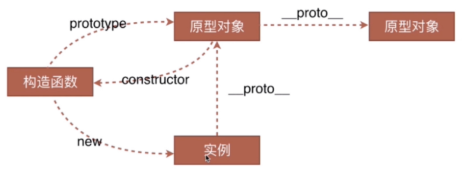
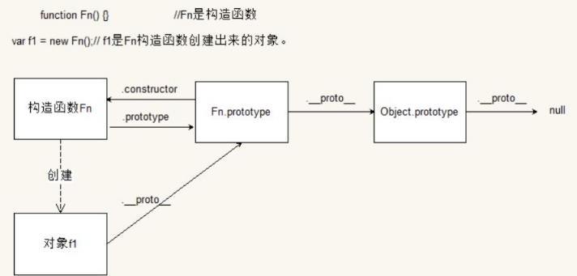

## 一、原型链

原型链表示的是实例对象与原型对象之间的一种关系，这种关系是通过` __proto__ `原型来联系的。

### 1、原型的指向改变

实例对象的原型 `__proto__` 指向的是该对象的构造函数中的原型对象 prototype，如果该对象的构造函数的 prototype 指向改变了，那么实例对象中的原型 `__proto__`  的指向也会跟着改变。

例如：

```js
Person.prototype = new Cat();
```

> 因为 Person.prototype = {}； 可以是一个对象，所以传入另一个对象的实例函数是可以的，这时候 Person 的实例对象可以访问 Cat 原型 prototype 中的属性和方法，而不能再访问自己 Person 中原型的属性和方法了。


### 2、原型链的最终指向

实例对象的`__proto__`指向的是构造函数的原型对象 prototype，由于prototype也是个对象，所以也有 `__proto__` ，这个 `__proto__` 指向的是 Object 的 prototype，而 Object 的 prototype 里面的 `__proto__`  指向的是 null。 


原型链图示：







示例：

```js
function Person() {}
var per = new Person();

console.log(per.__proto__ === Person.prototype); // true
console.log(Person.prototype.__proto__ === Object.prototype); // true
console.log(Object.prototype.__proto__); // null
```


### 3、原型指向改变后添加原型方法

先看个案例：问下面程序有问题吗？

```js
function Person() {}
Person.prototype.eat = function () {};
function Student() {}
Student.prototype.say = function () {};
Student.prototype = new Person();

var stu = new  Student();
stu.say();
```

解答：stu.say(); 会报错。因为 Student 的原型指向变成了 Person 的一个实例对象，Person 的实例对象钟并没有 say 方法，所以报错。


> 解决办法：在原型指向改变之后再添加原型方法。

```js
function Person() {}
Person.prototype.eat = function () {};
function Student() {}

Student.prototype = new Person();
Student.prototype.say = function () {};

var stu = new  Student();
stu.say();
```

这个时候就不会报错， Student 添加的原型方法的位置是一个匿名 Person 的实例对象中，这里是一个 Person 的实例对象，不是所有的，所以当你再 new 一个 Person 的实例对象的时候，不会有 say 方法。


### 4、实例对象和原型对象属性重名问题

当实例对象访问一个属性的时候，会先从实例对象中找，找到了直接使用，找不到再到指向的原型对象中找，找到了使用，还是找不到，则为 undefined。


如何改变原型对象中的属性的值呢？**怎么赋值的怎么修改。**

如果你使用 `对象.属性 = 值` 的方式来赋值的话，如果这个属性在实例对象中有的话，改变的是实例对象中属性的值；如果实例对象中没有这个属性的话，则这次修改相当于给该实例对象添加了一个属性，其指向的原型对象中相应的属性的值并没有被改变。


使用 `实例对象.proto.属性 = 值` 可以修改原型对象中的属性的值，

但是**禁止这么做！！！**

因为这样做就相当于修改一个种族一样，这是上帝做的事情。


## 二、原型的继承

### 1、原型的继承

**原型的第二个作用：继承。目的也是节省内存空间。**

通过改变子类原型的指向到父类的实例对象，可以实现继承。


案例：

```js
// 父类：人
function Person(name, age) {
    this.name= name;
    this.age=age;
}
Person.prototype.eat = function () {
    console.log("eat()");
};

// 子类：学生
function Student(sex) {
    this.sex=sex;
}
// 子类继承父类只需要改变子类原型的指向到父类的实例对象。
Student.prototype = new Person("Daotin", 18); 
Student.prototype.study = function () {
    console.log("study()");
};

var stu = new Student("male");
console.log(stu.name); // Daotin
console.log(stu.age); // 18
stu.eat(); // eat()
```


**缺陷1**：在改变子类原型对象的指向的时候，属性在初始化的时候就固定了，那么每个子类实例对象的值都固定了。


**解决办法**：不需要子类原型的指向到父类的实例对象，只需要借用父类的构造函数。

```js
function Person(name, age) {
    this.name = name;
    this.age = age;
}
Person.prototype.eat = function () {
    console.log("eat()");
};

function Student(name, age, sex) {
    Person.call(this, name, age);// Person.apply(this, arguments);
    this.sex = sex;
}
//Student.prototype = new Person("Daotin", 18);
Student.prototype.study = function () {
    console.log("study()");
};

var stu = new Student("Daotin", 18, "male");
console.log(stu.name);
console.log(stu.age);
console.log(stu.sex);
stu.eat(); // 不能访问
```

> `Person.call(this, name, age); `第一个参数 this，表示当前对象，意思是当前对象呼叫 Person，将 name 和 age 传过来，具体传多少，我自己指定。这样不同的子类，通过自己可以设置不同的属性。

**缺陷2**：`stu.eat(); `不能访问了，就是父类原型方法不能继承了。


**解决办法**：**组合继承（原型方式继承 + 借用构造函数继承）**

```js
function Person(name, age) {
    this.name = name;
    this.age = age;
}
Person.prototype.eat = function () {
    console.log("eat()");
};

function Student(name, age, sex) {
    Person.call(this, name, age); // 借用父类构造函数，实现父类属性的继承
    this.sex = sex;
}
Student.prototype = new Person(); // 不传参数了，实现原型方法的继承
Student.prototype.study = function () {
    console.log("study()");
};

var stu = new Student("Daotin", 18, "male");
console.log(stu.name);
console.log(stu.age);
console.log(stu.sex);
stu.eat();
stu.study();
```

> `Student.prototype = new Person(); `// 不传参数了，实现原型方法的继承。
>
> `Person.call(this, name, age); `// 借用父类构造函数，实现父类属性的继承。


### ~~2、拷贝继承~~

~~就是把对象中需要共享的属性和方法直接以遍历的方式复制到了另一个对象中。~~

```js
function Person(name, age) {
    this.name = name;
    this.age = age;
}
Person.prototype.eat = function () {
    console.log("eat()");
};

var per = {};

// 循环拷贝
for(var key in Person.prototype) {
    per[key] = Person.prototype[key];
}
console.log(per);
```


### 示例：Ball继承Box

```html
<!DOCTYPE html>
<html lang="en">
    <head>
        <meta charset="UTF-8">
        <title>Title</title>
    </head>
    <body>
        <script>
            // 父类Box
            var Box=(function () {
                function Box(b) {
                    this.b=b;
                }
                Box.prototype={
                    w:20,
                    h:20,
                    play:function () {
                        console.log("aa")
                        return this.w+this.h+this.b;
                    }
                };
                Box.prototype.constructor=Box;
                return Box;
            })();

		  // 子类Ball
            var Ball=(function () {
                function Ball(b) {
                    // 执行父类的构造函数，并且将当前的对象冒充带入
                    this.superClass.apply(this,arguments);
                }
                return Ball;
            })();

            extend(Ball,Box);
            
            // 覆盖继承只能写在extend后面，不要将这个写在子类里
            Ball.prototype.play=function () {
                return this.w*this.h+this.b;
            };

            var ball=new Ball(20);
            console.log(ball.play);
            
            // 实现继承的方法
            function extend(subClass,supClass) {
                // 定义临时类用于接收父类的实例对象
                function _F() {}
                _F.prototype=supClass.prototype;
                subClass.prototype=new _F();
                subClass.prototype.constructor=subClass;
                subClass.prototype.superClass=supClass;
                if(supClass.prototype.constructor===Object.prototype.constructor){
                    supClass.prototype.constructor=supClass;
                }
            }
        </script>
    </body>
</html>
```


## 三、ES6中的类与继承

ES6中的类的定义与类的继承范例：

```js
//创造类
class Box{
    //构造函数
    constructor(b){
        this.b=b;
        this.w=10;
        this.h=20;
    }
    //类下的方法
    play(){
        return this.w+this.h+this.b
    }
    fire(){
        console.log("生火");
    }
}
//创造Ball类并且继承Box类
class Ball extends Box{
    //构造函数，
    constructor(b){
        //在调用子类构造函数之前，一定要先调用父类的构造函数 super(b)。
        super(b);
    }
    //执行覆盖父类的play方法
    play(){
        return this.w*this.h+this.b;
    }
    fire(){
        console.log("捡柴");
        //执行父类的方法
        super.fire();
    }
}
```


