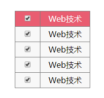

## 一、元素的创建添加和删除

### 1、对象方式创建元素

-   `父元素.append(子元素)`，`子元素.appendTo(父元素)` ：在被选元素所有子元素的**结尾插入**内容（增加子元素）。
-   `prepend`，`prependTo`：在被选元素所有子元素的**开头插入**元素（增加子元素）。
-   `A.before(B)`：在A元素之前插入兄弟元素B。
-   `A.after(B)`：在A元素之后插入兄弟元素B。
-   `A.insertBefore(B)`: 将兄弟元素A元素插入到B元素之前。
-   `A.insertAfter(B)`:将兄弟元素A元素插入到B元素之后。


语法：

```js
// 元素的创建
$("html代码"); 
// $("<a herf='http://fengdaoting.com'>Daontin</a>")

// 元素的添加（被动）
父元素.append(子元素); // $("#dv").append($("<a>...</a>"));
父元素.append(function(index,item){
    return `<a href="#">${item}</a>`;
}; 
```

```js
// 元素的添加（主动）
子元素.appendTo(父元素); // $("<a>...</a>").appendTo($("#dv"));
```

> append和appendTo区别：
>
> 1、append()括号里面可以写函数，但是appendTo里面不可以。
>
> 2、append()后面不可链式编程，appendTo可以。

**案例：动态创建列表**

```html
<script>
    $("#btn1").click(function () {
        var ulObj = $("<ul></ul>");
        // 创建ul添加到div
        $("#dv").append(ulObj);

        // 创建li添加到ul，并设置鼠标进入离开事件
        $("<li>鸣人</li><li>卡卡西</li><li>佐助</li>").appendTo(ulObj).mouseenter(function () {
            $(this).css("backgroundColor","yellow");
        }).mouseleave(function () {
            $(this).css("backgroundColor","");
        });
    });
</script>
```

>   注意：获取的元素通过 `append` 或者 `appendTo` 的方式添加到另一个元素的时候，相当于剪切。
>
>   **如果要保留获取的元素，可以在 append 或者 appendTo 之前使用克隆 `clone()` 方法。**


### 2、字符串方式创建元素

语法：

```js
父元素.html("html代码");
// $("#dv").html("<a herf='http://fengdaoting.com'>Dao</a>");
```


### 3、包裹元素

```js
// 在A元素之外包裹一层B元素，如果A是元素集合，那么A中的每个元素都包裹一层B。
A.wrap(B); 
A.wrap(function(index,item){});

//将所有的标签A挪移在一起，外面增加一个包裹B.
A.wrapAll(B);  //不管A元素在不在一起都挪到一起。 $("span").wrapAll("<div></div>")

// 给A元素里面内容加一层包裹B.
A.wrapInner(B); // $("span").wrapInner("<a href='#'></a>")
```

示例：

```js
var arr=["163","sina","baidu","taobao"];
$("span").wrap(function (index) {
    return `<a href='http://www.${arr[index]}.com'></a>`
});
```


### 4、元素的克隆

在DOM操作时，通过`元素A.cloneNode(false/true)` 进行浅/深复制。

浅复制是只复制A元素本身，而深复制可以复制到元素A里面的元素。

但是在JQuery里面只有深复制。

```js
A.clone();   // 元素A深复制
A.clone(true); // 元素A深复制，并且还复制A绑定的事件
```


### 5、元素的删除

**5.1、清除父元素中所有的子元素**

```js
父元素.html("");
父元素.empty();
```

**5.2、清除单个子元素**

```js
子元素.remove(); // 完全清除，包括事件。
子元素.detach(); // 相当于DOM中的子元素remove(),此时还存在于内存，而且其绑定的事件也没清除。
```

**5.3、替换元素**

```js
// A用B来替换
A.replaceWith(B); //旧元素.replaceWith(新元素)
// A替换所有的B
A.replaceAll(B)//  新元素.replaceAll(旧元素)
```


## 二、元素 value 属性的操作

一般 `val()` 是获取表单的 value 属性；
`val(值); `  设置表单的 value 属性。


**示例1：获取设置文本框value的值**

```html
<input type="text" value="text" id="txt">
 //------------------------------------------
<script>
    $("#btn1").click(function () {
        // 获取文本框的value属性值
        console.log($("#txt").val());
        // 设置文本框的value属性值
        $("#txt").val("text2");
    });
</script>
```

**示例2：获取设置单选框value的值**

```html
<input type="radio" value="1" name="sex" id="nan">男
<input type="radio" value="2" name="sex">女
//-----------------------------------------------
console.log($("#nan").val());
$("#nan").val("3");
```

**示例3：获取设置复选框value的值**

```html
<input type="checkbox" value="1">吃饭
<input type="checkbox" value="2" id="c1">睡觉
<input type="checkbox" value="3">大豆豆
//---------------------------------------
console.log($("#c1").val());
$("#c1").val("33");
```

**示例4：获取设置文本域value的值**

```html
<textarea name="text" id="t1" cols="30" rows="10">
    等你下课
</textarea>
//------------------------------------------------
console.log($("#t1").val()); // 等你下课
$("#t1").val("Jay"); 
console.log($("#t1").val()); // Jay

// 成对的标签可以使用 text() 方法来获取和设置
console.log($("#t1").text());// 等你下课
$("#t1").text("Jay");
console.log($("#t1").text());// Jay
```

>   1、使用 val() 进行设置之后，在源码中 value 的值没有改变，但是打印出来的值改变了。
>
>   2、使用 text() 行设置之后，在源码中 value 的值也改变了。
>
>   **3、成对的标签可以使用 text() 方法来获取和设置，推荐使用 text();**


> 注意：
>
> 对于 textarea 标签。如果没有设置value的值，不管有没有设置 innerHTML 的值，value的值都等于innerHTML的值；一旦设置了value的值，获取的value就不一定是innerHTML的值了。
>
> 这个结论不管是DOM操作还是jq操作，结果一样。


**示例5：获取设置下拉框value的值**

```html
<select id="s1">
    <option value="1">op1</option>
    <option value="2">op2</option>
    <option value="3">op3</option>
    <option value="4">op4</option>
    <option value="5">op5</option>
</select>
//-----------------------------------
console.log($("#s1").val());
$("#s1").val("3");
console.log($("#s1").val());
```

>   1、获取下拉框的 value 属性，就是获取 option 的 value 的值
>
>   2、设置下拉框的 value 属性，就是选中相应 value 值的 option 标签。


## 三、自定义属性

### 1、自定义属性和对象属性

**自定义属性是添加在标签上的。对象属性是添加对象的属性。**例如：

```js
var div = document.querySelector("div");
div.setAttribute("index",1); // 自定义属性
div.index = 1; // 对象属性
```

> 注意：jQuery不能直接添加对象属性，如果想添加，需要转化为DOM对象来添加，这时jQuery对象中就有了这个对象属性。

> PS: 自定义属性一般都是小写，多个单词之间用`-` 连接。例如：`toggle-name`

### 1、attr

语法：

```js
// 获取自定义属性
元素.attr("自定义属性/自带属性");
元素集合.attr("自定义属性/自带属性") // 获取的是元素集合中的第一个元素的自定义属性/自带属性。

// 设置自定义属性
元素.attr("自定义属性名/自带属性"，"自定义属性值");

// 设置多个自定义属性为不同的值
var arr=["a","b","c","d","e"];
元素.attr("自定义属性", function(index,item){
    return arr[index];
})

// 设置多个不同的属性，分别对应不同的属性值
元素.attr({
    "属性1":function(index,item){
        return index;
    },
    "属性2":function(index,item){
        return index+1;
    }
})

```

> 注意：**attr只有一个参数时是获取自定义属性的值，当有两个参数时是设置自定义属性的值。**

示例：

```html
<div id="dv"></div>
//-------------------------------------------
$("#dv").attr("hello","world"); //<div id="dv" hello="world"></div>
$("#dv").attr("id","box"); //<div id="box"></div>
console.log($("div").attr("id"));
```

>   1、attr 方法主要操作元素的自定义属性的，但是也可以操作元素的自带属性。但是操作元素是否选中的 checked 属性时不合适。
>
>   2、操作元素的选中 checked 属性，推荐使用 prop 方法。


**自定义属性的选中问题**

```js
元素.attr(); // 获取某个元素是否被选中的状态
元素.attr("checked",true); //设置某个元素为选中
```

```html
<input type="radio" value="1" name="sex"  id="r1">男
<input type="radio" value="2" name="sex">女
//-----------------------------------------------
console.log($("#r1").attr("checked"));
$("#r1").attr("checked", true);
```

>   PS：attr 方法针对单选框和复选框的是否选中问题操作复杂（选中返回值为 checked，未选中返回值为 undefined，不是直接显示  true 或者 false 那么简单，并且反复操作多次易失效），几乎不用。


### 2、prop

**主要用于获取元素的选中问题。**

语法：

```js
元素.prop("checked"); // 获取这个元素是否选中
元素.prop("checked",true/false); // 设置这个元素选中或不选中
```

示例：

```js
<input type="checkbox" value="1">吃饭
<input type="checkbox" value="2" id="c1">睡觉
<input type="checkbox" value="3">大豆豆
//--------------------------------------------
console.log($("#c1").prop("checked")); // false
$("#c1").prop("checked", true); // true
```


### 案例：全选与全不选

```html
<!DOCTYPE html>
<html lang="en">
<head>
    <meta charset="UTF-8">
    <title>Title</title>
    <style>
        * {
            padding: 0;
            margin: 0;
        }

        table {
            border-collapse: collapse;
        }

        td {
            width: 100px;
            height: 30px;
            background-color: #f8f8f8;
            border: 1px solid #7b7b7b;
            text-align: center;

        }

        .th td {
            background-color: #e95d71;
            color: #f8f8f8;
        }

        .little-td {
            width: 50px;
        }

    </style>
</head>
<body>
<div id="dv">
    <table class="table">
        <thead class="th">
        <tr>
            <td class="little-td"><input type="checkbox"></td>
            <td>Web技术</td>
        </tr>
        </thead>

        <tbody class="tb">
        <tr>
            <td class="little-td"><input type="checkbox"></td>
            <td>Web技术</td>
        </tr>
        <tr>
            <td class="little-td"><input type="checkbox"></td>
            <td>Web技术</td>
        </tr>
        <tr>
            <td class="little-td"><input type="checkbox"></td>
            <td>Web技术</td>
        </tr>
        <tr>
            <td class="little-td"><input type="checkbox"></td>
            <td>Web技术</td>
        </tr>
        </tbody>
    </table>
</div>


<script src="jquery-1.12.4.js"></script>
<script>
    // 设置总的复选框对子复选框的影响
    $(".th input").click(function () {
        $(".little-td input").prop("checked", $(this).prop("checked"));
    });

    // 设置每一个子复选框事件
    $(".little-td input").click(function () {
        var childLength = $(".tb").find("input").length;//总的子复选框的个数
        var actualLength = $(".tb :checked").length;// 已经选中的子复选框的个数
        $(".th input").prop("checked", childLength === actualLength);
    });
</script>
</body>
</html>
```

>   0、`border-collapse: collapse;`  细线表格。
>
>   1、子类复选框的集合在 prop 和  click 中会自动遍历操作。
>
>   2、`var actualLength = $(".tb :checked").length;` 中 `.tb` 和 `:checked` 中间有空格，表示的是 类 tb 下面的子元素集合中带有 checked 的元素，而没有空格表示，设置了类 tb 的所有元素集合中带有 checked 的元素。一个是 tb 下面的子元素集合中，一个是 tb 自身元素集合中。





