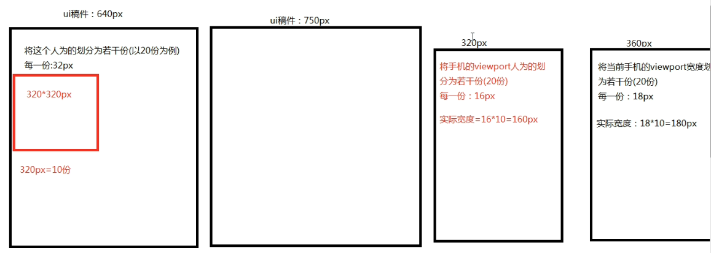

## 一、单位em与rem

`em`：就是一种长度单位，它是**参照当前元素的字号，如果没有设置，就参照父容器，一直到当前浏览器的默认字号。**

比如：当前浏览器默认字体大小为 16px，则 1em = 16px;


`rem`：css3新增的一种长度单位，它是**参照根元素(html)的字号**。

比如：当前浏览器默认字体大小为 16px，而 html 的字号为 20px，则 1rem = 20px;


**em 是相对长度单位（参照父元素）**，其参照当前元素字号大小，如果当前元素未设置字号则会继承其祖先元素字号大小。

例如：` .box {font-size: 16px;}` 则 1em = 16px 

`.box {font-size: 32px;} `则 1em = 32px，0.5em = 16px

**rem 相对长度单位（参照 html 元素）**，其参照根元素(html)字号大小。

例如 ：`html {font-size: 16px;}` 则 1rem = 16px 

`html {font-size: 32px;}` 则 1rem = 32px，0.5rem = 16px.


**vw：viewport width，视口宽度**  （1vw = 1%视口宽度）

**vh：viewport height   视口高度**  （1vh = 1%视口高度）


## 二、rem 的使用

一般情况下，美工给前端的移动端 UI 图的尺寸一般为 **640px** 和 **750px**。之后我们要设计的移动端的大小可能是 320px（iPhone5），375px（iPhone6），414px（iPhone6plus）等。

那么如何等比例的在这些移动端上进行一些元素布局的设计呢？

可以使用 em 吗？不好，不同浏览器可能默认字号大小不同，如果使用者对元素没有设置字号大小的话，就会参考父元素，可能一直到浏览器的默认字号大小。这样的话，可能不同的浏览器 1em 的大小不同。

所以，一般来说在移动端大多使用 rem 作为单位。

如何使用呢？

我们以 640px 的 UI 为例。**一般我们把 640px 的 UI 分成 20份，那么每一份的大小为 32px。**

那么 **750px 的 UI 分成 20份，那么每一份的大小为 37.5px。**

如何我们要在 320px 的屏幕上进行缩放的话，我们也将 320px 分成 20 份，每一份为 16px。

这时，我们想把 UI 上面一个 160px*160px 的矩形，缩放到 320px 的屏幕上的话，160 是占 UI 的5份，那么在 320px 上的矩形也应该占 16px 的 5 份。



所以，这个矩形在 320px 上的长度应该为：`160/32 * 16px  `，如何把 16px 换成 rem ？

rem 是按照 html 的字号决定的，那么我们可以这样做，我们先根据屏幕的大小，设置 html 的字号：

```css
@media screen and (device-width: 320px) {
  html {
    font-size: 16px;
  }
}
@media screen and (device-width: 360px) {
  html {
    font-size: 18px;
  }
}
@media screen and (device-width: 375px) {
  html {
    font-size: 18.75px;
  }
}
@media screen and (device-width: 414px) {
  html {
    font-size: 20.07px;
  }
}
```

之后，我们的代码可以改为：`160/32 rem` ，那么这份代码在不同屏幕的浏览器下，就有相应的大小，以保持不同屏幕下的不同缩放尺寸。


> 常见手机屏幕尺寸大全：https://strerr.com/screen.html


## 三、通用使用步骤

**1、设置各种屏幕尺寸下的 HTML 的字号大小。** 

```css
@media screen and (device-width: 320px) {
  html {
    font-size: 16px;
  }
}
@media screen and (device-width: 360px) {
  html {
    font-size: 18px;
  }
}
@media screen and (device-width: 375px) {
  html {
    font-size: 18.75px;
  }
}
@media screen and (device-width: 414px) {
  html {
    font-size: 20.07px;
  }
}
```

**2、将 UI 下各个元素，不论是元素还是边距，边框等值全部除以每一份的大小，单位为 rem 即可得到在不同屏幕下的不同缩放大小。**

比如：640px 的 UI，设置为：`元素等/32 rem;`

750px 的 UI，设置为：`元素等/37.5 rem;`


示例：

```less
// UI稿件为640px
.item{
    height:218/32rem;
    border: 3/32rem dashed #dedede;
    background-color: #fff;
    padding-top:36/32rem;
    font-size: 104/32rem;
    box-sizing: border-box;
    a{
      color: #aeaeae;
      text-align: center;
    }
    span{
      font-size: 26/32rem;
      display: block;
      margin-top:16/32rem;
    }
}
```
>  Tips：把 rem 理解成`份`  的意思更好理解，你在640px上占多少份，在实际的屏幕上就占多少份。

## 移动端适配补充（2021-07-22）

我们可以看到，我们在书写的时候每次这样除以一个32或者37.5还挺难看的，而且css还不能使用，在less或者sass这种css处理器上才可以使用除号：

```less
{
    height:218/32rem;
    border: 3/32rem dashed #dedede;
    padding-top:36/32rem;
    font-size: 104/32rem;
}
```

```less
{
    height:218/37.5rem;
    border: 3/37.5rem dashed #dedede;
    padding-top:36/37.5rem;
    font-size: 104/37.5rem;
}
```


所以，为了兼容css，也为了好看，我们就不要分成20份了，我们可以把640px的UI分成`6.4`份，把750px的UI分成`7.5`份，这样每一份的大小都是`100px`。

以后就不需要写成`36/37.5rem;` 的形式，而是 `0.36rem` 的形式，是不是好看多了。


**继续改进：**

从上文看出，为了适配320px，360px，375px等等尺寸的屏幕，我们需要写多个媒体查询，而且还没有做到连续，只是挑选出了几个经典的尺寸进行媒体查询设置html的font-size大小，如果出现一个350px的，我们就只能使用320px的适配了。

```css
@media screen and (device-width: 320px) {
  html {
    font-size: 16px;
  }
}
@media screen and (device-width: 360px) {
  html {
    font-size: 18px;
  }
}
@media screen and (device-width: 375px) {
  html {
    font-size: 18.75px;
  }
}
@media screen and (device-width: 414px) {
  html {
    font-size: 20.07px;
  }
}

```

于是，我们需要通过js动态设置不同尺寸html的font-size大小。


我们已750px的UI为例，把它分成7.5份，每一份100（100的话是为了好算）。

如果UI中有一个300px的元素的话，我们在320px的设备中应该显示多少呢？


**计算过程：**

- 300px在UI中占（300/100=3）份
- 那么在320px中也应该占3份，320px因为也是分成7.5份的，那么就应该是（320/7.5）× 3 = 128px


**写出rem形式的通用公式就是：**

- 设置 html 的 font-size： `deviceWidth/7.5`

- 在使用的时候在UI上是300px占了3份，所以320px也占3份就是：`3rem`，类比在UI上是320px就是`3.2rem` 。。。


所以，我们发现只要设置好了html的font-size后，我们只需要在使用的时候把图形**在原UI尺寸的基础上除以100，然后加上rem即可**。


那么回到上面的问题，**如何使用js动态设置 html的font-size？**

在脚本开始的时候，获取设备宽度`deviceWidth`，然后设置html的font-size大小。这样就不必写很多媒体查询了。

```js
<script type="text/javascript">
    (function() {
        var deviceWidth = document.documentElement.clientWidth;
        deviceWidth = deviceWidth < 320 ? 320 : deviceWidth > 640 ? 640 : deviceWidth;
        document.documentElement.style.fontSize = deviceWidth / 7.5 + 'px'; // 设计稿是750px
    	// document.documentElement.style.fontSize = deviceWidth / 6.4 + 'px'; // 设计稿是640px
    })();
</script>

```


**参考链接：**

- https://juejin.cn/post/6844903721697017864

- https://www.manster.me/?p=311
