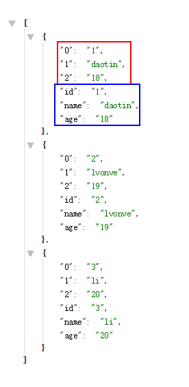
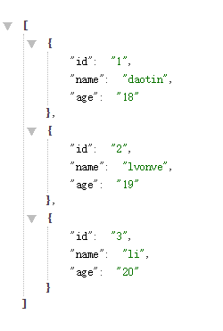
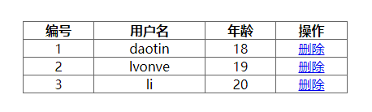
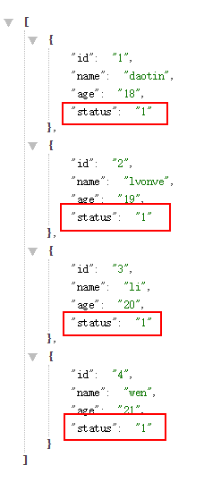

前提：我们在mysql创建了一个数据库: mydb.

mydb 里面有个数据表 mytable。

mytable 中的数据为：

| id   | name   | age  |
| ---- | ------ | ---- |
| 1    | daotin | 18   |
| 2    | lvonve | 19   |
| 3    | li     | 20   |


PHP代码连接数据库mydb：

```php
<?php
@header("content-type:text/html;charset=utf8");

mysql_connect("localhost:3306", "root", "root"); // 如果无法链接将会报错，报错信息如下：
 // Warning: mysql_connect() [function.mysql-connect]: [2002] 由于目标计算机积极拒绝，无法连接。 (trying to connect via tcp://localhost:33062) in 

$connect =  mysql_select_db("mydb"); // 选择的数据库存在返回1，否则为空

if($connect) {
    echo "数据库存在";
} else {
   echo "数据库不存在";
}

$sql = 'select * from mytable'; // 定义查询数据表（mytable）语句

$res = mysql_query($sql); // 执行数据表查询语句，返回值是resouce格式的数据。

// mysql_fetch_array 将resouce格式的数据转化成Array数据类型
// 由于mysql_fetch_array每次只能转换数据表的一行数据，所以要循环转换。
// 使用while是因为没有数据的地方转换的结果为false
// 最后将多个array加入数组list中。
$list = array();
while($item = mysql_fetch_array($res)) { 
    $list[] = $item;
}

// 使用json_encode将转换的array集合变成json对象集合。
echo json_encode($list);

?>
```

获取到的数据如下：




我们发现一个问题：就是获取到的有两份相同的数据，这就造成数据的冗余，怎么解决呢？

解决办法：

我们用另一个数组来放入获取到的数组中，我们需要的数据。

```php
$list = array();
while($item = mysql_fetch_array($res)) { 
    $tmp = array();
    $tmp["id"] = $item["id"];
    $tmp["name"] = $item["name"];
    $tmp["age"] = $item["age"];
    $tmp["status"] = $item["status"];
    $list[] = $tmp;
}

// 使用json_encode将转换的array集合变成json对象集合。
echo json_encode($list);
```

于是就获取到了我们想要的数据：




得到数据后，我们就可以通过html代码将其渲染到页面：

```html
<!DOCTYPE html>
<html lang="en">

<head>
    <meta charset="UTF-8">
    <meta name="viewport" content="width=device-width, initial-scale=1.0">
    <meta http-equiv="X-UA-Compatible" content="ie=edge">
    <title>Document</title>
    <style>
        * {
            margin: 0;
            padding: 0;
        }

        div {
            width: 400px;
            margin: 50px auto;
        }

        table {
            width: 400px;
            border: 1px solid #666;
            border-collapse: collapse;
            text-align: center;
        }
    </style>
</head>

<body>
    <div>
        <table border="1">
            <tr>
                <th>编号</th>
                <th>用户名</th>
                <th>年龄</th>
                <th>操作</th>
            </tr>
            <!-- <tr>
                <td>1</td>
                <td>哈哈</td>
                <td>18</td>
                <td><a href="javascript:;">删除</a></td>
            </tr>
            <tr>
                <td>2</td>
                <td>我的</td>
                <td>18</td>
                <td><a href="javascript:;">删除</a></td>
            </tr> -->
        </table>
    </div>
</body>
<script>
    var table = document.querySelector("table");
    var xhr = new XMLHttpRequest();
    xhr.open("get", "http://localhost/php/1121/connectDB.php", true);
    xhr.send();
    xhr.onreadystatechange = function () {
        if (xhr.readyState == 4 && xhr.status == 200) {
            let list = JSON.parse(xhr.responseText);

            list.map(function (item) {
                let id = item["id"];
                let uname = item["name"];
                let age = item["age"];

                var tr = document.createElement("tr");
                var td_id = document.createElement("td");
                var td_name = document.createElement("td");
                var td_age = document.createElement("td");
                var td_del = document.createElement("td");
                var a = document.createElement("a");
                a.innerHTML = "删除";
                a.href = "javascript:;";
                td_id.innerHTML = id;
                td_name.innerHTML = uname;
                td_age.innerHTML = age;
                td_del.appendChild(a);
                tr.appendChild(td_id);
                tr.appendChild(td_name);
                tr.appendChild(td_age);
                tr.appendChild(td_del);
                table.appendChild(tr);

                a.onclick = function () {
                    //?
                };
            });
        }
    };
</script>

</html>
```





需要注意的是，由于ajax受到同源策略的影响，所以我们的html代码一定和php文件在相同的协议，相同的域名，相同的端口下。

好了，上面的代码还有一个问题，就是我们在点击删除的时候，需要将数据库的对应的数据删除吗？

不需要，一般正常的操作是每个数据都对应一个status，表示是否可以访问，我们以status=1可以访问，status=0不可以访问为例，来实现删除操作。

所以我们数据库的数据现在是下面的样子：




我们php代码也要修改下：

