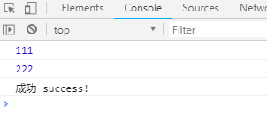

## 一、Promise

Promise是一个对象，代表了未来某个将要发生的事件(，这个事件通常是一个异步操作)

有了Promise对象, 可以将异步操作以同步的流程表达出来, 避免了层层嵌套的回调函数(俗称'回调地狱')。

ES6的Promise是一个构造函数, 用来生成promise实例。


### 1、promise对象3个状态

- `pending`: 初始化状态
- `fullfilled`: 成功状态
- `rejected`: 失败状态

只有异步操作的结果，可以决定当前是哪一种状态，任何其他操作都无法改变这个状态。这也是Promise这个名字的由来，它的英语意思就是“承诺”，表示其他手段无法改变。

一旦状态改变，就不会再变，任何时候都可以得到这个结果。

Promise对象的状态改变，只有两种可能：从pending变为fulfilled和从pending变为rejected。只要这两种情况发生，状态就凝固了，不会再变了，会一直保持这个结果，这时就称为 resolved（已定型）。


### 2、使用方法

**1、创建一个promise实例对象，参数是一个匿名函数，这个匿名函数有两个参数，resolve和reject，**

**2、每一个参数都是一个回调函数。然后，函数体中一般执行的是异步操作，比如发起Ajax请求，或者开启定时器等。**

**3、异步操作成功时，调用resolve回调函数，异步操作失败时，调用reject回调函数。**

**4、在初始化Promise实例对象的时候，Promise的状态为pending；在调用resolve回调函数的时候，Promise的状态为fullfilled，表示成功状态；在调用reject回调函数的时候，Promise的状态为rejected，表示失败状态；**

**5、 Promise的实例对象有一个方法then，参数为两个匿名函数，第一个匿名函数处理Promise的状态为fullfilled的情况；第二个匿名函数处理Promise的状态为rejected的情况；**

**6、上面说到，在异步操作成功或者失败的时候，会调用resolve和reject函数，在这两个回调函数中可以传入参数，这个参数可以直接带入到then中两个匿名函数的参数中使用。比如获取到ajax的数据，可以将获取的数作为参数传入resolve的参数中，然后会自动将这个参数传入then的第一个匿名函数中，reject也一样。**


用代码表示：

```js
function timeout(ms) {
  return new Promise((resolve, reject) => {
    setTimeout(resolve, ms, 'done');
  });
}

timeout(100).then((value) => {
  console.log(value);
});
```


用图示的方法表示：


示例：

```js
    let promise = new Promise((resolve, reject) => {
      console.log(111);
      // 执行异步操作
      setTimeout(() => {
        console.log(222);

        // 执行异步操作成功,此时修改promise的状态fullfilled
        resolve("success!");
        // 执行异步操作成功,此时修改promise的状态rejected
        reject("failed!");
      }, 2000);
    });

    promise.then((data) => { // promise的状态fullfilled的操作
      console.log("成功", data);
    }, () => { // promise的状态rejected的操作
      console.log("失败", data);
    });
```

>   注意：当执行到resolve("success!");修改promise的状态fullfilled的时候，后面的reject("failed!");不会执行。也就不会打印console.log("失败");的语句。




### 3、promise执行顺序

Promise 新建后就会立即执行。

```js
let promise = new Promise(function(resolve, reject) {
  console.log('Promise');
  resolve();
});

promise.then(function() {
  console.log('resolved.');
});

console.log('Hi!');

// Promise
// Hi!
// resolved
```

上面代码中，Promise 新建后立即执行，所以首先输出的是Promise。然后，then方法指定的回调函数，将在当前脚本所有同步任务执行完才会执行，所以resolved最后输出。

```js
new Promise((resolve, reject) => {
  resolve(1);
  console.log(2);
}).then(r => {
  console.log(r);
});
// 2
// 1
```

上面代码中，调用resolve(1)以后，后面的console.log(2)还是会执行，并且会首先打印出来。这是因为立即 resolved 的 Promise 是在本轮事件循环的末尾执行，**总是晚于本轮循环的同步任务**。

然而——

一般来说，调用resolve或reject以后，Promise 的使命就完成了，后继操作应该放到then方法里面，而不应该直接写在resolve或reject的后面。所以，最好在它们前面加上return语句，这样就不会有意外。

```js
new Promise((resolve, reject) => {
  return resolve(1);
  // 后面的语句不会执行
  console.log(2);
})
```


### 4、小栗子

使用 promise 获取新闻内容和评论内容：

```js
    // 定义一个请求news的方法
    function getNews(url) {
      //创建一个promise对象
      let promise = new Promise((resolve, reject) => {
        //初始化promise状态为pending
        //启动异步任务，发起Ajax请求
        //1.创建一个 XMLHttpRequest 类型的对象
        let request = new XMLHttpRequest();
        // 4. 指定 xhr 状态变化事件处理函数
        request.onreadystatechange = function () {
          if (request.readyState === 4) {
            if (request.status === 200) {
              let news = request.response;
              resolve(news);
            } else {
              reject('请求失败了...');
            }
          }
        };
        request.responseType = 'json'; //设置返回的数据类型
        // 2. 打开与一个网址之间的连接
        request.open("GET", url); //规定请求的方法，创建链接
        // 3. 通过链接发送一次请求
        request.send(); //发送
      })
      // 只有将promise返回，才可以调用then方法
      return promise;
    };
    // 调用getNews，获取新闻内容，其中一个字节为评论内容的地址
    getNews('http://localhost:3000/news?id=2')
      .then((news) => {
        // 获取到新闻内容
        console.log(news);
        // document.write(JSON.stringify(news));
        // 获取新闻内容中的评论地址
        console.log('http://localhost:3000' + news.commentsUrl);
        // 递归获取新闻评论内容，并且返回promise对象，以便链式then方法。
        return getNews('http://localhost:3000' + news.commentsUrl);
      }, (error) => {
        alert(error);
      })
      .then((comments) => { // then方法可以链式编程
        console.log(comments);
        // 把新闻的评论部分已json的格式打印出来显示
        document.write('<br><br><br><br><br>' + JSON.stringify(comments));
      }, (error) => {
        alert(error);
      });
```


### 5、catch

`Promise.prototype.catch`方法是`.then(null, rejection)`或`.then(undefined, rejection)`的别名，用于指定发生错误时的回调函数。

当状态就会变为`rejected`，就会调用`catch`方法指定的回调函数，处理这个错误。另外，`then`方法指定的回调函数，如果运行中抛出错误，也会被`catch`方法捕获。

```js
new Promise((resolve, reject) => {
  reject(1);
  console.log(2);
}).catch(r => {
  console.log(r);
});
// 2
// 1
```

> 一般来说，不要在`then`方法里面定义 Reject 状态的回调函数（即`then`的第二个参数），总是使用`catch`方法。

```js
// 不好的写法
promise
  .then(function(data) {
    // success
  }, function(err) {
    // error
  });

// 好的写法
promise
  .then(function(data) { //cb
    // success
  })
  .catch(function(err) {
    // error
  });
```

上面代码中，第二种写法要好于第一种写法，理由是第二种写法可以捕获前面`then`方法执行中的错误，也更接近同步的写法（`try/catch`）。因此，建议总是使用`catch`方法，而不使用`then`方法的第二个参数。


### 6、finally

`finally`方法用于指定不管 Promise 对象最后状态如何，都会执行的操作。该方法是 ES2018 引入标准的。

```js
promise
.then(result => {···})
.catch(error => {···})
.finally(() => {···});
```

上面代码中，不管`promise`最后的状态，在执行完`then`或`catch`指定的回调函数以后，都会执行`finally`方法指定的回调函数。


### 7、Promise静态方法

#### 7.1、all和race

有时候需要同时处理多个ajax请求，如何在都获取到数据的时候才进行下一步操作呢？

`Promise.all` 就派上用场了。

```js
Promise.all([ajax1(), ajax2(), ajax3()])
	.then(function(res) {
    // res 处理
})
.catch(function(err) {
    // err 错误处理
})
```

其中`ajax1`,`ajax2`,`ajax3` 返回值都是 Promise 实例。

> 当 ajax1(), ajax2(), ajax3() 状态全为 `fulfilled` 的时候，才会调用`then`方法。
>
> 当 ajax1(), ajax2(), ajax3() 状态有一个为 `rejected` 的时候，就会调用`catch`方法。


而 rece 与all 用法相同，但是结果相反：

```js
Promise.rece([ajax1(), ajax2(), ajax3()])
	.then(function(res) {
    // res 处理
})
.catch(function(err) {
    // err 错误处理
})
```

> 当 ajax1(), ajax2(), ajax3() 状态有一个为 `fulfilled` 的时候，就会调用`then`方法。
>
> 当 ajax1(), ajax2(), ajax3() 状态全为 `rejected` 的时候，才会调用`catch`方法。


#### 7.2、resolve和reject

`Promise.resolve(value) `方法返回一个已给定值解析后的新的Promise对象，从而能继续使用then的链式方法调用。

```js
var promise1 = Promise.resolve(123);

promise.then(function(value) {
  console.log(value);
  // expected output: 123
});
```

而 `Promise.reject()` 和 resolve 一样。


## 二、Symbol

ES5 的对象属性名都是字符串，这容易造成属性名的冲突。比如，你使用了一个他人提供的对象，但又想为这个对象添加新的方法（mixin 模式），新方法的名字就有可能与现有方法产生冲突。如果有一种机制，**保证每个属性的名字都是独一无二**的就好了，这样就从根本上防止属性名的冲突。这就是 ES6 引入Symbol的原因。


**1、Symbol属性对应的值是唯一的，解决命名冲突问题**

Symbol 是一种**新的数据类型**，跟 String，Number，Object，Boolean，null，undefined 并列。

Symbol 值通过`Symbol`函数生成。这就是说，对象的属性名现在可以有两种类型，一种是原来就有的字符串，另一种就是新增的 Symbol 类型。**凡是属性名属于 Symbol 类型，就都是独一无二的，可以保证不会与其他属性名产生冲突。**

```js
let s = Symbol();
typeof s; // symbol
```

上面代码中，变量`s`就是一个独一无二的值。`typeof`运算符的结果，表明变量`s`是 Symbol 数据类型，而不是字符串之类的其他类型。

>   注意，`Symbol`函数前不能使用`new`命令，否则会报错。这是因为生成的 Symbol 是一个原始类型的值，不是对象。也就是说，由于 Symbol 值不是对象，所以不能添加属性。基本上，它是一种类似于字符串的数据类型。


`Symbol`函数可以接受一个字符串作为参数，表示对 Symbol 实例的描述，主要是为了在控制台显示，或者转为字符串时，比较容易区分。

```js
let s1 = Symbol('foo');
let s2 = Symbol('bar');

s1 // Symbol(foo)
s2 // Symbol(bar)

s1.toString() // "Symbol(foo)"
s2.toString() // "Symbol(bar)"
```

上面代码中，`s1`和`s2`是两个 Symbol 值。如果不加参数，它们在控制台的输出都是`Symbol()`，不利于区分。有了参数以后，就等于为它们加上了描述，输出的时候就能够分清，到底是哪一个值。


**2、Symbol值不能与其他数据进行计算，包括同字符串拼串**

```js
let sym = Symbol('My symbol');

"your symbol is " + sym
// TypeError: can't convert symbol to string
`your symbol is ${sym}`
// TypeError: can't convert symbol to string
```


**3、作为属性名的 Symbol**

由于每一个 Symbol 值都是不相等的，这意味着 Symbol 值可以作为标识符，用于对象的属性名，就能保证不会出现同名的属性。这对于一个对象由多个模块构成的情况非常有用，能防止某一个键被不小心改写或覆盖。

```js
let mySymbol = Symbol();

// 第一种写法
let a = {};
a[mySymbol] = 'Hello!';

// 第二种写法
let a = {
  [mySymbol]: 'Hello!'
};

// 第三种写法
let a = {};
Object.defineProperty(a, mySymbol, { value: 'Hello!' });

// 以上写法都得到同样结果
a[mySymbol] // "Hello!"
```

>   注意，Symbol 值作为对象属性名时，不能用点运算符。`a.mySymbol = 'Hello!';`


**4、for in, for of遍历时不会遍历symbol属性**

```js
let obj = {
  username: 'Daotin',
  age: 18
};
obj[symbol] = 'hello';
obj[symbol] = 'symbol';
console.log(obj);
for (let i in obj) {
  console.log(i);
}
```


**5、内置的 Symbol 值**

除了定义自己使用的 Symbol 值以外，ES6 还提供了 11 个内置的 Symbol 值，指向语言内部使用的方法。


**6、Symbol.hasInstance**

对象的`Symbol.hasInstance`属性，指向一个内部方法。当其他对象使用`instanceof`运算符，判断是否为该对象的实例时，会调用这个方法。比如，`foo instanceof Foo`在语言内部，实际调用的是`Foo[Symbol.hasInstance](foo)`。


**7、Symbol.iterator**

对象的`Symbol.iterator`属性，指向该对象的默认遍历器方法。


## 三、Iterator

>   以下来自 [ECMAScript 6 入门 - 阮一峰](http://es6.ruanyifeng.com/)

Iterator 是迭代器（遍历器）的意思。

JavaScript 原有的表示“集合”的数据结构，主要是数组（`Array`）和对象（`Object`），ES6 又添加了`Map`和`Set`。这样就有了四种数据集合，用户还可以组合使用它们，定义自己的数据结构，比如数组的成员是`Map`，`Map`的成员是对象。这样就需要一种统一的接口机制，来处理所有不同的数据结构。

**遍历器（Iterator）就是这样一种机制。它是一种接口，为各种不同的数据结构提供统一的访问机制。任何数据结构只要部署 Iterator 接口，就可以完成遍历操作（即依次处理该数据结构的所有成员）。**


**Iterator 的作用：**

-   为各种数据结构，提供一个统一的、简便的访问接口
-   使得数据结构的成员能够按某种次序排列
-   ES6 创造了一种新的遍历命令`for...of`循环，Iterator 接口主要供`for...of`消费。


**Iterator 的遍历过程：**

（1）创建一个指针对象，指向当前数据结构的起始位置。也就是说，遍历器对象本质上，就是一个指针对象。

（2）第一次调用指针对象的next方法，可以将指针指向数据结构的第一个成员。

（3）第二次调用指针对象的next方法，指针就指向数据结构的第二个成员。

（4）不断调用指针对象的next方法，直到它指向数据结构的结束位置。

每一次调用next方法，都会返回数据结构的当前成员的信息。具体来说，就是返回一个包含value和done两个属性的对象。其中，value属性是当前成员的值，done属性是一个布尔值，表示遍历是否结束。


下面是一个模拟`next`方法返回值的例子。

```js
var it = makeIterator(['a', 'b']);

it.next() // { value: "a", done: false }
it.next() // { value: "b", done: false }
it.next() // { value: undefined, done: true }

function makeIterator(array) {
  var nextIndex = 0;
  return {
    next: function() {
      return nextIndex < array.length ?
        {value: array[nextIndex++], done: false} :
        {value: undefined, done: true};
    }
  };
}
```

对于遍历器对象来说，`done: false`和`value: undefined`属性都是可以省略的，因此上面的`makeIterator`函数可以简写成下面的形式。

```js
function makeIterator(array) {
  var nextIndex = 0;
  return {
    next: function() {
      return nextIndex < array.length ?
        {value: array[nextIndex++]} :
        {done: true};
    }
  };
}
```


### 1、默认 Iterator 接口

ES6 规定，默认的 Iterator 接口部署在数据结构的`Symbol.iterator`属性，或者说，一个数据结构只要具有`Symbol.iterator`属性，就可以认为是“可遍历的”（iterable）。

`Symbol.iterator`属性本身是一个函数，就是当前数据结构默认的遍历器生成函数。执行这个函数，就会返回一个遍历器。至于属性名`Symbol.iterator`，它是一个表达式，返回`Symbol`对象的`iterator`属性，这是一个预定义好的、类型为 Symbol 的特殊值，所以要放在方括号内.

```js
const obj = {
  [Symbol.iterator] : function () {
    return {
      next: function () {
        return {
          value: 1,
          done: true
        };
      }
    };
  }
};
```

上面代码中，对象`obj`是可遍历的（iterable），因为具有`Symbol.iterator`属性。执行这个属性，会返回一个遍历器对象。该对象的根本特征就是具有`next`方法。每次调用`next`方法，都会返回一个代表当前成员的信息对象，具有`value`和`done`两个属性。


ES6 的有些数据结构原生具备 Iterator 接口（比如数组），即不用任何处理，就可以被`for...of`循环遍历。原因在于，这些数据结构原生部署了`Symbol.iterator`属性（详见下文），另外一些数据结构没有（比如对象）。凡是部署了`Symbol.iterator`属性的数据结构，就称为部署了遍历器接口。调用这个接口，就会返回一个遍历器对象。

原生具备 Iterator 接口的数据结构如下。

-   Array
-   Map
-   Set
-   String
-   TypedArray
-   函数的 arguments 对象
-   NodeList 对象

下面的例子是数组的`Symbol.iterator`属性。

```js
let arr = ['a', 'b', 'c'];
let iter = arr[Symbol.iterator]();

iter.next() // { value: 'a', done: false }
iter.next() // { value: 'b', done: false }
iter.next() // { value: 'c', done: false }
iter.next() // { value: undefined, done: true }
```

上面代码中，变量`arr`是一个数组，原生就具有遍历器接口，部署在`arr`的`Symbol.iterator`属性上面。所以，调用这个属性，就得到遍历器对象。

对于原生部署 Iterator 接口的数据结构，不用自己写遍历器生成函数，`for...of`循环会自动遍历它们。除此之外，其他数据结构（主要是对象）的 Iterator 接口，都需要自己在`Symbol.iterator`属性上面部署，这样才会被`for...of`循环遍历。


一个对象如果要具备可被`for...of`循环调用的 Iterator 接口，就必须在`Symbol.iterator`的属性上部署遍历器生成方法（原型链上的对象具有该方法也可）。


### 2、调用 Iterator 接口的场合

-   使用解构赋值以及...三点运算符时会调用iterator接口

```js
let arr1 = [1, 2, 3, 4, 5];
let [value1, ...arr2] = arr1;
```


**for..of..遍历**

```js
// 原生测试  数组
let arr3 = [1, 2, 'kobe', true];
for (let i of arr3) {
  console.log(i);
}
// 字符串  string
let str = 'abcdefg';
for (let item of str) {
  console.log(item);
}
```


