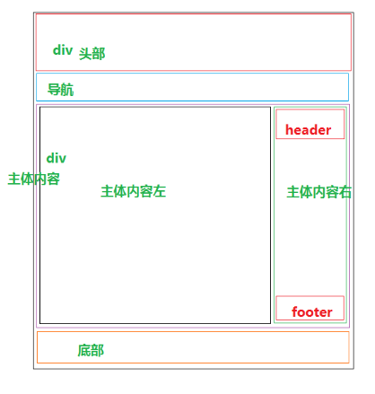
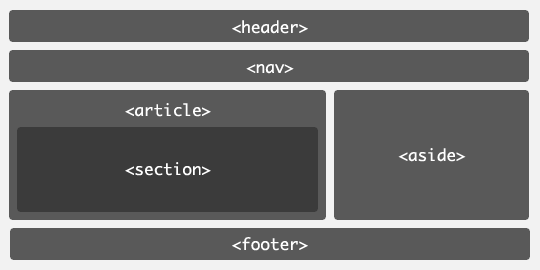

>大家好，这里是「 从零开始学 Web 系列教程 」，并在下列地址同步更新......
>
> - github：https://github.com/Daotin/Web
> - 微信公众号：[Web前端之巅](https://github.com/Daotin/pic/raw/master/wx.jpg)
> - 博客园：http://www.cnblogs.com/lvonve/
> - CSDN：https://blog.csdn.net/lvonve/
>
> 在这里我会从 Web 前端零基础开始，一步步学习 Web 相关的知识点，期间也会分享一些好玩的项目。现在就让我们一起进入 Web 前端学习的冒险之旅吧！


# 一、HTML5简介


## 1、什么是html5

html5 不是一门新的语言，而是我们之前学习的 html 的第五次重大修改版本。


## 2、html的发展历史

超文本标记语言（第一版，不叫 HTML 1.0）——在1993年6月作为互联网工程工作小组（IETF）工作草案发布（并非标准）；
HTML 2.0——1995年11月作为RFC 1866发布，在RFC 2854于2000年6月发布之后被宣布已经过时
HTML 3.2——1997年1月14日，W3C推荐标准
HTML 4.0——1997年12月18日，W3C推荐标准
HTML 4.01（微小改进）——1999年12月24日，W3C推荐标准
HTML 5——2014年10月28日，W3C推荐标准 


## 3、HTML5的设计目的

HTML5的设计目的是**为了在移动设备上支持多媒体**。之前网页如果想嵌入视频音频，需要用到 flash ，但是苹果设备是不支持 flash 的，所以为了改变这一现状，html5应运而生。

新的语法特征被引进以支持视频音频，如video、audio和 canvas 标记。

HTML5还引进了新的功能，可以真正改变用户与文档的交互方式。比如增加了新特性：语义特性，本地存储特性，设备兼容特性，连接特性，网页多媒体特性，三维、图形及特效特性，性能与集成特性，CSS3特性。


相比之前的进步：

-   取消了一些过时的 HTML4 标记
-   将内容和展示分离
-   一些全新的表单输入对象
-   全新的，更合理的Tag
-   本地数据库
-   Canvas 对象
-   浏览器中的真正程序
-   Html5取代Flash在移动设备的地位


## 4、html5优缺点

优点：

-   提高可用性和改进用户的友好体验；
-   有几个新的标签，这将有助于开发人员定义重要的内容；
-   可以给站点带来更多的多媒体元素(视频和音频)；
-   可以很好的替代FLASH和Silverlight；
-   当涉及到网站的抓取和索引的时候，对于SEO很友好；
-   将被大量应用于移动应用程序和游戏；
-   可移植性好。

缺点

-   该标准并未能很好的被Pc端浏览器所支持。因新标签的引入，各浏览器之间将缺少一种统一的数据描述格式，造成用户体验不佳。


## 5、html5 应用场景

（1）极具表现力的网页：内容简约而不简单。

（2）网页应用程序：

-   代替PC端的软件：Office、腾讯文档、有道云笔记等。
-   代替 APP 的网页：淘宝、京东、拼多多等。
-   微信端：公众号、小程序等。

（3）混合式本地应用。

（4）简单的游戏。


## 6、html5支持的浏览器

html5支持绝大部分主流浏览器，比如国外的 chrome，firefox，safari，IE9及以上，opera 等，国内的 360浏览器，QQ浏览器等。

>    注意：IE9为部分支持，IE8及以下不支持 html5。


# 二、语义化标签

## 1、什么是语义化标签？

类似于 p，span，img等这样的，看见标签就知道里面应该保存的是什么内容的是语义化标签。

像 div 这样的里面可以装任意东西的就是非语义化标签。


以前我们要做下面这个结构可能会这么布局：




```html
<div class="header"></div>
<div class="nav"></div>
<div class="main">
    <div class="left"></div>
    <div class="right"></div>
</div>
<div class="footer"></div>
```

那么在 html5 下语义化标签怎么做呢？



```html
<header></header>
<nav></nav>
<main>
    <article></article>
    <aside></aside>
</main>
<footer></footer>
```

是不是语义化更清晰，代码更简洁呢？


## 2、html5 部分新增的标签

### 2.1、结构标签

-   `section`：独立内容区块，可以用 h1~h6 组成大纲，表示文档结构，也可以有章节、页眉、页脚或页眉的其他部分；
-   `article`：特殊独立区块，表示这篇页眉中的核心内容；
-   `aside`：标签内容之外与标签内容相关的辅助信息；
-   `header`：某个区块的头部信息/标题；

-   `hgroup`：头部信息/标题的补充内容；
-   `footer`：底部信息；


- `nav`：导航条部分信息；
- `figure`：独立的单元，例如某个有图片与内容的新闻块。


### 2.2、表单标签

-   email：必须输入邮件；

- url：必须输入url地址；

- number：必须输入数值；

- range：必须输入一定范围内的数值；

- Date Pickers：日期选择器；

  date：选取日、月、年
  month：选取月、年
  week：选取周和年
  time：选取时间（小时和分钟）
  datetime：选取时间、日、月、年（UTC时间）
  datetime-local：选取时间、日、月、年（本地时间）

- search：搜索常规的文本域；

- color：颜色

```html
<form action="">
    <fieldset>
        <legend>学生档案</legend>
        <label for="userName">姓名:</label>
        <input type="text" name="userName" id="userName" placeholder="请输入用户名">
        <label for="userPhone">手机号码:</label>
        <input type="tel" name="userPhone" id="userPhone" pattern="^1\d{10}$">
        <label for="email">邮箱地址:</label>
        <input type="email" required name="email" id="email">
        <label for="collage">所属学院:</label>
        <input type="text" name="collage" id="collage" list="cList" placeholder="请选择">
        <datalist id="cList">
            <option value="前端与移动开发学院"></option>
            <option value="java学院"></option>
            <option value="c++学院"></option>
        </datalist>
        <label for="score">入学成绩:</label>
        <input type="number" max="100" min="0" value="0" id="score">
        <label for="level">基础水平:</label>
        <meter id="level" max="100" min="0" low="59" high="90"></meter>
        <label for="inTime">入学日期:</label>
        <input type="date" id="inTime" name="inTime">
        <label for="leaveTime">毕业日期:</label>
        <input type="date" id="leaveTime" name="leaveTime">
        <input type="submit">
    </fieldset>
</form>
```


### 2.3、媒体标签

-   video：视频；
-   audio：音频；
-   embed：嵌入内容（包括各种媒体），Midi、Wav、AU、MP3、Flash、AIFF等。


```html
<body>
<!--embed:可以直接插入音频视频，本质是通过本机安装的音频视频播放软件来播放的。要求必须已经安装了这些软件  兼容性-->

<!--flash:  1.先学习flash,增加使用成本  2.iphone,ipd,不支持flash-->

<!--audio:音频-->
<!--
src:播放文件的路径
controls:音频播放器的控制器面板
autoplay:自动播放
loop:循环播放-->
<audio src="../mp3/aa.mp3" controls></audio>

<!--video：视频-->
<!--
src:播放文件的路径
controls:音频播放器的控制器面板
autoplay:自动播放
loop:循环播放
poster:指定视频还没有完全下载完毕，或者用户没有点击播放前显示的封面。 默认显示当前视频文件的第一副图像
width:视频的宽度
height:视频的高度
-->
<!--注意事项：视频始终会保持原始的宽高比。意味着如果你同时设置宽高，并不是真正的将视频的画面大小设置为指定的大小，而只是将视频的占据区域设置为指定大小，除非你设置的宽高刚好就是原始的宽高比例。所以建议：在设置视频宽高的时候，一般只会设置宽度或者高度，让视频文件自动缩放-->
<video src="../mp3/mp4.mp4" poster="../images/l1.jpg" controls  height="600"></video>

<!--source:因为不同的浏览器所支持的视频格式不一样，为了保证用户能够看到视频，我们可以提供多个视频文件让浏览器自动选择-->
<video src="../mp3/flv.flv" controls></video>
<video controls>
    <!--视频源，可以有多个源-->
    <source src="../mp3/flv.flv" type="video/flv">
    <source src="../mp3/mp4.mp4" type="video/mp4">
</video>
</body>
```


### 2.4、其他功能标签

-   mark：标注；

-   progress：进度条；

    `<progress max="最大进度条的值" value="当前进度条的值">`

-   time：数据标签，给搜索引擎使用；

    发布日期 `<time datetime="2014-12-25T09:00">9：00</time>` 

    更新日期 `<time datetime="2015-01-23T04:00" pubdate>4:00</time>`

-   ruby和rt：对某一个字进行注释；

    `<ruby><rt>注释内容</rt><rp>浏览器不支持时如何显示</rp></ruby>`

-   wbr：软换行，页面宽度到需要换行时换行；

-   canvas：使用JS代码做内容进行图像绘制；

-   command：按钮；

-   deteils ：展开菜单；

-   dateilst：文本域下拉提示；

-   keygen：加密

-----以上参考链接： https://blog.csdn.net/garvisjack/article/details/54754928

```html
<form action="">
    <!--专业：
    <select name="" id="">
        <option value="1">前端与移动开发</option>
        <option value="2">java</option>
        <option value="3">javascript</option>
        <option value="4">c++</option>
    </select>-->
    <!--不仅可以选择，还应该可以输入-->
    <!--建立输入框与datalist的关联  list="datalist的id号"-->
    专业：<input type="text" list="subjects"> <br>
    <!--通过datalist创建选择列表-->
    <datalist id="subjects">
        <!--创建选项值：value:具体的值 label:提示信息，辅助值-->
        <!--option可以是单标签也可以是双标签-->
        <option value="英语" label="不会"/>
        <option value="前端与移动开发" label="前景非常好"></option>
        <option value="java" label="使用人数多"></option>
        <option value="javascript" label="做特效"></option>
        <option value="c" label="不知道"></option>
    </datalist>

    网址：<input type="url" list="urls">
    <datalist id="urls">
        <!--如果input输入框的type类型是url,那么value值必须添加http://-->
        <option value="http://www.baidu.com" label="百度"></option>
        <option value="http://www.sohu.com"></option>
        <option value="http://www.163.com"></option>
    </datalist>
</form>
```


## 3、语义化标签兼容性处理

IE9：部分支持（所有语义标签都被认定为**行级元素**）

IE8：不支持。如果想要IE8支持的话：

方式一：可以使用 js 手动创建这些语义标签，创建的语义标签默认也是行级元素。

```js
document.createElement("header");
document.createElement("nav");
document.createElement("main");
document.createElement("article");
document.createElement("aside");
document.createElement("footer");
```

方式二：引入第三方插件 “html5shiv.js” 文件，就可以使得 html5 支持 IE8及以下浏览器。


