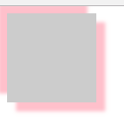

>大家好，这里是「 从零开始学 Web 系列教程 」，并在下列地址同步更新......
>
> - github：https://github.com/Daotin/Web
> - 微信公众号：[Web前端之巅](https://github.com/Daotin/pic/raw/master/wx.jpg)
> - 博客园：http://www.cnblogs.com/lvonve/
> - CSDN：https://blog.csdn.net/lvonve/
>
> 在这里我会从 Web 前端零基础开始，一步步学习 Web 相关的知识点，期间也会分享一些好玩的项目。现在就让我们一起进入 Web 前端学习的冒险之旅吧！


# 一、CSS3


## 1、CSS3简介

CSS3是CSS（层叠样式表）技术的升级版本，主要包括盒子模型、列表模块、超链接方式、语言模块、背景和边框、文字特效、多栏布局等模块。


## 2、新增特性

CSS3的新特征有很多，例如圆角效果、图形化边界、块阴影与文字阴影、使用RGBA实现透明效果、渐变效果、使用@Font-Face实现定制字体、多背景图、文字或图像的变形处理（旋转、缩放、倾斜、移动）、多栏布局、媒体查询等。


## 3、优势

**减少开发成本与维护成本**

在CSS3出现之前，开发人员为了实现一个圆角效果，往往需要添加额外的HTML标签，使用一个或多个图片来完成，而使用CSS3只需要一个标签，利用CSS3中的border-radius属性就能完成。

**提高页面性能**

很多CSS3技术通过提供相同的视觉效果而成为图片的“替代品”，换句话说，在进行Web开发时，减少多余的标签嵌套以及图片的使用数量，意味着用户要下载的内容将会更少，页面加载也会更快。


## 4、兼容问题

浏览器对于CSS3的支持程度比较低，有的时候不同的浏览器需要添加不同的前缀。

Chrome（谷歌浏览器）：`-webkit-`
Safari（苹果浏览器）：`-webkit-`
Firefox（火狐浏览器）：`-moz-`
lE（IE浏览器）：`-ms-`
Opera（欧朋浏览器）：`-o-`


---


# 二、选择器

CSS3新增了许多灵活查找元素的方法，极大的提高了查找元素的效率和精准度。CSS3选择器与jQuery中所提供的绝大部分选择器兼容。

## 1、属性选择器

所谓属性选择器就是**根据指定名称的属性的值**来查找元素。

1、`E[attr]`：查找指定的拥有attr属性的E标签。

```css
/*查找拥有style属性的里标签*/
li[style] {}
```


2、`E[attr=value]`：查找拥有指定的attr属性并且属性值为value的E标签。

```css
/*查找拥有class属性并且值为Red的li标签*/
li[class=red] {}
```


3、`E[attr*=value]`:查找拥有指定的attr属性并且属性值中包含**(可以在任意位置**)value的E标签

```css
li[class*=red] {}
```


4、`E[attr^=value]`：查找拥有指定的attr属性并且属性值以value开头的E标签

```css
li[class^=red] {}
```


5、`E[attr$=value]`：查找拥有指定的attr属性并且属性值以value开结束的E标签

```css
li[class$=red] {}
```


## 2、伪类选择器

之前学过的伪类选择器：`a:hover`，` a:link`，  `a:active`， ` a:visited`

伪类选择器：**以某元素相对于其父元素或兄弟元素的位置来获取无素的结构伪类。**

### 2.1、兄弟结构伪类

`+`：获取当前元素的**相邻**的满足条件的元素
`~`：获取当前元素的满足条件的**兄弟元素**

```css
/*下面这句样式说明查找 ：添加了.first样式的标签的相邻的li元素
要求：
1.必须相邻。2.必须是指定类型的元素
*/
.first + li{
    color: blue;
}

/*下面样式查找添加了.first样式的元素的所有兄弟li元素*/
.first ~ li{
    color: pink;
}
```


### 2.2、相对于父元素的伪类

**2.2.1、查找第一个元素和最后一个元素（无过滤）**

`E:first-child`：查找E元素的父级元素中的第一个E元素。

`E:last-child` ：查找E元素的父元素中最后一个指定类型的子元素

```css
/*下面这句样式查找：li的父元素中的第一个li元素
1.相对于当前指定元素的父元素
2.查找的类型必须是指定的类型*/
li:first-child{
  color: red;
}
li:last-child{
  background-color: skyblue;
}
```

>   注意：在查找的时候并不会**限制查找的元素的类型，也就是如果第一个元素不是E元素的话，就查找不到**，查找的时候不会过滤掉E元素之外的元素。


**2.2.2、查找第一个元素和最后一个元素（有过滤）**

`E:first-of-type`：查找E元素的父级元素中的第一个E元素。

`E:last-of-type` ：查找E元素的父元素中最后一个指定类型的子元素

```css
/*查找的时候限制类型  first-of-type*/
/*1.也是相对于父元素
2.在查找的时候只会查找满足类型条件的元素，过渡掉其它类型的元素*/
li:first-of-type{
  color: red;
}
li:last-of-type{
  color: orange;
}
```


**2.2.3、查找单个元素或多个元素（无过滤）**

`E:nth-child(index)`：查找指定索引位置的元素（从1开始的索引）

`E:nth-child(even)`：查找索引为偶数位置的元素

`E:nth-child(odd)`：查找索引为奇数位置的元素

与上面类似，下面是倒着计算的：

`E:nth-last-child(xxx)`

```css
li:nth-child(5){
  background-color: lightblue;
}
li:nth-child(even){
  background-color: blue;
}
li:nth-child(odd){
  background-color: red;
}

```


**2.2.4、查找单个元素或多个元素（有过滤）**

```css
li:nth-of-type(even){
  background-color: orange;
}
li:nth-of-type(odd){
  background-color: pink;
}
```


**2.2.5、查找开头或结尾的多个元素**

无过滤：`E:nth-child(n)` ：n 遵循线性变化，其取值0、1、2、3、4、... 但是当参数小于等于0时，选取无效。

有过滤：`E:nth-of-type(n)`

无过滤倒序：`E:nth-last-child(n)`

有过滤倒序：`E:nth-last-of-type(n)`


示例：

```css
/*想为前面的5个元素添加样式*/
/*n:默认取值范围为0~子元素的长度.但是当n<=0时，选取无效
0>>5
1>>4
...
4>>1
5>>0*/

li:nth-of-type(-n+5){
  font-size: 30px;
}
li:nth-last-of-type(-n+5){
  font-size: 30px;
}
```

>   PS：n 可是多种形式：nth-child(2n)、nth-child(2n+1)、nth-child(-n+5)等。


**2.2.6、空值：没有任何的内容，连空格都没有**

```css
li:empty{
  background-color: red;
}
```


**2.2.7、锚链接伪类**

`E:target` ：可以为锚点目标元素添加样式，当目标元素被触发为当前锚链接的目标时，调用此伪类样式。

```css
/*h2为锚点，在被触发时将h2的字体改为红色*/
h2:target{
	color: red;
}
```


## 3、伪元素选择器

伪元素之所以被称为伪元素，是因为它不是真正的DOM，但是却可以当成一个DOM元素看待，它的用法和真正的DOM元素的操作是一样的，但是在DOM树中又不会出现。

既然是伪元素，那么**无法使用 JS 的方式来获取**。

css有一系列的伪元素，如`::before`，`::after`，`::first-line`，`::first-letter`等，本文就详述一下:before和:after元素的使用。


### 3.1、E::before，E::after

- 是一个**行内元素**，需要转换成块：`display:block` 或者  `float:left/right` 或者使用 `position` 。
- **必须添加 content** , 哪怕不设置内容，也需要`content:""`，否则不会起作用。
- E:after、E:before 在旧版本里是伪类，在新版本里是伪元素，因为在新版本下E:after、E:before会被自动识别为E::after、E::before，按伪元素来对待，这样做的目的是用来做兼容处理。
- `E::before`：定义在一个元素的内容之前插入 content 属性定义的内容与样式。
- `E::after`：定义在一个元素的内容之后插入 content 属性定义的内容与样式。

>    注意：
>
>    -   IE6、IE7与IE8（怪异模式Quirks mode）不支持此伪元素
>    -   CSS2中 E:before或者E:after，是属于伪类的，并且没有伪元素的概念，CSS3中 提出伪元素的概念 E::before和E::after，并且归属到了伪元素当中，伪类里就不再存在E:before或者   E:after伪类


示例：

```html
<!DOCTYPE html>
<html lang="en">
<head>
    <meta charset="UTF-8">
    <title>Document</title>
    <style>
        div:nth-of-type(1){
            width: 300px;
            height: 200px;
            background-color: red;
            float: left;
            position: relative;
        }
        div:nth-of-type(2){
            width: 100px;
            height: 200px;
            background-color: blue;
            float: left;            
        }
        div:nth-of-type(1)::before {
            content: "";
            position: absolute;
            width: 20px;
            height: 20px;
            background-color: #fff;
            border-radius: 50%;
            right: -10px;
            top: -10px;
        }
        div:nth-of-type(1)::after {
            content: "";
            position: absolute;
            width: 20px;
            height: 20px;
            background-color: #fff;
            border-radius: 50%;
            right: -10px;
            bottom: -10px;
        }
    </style>
</head>
<body>
    <div></div>
    <div></div>
</body>
</html>
```




### 3.2、E:first-letter

**选中文本的第一个字母（英文）或者文字（中文）**

```css
/*设置首字下沉*/
p::first-letter {
  font-size: 40px;
  float: left;
}
```


### 3.3、E::first-line

**选中文本第一行**

>   PS：如果同时设置了::first-letter，那么 ::first-line 无法对第一个字母或文字进行设置（颜色除外）。


### 3.4、E::selection 

**设置选中文本的样式。**

> 注意：不能改变其大小，但是可以改变颜色。

```css
p::selection {
  background-color: orange;
}
```


