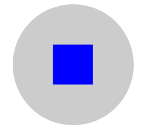
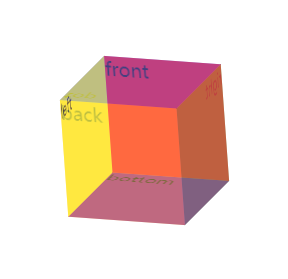

>大家好，这里是「 从零开始学 Web 系列教程 」，并在下列地址同步更新......
>
> - github：https://github.com/Daotin/Web
> - 微信公众号：[Web前端之巅](https://github.com/Daotin/pic/raw/master/wx.jpg)
> - 博客园：http://www.cnblogs.com/lvonve/
> - CSDN：https://blog.csdn.net/lvonve/
>
> 在这里我会从 Web 前端零基础开始，一步步学习 Web 相关的知识点，期间也会分享一些好玩的项目。现在就让我们一起进入 Web 前端学习的探索之旅吧！


# transform

`transform` 字面上就是变形，改变的意思。在CSS3中transform主要包括以下几种：移动 `translate`，缩放`scale`，旋转`rotate`，翻转`skew`，改变旋转轴心等。

## 1、元素的移动：translate

**作用：**使用transform实现元素的移动 

**语法：**

```css
/*使用transform实现元素的移动 
1.如果只有一个参数就代表x方向
2.如果有两个参数就代表x/y方向*/
transform: translate(100px);
transform: translate(400px,500px);
transform: translate(0px,500px);

/*添加水平或者垂直方向的移动*/
transform:translateX(300px);
transform:translateY(300px);
```

>   注意：
>
>   1、移动是参照元素的左上角 ；
>
>   2、执行完毕之后会恢复到原始状态。


## 2、缩放：scale

**作用：**实现缩放（参照元素的几何中心）：1指不缩放，>1.01放大，  <0.99缩小。

**语法：**

```css
/*实现缩放（参照元素的几何中心）：1指不缩放，>1.01放大  <0.99缩小。
1.如果只有一个参数，就代表x和y方向都进行相等比例的缩放
2.如果有两个参数，就代表x/y方向*/
transform: scale(2);
transform: scale(2,1);
/* 缩放指定的方向 */
transform:scaleX(0.5);
transform:scaleY(0.5);
```


## 3、旋转：rotate

**作用：**实现元素的旋转。

**语法：**

```css
/*参数：正数就是顺时针方向，负数就是逆时针方向。*/ 
transform:rotate(90deg); 
```


## 4、翻转：skew

**作用：**实现元素的翻转

**语法：**

```css
/*如果角度为正，则往当前轴的负方向斜切，如果角度为负，则往当前轴的正方向斜切*/
transform:skew(-30deg);
/*两个值，一个往x方向，一个y方向*/
transform:skew(30deg,-30deg);
/*设置某个方向的斜切值*/
/*transform:skewX(30deg);*/
/*transform:skewY(30deg);*/
```


## 5、改变旋转轴心

**语法：**

```css
/*设置旋转轴心
1.参数：x y
2.关键字：left top right bottom center*/
transform-origin: left top;
transform-origin: 10px 10px;
```


## 6、同时添加多个transform属性值

```css
/*单独写两个是无效的，后面的会覆盖前面的*/
transform: translateX(700px);
transform: rotate(-90deg);

/*需要合并起来写*/
transform: translateX(700px) rotate(-90deg);
```

>   注意：
>
>   1、transform 多个属性分开写的话，后面的属性会覆盖前面的，一定要合并起来写。
>
>   2、`transform: rotate(-90deg)  translateX(700px); `会出问题，因为旋转会将坐标系旋转，所以先移动再旋转。


## 案例：旋转轴心案例

效果：鼠标放在图形上，图形旋转，鼠标移开，图形回归原状。

```html
<!DOCTYPE html>
<html lang="en">
<head>
    <meta charset="UTF-8">
    <title>Document</title>
    <style>
        * {
            padding: 0;
            margin: 0;
        }
        .box {
            width: 100px;
            height: 100px;
            margin: 300px auto;
            position: relative;
        }
        .box > img {
            width: 100px;
            height: 100px;
            position: absolute;
            transition: transform 1s;
            transform-origin: 110px -10px;
        }
        .box:hover > img:nth-of-type(1) {
            transform: rotate(60deg);
        }
        .box:hover > img:nth-of-type(2) {
            transform: rotate(120deg);
        }
        .box:hover > img:nth-of-type(3) {
            transform: rotate(180deg);
        }
        .box:hover > img:nth-of-type(4) {
            transform: rotate(240deg);
        }
        .box:hover > img:nth-of-type(5) {
            transform: rotate(300deg);
        }
        .box:hover > img:nth-of-type(6) {
            transform: rotate(360deg);
        }
        
    </style>
</head>
<body>
    <div class="box">
        
        
        
        
        
        
    </div>
</body>
</html>
```


## 案例：图形打散

效果：鼠标放到图形上，图形打散，鼠标移开，图形归位。

```html
<!DOCTYPE html>
<html lang="en">
<head>
    <meta charset="UTF-8">
    <title>Document</title>
    <style>
        *{
            margin: 0;
            padding: 0;
        }
        body {
            background-color: rgb(110, 84, 226);
        }
        .box {
            width: 500px;
            height: 100%;
            margin: 100px auto;
        }
        .box > img {
            transition: transform 1s;
        }
        .box:hover > img:nth-of-type(1){
            transform: translate(-100px, 200px) rotate(30deg);
        }
        .box:hover > img:nth-of-type(2){
            transform: translate(-500px, -50px) rotate(60deg);
        }
        .box:hover > img:nth-of-type(3){
            transform: translate(300px, 10px) rotate(-50deg);
        }
        .box:hover > img:nth-of-type(4){
            transform: translate(600px, 20px) rotate(-90deg);
        }
        .box:hover > img:nth-of-type(5){
            transform: translate(30px, 200px) rotate(90deg);
        }
        .box:hover > img:nth-of-type(6){
            transform: translate(-100px, -200px) rotate(-30deg);
        }
        .box:hover > img:nth-of-type(7){
            transform: translate(-300px, 100px) rotate(-30deg);
        }
        .box:hover > img:nth-of-type(8){
            transform: translate(200px, 250px) rotate(30deg);
        }
        .box:hover > img:nth-of-type(9){
            transform: translate(0, -150px) rotate(-30deg);
        }
    </style>
</head>
<body>
    <div class="box">
        
        
        
        
        
        
        
        
        
    </div>
</body>
</html>
```


## 案例：脱标流盒子居中

我们之前也学过脱标流盒子的居中问题，当时做的是先移动父盒子的 50%（比如：left：50%），再往相反方向移动子盒子的 50%（比如：margin-left：100px;）。大家可以看到，子盒子的移动只能写具体的像素值，而不能写 -50%。如果子盒子的大小改变了，就需要重新计算。

这里可以使用：`left: 50%;` 和 `transform:translate(-50%, -50%);` 就可以解决。

示例：

```html
<!DOCTYPE html>
<html lang="en">
<head>
    <meta charset="UTF-8">
    <title>Document</title>
    <style>
        .cir {
            width: 300px;
            height: 300px;
            background-color: #ccc;
            border-radius: 50%;
            margin: 100px auto;
            position: relative;
        }
        .rec {
            width: 100px;
            height: 100px;
            background-color: blue;
            position: absolute;
            left: 50%;
            top: 50%;
            /* margin-left: -50px;
            margin-top: -50px; */
            transform: translate(-50%, -50%);
        }
    </style>
</head>
<body>
    <div class="cir">
        <div class="rec"></div>
    </div>
</body>
</html>
```




## 7、3d三维变换

语法：

```css
/*添加三维移动--3D移动*/
/*translate3d(X方向的偏移，Y方向的偏移，Z方向的偏移)*/
/*transform: translate3d(400px,0,0);*/
/*transform: translate3d(400px,400px,0);*/
transform: translate3d(0px,0px,400px);

/*添加3d缩放*/
/*scale3d(x方向上的缩放，y方向的缩放，z方向的缩放)
>1.01 放大   <0.99 缩小*/
transform:scale3d(1,1,10);

/*添加三维旋转*/
/*rotate3d(x,y,z,angle):
x:代表x轴方向上的一个向量值
y:代表y轴方向上的一个向量值
z:代表z轴方向上的一个向量值
330deg：旋转的度数*/
transform: rotate3d(1,1,1,330deg);
/*注意：当只有一个方向的向量值的时候，数字大小无所谓，但是当有两个或三个向量值的时候，旋转轴心为三个向量值合成的一个向量值，这个时候，各个向量值的大小会对合成的向量值的方向有影响。*/
```


## 案例：立方体

```html
<!DOCTYPE html>
<html lang="en">
<head>
    <meta charset="UTF-8">
    <title>Document</title>
    <style>
        * {
            margin: 0;
            padding: 0;
        }
        .cube {
            width: 100px;
            height: 100px;
            position: relative;
            margin: 100px auto;
            /* 旋转一定的角度便于查看 */
            transform: rotate3d(1,1,0,30deg);
            /* 保存变换之后的效果 （加在父元素身上）*/
            transform-style: preserve-3d;

        }
        .cube > div {
            width: 100px;
            height: 100px;
            position: absolute;
            opacity: 0.5;
        }
        .front {
            background-color: red;
            transform: translateZ(50px);
        }
        .back {
            background-color: orange;
            transform: translateZ(-50px) rotateY(180deg);
        }
        .left{
            background-color: yellow;
            transform: translateX(-50px) rotateY(-90deg);
        }
        .right {
            background-color: green;
            transform: translateX(50px) rotateY(90deg);
        }
        .top{
            background-color: blue;
            transform: translateY(-50px) rotateX(90deg);
        }
        .bottom{
            background-color: purple;
            transform: translateY(50px) rotateX(-90deg);
        }
    </style>
</head>
<body>
    <div class="cube">
        <div class="front">front</div>
        <div class="back">back</div>
        <div class="left">left</div>
        <div class="right">right</div>
        <div class="top">top</div>
        <div class="bottom">bottom</div>
    </div>
</body>
</html>
```




## 8、景深/透视效果

当`perspective:none/0;`时，相当于没有设置，没有设置的时候，视角位于3D的几何中心位置，相当于在
盒子内部往外看;

当perspective的值大于中心到各个平面的距离时，相当于出了盒子看。

语法：

```css
/*默认无透视效果*/
perspective: 0px;

/*perspective-origin属性规定了镜头在平面上的位置。默认是放在元素的中心*/
perspective-origin: 0px 0px;

/*transform-style：使被转换的子元素保留其 3D 转换(需要设置在父元素中)
flat: 不保留3d转换结果
preserve-3d：保留3d转换结果*/
transform-style: preserve-3d;
```


