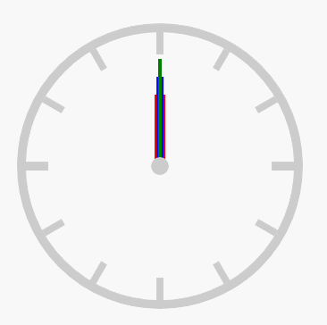
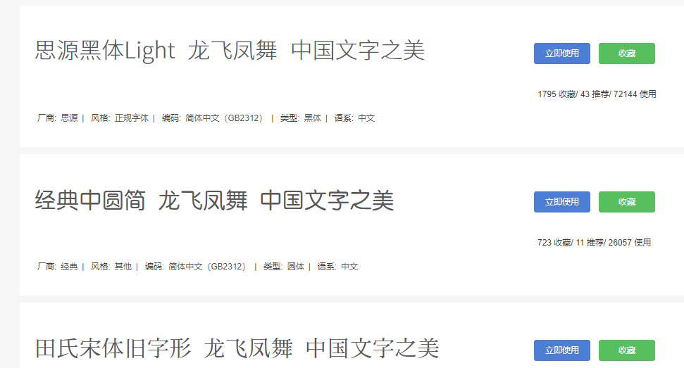

>大家好，这里是「 从零开始学 Web 系列教程 」，并在下列地址同步更新......
>
> - github：https://github.com/Daotin/Web
> - 微信公众号：[Web前端之巅](https://github.com/Daotin/pic/raw/master/wx.jpg)
> - 博客园：http://www.cnblogs.com/lvonve/
> - CSDN：https://blog.csdn.net/lvonve/
>
> 在这里我会从 Web 前端零基础开始，一步步学习 Web 相关的知识点，期间也会分享一些好玩的项目。现在就让我们一起进入 Web 前端学习的冒险之旅吧！


# 一、动画

## 1、创建动画

好的前端工程师，会更注重用户的体验和交互。那么动画就是将我们的静态页面，变成具有灵动性，为我们的界面添加个性的一种方式。

一个动画至少需要两个属性：

`animation-name` ：动画的名字（创建动画时起的名字，如下为 moveTest）

`animation-duration` ：动画的耗时

```css
animation-name: moveTest;
animation-duration: 2s;
```

如需在 CSS3 中创建动画，需要学习 `@keyframes` 规则。`@keyframes` 规则用于创建动画。在 `@keyframes` 中规定某项 CSS 样式，就能创建由当前样式逐渐改为新样式的动画效果。

使用 `@keyframes `关键字来创建动画。

```css
@keyframes moveTest {
  /*百分比是指整个动画耗时的百分比*/
  0% {
    transform: translate(0px, 0px);
  }
  50% {
    transform: translateY(200px);
  }
  100% {
    transform: translate(200px,200px);
  }
}
```

> 其中，百分比是指整个动画耗时的百分比。


**示例：**

```html
<!DOCTYPE html>
<html lang="en">
<head>
    <meta charset="UTF-8">
    <title>Document</title>
    <style>
        div {
            width: 100px;
            height: 100px;
            background-color: blue;

            animation-name: moveTest;
            animation-duration: 2s;
        }

        @keyframes moveTest {
            0% {
                transform: translate(0px, 0px);
            }
            50% {
                transform: translateY(200px);
            }
            100% {
                transform: translate(200px,200px);
            }
        }
    </style>
</head>
<body>
    <div></div>
</body>
</html>
```

>   `0%`：动画起始位置，也可以写成 from
>
>   `100%`：动画终点位置，也可以写成 to。


## 2、动画的其他属性

`animation-iteration-count`：设置动画的播放次数，默认为1次

`animation-direction`：设置交替动画

`animation-delay`：设置动画的延迟

`animation-fill-mode`：设置动画结束时的状态：默认情况下，动画执行完毕之后，会回到原始状态

`animation-timing-function`：动画的时间函数（动画的效果，平滑？先快后慢等）

`animation-play-state`：设置动画的播放状态  paused:暂停   running:播放

```css
/*3.设置动画的播放次数，默认为1次  可以指定具体的数值，也可以指定infinite(无限次)*/
animation-iteration-count: 1;
/*4.设置交替动画  alternate:来回交替*/
animation-direction: alternate;
/*5.设置动画的延迟*/
animation-delay: 2s;
/*5.设置动画结束时的状态：默认情况下，动画执行完毕之后，会回到原始状态
forwards:会保留动画结束时的状态，在有延迟的情况下，并不会立刻进行到动画的初始状态
backwards:不会保留动画结束时的状态，在添加了动画延迟的前提下，如果动画有初始状态，那么会立刻进行到初始状态
both:会保留动画的结束时状态，在有延迟的情况下也会立刻进入到动画的初始状态*/
animation-fill-mode: both;
/*6.动画的时间函数:linear,ease...*/
animation-timing-function: linear;
/*设置动画的播放状态  paused:暂停   running:播放*/
animation-play-state: running;
```


## 3、案例：无缝滚动

```html
<!DOCTYPE html>
<html lang="en">
<head>
    <meta charset="UTF-8">
    <title>Document</title>
    <style>
        * {
            margin: 0;
            padding: 0;
        }
        div {
            width: 600px;
            height: 100px;
            margin: 100px auto;
            background-color: #ccc;
            overflow: hidden;
        }
        ul {
            width: 200%;
            animation: moveLeft 6s linear 0s infinite;
        }
        ul > li {
            float: left;
            list-style: none;
        }
        li > img {
            width: 200px;
            height: 100px;
        }
        div:hover > ul {
            cursor: pointer;
            animation-play-state: paused;
        }
        @keyframes moveLeft {
            from {
                transform: translateX(0);
            }
            to {
                transform: translateX(-600px);
            }
        }
    </style>
</head>
<body>
    <div>
        <ul>
            <li></li>
            <li></li>
            <li></li>
          	<!-- 复制的一份图片 -->
            <li></li>
            <li></li>
            <li></li>
        </ul>
    </div>
</body>
</html>
```

>   1、将要显示的图片复制一份，以完成无缝滚动的需求。
>
>   2、然后让 ul 移动整个ul的宽度即可，并且无限循环，就实现无线轮播的效果。
>
>   3、然后在鼠标放上去的时候，使得动画暂停。


## 4、案例：时钟

```html
<!DOCTYPE html>
<html lang="en">
<head>
    <meta charset="UTF-8">
    <title>Document</title>
    <style>
        * {
            padding: 0;
            margin: 0;
        }
        .clock {
            width: 300px;
            height: 300px;
            margin: 100px auto;
            border: 10px solid #ccc;
            border-radius: 50%;
            position: relative;
        }
        .line {
            width: 8px;
            height: 300px;
            background-color: #ccc;
            position: absolute;
            left: 50%;
            top: 50%;
            transform: translate(-50%, -50%);
        }
        .line2 {
            transform: translate(-50%, -50%) rotate(30deg);
        }
        .line3 {
            transform: translate(-50%, -50%) rotate(60deg);
        }
        .line4 {
            width: 10px;
            transform: translate(-50%, -50%) rotate(90deg);
        }
        .line5 {
            transform: translate(-50%, -50%) rotate(120deg);
        }
        .line6 {
            transform: translate(-50%, -50%) rotate(150deg);
        }
        .cover {
            width: 250px;
            height: 250px;
            background-color: #fff;
            border-radius: 50%;
            position: absolute;
            left: 50%;
            top: 50%;
            transform: translate(-50%, -50%);
        }
        .center {
            width: 20px;
            height: 20px;
            background-color: #ccc;
            border-radius: 50%;
            position: absolute;
            left: 50%;
            top: 50%;
            transform: translate(-50%, -50%);
        }
        .hour {
            width: 12px;
            height: 80px;
            background-color: red;
            position: absolute;
            left: 50%;
            top: 50%;
            transform: translate(-50%, -100%);
            transform-origin: center bottom;
            animation: clockMove 43200s linear infinite;
        }
        .minute {
            width: 8px;
            height: 100px;
            background-color: blue;
            position: absolute;
            left: 50%;
            top: 50%;
            transform: translate(-50%, -100%);
            transform-origin: center bottom;
            animation: clockMove 3600s linear infinite;
        }
        .second {
            width: 4px;
            height: 120px;
            background-color: green;
            position: absolute;
            left: 50%;
            top: 50%;
            transform: translate(-50%, -100%);
            transform-origin: center bottom;
            animation: clockMove 60s infinite steps(60);
        }
        
        @keyframes clockMove {
            from {
                transform: translate(-50%, -100%) rotate(0deg);
            }
            to {
                transform: translate(-50%, -100%) rotate(360deg);
            }
        }
    </style>
</head>
<body>
    <div class="clock">
        <div class="line line1"></div>
        <div class="line line2"></div>
        <div class="line line3"></div>
        <div class="line line4"></div>
        <div class="line line5"></div>
        <div class="line line6"></div>    
        <div class="cover"></div>
        <div class="hour"></div>
        <div class="minute"></div>
        <div class="second"></div>
        <div class="center"></div>
    </div>
</body>
</html>
```

> 我们让秒针step(60)一步一步走，效果更好。




---


# 二、Web字体与图标

## 1、web字体

我们有些时候需要在网页上显示一些特殊的字体，如果这些特殊的字体在电脑上没有安装的话，就会显示系统默认的字体，而不是这些特殊的字体。

这时就有了 Web 字体。开发人员可以为自已的网页指定特殊的字体，无需考虑用户电脑上是否安装了此特殊字体，从此把特殊字体处理成图片的时代便成为了过去。它的支持程度比较好，甚至 IE 低版本浏览器也能支持。


## 2、字体格式

不同浏览器所支持的字体格式是不一样的，我们有必要了解一下有关字体格式的知识。

-   `TureTpe(.ttf) `格式

.ttf字体是Windows和Mac的最常见的字体，是一种RAW格式，支持这种字体的浏览器有IE9+、Firefox3.5+、Chrome4+、Safari3+、Opera10+、iOS Mobile、Safari4.2+；

-   `OpenType(.otf)`格式

.otf字体被认为是一种原始的字体格式，其内置在TureType的基础上，支持这种字体的浏览器有Firefox3.5+、Chrome4.0+、Safari3.1+、Opera10.0+、iOS Mobile、Safari4.2+；

-   `Web Open Font Format(.woff)`格式

woff字体是Web字体中最佳格式，他是一个开放的TrueType/OpenType的压缩版本，同时也支持元数据包的分离，支持这种字体的浏览器有IE9+、Firefox3.5+、Chrome6+、Safari3.6+、Opera11.1+；

-   `Embedded Open Type(.eot)`格式

.eot字体是IE专用字体，可以从TrueType创建此格式字体，支持这种字体的浏览器有IE4+；

-   `SVG(.svg)`格式

.svg字体是基于SVG字体渲染的一种格式，支持这种字体的浏览器有Chrome4+、Safari3.1+、Opera10.0+、iOS Mobile Safari3.2+


## 3、使用步骤

需要注意的是，我们在使用 Web 字体的时候，应该首先把需要用到特殊字体的这些字写好，然后在网络上生成这些字体对应的 Web 字体库，并将其下载下来。下图为一个网站生成和下载web字体的网站，点击立即使用就可以了：




下载下来之后，把下在下来的所有文件导入自己的项目，注意路径的匹配问题。

之后在我们css样式里面使用` @font-face`关键字来自定义 Web 字体。

```css
@font-face {
  font-family: 'shuangyuan';
  src: url('../fonts/webfont.eot'); /* IE9*/
  src: url('../fonts/webfont.eot?#iefix') format('embedded-opentype'), /* IE6-IE8 */
    url('../fonts/webfont.woff') format('woff'), /* chrome、firefox */
    url('../fonts/webfont.ttf') format('truetype'), /* chrome、firefox、opera、Safari, Android, iOS 4.2+*/
    url('../fonts/webfont.svg#webfont') format('svg'); /* iOS 4.1- */
}
```

最后在使用的时候：`font-family: "shuangyuan";` 就可以使用 shuangyuan 这种字体了。


## 4、字体图标

字体图标就是我们常见的字体，不过这个字体的表现形式为一个图标。这样我们就可以使用这些特殊的字体来代替精灵图了。

常见的是把网页常用的一些小的图标，借助工具帮我们生成一个字体包，然后就可以像使用文字一样使用图标了。

**优点：**

-   将所有图标打包成字体库，减少请求；
-   具有矢量性，可保证清晰度；
-   使用灵活，便于维护


### 4.1、方法一

使用方法和Web字体一样。也是先下载需要的图标字体库文件，然后使用关键字 `@font-face` 生成自己的web图标字体。

示例：

```css
<!DOCTYPE html>
<html lang="en">
<head>
    <meta charset="UTF-8">
    <title>Title</title>
    <style>
        @font-face {
            font-family: 'iconfont';
            src: url('../fonts/iconfont.eot'); /* IE9*/
            src: url('../fonts/iconfont.eot?#iefix') format('embedded-opentype'), /* IE6-IE8 */
            url('../fonts/iconfont.woff') format('woff'), /* chrome、firefox */
            url('../fonts/iconfont.ttf') format('truetype'), /* chrome、firefox、opera、Safari, Android, iOS 4.2+*/
            url('../fonts/iconfont.svg#iconfont') format('svg'); /* iOS 4.1- */
        }
        .myFont{
            font-family: iconfont;
        }
        /*笑脸*/
        .smile::before{
            content: "\e641";
            color: red;
            font-size: 50px;
        }
        /*输出*/
        .output::before{
            content: "\e640";
            color: blue;
            font-size: 50px;
        }
    </style>
</head>
<body>
<!--使用字体图标的时候，得自己指定你想使用的图片-->
<span class="myFont smile"></span>
<span class="myFont output"></span>
<span class="myFont">&#xe642;</span>
</body>
</html>
```


### 4.2、方法二

直接在线调用网上web图标 css库

```css
<link rel="stylesheet" href="https://cdn.bootcss.com/font-awesome/4.7.0/css/font-awesome.css">
```

使用的时候：和方法一一样，直接使用类属性 `class='fa fa-play` 的方式，fa-play是一个播放的图标，不同的图标的名字含义不同，只需要到 font-awesome 官网（http://www.fontawesome.com.cn/）找到对应的图标的名称即可。

示例：

```html
<a href="javascript:void(0);" class="fa fa-play"></a>  <!--播放图标-->
<a href="javascript:void(0);" class="fa fa-arrows-alt"></a>   <!--全屏图标-->
```

> 注意：class 样式的 第一个 fa 是必写的，表示的是用的 font-awesome 的字体图标。


