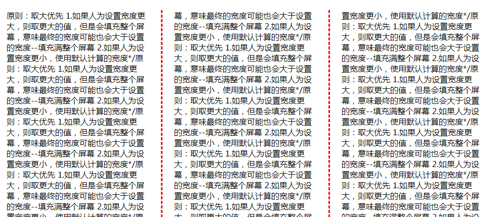
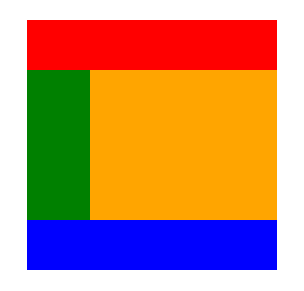

>大家好，这里是「 从零开始学 Web 系列教程 」，并在下列地址同步更新......
>
> - github：https://github.com/Daotin/Web
> - 微信公众号：[Web前端之巅](https://github.com/Daotin/pic/raw/master/wx.jpg)
> - 博客园：http://www.cnblogs.com/lvonve/
> - CSDN：https://blog.csdn.net/lvonve/
>
> 在这里我会从 Web 前端零基础开始，一步步学习 Web 相关的知识点，期间也会分享一些好玩的项目。现在就让我们一起进入 Web 前端学习的探索之旅吧！


# 一、多列布局

CSS3中新出现的多列布局 (multi-column) 是传统 HTML 网页中块状布局模式的有力扩充。

这种新语法能够让 WEB 开发人员轻松的让文本呈现多列显示。

我们知道，当一行文字太长时，读者读起来就比较费劲，有可能读错行或读串行；人们的视点从文本的一端移到另一端、然后换到下一行的行首，如果眼球移动浮动过大，他们的注意力就会减退，容易读不下去。所以，为了最大效率的使用大屏幕显示器，页面设计中需要限制文本的宽度，让文本按多列呈现，就像报纸上的新闻排版一样。

**常用属性：**

```css
column-count: 属性设置列的具体个数
column-width: 属性控制列的宽度
column-gap: 两列之间的缝隙间隔
column-rule: 规定列之间的宽度、样式和颜色
column-span: 规定元素应横跨多少列(1:跨1列  all:跨所有列)

max-height: 列高度 /*如果设定列的最大高度，这个时候，文本内容会从第一列开始填充，然后第二列...*/
```

>   如果设置列的宽度和设置列的个数时自动计算的宽度有冲突时，原则是“**取大优先**”。
>
>   比如：如果设置的列的宽度大于自动计算的列的宽度，那么实际显示的效果以设置的列的宽度为准；如果设置的列的宽度无法填充整个屏幕，那么实际的宽度可能大于设置的宽度；
>
>   如果设置的列的宽度小于自动计算的列的宽度，那么实际显示的效果以自动计算的的列的宽度为准。

**示例：**

```css
.wrapper {
    width: 100%;
    padding: 20px;
    box-sizing: border-box;
    /*设置多列布局*/
    /*1.设置列数*/
    column-count: 3;
    /*2.添加列间隙样式,与边框样式的添加一样*/
    column-rule: dashed 3px red;
    /*3。设置列间隙大小*/
    column-gap: 50px;
    /*4.设置列宽
    原则：取大优先
    1.如果人为设置宽度更大，则取更大的值，但是会填充整个屏幕，意味最终的宽度可能也会大于设置的宽度--填充满整个屏幕
    2.如果人为设置宽度更小，使用默认计算的宽度*/
    column-width: 200px;
}
h4{
    /*设置跨列显示：取值：1 / all */
    column-span: all;
}
```




# 二、伸缩布局

## 1、flex 和 justify-content（父元素使用）

布局的传统解决方案，基于盒状模型，依赖 **display属性 + position属性 + float属性** ，它对于那些特殊布局非常不方便。

CSS3在布局方面做了非常大的改进，使得我们对块级元素的布局排列变得十分灵活，适应性非常强，其强大的伸缩性，在响应式开发中可以发挥极大的作用。

**重要属性：**


```css
display: flex;
/*justify-content：设置或检索弹性盒子元素在主轴（横轴）方向上的对齐方式 。*/
justify-content：flex-start | flex-end | center | space-between | space-around
```

>`display: flex; ` ：如果一个容器设置了这个属性，那么这个盒子里面的所有直接子元素都会自动的变成伸缩项。
>
>`justify-content`：设置或检索弹性盒子元素在主轴（横轴）方向上的对齐方式 。
>
>- `flex-start`：让子元素向父元素的起始位置对齐，父元素右边可能会有空余。
>- `flex-end`：让子元素向父元素结束位置对齐，父元素左边可能会有空余。
>- `center`：让子元素向父元素中间位置对齐，父元素两边可能会有空余。
>- `space-between`：最左边与最右边子元素和父元素的左右边对齐，中间子元素平均分布，产生相同的间距。
>- `space-around`：将父盒子多余的空间平均分布在子元素的两边。这时子元素与子元素之间的间距是最左边和最右边子元素与父元素间距的2倍。


**注意：**

*当所有子元素的宽度之和大于父盒子的宽度时，所有子元素的宽度会平均收缩，变窄，以适应父盒子的宽度。*

*但是这样就不是我想要的了，我想要其换行怎么办？*


## 2、flex-flow（父元素使用）

`flex-flow` 属性：flex-flow 是 `flex-direction` 属性和 `flex-wrap` 属性的简写形式，默认值为`row nowrap`。

它用来**设置弹性盒模型对象的子元素排列方式**。它的两种取值：

### 2.1、flex-wrap

```css
flex-wrap: 控制子元素是否换行显示，默认不换行
```

`nowrap`:不换行--则收缩
`wrap`:换行
`wrap-reverse`:翻转，原来是从上到下，翻转后就是从下到上来排列 


### 2.2、flex-direction

```css
flex-direction：定义弹性盒子元素的排列方向。就是设置主轴方向，默认主轴方向是row(水平方向)
```

`row`: 水平排列方向，从左到右
`row-reverse`:水平排列方向，从右到左
`column`:垂直排列方向，从上到下
`column-reverse`：垂直排列方向，从下到上


最后，这两个属性可以连写：

```css
flex-flow: wrap row; /* 设置子元素水平方向排列，换行显示*/
```

>   注意：以上属性均设置的是父元素的属性。


## 3、flex属性（子元素使用）

### 3.1、flex-grow

`flow-grow`：可以来扩展子元素的宽度：**设置当前元素应该占据剩余空间的比例值**，这个比例值是和其他兄弟子元素占据的剩余空间平分的。

**flex-grow 默认值为0。**

**比例值的计算：当前子元素的 flex-grow 的值 / 所有兄弟元素的 flex-grow 值的和。**

示例：

```css
.first{
    flex-grow: 1; /*first子元素宽度拉伸，拉伸的宽度占据父元素剩余空间的三分之一*/
}
.second{
  	flex-grow: 0;/*second子元素宽度不拉伸*/
}
.third{
  	flex-grow: 2;/*third子元素宽度拉伸，拉伸的宽度占据父元素剩余空间的三分之二*/
}
```


### 3.2、flex-shrink

同 flex-grow 相反，flex-grow 设置的是父盒子剩余空间的比例分配，而 flex-shrink 设置的是，如果父盒子宽度不够时，子元素的收缩比例。

**flex-shrink 默认值为1。**

如果将 flex-shrink 的值设置为 0 的话，父盒子宽度不够时，子元素不收缩，会溢出。


### 3.3、flex

flex属性：flex属性是flex-grow, 或者 flex-shrink 和 flex-basis的简写，

**flex 默认值为0 。**

```css
flex: [number]：这个语法指定了一个数字，代表了这个伸缩项目该占用的剩余空间比例。
flex: auto：属性值被设为auto的伸缩项目，会根据主轴自动伸缩以占用所有剩余空间
```


### 3.4、flex 应用案例

需求：不管有多少个 li 标签，总是能平分父盒子（因为从服务器获取的 li 标签的个数可能不是固定的）。

```html
<!DOCTYPE html>
<html lang="en">
<head>
    <meta charset="UTF-8">
    <title>Document</title>
    <style>
        * {
            padding: 0;
            margin: 0;
        }
        div {
            width: 500px;
            height: 100px;
            margin: 100px auto;
            border: 1px solid red;
        }
        div > ul {
            width: 100%;
            height: 36px;;
            list-style: none;
            /*设置父盒子为伸缩盒子*/
            display: flex;
        }
        ul > li {
            /* 宽度不知道设置多少 */
          	/* width: ??? */
            background-color: pink;
            border-right: 1px solid #ccc;
            line-height: 36px;
            text-align: center;
            /* 所有li平分父盒子宽度 */
            flex: 1; 
        }
    </style>
</head>
<body>
    <div>
        <ul>
            <li>首页</li>
            <li>C++</li>
            <li>Web</li>
            <li>嵌入式</li>
            <li>Python</li>
        </ul>
    </div>
</body>
</html>
```


## 4、align-items（父元素使用）

我们之前学的`justify-content` 设置的是主轴方向上的对齐方式，而 align-items 设置的是侧轴方向的对齐方式。

语法：

```css
align-items: center; // 设置子元素(伸缩项)在侧轴方向上的对齐方式
```

`center`:设置在侧轴方向上居中对齐
`flex-start`:设置在侧轴方向上顶对齐
`flex`:设置在侧轴方向上底对齐
`stretch`:（默认值）拉伸：让子元素在侧轴方向上进行拉伸，填充满整个侧轴方向。（在子元素未设置高度时有效）
`baseline`:以子元素中文本基线对齐来来对齐*/


**问题：**

*align-items 既然写在父元素中，是对所有子元素在侧轴方向的对齐方式进行设置。那么，能不能单独设置某个子元素在侧轴的对齐方式呢？*


## 5、align-self （子元素使用）

单独设置某个子元素在侧轴的对齐方式，属性值和 align-items  相同。

```css
align-self: flex-start;
```


## 6、案例：宽高自适应盒子

需求：改变最外边父盒子的大小，里面所有子盒子宽高自适应。

```html
<!DOCTYPE html>
<html lang="en">

<head>
  <meta charset="UTF-8">
  <title>Document</title>
  <style>
    * {
      margin: 0;
      padding: 0;
    }

    div {
      width: 500px;
      height: 500px;
      margin: 50px auto;
      background-color: pink;
      /* 设置父盒子为伸缩盒子 */
      display: flex;
      /* 设置主轴方法为纵向 */
      flex-direction: column;
    }

    header {
      width: 100%;
      height: 100px;
      background-color: red;
    }

    main {
      width: 100%;
      background-color: yellow;
      flex: 1;
      /* 设置为弹性盒子 */
      display: flex;
      /* 不需要设置主轴方法，默认横向 */
      /* flex-direction: row; */
    }

    article {
      height: 100%;
      background-color: green;
      flex: 1;
    }

    aside {
      height: 100%;
      background-color: orange;
      flex: 3;
    }

    footer {
      width: 100%;
      height: 100px;
      background-color: blue;
    }
  </style>
</head>

<body>
  <div>
    <header></header>
    <main>
      <article></article>
      <aside></aside>
    </main>
    <footer></footer>
  </div>
</body>

</html>
```




