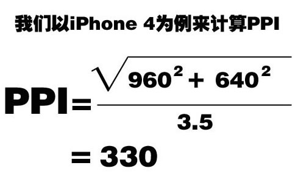
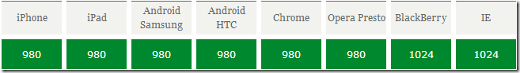

>大家好，这里是「 从零开始学 Web 系列教程 」，并在下列地址同步更新......
>
> - github：https://github.com/Daotin/Web
> - 微信公众号：[Web前端之巅](https://github.com/Daotin/pic/raw/master/wx.jpg)
> - 博客园：http://www.cnblogs.com/lvonve/
> - CSDN：https://blog.csdn.net/lvonve/
>
> 在这里我会从 Web 前端零基础开始，一步步学习 Web 相关的知识点，期间也会分享一些好玩的项目。现在就让我们一起进入 Web 前端学习的探索之旅吧！


# 一、基础知识

## 1、屏幕

移动设备与PC设备最大的差异在于屏幕，这主要体现在**屏幕尺寸**和**屏幕分辨率**两个方面。

通常我们所指的屏幕尺寸，实际上指的是屏幕对角线的长度（一般用英寸来度量）。

而分辨率则一般用像素来度量 `px`，表示屏幕水平和垂直方向的像素数，例如 1920*1080 指的是屏幕垂直方向和水平方向分别有1920和1080个像素点而构成。


## 2、长度单位

在Web开发中可以使用`px`（像素）、`em`、`pt`（点）、`in`（英寸）、`cm`（厘米）做为长度单位，我们最常用`px`（像素）做为长度单位。

我们可以将上述的几种长度单位划分成相对长度单位和绝对长度单位。

例如：iPhone3G/S和iPhone4/S的屏幕尺寸都为 3.5 英寸（in）但是屏幕分辨率却分别为 480x320px、960x480px，由此我们可以得出英寸是一个绝对长度单位，而像素是一个相对长度单位（像素并没有固定的长度）。


## 3、像素密度

DPI（Dots Per Inch）是印刷行业中用来表示打印机每英寸可以喷的墨汁点数，计算机显示设备从打印机中借鉴了DPI的概念，由于计算机显示设备中的最小单位不是墨汁点而是像素，所以用PPI（Pixels Per Inch）值来表示屏幕每英寸的像素数量，我们将PPI、DPI都称为像素密度，但PPI应用更广泛，DPI在Android设备比较常见。

利用屏幕分辨率计算 PPI :




## 4、设备独立像素

随着技术发展，设备不断更新，出现了不同PPI的屏幕共存的状态（如iPhone3G/S为163PPI，iPhone4/S为326PPI），像素不再是统一的度量单位，这会造成同样尺寸的图像在不同PPI设备上的显示大小不一样。

如下图，假设你设计了一个163x163的蓝色方块，在PPI为163的屏幕上，那这个方块看起来正好就是1x1寸大小，在PPI为326的屏幕上，这个方块看起来就只有0.5x0.5寸大小了。

但是做为用户是不会关心这些细节的，他们只是希望在不同PPI的设备上看到的图像内容差不多大小，所以这时我们需要一个新的单位，这个新的单位能够保证图像内容在不同的PPI设备看上去大小应该差不多，这就是独立像素，在IOS设备上叫PT(Point)，Android设备上叫DIP(Device independent Pixel)或DP。

举例说明就是iPhone 3G（PPI为163）1pt = 1px，iPhone 4（PPI为326）1pt = 2px。

通过上面例子我们不难发现 pt 同px是有一个对应（比例）关系的，这个对应（比例）关系是操作系统确定并处理，目的是确保不同PPI屏幕所能显示的图像大小是一致的，通过 `window.devicePixelRatio` 可以获得该比例值。

所以，我们如何处理在不同 pt/px 比例上使得显示相同大小的图片呢？

很简单，在美工设计图片的时候，多设计几种尺寸的图片。


## 5、像素

### 5.1、物理像素

物理像素指的是屏幕渲染图像的最小单位，属于屏幕的物理属性，不可人为进行改变，其值大小决定了屏幕渲染图像的品质，我们以上所讨论的都指的是物理像素。

获取屏幕的物理像素尺寸：

`window.screen.width;`

`window.screen.height;`


### 5.2、CSS像素

CSS像素，与设备无关像素，指的是通过CSS进行网页布局时用到的单位，其默认值(PC端)是和物理像素保持一致的（1个单位的CSS像素等于1个单位的物理像素），但是我们可通缩放来改变CSS像素的大小。

 我们需要理解的是物理像素和CSS像素的一个关系，1个物理像素并不总是等于一个CSS像素，通过缩放，一个CSS像素可能大于1个物理像素，也可能小于1个物理像素。


# 二、调试

## 1、模拟调试

现代主流浏览器均支持移动开发模拟调试，通常按F12可以调起，其使用也比较简单，可以帮我们方便快捷定位问题。


## 2、真机调试

模拟调试可以满足大部分的开发调试任务，但是由于移动设备种类繁多，环境也十分复杂，模拟调试容易出现差错，所以真机调试变的非常必要。

有两种方法可以实现真机调试：

1、将做好的网页上传至服务器或者本地搭建服务器，然后移动设备通过网络来访问。（重点）

2、借助第三方的调试工具，如weinre、debuggap、ghostlab(推荐) 等。

真机调试必须保证移动设备同服务器间的网络是相通的。


# 三、视口

视口（viewport）是用来约束网站中最顶级块元素\<html>的，即它决定了\<html>的大小。


## 1、PC 设备

在PC设备上viewport的大小取决于浏览器窗口的大小，以CSS像素做为度量单位。

通过以往CSS的知识，我们都能理解\<html>的大小是会影响到我们的网页布局的，而viewport又决定了\<html>的大小，所以viewport间接的决定并影响了我们网页的布局。

```css
/* 获取viewport的大小 */
document.documentElement.clientWidth;
document.documentElement.clientHeight;
```


在PC端，我们通过调整浏览器窗口可以改变 viewport 的大小，为了保证网页布局不发生错乱，需要给元素设定较大固定宽度。


## 2、移动设备

移动设备屏幕普遍都是比较小的，但是大部分的网站又都是为PC设备来设计的，要想让移动设备也可以正常显示网页，移动设备不得不做一些处理，通过上面的例子我们可以知道只要viewport足够大，就能保证原本为PC设备设计的网页也能在移动设备上正常显示，移动设备厂商也的确是这样来处理的。

在移动设备上viewport不再受限于浏览器的窗口，而是允许开发人员自由设置viewport的大小，通常浏览 器会设置一个默认大小的 viewport，为了能够正常显示那些专为PC设计的网页，一般这个值的大小会大于屏幕的尺寸。

如下图为常见默认viewport大小（仅供参考）：





从图中统计我们得知不同的移动厂商分别设置了一个默认的viewport的值，这个值保证大部分网页可以正常在移动设备下浏览。

但是由于我们手机的屏幕很小，而 viewport 的值却很大，所以页面所有的内容就会缩小以适应屏幕，所以用手机看起来，这些字体和图片就会特别小，这就像手机设置里面有个电脑版显示一样。

要解释上面的原因，需要进一步对移动设备的 viewport 进行分析，移动设备上有2个viewport（为了方便讲解人为定义的），分别是 `layout viewport` 和` ideal viewport`。


1、`layout viewport`（布局视口）指的是我们可以进行网页布局区域的大小，同样是以CSS像素做为计量单位，可以通过下面方式获取

```css
/* 获取layout viewport */
document.documentElement.clientWidth;
document.documentElement.clientHeight;
```

通过前面介绍我们知道，如果要保证为PC设计的网页在移动设备上布局不发生错乱，移动设备会默认设置一个较大的viewport（如IOS为980px），这个viewport实际指的是layout viewport。


2、`ideal viewport`（理想视口）设备屏幕区域，（以设备独立像素PT、DP做为单位）以CSS像素做为计量单位，其大小是不可能被改变，通过下面方式可以获取。

```css
/* 获取ideal viewport有两种情形 */
/* 新设备 */
window.screen.width;
window.screen.height;

/* 老设备 */
window.screen.width / window.devicePixelRatio;
window.screen.height / window.devicePixelRatio;

```


理解两个viewport后我们来解释**为什么网页会被缩放或出现水平滚动条**：

其原因在于移动设备浏览器会默认设置一个layout viewport，并且这个值会大于ideal viewport，那么我们也知道ideal viewport就是屏幕区域，layout viewport是我们布局网页的区域，那么最终layout viewport是要显示在ideal viewport里的，而layout viewport大于ideal viewport时，于是就出现滚动条了，那么为什么有的移动设备网页内容被缩放了呢？移动设备厂商认为将网页完整显示给用户才最合理，而不该出现滚动条，所以就将layout viewport进行了缩放，使其恰好完整显示在ideal viewport（屏幕）里，其缩放比例为ideal viewport / layout viewport。


## 3、移动浏览器

移动端开发主要是针对IOS和Android两个操作系统平台的，除此之外还有Windows Phone。

移动端主要可以分成三大类，系统自带浏览器、应用内置浏览器、第三方浏览器。

### 3.1、系统浏览器

指跟随移动设备操作系统一起安装的浏览器，一般不能卸载。比如 iPhone 的 safari 浏览器。

### 3.2、应用内置浏览器

通常在移动设备上都会安装一些APP例如 QQ、微信、微博、淘宝等，这些APP里往往会内置一个浏览器，我们称这个浏览器为应用内置浏览器（也叫WebView），这个内置的浏览器一般功能比较简单，并且客户端开发人员可以更改这个浏览器的某些设置。

### 3.3、第三方浏览器

指安装在手机的浏览器如FireFox、Chrome、360等等。

在IOS 和 Android 操作系统上自带浏览器、应用内置浏览器都是基于Webkit内核的。


# 四、屏幕适配

经过分析我们得到，移动页面最理想的状态是，避免滚动条且不被默认缩放处理，我们可以通过设置 `<meta name="viewport" content="">`来进行控制，并改变浏览器默认的layout viewport的宽度。

## 1、viewport 详解

viewport 是由苹果公司为了解决移动设备浏览器渲染页面而提出的解决方案，后来被其它移动设备厂商采纳，其使用参数如下：

通过设置属性 `content=""` 实现，中间以逗号分隔。

示例：

```html
<meta name="viewport" content="width=device-width, initital-scale=1.0, user-scalable=no">
```

>   `width` ：设置 layout viewport 宽度，其取值可为数值或者device-width。
>
>   `height`：设置layout viewport 高度，其取值可为数值或者device-height
>
>   `initital-scale`：设置页面的初始缩放值，为一个数字，可以带小数。
>
>   `maximum-scale`：允许用户的最大缩放值，为一个数字，可以带小数。
>
>   `minimum-scale`：允许用户的最小缩放值，为一个数字，可以带小数。
>
>   `user-scalable`：是否允许用户进行缩放，值为"no"（不能缩放）或"yes"（可以缩放）。

注：device-width 和 device-height 就是 ideal viewport 的宽和高。


## 2、控制缩放

设置 `<meta name="viewport" content="initial-scale=1">`，这时我们发现网页没有被浏览器设置缩放。

设置 `<meta name="viewport" content="width=device-width">`，这时我们发现网页也没有被浏览器设设置缩放。

当我们设置 `width=device-width`，也达到了 `initial-scale=1` 的效果，得知其实 `initial-scale = ideal viewport / layout viewport`。

两种方式都可以控制缩放，开发中一般同时设置 width=device-width 和 initial-scale=1.0（为了解决一些兼容问题）参见 [移动前端开发之viewport深入理解](http://www.cnblogs.com/2050/p/3877280.html) (http://www.cnblogs.com/2050/p/3877280.html)，即：

```html
<meta name="viewport" content="width=device-width, initial-scale=1.0">
```


​	

## 3、适配方案

**关于 em 和 rem** 

**em 是相对长度单位（参照父元素）**，其参照当前元素字号大小，如果当前元素未设置字号则会继承其祖先元素字号大小。

例如：` .box {font-size: 16px;}` 则 1em = 16px 

`.box {font-size: 32px;} `则 1em = 32px，0.5em = 16px

**rem 相对长度单位（参照 html 元素）**，其参照根元素(html)字号大小。

例如 ：`html {font-size: 16px;}` 则 1rem = 16px 

`html {font-size: 32px;}` 则 1rem = 32px，0.5rem = 16px.


