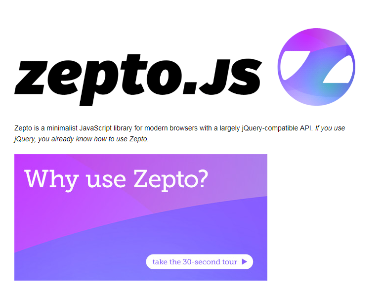

>大家好，这里是「 从零开始学 Web 系列教程 」，并在下列地址同步更新......
>
> - github：https://github.com/Daotin/Web
> - 微信公众号：[Web前端之巅](https://github.com/Daotin/pic/raw/master/wx.jpg)
> - 博客园：http://www.cnblogs.com/lvonve/
> - CSDN：https://blog.csdn.net/lvonve/
>
> 在这里我会从 Web 前端零基础开始，一步步学习 Web 相关的知识点，期间也会分享一些好玩的项目。现在就让我们一起进入 Web 前端学习的探索之旅吧！


## 一、Zepto简介 



Zepto是一个轻量级的针对现代高级浏览器的 **JavaScript库**， 它**与jquery有着类似的api。**

Zepto 主要使用在移动端浏览器上面，由于移动端的浏览器都是比较新的平台，而 jQuery 主要是在 PC 上为了浏览器的兼容性而使用的，所以**在移动端一般不使用 jQuery，因为它的兼容性失去了意义。**

**Zepto 就是移动端代替 jQuery 的 js 库，它封装了很多关于手势操作的方法。如果你会用jquery，那么你也会用zepto。**


Zepto js 库文件的下载地址：https://github.com/madrobby/zepto，直接下载源码文件，相应的所有 js 文件就在 src 目录下。


## 二、手势事件封装

Zepto 将移动端的 `touchStart`，`touchmove` 和 `touchEnd` 封装成了一系列事件。

`tap` ：触摸屏幕时触发。

`singleTap` ：单击屏幕时触发

`doubleTap`：双击屏幕时触发。(如果你不需要检测单击、双击，使用 tap 代替)。

`longTap` ：长按时触发。当一个元素被按住超过750ms触发。

`swipe`：滑动屏幕时触发。

`swipeLeft, swipeRight, swipeUp, swipeDown`：屏幕左滑，右滑，上滑，下滑时触发。


## 三、Zepto 模块化

Zepto 有一点和 jQuery 是不同的，就是 Zepto 是分模块的。在使用的时候不是像 jQuery 只需要引入一个 js 文件就可以了。Zepto 是分模块的。

默认的 **Zepto.js** 文件只包含下面一些功能：

| zepto | ✔    | 核心模块；包含许多方法                              |
| ----- | ---- | ---------------------------------------- |
| event | ✔    | 通过`on()`& `off()`处理事件                    |
| ajax  | ✔    | XMLHttpRequest 和 JSONP 实用功能              |
| form  | ✔    | 序列化 & 提交web表单                            |
| ie    | ✔    | 增加支持桌面的Internet Explorer 10+和Windows Phone 8。 |

如果要使用到其他的功能，就需要包含其他的 js 文件：

| detect.js     | 提供 `$.os`和 `$.browser`消息                 |
| ------------- | ---------------------------------------- |
| fx.js         | The `animate()`方法                        |
| fx_methods.js | 以动画形式的 `show`, `hide`, `toggle`, 和 `fade*()`方法. |
| assets.js     | 实验性支持从DOM中移除image元素后清理iOS的内存。            |
| data.js       | 一个全面的 `data()`方法, 能够在内存中存储任意对象。          |
| deferred.js   | 提供 `$.Deferred`promises API. 依赖"callbacks" 模块. 当包含这个模块时候, `$.ajax()` 支持promise接口链式的回调。 |
| callbacks.js  | 为"deferred"模块提供 `$.Callbacks`。           |
| selector.js   | 实验性的支持 jQuery CSS 表达式 实用功能，比如 `$('div:first')`和`el.is(':visible')`。 |
| touch.js      | 在触摸设备上触发tap– 和 swipe– 相关事件。这适用于所有的`touch`(iOS, Android)和`pointer`事件(Windows Phone)。 |
| gesture.js    | 在触摸设备上触发 pinch 手势事件。                     |
| stack.js      | 提供 `andSelf`& `end()`链式调用方法              |
| ios3.js       | String.prototype.trim 和 Array.prototype.reduce 方法 (如果他们不存在) ，以兼容 iOS 3.x. |

所以，每次在使用到某一个功能的时候，就需要到 html 文件下添加相应的 js 库文件，这样就比较繁琐，更重要的是多个 js 文件会增加访问服务器的次数，那么我们可不可以像 jQuery 一样，只包含一个 js 库文件就包括所有的功能呢？

答案是肯定的。


## 四、Zepto 的定制

**Zepto 允许将多个 js 文件打包成一个 js 文件。**

**操作步骤：**

1、安装 Nodejs 环境

2、下载 zepto.js 源码并解压好。

3、cmd 命令行进入解压缩后的目录

4、执行`npm install` 命令（这一步需要联网下载）

5、编辑 zepto.js 源码中的 make文件，添加自定义模块并保存，如下

原来的：`modules = (env['MODULES'] || 'zepto event ajax form ie').split(' ')`

增加自己需要的模块：`modules = (env['MODULES'] || 'zepto event ajax form ie fx selector touch').split(' ')`

6、然后执行命令 `npm run-script dist`（这一步会在当前目录生成一个dist文件夹）
7、查看目录 dist ，里面就有我们打包好的 zepto.js 库文件。


## 五、使用 zepto 实现京东移动首页

相关源码已放置 [Github](https://github.com/Daotin/Web/tree/master/Code/src/11/jd.zip)

以下为详细代码：

```html
<!DOCTYPE html>
<html lang="en">

<head>
    <meta charset="UTF-8">
    <meta name="viewport" content="width=device-width, initial-scale=1.0, user-scalable=no">
    <meta http-equiv="X-UA-Compatible" content="ie=edge">
    <title>Document</title>
    <link rel="stylesheet" href="./css/base.css">
    <link rel="stylesheet" href="./css/index.css">
    <!-- <script src="./js/index.js"></script> -->
    <script src="./zepto-master/src/zepto.min.js"></script>
    <script src="./zepto-master/src/fx.js"></script>
    <script src="./zepto-master/src/selector.js"></script>
    <script src="./zepto-master/src/touch.js"></script>
    <script src="./js/index-zepto.js"></script>
</head>

<body>
    <div class="jd">
        <!-- 搜索栏开始 -->
        <div class="search">
            <a href="javascript:;" class="search-logo"></a>
            <form action="" class="search-text">
                <input type="text" placeholder="请输入商品名称">
            </form>
            <a href="javascript:;" class="search-login">登录</a>
        </div>
        <!-- 搜索栏结束 -->

        <!-- 轮播图开始 -->
        <div class="slideshow">
            <ul class="slideshow-img clearfix">
                <li>
                    <a href="javascript:;">
                        
                    </a>
                </li>
                <li>
                    <a href="javascript:;">
                        
                    </a>
                </li>
                <li>
                    <a href="javascript:;">
                        
                    </a>
                </li>
                <li>
                    <a href="javascript:;">
                        
                    </a>
                </li>
                <li>
                    <a href="javascript:;">
                        
                    </a>
                </li>
                <li>
                    <a href="javascript:;">
                        
                    </a>
                </li>
                <li>
                    <a href="javascript:;">
                        
                    </a>
                </li>
                <li>
                    <a href="javascript:;">
                        
                    </a>
                </li>
            </ul>
            <ul class="slideshow-dot">
                <li class="select"></li>
                <li></li>
                <li></li>
                <li></li>
                <li></li>
                <li></li>
                <li></li>
                <li></li>
            </ul>
        </div>
        <!-- 轮播图结束 -->

        <!-- 导航栏开始 -->
        <div class="nav">
            <ul class="nav-ul clearfix">
                <li>
                    <a href="javascript:;">
                        
                    </a>
                    <p>商品分类</p>
                </li>
                <li>
                    <a href="javascript:;">
                        
                    </a>
                    <p>商品分类</p>
                </li>
                <li>
                    <a href="javascript:;">
                        
                    </a>
                    <p>商品分类</p>
                </li>
                <li>
                    <a href="javascript:;">
                        
                    </a>
                    <p>商品分类</p>
                </li>
                <li>
                    <a href="javascript:;">
                        
                    </a>
                    <p>商品分类</p>
                </li>
                <li>
                    <a href="javascript:;">
                        
                    </a>
                    <p>商品分类</p>
                </li>
                <li>
                    <a href="javascript:;">
                        
                    </a>
                    <p>商品分类</p>
                </li>
                <li>
                    <a href="javascript:;">
                        
                    </a>
                    <p>商品分类</p>
                </li>
            </ul>
        </div>
        <!-- 导航栏结束 -->

        <!-- 主体内容开始 -->
        <div class="content">
            <div class="content-box clearfix content-box-sk">
                <div class="content-title">
                    <span class="content-title-left-clock"></span>
                    <span class="content-title-left-text fl">掌上秒杀</span>
                    <div class="content-title-left-time fl">
                        <span>0</span>
                        <span>0</span>
                        <span>:</span>
                        <span>0</span>
                        <span>0</span>
                        <span>:</span>
                        <span>0</span>
                        <span>0</span>
                    </div>
                    <span class="content-title-right fr">更多秒杀...</span>
                </div>
                <lu class="content-ul clearfix">
                    <li>
                        <a href="javascript:;">
                            
                        </a>
                        <p>￥10.00</p>
                        <p class="content-ul-delete">￥20.00</p>
                    </li>
                    <li>
                        <a href="javascript:;">
                            
                        </a>
                        <p>￥10.00</p>
                        <p class="content-ul-delete">￥20.00</p>
                    </li>
                    <li>
                        <a href="javascript:;">
                            
                        </a>
                        <p>￥10.00</p>
                        <p class="content-ul-delete">￥20.00</p>
                    </li>
                </lu>
            </div>
            <div class="content-box clearfix">
                <div class="content-title">
                    <h3>京东超市</h3>
                </div>
                <lu class="content-ul">
                    <li class="fl">
                        <a href="javascript:;">
                            
                        </a>
                    </li>
                    <li class="fl bl bb">
                        <a href="javascript:;">
                            
                        </a>
                    </li>
                    <li class="fl bl">
                        <a href="javascript:;">
                            
                        </a>
                    </li>
                </lu>
            </div>
            <div class="content-box clearfix">
                <div class="content-title">
                    <h3>京东超市</h3>
                </div>
                <lu class="content-ul">
                    <li class="fr">
                        <a href="javascript:;">
                            
                        </a>
                    </li>
                    <li class="fl bl bb">
                        <a href="javascript:;">
                            
                        </a>
                    </li>
                    <li class="fl bl">
                        <a href="javascript:;">
                            
                        </a>
                    </li>
                </lu>
            </div>
        </div>
        <!-- 主体内容结束 -->
    </div>
</body>

</html>
```


js 文件：

```js
$(function () {  
    // 1.在开始和最后位置添加图片
    // 2.重新设置图片盒子的宽度和图片的宽度
    // 3.添加定时器，自动轮播
    // 4.添加过渡结束事件
    // 5.设置小白点
    // 6.添加手动轮播

    // 获取元素
    var ulObj = $(".slideshow-img");
    var first = ulObj.find("li:first-of-type");
    var last = ulObj.find("li:last-of-type");

    var bannerWidth = $(".slideshow").width();

    // 在开始和最后位置添加图片
    ulObj.append(first.clone());
    last.clone().insertBefore(first);

    // 重新设置图片盒子的宽度和图片的宽度
    var liObjs = ulObj.find("li");

    ulObj.width(liObjs.length +"00%");
    liObjs.each(function (index) {  
        // 数组是DOM操作，要转换成zepto元素
        $(liObjs[index]).width(bannerWidth);
    });    

    // 设置默认显示第一张图
    ulObj.css("transform", "translateX("+ -bannerWidth +"px)");

    var index = 1;

    // 盒子改变大小的时候重现设置图片盒子的宽度和图片的宽度
    $(window).on("resize", function () {  
        ulObj.width(liObjs.length +"00%");
        liObjs.each(function (index) {  
            // 数组是DOM操作，要转换成zepto元素
            $(liObjs[index]).width($(".slideshow").width());            
        });
        ulObj.css("transform", "translateX("+ -$(".slideshow").width()*index +"px)");
    });

    // 轮播动画函数
    var setAnimate = function () {  
        ulObj.animate(
            {"transform": "translateX("+ -$(".slideshow").width()*index +"px)"},
            500,
            "linear",
            function () {  // 过渡结束事件回调函数
                if(index == 0) {
                    index = liObjs.length -2;
                    ulObj.css("transform", "translateX("+ -$(".slideshow").width()*index +"px)");
                } else if(index == liObjs.length -1) {
                    index = 1;
                    ulObj.css("transform", "translateX("+ -$(".slideshow").width()*index +"px)");
                }
                // 设置小白点
                $(".slideshow-dot").children("li").removeClass("select").eq(index-1).addClass("select");          
    
            }
        );
    };

    var timerId;
    // 添加定时器，自动轮播
    var timerStart = function () {  
        timerId = setInterval(function () {  
            index++;
            setAnimate();
        }, 1500);
    };
    timerStart();

    // 手动轮播操作
    ulObj.on("swipeLeft", function () {
        clearInterval(timerId);
        index++;
        setAnimate();
        //手动轮播操作完成后再开启定时器
        timerStart();
    });
    ulObj.on("swipeRight", function () {
        clearInterval(timerId);
        index--;
        setAnimate();
        // 手动轮播操作完成后再开启定时器
        timerStart();
    });

    //------------------------------------------------

    // 搜索栏上下滚动时改变透明度
    var bannerEffect = function () {  
        var bannerObj = $(".search");
        var slideshowObj = $(".slideshow");
        var bannerHeight = bannerObj.height();
        var imgHeight = slideshowObj.height();
        // console.log(bannerHeight + '  ' + imgHeight);

        $(window).on("scroll", function (e) {  
            var scrollHeight = $(window).scrollTop();            
            if(scrollHeight < (imgHeight-bannerHeight)) {
                var setopacity = scrollHeight / (imgHeight-bannerHeight);
                bannerObj.css("backgroundColor", "rgba(233, 35, 34,"+setopacity+")");
            }
            
        });
        
    };
    bannerEffect();

    //-----------------------------------------------------

    // 设置倒计时
    var timerCount = function () {  
        var timers = $(".content-title-left-time").children("span");
        var titleCount = 2*60*60;

        var timerId = setInterval(function () {  
            titleCount--;
            var hour = Math.floor(titleCount / 3600);
            var minute = Math.floor((titleCount % 3600) / 60);
            var second = titleCount % 60;

            if(titleCount >= 0) {
                $(timers[0]).html(Math.floor(hour / 10));
                $(timers[1]).html(hour % 10);
                $(timers[3]).html(Math.floor(minute / 10));
                $(timers[4]).html(minute % 10);
                $(timers[6]).html(Math.floor(second / 10));
                $(timers[7]).html(second % 10);
            } else {
                titleCount = 0;
                clearInterval(timerId);
                return;
            }

        }, 1000);
    };
    timerCount();

});
```


