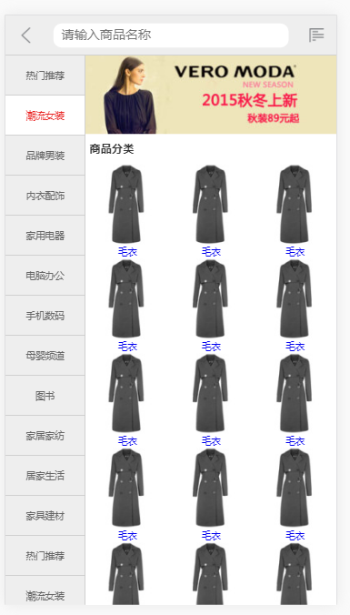
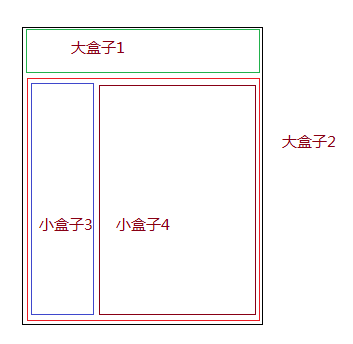
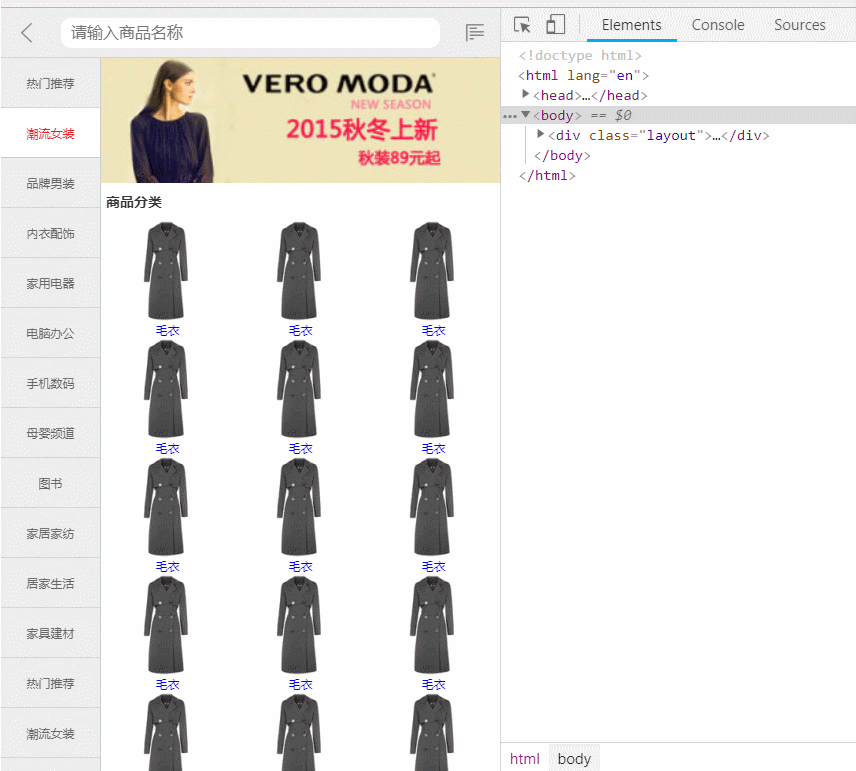

>大家好，这里是「 从零开始学 Web 系列教程 」，并在下列地址同步更新......
>
> - github：https://github.com/Daotin/Web
> - 微信公众号：[Web前端之巅](https://github.com/Daotin/pic/raw/master/wx.jpg)
> - 博客园：http://www.cnblogs.com/lvonve/
> - CSDN：https://blog.csdn.net/lvonve/
>
> 在这里我会从 Web 前端零基础开始，一步步学习 Web 相关的知识点，期间也会分享一些好玩的项目。现在就让我们一起进入 Web 前端学习的探索之旅吧！


## 实现JD分类页面

我们先看看要实现的效果图：




### 1、项目需求：

- 全屏页面
- 右侧的页面随着页面宽度的变化而变化，左侧栏宽度固定不变。
- 左侧栏可以上下滑动，如果滑动超出上下范围自动反弹回去
- 点击左侧栏每个项目，自动滚动左侧栏使得项目置顶
- 当点击项目可能使得超出滑动范围的时候，以滑动范围为准，当前点击的项目不必置顶。


### 2、项目分析

**如何实现一个全屏页面，没有滚动条？**

如下面的结构：大盒子1和大盒子2分为上下结构，小盒子3和小盒子4在大盒子2的内部，分为左右结构。



那么如何排布，使得上下左右都没有滚动条呢？

**思路：**

1、要使得大盒子1和大盒子2上下没有滚动条，可以使得大盒子1 的宽度为 100%，高度加入100px，大盒子2的高度 100%；这时会超出100px的高度，如果这时我们让大盒子1定位（position:absolute;），，确实可以实现上下没有滚动条，但是大盒子的头部100px 的位置会被覆盖，所以再让大盒子2  padding-top: 100px; 就可以了。

2、要使得小盒子3和小盒子4左右没有滚动条，可不可以参考大盒子1和大盒子2的策略呢？让小盒子3 宽度100px，高度100%，小盒子4宽度100%，高度100%，然后小盒子3定位（position:absolute;），这是不可以的，因为小盒子3的高度是100%，参照父盒子（大盒子2）的，所以高度是整个视口的高度，而大盒子1占了位置，所以小盒子3只能往下挪，在底部冲出100px的大小，无法弥补。

那么怎么办呢？

**第一，可以将小盒子3定位（position:absolute;）改为浮动（float:left）；**

**第二，可以取消大盒子2的宽度100%，改为 margin-left:100px；小盒子3依然浮动（float:left），也是可以的。**


### 3、示例代码：

相关源码以放置 Github：https://github.com/Daotin/Web/tree/master/Code/src/11/jd.zip

```html
<!DOCTYPE html>
<html lang="en">
<head>
    <meta charset="UTF-8">
    <meta name="viewport" content="width=device-width, initial-scale=1.0, maximum-scale=1.0, minimum-scale=1.0">
    <meta http-equiv="X-UA-Compatible" content="ie=edge">
    <link rel="stylesheet" href="./css/base.css">
    <link rel="stylesheet" href="./css/category.css">
    <script src="./js/category.js"></script>
    <script src="./js/tap.js"></script>
    <title>Document</title>
</head>
<body>
    <div class="layout">
        <!-- 头部header -->
        <div class="header">
            <div class="header-back"></div>
            <form action="" class="header-text">
                <input type="text" placeholder="请输入商品名称">
            </form>
            <div class="header-menu"></div>
        </div>
        <!-- 主体main -->
        <div class="main">
            <div class="main-left">
                <span>拉这么多想干嘛？</span>
                <ul>
                    <li class=""><a href="javascript:;">热门推荐</a></li>
                    <li class="active"><a href="javascript:;">潮流女装</a></li>
                    <li class=""><a href="javascript:;">品牌男装</a></li>
                    <li class=""><a href="javascript:;">内衣配饰</a></li>
                    <li class=""><a href="javascript:;">家用电器</a></li>
                    <li class=""><a href="javascript:;">电脑办公</a></li>
                    <li class=""><a href="javascript:;">手机数码</a></li>
                    <li class=""><a href="javascript:;">母婴频道</a></li>
                    <li class=""><a href="javascript:;">图书</a></li>
                    <li class=""><a href="javascript:;">家居家纺</a></li>
                    <li class=""><a href="javascript:;">居家生活</a></li>
                    <li class=""><a href="javascript:;">家具建材</a></li>
                    <li class=""><a href="javascript:;">热门推荐</a></li>
                    <li class=""><a href="javascript:;">潮流女装</a></li>
                    <li class=""><a href="javascript:;">品牌男装</a></li>
                    <li class=""><a href="javascript:;">内衣配饰</a></li>
                    <li class=""><a href="javascript:;">家用电器</a></li>
                    <li class=""><a href="javascript:;">电脑办公</a></li>
                    <li class=""><a href="javascript:;">手机数码</a></li>
                    <li class=""><a href="javascript:;">母婴频道</a></li>
                    <li class=""><a href="javascript:;">图书</a></li>
                    <li class=""><a href="javascript:;">家居家纺</a></li>
                    <li class=""><a href="javascript:;">居家生活</a></li>
                    <li class=""><a href="javascript:;">家具建材</a></li>
                </ul>
            </div>
            <div class="main-right">
                <a href="javascript:;" class="main-right-img">
                    
                </a>
                <h3>商品分类</h3>
                <div class="main-right-cate">
                    <ul>
                        <li>
                            <a href="javascript:;">
                                
                                <p>毛衣</p>
                            </a>
                        </li>
                        <li>
                            <a href="javascript:;">
                                
                                <p>毛衣</p>
                            </a>
                        </li>
                        <li>
                            <a href="javascript:;">
                                
                                <p>毛衣</p>
                            </a>
                        </li>
                        <li>
                            <a href="javascript:;">
                                
                                <p>毛衣</p>
                            </a>
                        </li>
                        <li>
                            <a href="javascript:;">
                                
                                <p>毛衣</p>
                            </a>
                        </li>
                        <li>
                            <a href="javascript:;">
                                
                                <p>毛衣</p>
                            </a>
                        </li>
                        <li>
                            <a href="javascript:;">
                                
                                <p>毛衣</p>
                            </a>
                        </li>
                        <li>
                            <a href="javascript:;">
                                
                                <p>毛衣</p>
                            </a>
                        </li>
                        <li>
                            <a href="javascript:;">
                                
                                <p>毛衣</p>
                            </a>
                        </li>
                        <li>
                            <a href="javascript:;">
                                
                                <p>毛衣</p>
                            </a>
                        </li>
                        <li>
                            <a href="javascript:;">
                                
                                <p>毛衣</p>
                            </a>
                        </li>
                        <li>
                            <a href="javascript:;">
                                
                                <p>毛衣</p>
                            </a>
                        </li>
                        <li>
                            <a href="javascript:;">
                                
                                <p>毛衣</p>
                            </a>
                        </li>
                        <li>
                            <a href="javascript:;">
                                
                                <p>毛衣</p>
                            </a>
                        </li>
                        <li>
                            <a href="javascript:;">
                                
                                <p>毛衣</p>
                            </a>
                        </li>
                        <li>
                            <a href="javascript:;">
                                
                                <p>毛衣</p>
                            </a>
                        </li>
                        <li>
                            <a href="javascript:;">
                                
                                <p>毛衣</p>
                            </a>
                        </li>
                        <li>
                            <a href="javascript:;">
                                
                                <p>毛衣</p>
                            </a>
                        </li>
                        <li>
                            <a href="javascript:;">
                                
                                <p>毛衣</p>
                            </a>
                        </li>
                        <li>
                            <a href="javascript:;">
                                
                                <p>毛衣</p>
                            </a>
                        </li>
                        <li>
                            <a href="javascript:;">
                                
                                <p>毛衣</p>
                            </a>
                        </li>
                    </ul>
                </div>
            </div>
        </div>
    </div>
</body>
</html>
```


CSS 代码：

```css
html, body {
    width: 100%;
    height: 100%;
}

.layout {
    width: 100%;
    height: 100%;
}

/* 头部header */
.header {
    width: 100%;
    height: 50px;
    background-color: #eee;
    border-bottom: 1px solid #ccc;
    position: absolute;
}
.header-back,
.header-menu {
    width: 50px;
    height: 50px;
    background: url("../images/jd-sprites.png");
    background-size: 200px 200px;
    position: absolute;
    top: 0;
    padding: 15px;
    background-origin: content-box;
    background-clip: content-box;
}
.header-back {
    background-position: -20px 0;
    left: 0;
}
.header-menu {
    background-position: -60px 0;
    right: 0;
}
.header-text {
    padding: 0 60px;
}
.header-text > input {
    width: 100%;
    height: 30px;
    margin-top: 10px;
    border-radius: 10px;
    padding-left: 10px;
    font-size: 16px;
    color: #aaa;
}


/* 主体main */
.main {
    width: 100%;
    height: 100%;
    padding-top: 50px;
}
.main-left {
    width: 100px;
    height: 100%;
    float: left;
    overflow: hidden;
    position: relative;
    background: #eee;
}
.main-left > span {
    display: inline-block;
    width: 100%;
    font-size: 10px;
    color: #ccc;
    text-align: center;
    margin-top: 80px;
}
.main-left ul {
    width: 100px;
    position: absolute;
    left: 0;
    top: 0;
}
.main-left ul li {
    width: 100%;
    height: 50px;
    line-height: 50px;
    text-align: center;
    border-right: 1px solid #ccc;
    border-bottom: 1px solid #ccc;
    background-color: #eee;
}
.main-left li.active {
    background-color: #fff;
    border-bottom: 1px solid #ccc;
    border-right: 1px solid #ccc;
}
.main-left li.active a {
    color: #e92322;
}
.main-left a {
    display: block;
    width: 100%;
    height: 50px;
    color: #666;
}
.main-right {
    /* width: 100%; */
    height: 100%;
    margin-left: 100px;
    /* 设置为伸缩盒子 */
    display: flex;
    flex-direction: column;
}
.main-right-img {
    width: 100%;
}
.main-right-img > img {
    width: 100%;
    /* 消除基线 */
    display: block;
}
.main-right > h3 {
    font-size: 14px;
    font-weight: bold;
    color: #333;
    margin: 10px 0 10px 5px;
}
.main-right-cate {
    width: 100%;
    /* 下面两个一起使得没有上下滚动条 */
    flex: 1;
    overflow: hidden;
}

.main-right-cate> ul {
    width: 100%;
}
.main-right-cate > ul > li {
    width: 33.33%;
    text-align: center;
    float: left;
}
```





原生 js 代码：

```js
window.onload = function () {  
    leftSlideEffect();
};

// 左侧滑动栏效果和点击效果
function leftSlideEffect() {  
    // 添加左侧栏的滑动效果
    var mainObj = document.querySelector(".main");
    var leftUlObj = document.querySelector(".main-left").children[1];

    var mainLeftHeight = document.querySelector(".main-left").offsetHeight;
    var leftUlObjHeight = leftUlObj.offsetHeight;

    var liObjs = leftUlObj.querySelectorAll("li");


    var startY=0; // 起始位置
    var diffY=0;  // 滑动后与起始位置的偏移
    var currentY=0; // 保存每次滑动后的偏移

    var maxTop = 0; // 最大top偏移值
    var minTop = mainLeftHeight-leftUlObjHeight; // 最大top偏移值
    var maxBounceTop = maxTop + 100; //弹性最大高度
    var minBounceTop = minTop - 100; //弹性最小高度
    leftUlObj.addEventListener("touchstart", function(e) {
        // 计算起始坐标
        startY = e.targetTouches[0].clientY;
    });

    leftUlObj.addEventListener("touchmove", function(e) {
        /*计算距离的差异*/
        diffY = e.targetTouches[0].clientY - startY;
        /*判断滑动的时候是否超出当前指定的滑动区间*/
        if((diffY+currentY > maxBounceTop) || (diffY+currentY < minBounceTop)) {
            return;
        }
        /*先将之前可能添加的过渡效果清除*/
        leftUlObj.style.transition = "none";
        /*实现偏移操作:应该在之前的滑动距离的基础之上再进行滑动*/
        leftUlObj.style.top = diffY+currentY + "px";
    });

    leftUlObj.addEventListener("touchend", function() {
        
        if(diffY+currentY > maxTop) {
            // 回到maxTop位置，设置currentY当前值
            leftUlObj.style.transition = "top 0.5s"
            leftUlObj.style.top = maxTop + "px";
            currentY = maxTop;
        } else if(diffY+currentY < minTop) {
            // 回到minTop位置，设置currentY当前值
            leftUlObj.style.transition = "top 0.5s"
            leftUlObj.style.top = minTop + "px";
            currentY = minTop;
        } else {
            // 记录当前滑动的距离
            currentY += diffY;
        }
    });

   // -----------------------------------------------------
  
  	// 左侧滑动栏点击效果
    /*为每一个li元素设置添加一个索引值*/
    for(var i=0; i<liObjs.length; i++) {
        // liObjs是对象，给对象增加属性值
        liObjs[i].index = i;
    }
    // 点击事件
    fingerTap.tap(leftUlObj, function (e) {
        // 清除所有li标签
        for(var i=0; i<liObjs.length; i++) {
            liObjs[i].classList.remove("active");
        }
        //设置点击的li标签的样式
        var indexLi = e.target.parentElement;
        
        indexLi.classList.add("active");
        // 每个li标签的高度
        var indexLiHeight = indexLi.offsetHeight;

        /*2.移动当前的li元素到父容器的最顶部，但是不能超出之前设定了静止状态下的最小top值*/
        leftUlObj.style.transition = "top 0.5s";

        if(-indexLiHeight*indexLi.index < minTop) {
            leftUlObj.style.top = minTop + "px";
            // 记得重置currentY的值
            currentY=minTop;
        } else {
            leftUlObj.style.top = -indexLiHeight*indexLi.index + "px";
            // 记得重置currentY的值
            currentY=-indexLiHeight*indexLi.index;
        }
    });
}
```


把点击事件封装成一个单独 js 库，tap.js。

```js
// 封装移动端的tap事件

var fingerTap = {
    tap: function (dom, callback) {  
        // 判断dom是否存在
        if((!dom) || (typeof dom != "object")) {
            return;
        }
        var startX, startY, endX, endY, startTime, endTime;
        dom.addEventListener("touchstart", function (e) {  
            // 不止一个手指
            if(e.targetTouches.length > 1) {
                return;
            }
            startX = e.targetTouches[0].clientX;
            startY = e.targetTouches[0].clientY;
            
            // 点击时记录毫秒数
            startTime = Date.now(); 

        });

        dom.addEventListener("touchend", function (e) {
            // 不止一个手指
            if(e.changedTouches.length > 1) {
                return;
            }
            // 之所以使用changedTouches，是因为手指离开后就没有targetTouches了
            endX = e.changedTouches[0].clientX;
            endY = e.changedTouches[0].clientY;
            // 记录离开手指的毫秒数
            endTime = Date.now();
            //如果是长按操作就返回
            if(endTime - startTime > 300) {
                return;
            }
            // 判断从按下到抬起手指在一定的范围滑动也算tap事件
            if((Math.abs(endX-startX) <= 6) && (Math.abs(endY-startY) <= 6)) {
                // tap点击事件的处理函数
                callback && callback(e);
            }
        });
    }
};
```


### 4、使用 Zepto 实现点击操作

上面 tap.js 是我们自己封装的点击事件，其实在 Zepto 中，已经封装好了 tap 单击事件，我们可以直接使用。

只需要将

```js
fingerTap.tap(leftUlObj, function (e) {});
```

改为：

```js
$(leftUlObj).on("tap", function() {});
```

就可以实现相同的效果。


