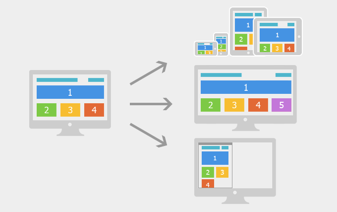
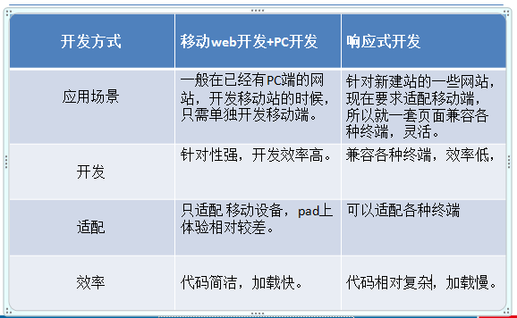

>大家好，这里是「 从零开始学 Web 系列教程 」，并在下列地址同步更新......
>
> - github：https://github.com/Daotin/Web
> - 微信公众号：[Web前端之巅](https://github.com/Daotin/pic/raw/master/wx.jpg)
> - 博客园：http://www.cnblogs.com/lvonve/
> - CSDN：https://blog.csdn.net/lvonve/
>
> 在这里我会从 Web 前端零基础开始，一步步学习 Web 相关的知识点，期间也会分享一些好玩的项目。现在就让我们一起进入 Web 前端学习的探索之旅吧！


# 网页布局

常见的网页布局方式分为以下四种：

1、**固定宽度布局**：为网页设置一个固定的宽度，通常以px做为长度单位，常见于PC端网页。

2、**流式布局**：为网页设置一个相对的宽度，通常以百分比做为长度单位。

3、**栅格化布局**：将网页宽度人为的划分成均等的长度，然后排版布局时则以这些均等的长度做为度量单位，通常利用百分比做为长度单位来划分成均等的长度。

4、**响应式布局**：通过检测设备信息，决定网页布局方式，即用户如果采用不同的设备访问同一个网页，有可能会看到不一样的内容，一般情况下是检测设备屏幕的宽度来实现。

>   注：以上几种布局方式并不是独立存在的，实际开发过程中往往是相互结合使用的。"


## 1、响应式布局

响应式布局，意在**实现不同屏幕分辨率的终端上浏览网页的不同展示方式**。

通过响应式设计能使网站在手机和平板电脑上有更好的浏览阅读体验，如下图：




如上图所示，屏幕尺寸不一样展示给用户的网页内容也不一样，我们利用 **媒体查询** 可以检测到屏幕的尺寸（主要检测宽度），并设置不同的CSS样式，就可以实现响应式的布局。




## 2、响应式布局的缺点

我们利用响应式布局可以满足不同尺寸的终端设备非常完美的展现网页内容，使得用户体验得到了很大的提升，但是为了实现这一目的我们不得不利用媒体查询**写很多冗余的代码**，使整体网页的体积变大，应用在移动设备上就会带来严重的性能问题。

响应式布局**常用于企业的官网、博客、新闻资讯类型网站**，这些网站以浏览内容为主，没有复杂的交互。


## 3、屏幕尺寸的划分

一般我们会对常见的设备尺寸进行划分后，再分别确定为不同的尺寸的设备设计专门的布局方式，如下图所示

| 类型      | 布局宽度        |
| ------- | ----------- |
| 大屏幕     | \>=  1200px |
| 默认      | \>= 980px   |
| 平板      | \>= 768px   |
| 手机到平板之间 | <= 767px    |
| 手机      | <= 480px    |


## 4、媒体查询

参考链接：http://www.runoob.com/cssref/css3-pr-mediaquery.html

使用 `@media` 查询，你可以针对不同的媒体类型定义不同的样式。

`@media` 可以针对不同的屏幕尺寸设置不同的样式，特别是如果你需要设置设计响应式的页面，@media 是非常有用的。

当你重置浏览器大小的过程中，页面也会根据浏览器的宽度和高度重新渲染页面。


**CSS 语法：**

```css
@media mediatype and|not|only (media feature) {
    /*CSS-Code*/
}

/*或者引入不同样式文件的判断：当满足某个条件的时候，引入mystylesheet.css样式*/
<link rel="stylesheet" media="mediatype and|not|only (media feature)" href="mystylesheet.css">
```

**mediatype 取值:** 

>   all				用于所有设备
>
>   print			用于打印机和打印预览
>
>   screen			用于电脑屏幕，平板电脑，智能手机等。
>
>   speech			应用于屏幕阅读器等发声设备

**and|not|only：**

>   and  同时满足，相当于 &&；
>
>   not  取反（一般写在 mediatype 前面）

**示例：**

```css
<style>
  body{
    background-color: red;
  }
  /* 不在768-992之间的时候，设置背景颜色为蓝色*/
  @media not screen and (min-width: 768px) and (max-width: 992px){
    body{
      background-color: blue;
    }
}
</style>
```

**media feature 取值**：（主要关注以下三个宽度）

>   device-height			定义输出设备的屏幕可见高度。
>
>   **device-width**			定义输出设备的屏幕可见宽度。
>
>   max-device-height		定义输出设备的屏幕可见的最大高度。
>
>   max-device-width		定义输出设备的屏幕最大可见宽度。
>
>   min-device-width		定义输出设备的屏幕最小可见宽度。
>
>   min-device-height		定义输出设备的屏幕的最小可见高度。
>
>   max-height				定义输出设备中的页面最大可见区域高度。
>
>   **max-width**				定义输出设备中的页面最大可见区域宽度。
>
>   min-height				定义输出设备中的页面最小可见区域高度。
>
>   **min-width**				定义输出设备中的页面最小可见区域宽度。


### 4.1、min-width 与 min-device-height 的区别

device 表示的是设备，所以加了 device 的 范围取值表示的是**设备的宽度范围**。

- 在移动端，由于通过模拟器改变的是移动端设备的宽度，所以 min-width 与 min-device-height 效果一样；
- 在 PC 端，如果改变浏览器的宽度，而我们电脑的宽度并没有改变，所以设备的宽度一定，最终的效果就是只有一个范围起作用。


### 4.2、案例：控制不同屏幕尺寸下屏幕背景色,

```css
<style>
    .container{
        width:1200px;
        margin: 0 auto;
        height:1200px;
        background-color: red;
    }
    /*媒体查询：注意and后面空格的添加*/
    /*iphone: w < 768px*/
    @media screen and (max-width: 768px){
        .container{
            width:100%;
            background-color: green;
        }
    }
    /*pad: w >= 768  && w< 992*/
    @media screen and (max-width: 992px) and (min-width: 768px) {
        .container{
            width:750px;
            background-color: blue;
        }
    }
    /*中等屏幕   w >= 992  && w<1200*/
    @media screen and (max-width: 1200px) and (min-width: 992px) {
        .container{
            width:970px;
            background-color: pink;
        }
    }
</style>
```


### 4.3、媒体查询条件判断的顺序

原因：如果结构如上面示例的那样，并且媒体查询条件由重叠的话，后面的媒体查询样式设置会覆盖前面的媒体查询设置，为了避免发生这种情况，我们就应该遵循一定的规律，使得不同的媒体查询条件下，执行不同的样式，而不会发生冲突。


**特点：**

>   **向上兼容：如果设置了宽度更小时的样式，默认这些样式也会传递到宽度更大的条件范围内.**
>
>   向下覆盖：宽度更大的样式会将前面宽度更小的样式覆盖

**书写建议：**

- **如果是判断最小值 (min-width)，那么范围就应该从小到大写**
- **如果是判断最大值 (max-width)，那么范围就应该从大到小写**


**例如：**

```css
@media screen and (min-width: 768px){
  body{
    background-color: green;
  }
}
!*w:992!1200 blue  min-width: 992px:当屏幕的宽度大于等于992的时候*!
@media screen and (min-width: 992px){
  body{
    background-color: blue;
  }
}
!*w>1200 pink*!
@media screen and (min-width: 1200px){
  body{
    background-color: pink;
  }
}
```


