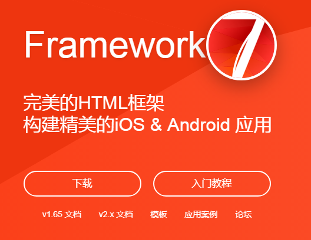

>大家好，这里是「 从零开始学 Web 系列教程 」，并在下列地址同步更新......
>
> - github：https://github.com/Daotin/Web
> - 微信公众号：[Web前端之巅](https://github.com/Daotin/pic/raw/master/wx.jpg)
> - 博客园：http://www.cnblogs.com/lvonve/
> - CSDN：https://blog.csdn.net/lvonve/
>
> 在这里我会从 Web 前端零基础开始，一步步学习 Web 相关的知识点，期间也会分享一些好玩的项目。现在就让我们一起进入 Web 前端学习的探索之旅吧！


## 一、常见的响应式框架

随着Web应用变的越来越复杂，在大量的开发过程中我们发现有许多功能模块非常相似，比如轮播图、分页、选项卡、导航栏等，开发中往往会把这些具有通用性的功能模块进行一系列封装，使之成为一个个组件应用到项目中，可以极大的节约开发成本，将这些通用的组件缩合到一起就形成了前端框架。


**常见的响应式框架有：**

**1、Bootstrap**

官网：http://www.bootcss.com/


简洁、直观、强悍的前端开发框架，让web开发更迅速、简单。

来自 Twitter，粉丝众多，是目前最受欢迎的前端框架。


**2、Amaze UI**

官网：http://amazeui.org/


中国首个开源 HTML5 跨屏前端框架。

Amaze ~ 妹子UI，国人开发，后起之秀！


**3、Framework7**

官网：http://www.framework7.cn/



Framework7 是一款免费、开源的移动HTML框架，主要用于开发混合手机App或者网页App，某些应用场景的体验几乎与原生开发的 iOS 和 Android 应用一模一样，同时也是一款不可获取的应用原型快速开发及展示工具。

Framework7 主要的作用就是让你有机会能够使用 HTML，CSS 和 JavaScript 简单明了地开发 iOS 和 Android 应用。Framework7 是完全开放的，它完全没有限制你进行打开脑洞的创造，同时还提供了一些解决方案。

Framework7 并不支持所有平台。为了给你带来最好的体验感受，它只专注于 iOS 和 Google Material 设计风格。


## 二、bootstrap

Bootstrap是当前最流行的前端UI框架(有预制界面组件)

Bootstrap 是最受欢迎的 HTML、CSS 和 JS 框架，用于开发响应式布局、移动设备优先的 WEB 项目。

Bootstrap是基于HTML5和CSS3开发的，它在jQuery的基础上进行了更为个性化和人性化的完善，形成一套自己独有的网站风格，并兼容大部分jQuery插件。

>   Bootstrap 的所有 JavaScript 插件都依赖 jQuery。


### 1、BootStrap的版本了解

-   2.x.x:兼容性好  / 代码不够简洁，功能不够完善
-   3.x.x:稳定性好,放弃了IE6-IE7,对IE8的支持一般 /偏向于响应式布局开发，移动设备优先的web项目开发
-   4.x.x:测试阶段，偏向于响应式，移动设备


### 2、bootstrap 基本模板

```html
<!--说明页面是html5页面-->
<!DOCTYPE html>
<!--页面使用的语言环境-->
<html lang="zh-CN">
<head>
    <!--指定当前页面的字符编码-->
    <meta charset="utf-8">
    <!--如果是IE，会使用最新的渲染引擎进行渲染-->
    <meta http-equiv="X-UA-Compatible" content="IE=edge">
    <!--标准的视口设置-->
    <meta name="viewport" content="width=device-width, initial-scale=1,user-scalable=0">
    <!-- 上述3个meta标签*必须*放在最前面，任何其他内容都*必须*跟随其后！ -->
    <title>Bootstrap 101 Template</title>
    <!-- Bootstrap核心样式文件 -->
    <link href="../lib/bootstrap/css/bootstrap.min.css" rel="stylesheet">
    <!-- HTML5 shim and Respond.js for IE8 support of HTML5 elements and media queries: 这两个文件的引入是为了支持IE8下面的html5元素和媒体查询：因为在IE8下面默认不支持HTML5和媒体查询，所以需要引入两个插件-->
    <!-- WARNING: Respond.js doesn't work if you view the page via file:// 如果通过file://来查看文件，那么respond.js文件不能正常工作，说明必须在http://形式下访问才有用-->
    <!--html5shiv.min.js：为了在IE8下面支持HTML标签
    respond.min.js：为了在IE8下面支持媒体查询-->
    <!--[if lt IE 9]> <!--只有IE9之前才会加载这两个文件  lt:less than-->
    <script src="../lib/html5shiv/html5shiv.min.js"></script>
    <script src="../lib/respond.js/respond.js"></script>
    <![endif]-->
</head>
<body>
<h1>你好，世界！</h1>

<!-- jQuery (necessary for Bootstrap's JavaScript plugins) bootstrap是依赖jquery的-->
<script src="../lib/jquery/jquery.js"></script>
<!-- Include all compiled plugins (below), or include individual files as needed  bootstarp核心js文件-->
<script src="../lib/bootstrap/js/bootstrap.min.js"></script>
</body>
</html>
```


### 3、bootstrap 布局容器

bootstrap 的 css 样式中，有一个起着支撑整个页面框架的容器，也叫**布局容器**，它类似于我们的版心结构。

 1、`.container` 实现固定宽度并支持响应式布局的容器。

    当屏幕宽度 > 1200，则页面宽度固定为 1170px
    当屏幕宽度 992~1200，则页面宽度固定为 970px
    当屏幕宽度 768~992，则页面宽度固定为 750px
    当屏幕宽度 < 768，则页面宽度固定为 100%.
2、`.container-fluid` ：实现宽度为全屏 100% 的容器。


### 4、bootstrap 栅格系统

概念：Bootstrap 提供了一套响应式、移动设备优先的流式栅格系统，随着屏幕或视口（viewport）尺寸的增加，系统会**默认分为12列**。

栅格系统用于通过一系列的行（row）与列（column）的组合来创建页面布局，你的内容就可以放入这些创建好的布局中。

**“行（row）”必须包含在 .container （固定宽度）或 .container-fluid （100% 宽度）中，以便为其赋予合适的排列（aligment）和内补（padding）。**

**你的内容应当放置于“列（column）”内**，并且，只有“列（column）”可以作为行（row）”的直接子元素。你可以使用类似 .row 和 .col-xs-4 这种预定义的类，可以用来快速创建栅格布局。Bootstrap 源码中定义的 mixin 也可以用来创建语义化的布局。

通过为“列（column）”设置 padding 属性，从而创建列与列之间的间隔（gutter）。通过为 .row 元素设置负值 margin 从而抵消掉为 .container 元素设置的 padding，也就间接为“行（row）”所包含的“列（column）”抵消掉了padding。

栅格系统中的列是通过指定1到12的值来表示其跨越的范围。例如，三个等宽的列可以使用三个 `.col-xs-4` 来创建。

如果一“行（row）”中包含了的“列（column）”大于 12，多余的“列（column）”所在的元素将被作为一个整体另起一行排列。


**示例：**

```html
<div class="row">
    <div class="col-xs-12 col-sm-6 col-md-4 col-lg-3"></div>
    <div class="col-xs-12 col-sm-6 col-md-4 col-lg-3"></div>
    <div class="col-xs-12 col-sm-6 col-md-4 col-lg-3"></div>
    <div class="col-xs-12 col-sm-6 col-md-4 col-lg-3"></div>
</div>
```

解释：上面四个div，如果在超小屏幕上就 100%显示（占12栅格）；在小屏幕上，每个div占50%显示；在中等屏幕上，每个div占25%显示；在大屏幕上，每个div占33.33%显示。

**栅格参数：**

>`.col-xs- `：超小屏幕 手机 (<768px)
>
>`.col-sm-` : 小屏幕 平板 (≥768px)
>
>`.col-md-` : 中等屏幕 桌面显示器 (≥992px)
>
>`.col-lg-` : 大屏幕 大桌面显示器 (≥1200px)


**注意：**

1.栅格系统是往上兼容的：意味着小屏幕上的效果在大屏幕上也是可以正常显示的人，但是大屏幕上的设置在小屏幕上却无法正常显示。

2.Row可以再次嵌套在列中。如果不能填满整列，则默认从左排列，如果超出，则换行展示。


### 5、列排序

-   `col-xs-offset-n`：往右偏移 n 个栅格，但是会影响后面所有元素也偏移 n 个栅格。（内部通过 margin-left 实现的）
-   `col-xs-push/pull-n`：push 往右推，pull 往左拉。往右偏移 n 个栅格，可能会与后面的元素重叠。（内部实现原理通过定位实现）


### 6、列嵌套

列嵌套就是列中还可以嵌套行，注意不能嵌套版心 container 和 container-fluid。

因为：

如果在外层没有再包含container,那么嵌套列的宽度就是参参照当前所在的栅格；

如果外层添加了container,那么参照就是核心样式文件所设置的容器宽度

```html
<div class="container">
    <div class="row">
        <div class="col-xs-1">1</div>
        <div class="col-xs-1">2</div>
        <div class="col-xs-6">
            <!--
            1.如果在外层没有再包含container,那么嵌套列的宽度就是参参照当前所在的栅格
            2.如果外层添加了container,那么参照就是核心样式文件所设置的容器宽度-->
            <!--<div class="container">-->
                <div class="row">
                    <div class="col-xs-6">3</div> <!--这里的6占的是直接父div的一半，而不是container的一半-->
                    <div class="col-xs-6">4</div>
                </div>
            <!--</div>-->
        </div>
        <div class="col-xs-1">4</div>
        <div class="col-xs-1">5</div>
        <div class="col-xs-1">6</div>
        <div class="col-xs-1">7</div>
    </div>
</div>
```


### 7、响应式工具

**（无向上兼容，内部实现是一个具体的范围，没有波及到其他区域）**

>   .hidden-xs ：在超小屏幕下不可见
>
>   .hidden-sm ：在小屏幕下不可见
>
>   .hidden-md ：在中等屏幕下不可见
>
>   .hidden-lg ：在大屏幕下不可见


**示例：**

```html
<div class="container">
    <div class="row">
        <div class="col-xs-1 hidden-sm">1</div> <!--在小屏幕下不可见-->
        <div class="col-xs-1 hidden-xs">2</div> <!--在超小屏幕下不可见-->
        <div class="col-xs-6 hidden-lg">        <!--在大屏幕下不可见-->
        <div class="col-xs-1">4</div>
        <div class="col-xs-1">5</div>
        <div class="col-xs-1">6</div>
        <div class="col-xs-1">7</div>
    </div>
</div>
```


