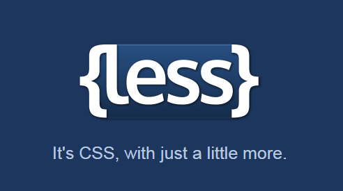
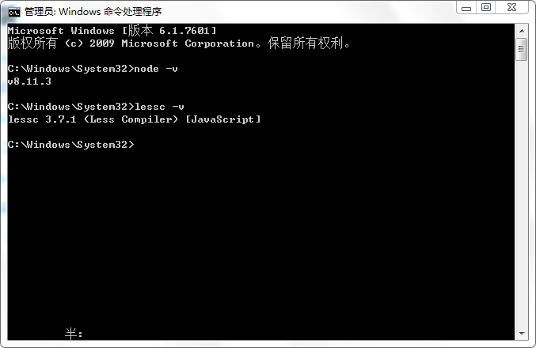
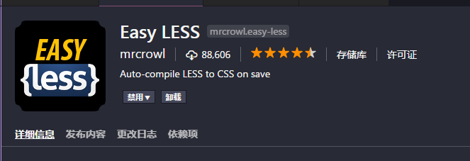

>大家好，这里是「 从零开始学 Web 系列教程 」，并在下列地址同步更新......
>
> - github：https://github.com/Daotin/Web
> - 微信公众号：[Web前端之巅](https://github.com/Daotin/pic/raw/master/wx.jpg)
> - 博客园：http://www.cnblogs.com/lvonve/
> - CSDN：https://blog.csdn.net/lvonve/
>
> 在这里我会从 Web 前端零基础开始，一步步学习 Web 相关的知识点，期间也会分享一些好玩的项目。现在就让我们一起进入 Web 前端学习的探索之旅吧！


## 一、Less简介

LESS 是一种动态的样式表语言，通过简洁明了的语法定义，使编写 CSS 的工作变得非常简单，本质上，LESS 包含一套自定义的语法及一个解析器。





## 二、less 安装

1、下载安装 node.js 环境。（官网：https://nodejs.org/zh-cn/）

2、安装完成后验证 node 环境是否安装成功。

在命令行中输入：`node -v ` 出现 node 的版本号表示安装成功。

3、安装 less 工具（需要联网）。

在命令行中输入：`npm install -g less` 即可下载安装。

4、安装后验证 less 是否安装成功。

命令行输入：`lessc -v`  出现 less 版本号，即表示安装成功。





## 三、编译

浏览器只能识别 CSS，Less 只是用来提升CSS可维护性的一个工具，所最终需要将LESS编译成CSS。

编译方式有两种：

1、一种是使用命令行的方式手工编译。

在我们编写好一个 less 文件后，可以使用命令行输入以下指令将 less 文件编译成 css 文件。

```
lessc .\test.less .\test.css
```

这种手工编译的方式效率比较低下，一般我们都会借助一些编辑器来完成自动编译。

2、这里我使用 vscode，使用很简单，只需要安装插件 “**Easy LESS**” ，那么编写的 less 文件在保存时会自动在 less 文件相同的目录下生成 css 文件。





## 四、语法

### 1、注释

注释的方式有两种：`//`  或者 `/**/`  。

但是这两种注释有区别：这两种样式在 less 中都是注释，但是 `//` 注释不会进行编译，也就是不会在生成的 css 文件中显示，而 `/**/` 注释则会在 css 文件中对应显示。

```less
/*注释  才会编译*/
//这也是样式，但是不会进行编译
```


### 2、变量

语法格式为：`@变量名：值;` ，比如 `@baseColor: #ccc;`

使用的时候： `div { color: @baseColor;}`

```less
/*变量  @变量名:值; */
@baseColor:#e92322;
a{
  color: @baseColor;
}
```


### 3、混入（类似于函数）

语法：`.样式名(@变量名 ：默认值) {具体样式}`

```less
/*混入:可以将一个定义好的样式引入到另外一个样式中  类似于函数的调用*/
/*.addRadius{
  border-radius: 10px;
  -webkit-border-radius: 10px;
  -moz-border-radius: 10px;
}*/
/*相当于定义一个函数的参数*/
.addRadius(@r:10px){
  border-radius: @r;
  -webkit-border-radius: @r;
  -moz-border-radius: @r;
}
div{
  width: 200px;
  height: 200px;
  /*引入已经写好的圆角样式*/
  /*传入参数*/
  .addRadius(5px);
}
```


### 4、嵌套

嵌套可以实现选择器的继承，可以减少代码量，同时使用代码结构更加清晰。

```less
/* 以前我们写的样式
.jd_header{}
.jd_header > div{}
.jd_header > div > h3{}
.jd_header > div > h3::before{}
.jd_header > div > a{}
.jd_header > div > a:hover{}
*/


/*嵌套:实现选择器的继承，可以减少代码量，同时使用代码结构更加清晰*/
.jd_header{
  width: 100%;
  height: 200px;
  .addRadius();
  // 加 > 表示直接子元素
  > div{
    // 加 & 表示中间没有空格为 div::before，如果没有 & 则是 div ::before 就错了。
    &::before{
      content: "";
    }
    width: 100%;
    // div下面的直接子元素a
    >a{
      text-decoration: underline;
      // a::hover，中间没有空格
      &:hover{
        text-decoration: none;
      }
    }
    > h3{
      height: 20px;
    }
    ul{
      list-style: none;
    }
  }
}

```


## 五、less 文件引入

我们之前编写好 less 文件之后，都是自动解析成 css 然后添加到 html 文件中。如果 css 的文件很多的话，就要引入很多个 link 标签，那么可不可以直接引入 less 文件呢？

当然可以。

语法：

```html
<link rel="stylesheet/less" href="./index.less">
```

只是在 stylesheet 后面加上 less 的说明。

只是引入 less 文件是不可以的，还需要**引入解析 less 的 js 插件**。

```html
<script src="./js/less.js"></script>
```

看起来好麻烦哦，为什么要引入 less 文件，它有什么好处吗？

好处是：不管有多少 less 文件，只需要引入一个 less 文件就可以了，其他需要的 less 文件都包含在引入的这个 less 文件中。


**如何在 less 文件中引入其他 less 文件呢？**

语法：

```less
@import "other1.less";  // other.less 为其他 less 文件的路径名称
@import "other2.less";
@import "other3.less";
```

这样，不管有多少个 less 文件，都可以写到一个待引入的 less 文件中。


