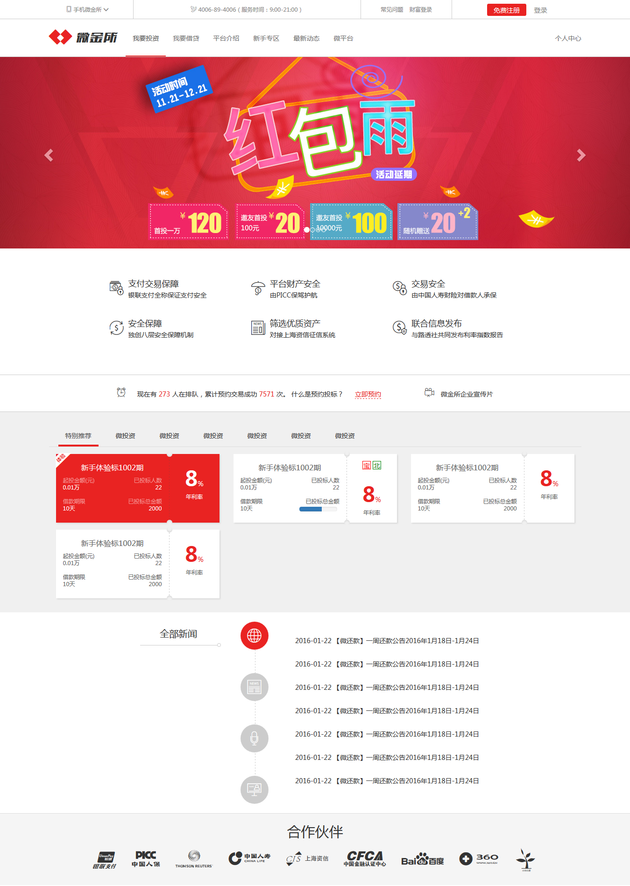
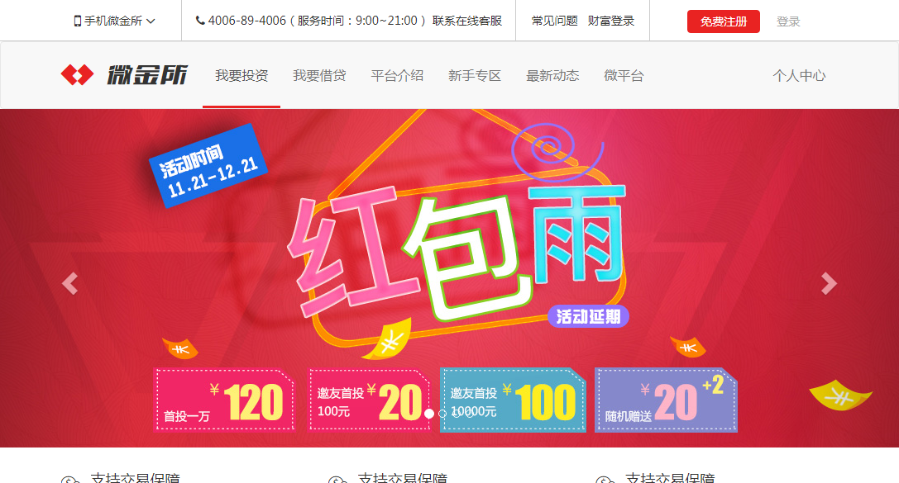
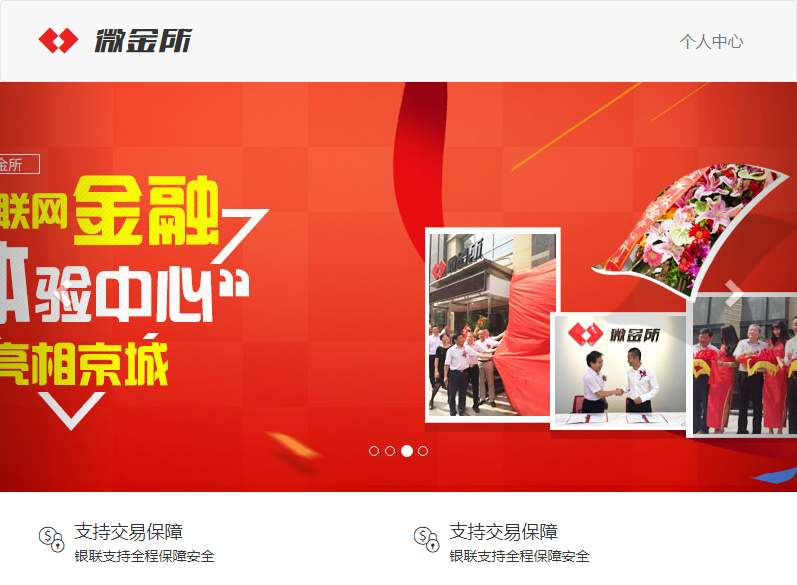
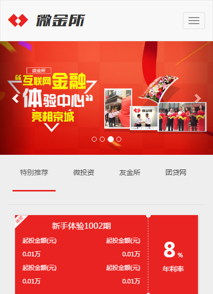
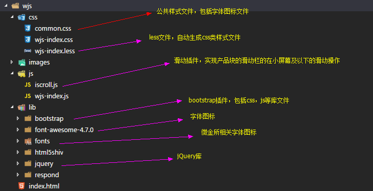

# 微金所案例


## 1、案例要求

利用响应式布局，实现微金所页面结构。


## 2、不同屏幕尺寸布局

### 整体样式




### 中大屏幕下样式




### 小屏幕下样式




### 超小屏幕（移动端）下样式




## 3、代码结构




## 4、页面结构

页面结构主要分8大块：

-   头部块
-   导航条
-   轮播图
-   信息块
-   预约块
-   产品块
-   新闻块
-   合作块


## 5、源码

相关源代码已放置github：https://github.com/Daotin/Web/blob/master/Code/src/11/wjs.zip

### index.html 文件

```html
<!DOCTYPE html>
<html lang="zh-CN">

<head>
    <meta charset="utf-8">
    <meta http-equiv="X-UA-Compatible" content="IE=edge">
    <meta name="viewport" content="width=device-width, initial-scale=1.0">
    <title>微金所</title>
    <link href="./lib/bootstrap/css/bootstrap.min.css" rel="stylesheet">
    <!-- 在线字体图标文件 -->
    <link href="./lib/font-awesome-4.7.0/css/font-awesome.min.css" rel="stylesheet">
    <link rel="stylesheet" href="./css/common.css">
    <link rel="stylesheet" href="./css/wjs-index.css">
</head>

<body>
    <!-- 头部块开始 -->
    <header class="wjs-header hidden-sm hidden-xs">
        <div class="container">
            <div class="row">
                <!-- 在xs sm下是不显示的，所以没必要写 -->
                <div class="col-md-2">
                    <a href="javascript:;" class="code">
                        <span class="fa fa-mobile fa-lg"></span>
                        <span>手机微金所</span>
                        <span class="fa fa-angle-down fa-lg"></span>
                        
                    </a>
                </div>
                <div class="col-md-5">
                    <span class="fa fa-phone"></span>
                    <a href="javascript:;">4006-89-4006（服务时间：9:00~21:00） 联系在线客服</a>
                </div>
                <div class="col-md-2">
                    <a href="javascript:;">常见问题</a>&nbsp;&nbsp;
                    <a href="javascript:;">财富登录</a>
                </div>
                <div class="col-md-3">
                    <button type="button" class="btn btn-danger">免费注册</button>
                    <button type="button" class="btn btn-link">登录</button>
                </div>
            </div>
        </div>
    </header>
    <!-- 头部块结束 -->

    <!-- 导航条开始 -->
    <nav class="navbar navbar-default wjs-nav">
        <div class="container">
            <!-- Brand and toggle get grouped for better mobile display -->
            <div class="navbar-header">
                <button type="button" class="navbar-toggle collapsed" data-toggle="collapse" data-target="#bs-example-navbar-collapse-1"
                    aria-expanded="false">
                    <span class="sr-only">Toggle navigation</span>
                    <span class="icon-bar"></span>
                    <span class="icon-bar"></span>
                    <span class="icon-bar"></span>
                </button>
                <a class="navbar-brand" href="#">
                    <span class="wjs_icon wjs_icon_logo"></span>
                    <span class="wjs_icon wjs_icon_text"></span>
                </a>
            </div>

            <!-- Collect the nav links, forms, and other content for toggling -->
            <div class="collapse navbar-collapse" id="bs-example-navbar-collapse-1">
                <ul class="nav navbar-nav hidden-sm">
                    <li class="active">
                        <a href="#">我要投资
                            <span class="sr-only">(current)</span>
                        </a>
                    </li>
                    <li>
                        <a href="#">我要借贷</a>
                    </li>
                    <li>
                        <a href="#">平台介绍</a>
                    </li>
                    <li>
                        <a href="#">新手专区</a>
                    </li>
                    <li>
                        <a href="#">最新动态</a>
                    </li>
                    <li>
                        <a href="#">微平台</a>
                    </li>
                </ul>
                <ul class="nav navbar-nav navbar-right">
                    <li>
                        <a href="#">个人中心</a>
                    </li>
                </ul>
            </div>
        </div>
    </nav>
    <!-- 导航条结束 -->

    <!-- 轮播图开始 -->
    <div class="wjs-banner">
        <div id="carousel-example-generic" class="carousel slide" data-ride="carousel">
            <!-- 小白点 -->
            <ol class="carousel-indicators">
                <!-- data-target="#carousel-example-generic"：自定义属性，给哪个id的轮播图加小白点 -->
                <!-- data-slide-to="0"：第几个小白点 -->
                <li data-target="#carousel-example-generic" data-slide-to="0" class="active"></li>
                <li data-target="#carousel-example-generic" data-slide-to="1"></li>
                <li data-target="#carousel-example-generic" data-slide-to="2"></li>
                <li data-target="#carousel-example-generic" data-slide-to="3"></li>
            </ol>

            <!-- 轮播图主体部分 -->
            <div class="carousel-inner" role="listbox">
                <!-- HTML5 增加了一项新功能是 自定义数据属性 ，也就是  data-* 自定义属性。
                    jQuery中可以使用data()方法获取自定义属性的值 -->
                <div class="item active" data-large-image="./images/slide_01_2000x410.jpg" data-small-image="./images/slide_01_640x340.jpg">
                    <!-- 这里面的轮播图片使用jq动态添加，否则加大小图的话，加载的时候，不管是大屏幕还是小屏幕
                        大小图都会加载，浪费流量 -->

                    <!-- 每张轮播图的图片说明，这里不需要 -->
                    <!-- <div class="carousel-caption">
                        ...
                    </div> -->
                    <a href="">
                        
                    </a>
                </div>
                <div class="item" data-large-image="./images/slide_02_2000x410.jpg" data-small-image="./images/slide_02_640x340.jpg"></div>
                <div class="item" data-large-image="./images/slide_03_2000x410.jpg" data-small-image="./images/slide_03_640x340.jpg"></div>
                <div class="item" data-large-image="./images/slide_04_2000x410.jpg" data-small-image="./images/slide_04_640x340.jpg"></div>
            </div>

            <!-- 左右箭头，点击可切换上下一张 -->
            <!-- Controls -->
            <a class="left carousel-control" href="#carousel-example-generic" role="button" data-slide="prev">
                <span class="glyphicon glyphicon-chevron-left" aria-hidden="true"></span>
                <span class="sr-only">Previous</span>
            </a>
            <a class="right carousel-control" href="#carousel-example-generic" role="button" data-slide="next">
                <span class="glyphicon glyphicon-chevron-right" aria-hidden="true"></span>
                <span class="sr-only">Next</span>
            </a>
        </div>
    </div>
    <!-- 轮播图结束 -->

    <!-- 信息块开始 -->
    <div class="wjs-info hidden-xs">
        <!-- 信息块的制作可以使用bootstrap组件的媒体对象来做 -->
        <div class="container">
            <div class="row">
                <div class="col-sm-6 col-md-4">
                    <a href="javascript:;">
                        <div class="media">
                            <span class="media-left wjs_icon wjs_icon_E900"></span>
                            <div class="media-body">
                                <h4 class="media-heading">支持交易保障</h4>
                                <p>银联支持全程保障安全</p>
                            </div>
                        </div>
                    </a>
                </div>
                <div class="col-sm-6 col-md-4">
                    <a href="javascript:;">
                        <div class="media">
                            <span class="media-left wjs_icon wjs_icon_E900"></span>
                            <div class="media-body">
                                <h4 class="media-heading">支持交易保障</h4>
                                <p>银联支持全程保障安全</p>
                            </div>
                        </div>
                    </a>
                </div>
                <div class="col-sm-6 col-md-4">
                    <a href="javascript:;">
                        <div class="media">
                            <span class="media-left wjs_icon wjs_icon_E900"></span>
                            <div class="media-body">
                                <h4 class="media-heading">支持交易保障</h4>
                                <p>银联支持全程保障安全</p>
                            </div>
                        </div>
                    </a>
                </div>
                <div class="col-sm-6 col-md-4">
                    <a href="javascript:;">
                        <div class="media">
                            <span class="media-left wjs_icon wjs_icon_E900"></span>
                            <div class="media-body">
                                <h4 class="media-heading">支持交易保障</h4>
                                <p>银联支持全程保障安全</p>
                            </div>
                        </div>
                    </a>
                </div>
                <div class="col-sm-6 col-md-4">
                    <a href="javascript:;">
                        <div class="media">
                            <span class="media-left wjs_icon wjs_icon_E900"></span>
                            <div class="media-body">
                                <h4 class="media-heading">支持交易保障</h4>
                                <p>银联支持全程保障安全</p>
                            </div>
                        </div>
                    </a>
                </div>
                <div class="col-sm-6 col-md-4">
                    <a href="javascript:;">
                        <div class="media">
                            <span class="media-left wjs_icon wjs_icon_E900"></span>
                            <div class="media-body">
                                <h4 class="media-heading">支持交易保障</h4>
                                <p>银联支持全程保障安全</p>
                            </div>
                        </div>
                    </a>
                </div>

            </div>
        </div>
    </div>
    <!-- 信息块结束 -->

    <!-- 预约块开始 -->
    <div class="wjs-reverse hidden-xs">
        <div class="container">
            <div class="row">
                <div class="col-sm-9">
                    <span class="wjs_icon wjs_icon_E906"></span>
                    <span>现在的 272 人在排队，累计预约交易成功 7571 次</span>
                    <a href="javascript:;">什么叫预约投标</a>
                    <a href="javascript:;">立即预约</a>
                </div>
                <div class="col-sm-3">
                    <span class="wjs_icon wjs_icon_E905"></span>
                    <a href="javascript:;">微金所企业宣传片</a>
                </div>
            </div>
        </div>
    </div>
    <!-- 预约块结束 -->

    <!-- 产品块开始 -->
    <div class="wjs-product">
        <div class="container">
            <!-- 手动滑动效果 -->
            <div class="tabs-parent">
                <ul class="nav nav-tabs" role="tablist">
                    <li role="presentation" class="active">
                        <a href="#p1" aria-controls="p1" role="tab" data-toggle="tab">特别推荐</a>
                    </li>
                    <li role="presentation">
                        <a href="#p2" aria-controls="p2" role="tab" data-toggle="tab">微投资</a>
                    </li>
                    <li role="presentation">
                        <a href="#p3" aria-controls="p3" role="tab" data-toggle="tab">友金所</a>
                    </li>
                    <li role="presentation">
                        <a href="#p4" aria-controls="p4" role="tab" data-toggle="tab">团贷网</a>
                    </li>
                    <li role="presentation">
                        <a href="#p5" aria-controls="p5" role="tab" data-toggle="tab">懒投资</a>
                    </li>
                    <li role="presentation">
                        <a href="#p6" aria-controls="p6" role="tab" data-toggle="tab">掌游宝</a>
                    </li>
                    <li role="presentation">
                        <a href="#p7" aria-controls="p7" role="tab" data-toggle="tab">英雄联盟</a>
                    </li>
                </ul>
            </div>
            <!-- Tab panes -->
            <div class="tab-content">
                <div role="tabpanel" class="tab-pane active" id="p1">
                    <div class="container">
                        <div class="row">
                            <div class="col-xs-12 col-sm-6 col-md-4">
                                <div class="wjs-pBox active">
                                    <div class="wjs-pLeft">
                                        <p>新手体验1002期</p>
                                        <div class="row">
                                            <div class="col-xs-6">
                                                <p>起投金额(元)</p>
                                                <p>0.01万</p>
                                            </div>
                                            <div class="col-xs-6">
                                                <p>起投金额(元)</p>
                                                <p>0.01万</p>
                                            </div>
                                            <div class="col-xs-6">
                                                <p>起投金额(元)</p>
                                                <p>0.01万</p>
                                            </div>
                                            <div class="col-xs-6">
                                                <p>起投金额(元)</p>
                                                <p>0.01万</p>
                                            </div>
                                        </div>
                                    </div>
                                    <div class="wjs-pRight">
                                        <b>8</b>
                                        <sub>%</sub>
                                        <p>年利率</p>
                                    </div>
                                </div>
                            </div>
                            <div class="col-xs-12 col-sm-6 col-md-4">
                                <div class="wjs-pBox">
                                    <div class="wjs-pLeft">
                                        <p>新手体验1002期</p>
                                        <div class="row">
                                            <div class="col-xs-6">
                                                <p>起投金额(元)</p>
                                                <p>0.01万</p>
                                            </div>
                                            <div class="col-xs-6">
                                                <p>起投金额(元)</p>
                                                <p>0.01万</p>
                                            </div>
                                            <div class="col-xs-6">
                                                <p>起投金额(元)</p>
                                                <p>0.01万</p>
                                            </div>
                                            <div class="col-xs-6">
                                                <p>起投金额(元)</p>
                                                <p>0.01万</p>
                                            </div>
                                        </div>
                                    </div>
                                    <div class="wjs-pRight">
                                        <div class="wjs-pRight-tip">
                                            <span data-toggle="tooltip" data-placement="top" title="微金宝">宝</span>
                                            <span data-toggle="tooltip" data-placement="top" title="北京市">北</span>
                                        </div>
                                        <b>8</b>
                                        <sub>%</sub>
                                        <p>年利率</p>
                                    </div>
                                </div>
                            </div>
                            <div class="col-xs-12 col-sm-6 col-md-4">
                                <div class="wjs-pBox">
                                    <div class="wjs-pLeft">
                                        <p>新手体验1002期</p>
                                        <div class="row">
                                            <div class="col-xs-6">
                                                <p>起投金额(元)</p>
                                                <p>0.01万</p>
                                            </div>
                                            <div class="col-xs-6">
                                                <p>起投金额(元)</p>
                                                <p>0.01万</p>
                                            </div>
                                            <div class="col-xs-6">
                                                <p>起投金额(元)</p>
                                                <p>0.01万</p>
                                            </div>
                                            <div class="col-xs-6">
                                                <p>起投金额(元)</p>
                                                <p>0.01万</p>
                                            </div>
                                        </div>
                                    </div>
                                    <div class="wjs-pRight">
                                        <b>8</b>
                                        <sub>%</sub>
                                        <p>年利率</p>
                                    </div>
                                </div>
                            </div>
                            <div class="col-xs-12 col-sm-6 col-md-4">
                                <div class="wjs-pBox">
                                    <div class="wjs-pLeft">
                                        <p>新手体验1002期</p>
                                        <div class="row">
                                            <div class="col-xs-6">
                                                <p>起投金额(元)</p>
                                                <p>0.01万</p>
                                            </div>
                                            <div class="col-xs-6">
                                                <p>起投金额(元)</p>
                                                <p>0.01万</p>
                                            </div>
                                            <div class="col-xs-6">
                                                <p>起投金额(元)</p>
                                                <p>0.01万</p>
                                            </div>
                                            <div class="col-xs-6">
                                                <p>起投金额(元)</p>
                                                <p>0.01万</p>
                                            </div>
                                        </div>
                                    </div>
                                    <div class="wjs-pRight">
                                        <b>8</b>
                                        <sub>%</sub>
                                        <p>年利率</p>
                                    </div>
                                </div>
                            </div>
                        </div>
                    </div>
                </div>
                <div role="tabpanel" class="tab-pane" id="p2">2</div>
                <div role="tabpanel" class="tab-pane" id="p3">3</div>
                <div role="tabpanel" class="tab-pane" id="p4">4</div>
                <div role="tabpanel" class="tab-pane" id="p5">5</div>
                <div role="tabpanel" class="tab-pane" id="p6">6</div>
                <div role="tabpanel" class="tab-pane" id="p7">7</div>
            </div>
        </div>
    </div>
    <!-- 产品块结束 -->

    <!-- 新闻块开始 -->
    <div class="wjs-news">
        <div class="container">
            <div class="row">
                <div class="col-md-2 col-md-offset-2">
                    <h3 class="wjs_nTitle">全部新闻</h3>
                </div>
                <div class="col-md-1">
                    <div class="wjs_newsLine hidden-xs hidden-sm"></div>
                    <ul class="nav nav-tabs" role="tablist">
                        <li role="presentation" class="active">
                            <a href="#home" aria-controls="home" role="tab" data-toggle="tab">
                                <span class="wjs_icon wjs_icon_new01"></span>
                            </a>
                        </li>
                        <li role="presentation">
                            <a href="#profile" aria-controls="profile" role="tab" data-toggle="tab">
                                <span class="wjs_icon wjs_icon_new02"></span>
                            </a>
                        </li>
                        <li role="presentation">
                            <a href="#messages" aria-controls="messages" role="tab" data-toggle="tab">
                                <span class="wjs_icon wjs_icon_new03"></span>
                            </a>
                        </li>
                        <li role="presentation">
                            <a href="#settings" aria-controls="settings" role="tab" data-toggle="tab">
                                <span class="wjs_icon wjs_icon_new04"></span>
                            </a>
                        </li>
                    </ul>
                </div>
                <div class="col-md-7">
                    <div class="tab-content">
                        <div role="tabpanel" class="tab-pane active" id="home">
                            <ul class="wjs_newslist">
                                <li>
                                    <a href="">
                                        <span class="hidden-xs">2016-01-22</span>【微公告】关于海航通宝22期项目募集期延长通知
                                    </a>
                                </li>
                                <li>
                                    <a href="">
                                        <span class="hidden-xs">2016-01-22</span>【微动态】世纪佳缘与百合网的投资人首善财富董事长吴正新一行莅临微金所调研指导
                                    </a>
                                </li>
                                <li>
                                    <a href="">
                                        <span class="hidden-xs">2016-01-22</span>【微动态】封面人物第六期 ▏万雅泉—— 手写心情的双鱼座美女
                                    </a>
                                </li>
                                <li>
                                    <a href="">
                                        <span class="hidden-xs">2016-01-22</span>【微公告】2016年7月11日微金所平台系统升级维护公告
                                    </a>
                                </li>
                                <li>
                                    <a href="">
                                        <span class="hidden-xs">2016-01-22</span>【微动态】微金所与前海航交所携手，正式推出安全优质的理财产品—海航金宝！
                                    </a>
                                </li>
                                <li>
                                    <a href="">
                                        <span class="hidden-xs">2016-01-22</span>【微动态】微金所七月电脑节，激情狂欢理财好礼送不停！
                                    </a>
                                </li>
                                <li>
                                    <a href="">
                                        <span class="hidden-xs">2016-01-22</span>【微还款】一周还款公告2016年7月11日-7月17日
                                    </a>
                                </li>
                            </ul>
                        </div>
                        <div role="tabpanel" class="tab-pane" id="profile">2</div>
                        <div role="tabpanel" class="tab-pane" id="messages">3</div>
                        <div role="tabpanel" class="tab-pane" id="settings">4</div>
                    </div>
                </div>
            </div>
        </div>
    </div>
    <!-- 新闻块结束 -->

    <!-- 合作块开始 -->
    <footer class="wjs-partner">
        <div class="container">
            <h3>合作伙伴</h3>
            <ul>
                <li><a href="javascript:;" class="wjs_icon wjs_icon_partner01"></a></li>
                <li><a href="javascript:;" class="wjs_icon wjs_icon_partner02"></a></li>
                <li><a href="javascript:;" class="wjs_icon wjs_icon_partner03"></a></li>
                <li><a href="javascript:;" class="wjs_icon wjs_icon_partner04"></a></li>
                <li><a href="javascript:;" class="wjs_icon wjs_icon_partner05"></a></li>
                <li><a href="javascript:;" class="wjs_icon wjs_icon_partner06"></a></li>
                <li><a href="javascript:;" class="wjs_icon wjs_icon_partner07"></a></li>
                <li><a href="javascript:;" class="wjs_icon wjs_icon_partner08"></a></li>
            </ul>
        </div>
    </footer>
    <!-- 合作块结束 -->

    <script src="./lib/jquery/jquery.min.js"></script>
    <script src="./lib/bootstrap/js/bootstrap.min.js"></script>
    <script src="./js/iscroll.js"></script>
    <script src="./js/wjs-index.js"></script>
</body>

</html>
```


### common.css 文件

```css
/*公共css样式*/

body {
    font-family: "Microsoft YaHei", sans-serif;
    font-size: 14px;
    color: #333;
}

a {
    text-decoration: none;
    color: #333;
}

a:hover {
    text-decoration: none;
    color: #333;
}

/*左边距*/

.m_l10 {
    margin-left: 10px;
}

/*右边距*/

.m_r10 {
    margin-right: 10px;
}

/*自定义字体*/

@font-face {
    font-family: 'wjs';
    src: url('../fonts/MiFie-Web-Font.eot');
    /* IE9*/
    src: url('../lib/fonts/MiFie-Web-Font.eot') format('embedded-opentype'), /* IE6-IE8 */
    url('../lib/fonts/MiFie-Web-Font.woff') format('woff'), /* chrome、firefox */
    url('../lib/fonts/MiFie-Web-Font.ttf') format('truetype'), /* chrome、firefox、opera、Safari, Android, iOS 4.2+*/
    url('../lib/fonts/MiFie-Web-Font.svg') format('svg');
    /* iOS 4.1- */
}

/*自定义字体使用样式*/

.wjs_icon {
    font-family: wjs;
}

/*手机图标对应的编码*/

.wjs_icon_phone::before {
    content: "\e908";
}

/*电话图标对应的编码*/

.wjs_icon_tel::before {
    content: "\e909";
    font-size: 14px;
}

/*wjs logo*/

.wjs_icon_logo::before {
    content: "\e920";
}

/*wjs 文本*/

.wjs_icon_text::before {
    content: "\e93e";
}

.wjs_icon_new01::before {
    content: "\e90e";
}

.wjs_icon_new02::before {
    content: "\e90f";
}

.wjs_icon_new03::before {
    content: "\e910";
}

.wjs_icon_new04::before {
    content: "\e911";
}

.wjs_icon_partner01::before {
    content: "\e946";
}

.wjs_icon_partner02::before {
    content: "\e92f";
}

.wjs_icon_partner03::before {
    content: "\e92e";
}

.wjs_icon_partner04::before {
    content: "\e92a";
}

.wjs_icon_partner05::before {
    content: "\e929";
}

.wjs_icon_partner06::before {
    content: "\e931";
}

.wjs_icon_partner07::before {
    content: "\e92c";
}

.wjs_icon_partner08::before {
    content: "\e92b";
}

.wjs_icon_partner09::before {
    content: "\e92d";
}

.wjs_iconn_E903::before {
    content: "\e903";
}

.wjs_icon_E906::before {
    content: "\e906";
}

.wjs_icon_E905::before {
    content: "\e905";
}

.wjs_icon_E907::before {
    content: "\e907";
}

.wjs_icon_E901::before {
    content: "\e901";
}

.wjs_icon_E900::before {
    content: "\e900";
}

.wjs_icon_E904::before {
    content: "\e904";
}

.wjs_icon_E902::before {
    content: "\e902";
}

.wjs_icon_E906::before {
    content: "\e906";
}
```


### wjs-index.less 文件

```less
@baseColor: #e92322;

/* 头部块 */
.wjs-header {
    height: 50px;
    line-height: 50px;
    border-bottom: 1px solid #ccc;
    .row {
        height: 100%;
        text-align: center;
        > div:nth-of-type(-n+3) {
            border-right: 1px solid #ccc;
        }
        .code {
            display: block;
            position: relative;
            > img {
                display: none;
                position: absolute;
                border: 1px solid #ccc;
                border-top: none;
                left: 50%;
                transform: translateX(-50%);
                top: 49px;
            }
            &:hover {
                > img {
                    display: block;
                }
            }
        }
        > div:nth-last-of-type(1) {
            > .btn-danger {
                background-color: @baseColor;
                border-color: @baseColor;
            }
            > .btn {
                padding: 3px 15px;
            }
            > .btn-link {
                text-decoration: none;
                color: #aaa;
            }
            
        }
    }
}

/*导航条*/ 
.wjs-nav {
    &.navbar {
        margin-bottom: 0;
    }
    .navbar-brand {
        height: 80px;
        line-height: 50px;
        font-size: 40px;

        > span:nth-of-type(1) {
            color: @baseColor;
        }

        > span:nth-of-type(2) {
            color: #333;
        }
    }
    .navbar-toggle {
        margin-top: 23px;;
    }
    .navbar-nav {
        > li {
            height: 80px;
            > a {
                height: 80px;
                line-height: 50px;
                font-size: 16px;
                
                &:hover, &:active {
                    color: #777;
                    border-bottom: 3px solid @baseColor;
                }
            }
        }
        .active {
            a,a:hover,a:active {
                background-color: transparent;
                border-bottom: 3px solid @baseColor;
            }
        }
    }
}

/*轮播图*/
/*
w<768px-移动端：图片会随着屏幕的缩小自动适应--缩小
	img的宽度为100%,通过img标签来实现

w>=768px：
	图片做为背景，当屏幕宽度变宽的时候，会显示更多的图片的两边区域
	1.background-image添加图片
	2.添加background-position:center center
	3.background-size:cover
*/
.wjs-banner {
    .bigImg {
        width: 100%;
        height: 410px;
        /*去除图片基线*/ 
        display: block;
        background-position:center center;
        background-size: cover;
    }

    .smallImg {
        // width: 100%;
        // display: block;
        img {
            width: 100%;
            /*去除图片基线*/ 
            display: block;
        }
    }
}

/*信息块*/
.wjs-info {
    padding: 20px;
    .wjs_icon {
        font-size: 26px;
    }
    .row {
        > div {
            margin: 10px 0;
            > a:hover {
                color: @baseColor;
            }
        }
    }
} 

/*预约块*/
.wjs-reverse {
    height: 60px;
    line-height: 60px;
    border-top: 1px solid #ccc;
    border-bottom: 1px solid #ccc;

    .wjs_icon {
        font-size: 18px;
    }

    a:hover {
        color: @baseColor;
    }

    .col-sm-9 {
        > a:last-of-type {
            color: @baseColor;
            border-bottom: 1px dashed @baseColor;
        }
    }
}

/*产品块*/ 
.wjs-product{
    clear: both;
    background-color: #eee;
    

    li {
        height: 100px;
        line-height: 100px;
        padding: 0 10px;
        > a {
            margin: 0;
            border: none;
            line-height: 50px;
        }

        a:hover {
            border: none;
            border-bottom: 3px solid @baseColor;
        }

        &.active {
            > a,a:hover,a:focus{
                background-color: transparent;
                border: none;
                border-bottom: 3px solid @baseColor;
            }
            
            
        }
    }
}

/*产品块*/ 
.wjs-product {
    .tabs-parent {
        width: 100%;
        overflow: hidden;
    }
    .wjs-pBox {
        height: 100%;
        background-color: #fff;
        margin-top: 20px;
        position: relative;
        box-shadow: 1px 1px 5px #ccc;

        > .wjs-pLeft {
            height: 100%;
            margin-right: 100px;
            padding: 10px 0;
            font-size: 12px;
            position: relative;

            > p {
                font-size: 16px;
                text-align: center;
            }
            .row {
                margin-left: 0;
                margin-right: 0;
                > div:nth-of-type(even) {
                    text-align: right;
                }
            }
        }

        > .wjs-pRight {
            width: 100px;
            height: 100%;
            position: absolute;
            right: 0;
            top: 0;
            border-left: 1px dashed #ccc;
            text-align: center;
            padding-top: 40px;

            > .wjs-pRight-tip {
                width: 100%;
                span {
                    font-size: 12px;
                    border-radius: 3px;
                    cursor: pointer;
                }
                span:first-of-type {
                    border: 1px solid @baseColor;
                    color: @baseColor;
                }
                span:last-of-type {
                    border: 1px solid blue;
                    color: blue;
                }
            }

            > b {
                font-size: 40px;
                color: @baseColor;
            }
            > sub {
                bottom: 0;
                color: @baseColor;
            }
            &::before, &::after {
                content: "";
                width: 10%;
                height: 10px;
                border-radius: 5px;
                background-color: #eee;
                position: absolute;
                left: -5px;
            }
            &::before {
                top: -5px;
            }
            &::after {
                bottom: -5px;
            }
        }

        &.active {
            background-color: @baseColor;
            .wjs-pLeft {
                color: #fff;
                &::before {
                    content: "\e915";
                    font-family: "wjs";
                    position: absolute;
                    left: 0;
                    top: -4px;
                    font-size: 26px;
                }
            }
            .wjs-pRight {
                b,sub,p {
                    color: #fff;
                }
            }   
        }
    }
}

/*新闻块*/
.wjs-news {
    padding: 20px;
    .wjs_nTitle{
        line-height:50px;
        font-size: 25px;
        border-bottom: 1px solid #ccc;
        text-align: center;
        position: relative;
        &::before{
          content: "";
          width: 8px;
          height: 8px;
          border-radius: 4px;
          border: 1px solid #ccc;
          position: absolute;
          bottom: -4px;
          right: -8px;
        }
    }
    /*设置li元素间的虚线*/ 
    .wjs_newsLine {
        width: 1px;
        height: 100%;
        position: absolute;
        border-left: 1px dashed @baseColor;
        left:45px;
        top:0;
    }
    .nav-tabs {
        border-bottom: none;
        > li {
            margin-bottom:60px;
            > a {
                background-color: #ccc;
                width: 60px;
                height: 60px;
                border: none;
                border-radius: 50%;

            }
            > a:hover {
                border: none;
                background-color: @baseColor;
            }
            &.active {
                > a {
                    border: none;
                    background-color: @baseColor;
                }
                
            }
            .wjs_icon{
                font-size: 30px;
                color: #fff;
              }
        }
        > li:last-of-type {
            margin-bottom: 0;
        }
        /*媒体查询设置li元素的样式*/
        @media screen and (min-width: 768px) and (max-width: 992px) {
            li {
                margin: 20px 30px;
            }
        } 
        @media screen and (max-width: 768px) {
            li {
                margin: 20px 0;
                width: 25%;
            }
        } 
    }

    .tab-content {
        .wjs_newslist {
            list-style: none;
            > li {
            line-height:60px;
            }
        }
    }
} 

/*合作块*/ 
.wjs-partner {
    background-color: #eee;
    padding: 20px;
    text-align: center;
    h3 {
        width: 100%;
    }
    ul {
        list-style: none;
        display: inline-block;
        > li {
            float: left;
            margin: 0 15px;
        }
        .wjs_icon {
            font-size: 80px;
        }
    }
}
```


### wjs-index.js 文件

```js
$(function () {
    // 获取所有的item元素
    var items = $(".carousel-inner .item");

    // 当屏幕大小改变的时候，动态创建图片
    // triggle函数表示页面在第一次加载的时候，自动触发一次。
    $(window).on("resize", function () {
        // 判断屏幕的大小，以决定加载大图还是小图
        var screenWidth = $(window).width();
        // 添加大屏幕的图片
        if (screenWidth >= 768) {
            // 为每个item添加大图片
            items.each(function (index, value) {
                // 获取每个item的图片，使用data()获取自定义属性
                var imgSrc = $(this).data("largeImage");
                // 使用插入小图片的方法不可以，因为路径符号会被解析成空格
                $(this).html($('<a href="javascript:;" class="bigImg"></a>').css("backgroundImage", "url('" + imgSrc + "')"));
            });

            // 添加小屏幕的图片
        } else {
            // 为每个item添加小图片
            items.each(function (index, value) {
                // 获取每个item的图片，使用data()获取自定义属性
                var imgSrc = $(this).data("smallImage");
                $(this).html('<a href="javascript:;" class="smallImg"></a>');
            });
        }
    }).trigger("resize");

    // 实现滑动轮播效果
    // 实现滑动轮播可以可以直接调用插件的点击按钮上下切换的功能

    // 获取滑动区域的元素
    var carouselInner = $(".carousel-inner");
    var carousel = $(".carousel");
    var startX, endX;
    // 给元素添加touchstart和touchend事件
    carouselInner[0].addEventListener("touchstart", function (e) {
        startX = e.targetTouches[0].clientX;
    });

    carouselInner[0].addEventListener("touchend", function (e) {
        endX = e.changedTouches[0].clientX;
        // endX - startX > 10px 证明往右滑动
        if (endX - startX > 10) {
            carousel.carousel("prev");
        } else if (startX - endX > 10) {
            carousel.carousel("next");
        }
    });

    // 产品块的宝，北标签的鼠标悬停效果
    $('[data-toggle="tooltip"]').tooltip();

    // 设置产品块的标签栏在移动端时可以滑动
    var ulProduct = $(".tabs-parent .nav-tabs");
    var liProducts = ulProduct.children("li");
    var totleWidth = 0;
    liProducts.each(function (index, element) {
        /*获取宽度的方法的说明：
         * width():它只能得到当前元素的内容的宽度
         * innerWidth():它能获取当前元素的内容的宽度+padding
         * outerWidth():获取当前元素的内容的宽度+padding+border
         * outerWidth(true):获取元素的内容的宽度+padding+border+margin*/
        totleWidth += $(element).innerWidth();

    });
    ulProduct.width(totleWidth);
    // 使用iScroll插件实现滑动效果
    /*使用插件实现导航条的滑动操作*/
    var myScroll = new IScroll('.tabs-parent', {
        /*设置水平滑动，不允许垂直滑动*/
        scrollX: true,
        scrollY: false
    });
});
```


## 6、代码说明

使用到的技术点：

1. 大面积使用 bootstrap 的 `.container` + `.row` + `.col-xx-xx` 的布局，构成响应式布局结构；
2. 在某些屏幕尺寸下不显示，使用 `hidden-xx`；
3. 字体图标的使用；
4. 导航条样式直接使用 bootstrap 组件中的导航条样式修改而成。
5. 轮播图直接使用 bootstrap js插件下的 Carousel （轮播图）插件。


由于需要轮播图效果：

w<768px-移动端：图片会随着屏幕的缩小自动适应--缩小

实现方式：img的宽度为100%,通过img标签来实现。


w>=768px：

图片做为背景，当屏幕宽度变宽的时候，会显示更多的图片的两边区域
实现方式：
1.background-image添加图片
2.添加background-position:center center;
3.background-size:cover；

所以不能在 html 中直接添加代码的方式，只能通过 js 动态插入图片或背景图的方式。


6. 信息块的制作可以使用 bootstrap 组件的媒体对象来做，实现左边为图标，右边为文字说明的样式；
7. 产品块的制作可以使用 bootstrap js插件下的标签页修改得到，而且为了实现在小屏幕下的滑动效果，引入了 
  iScroll 插件。


产品块中“宝北”的添加：

- 添加两个文本
- 宝 北 两个字应该是一个整体，所以使用div包含
- 添加两个字之后，不应该破坏之前的元素的布局，所以可以让div进行定位
- 设置div的水平居中，垂直方向的偏移可以使用top实现
- 添加文本的颜色和边框
   添加工具提示
- 添加工具提示，可以修改类型为span

> type="button":说明当前工具提示的类型，类型默认是按钮，如果不需要，可以修改为其它任意的元素类型
> data-toggle="tooltip":说明当前插件/组件是一工具提示
> data-placement="top"：提示出现的位置
> title="提示文本"

- 工具提示会默认的生成一个新的div标签，只不过默认的文本显示会换行，原因是新添加的标签的宽度是参照父容器的
  ，应该将父容器div的宽度设置为100%。
- 记得对工具提示进行初始化 `$('[data-toggle="tooltip"]').tooltip();`


8. 新闻块同产品块一样，也是使用 bootstrap js插件下的标签页修改得到，值得注意的是，在不同屏幕大小下，的显示方式不同，所以在css样式中使用到了媒体查询的方式。


## 7、案例演示


