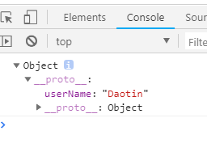
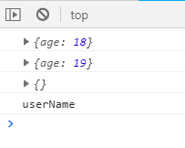
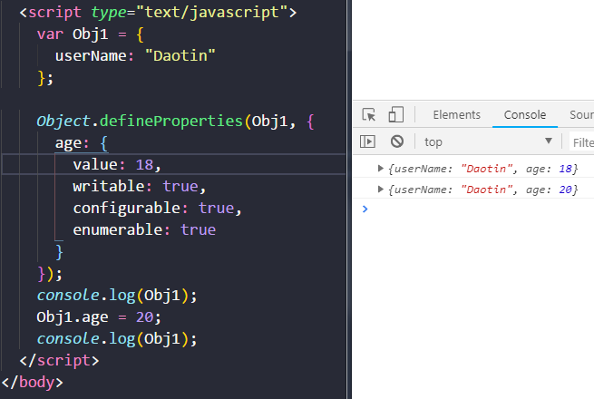
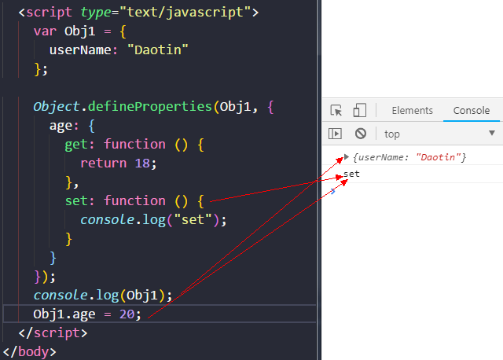
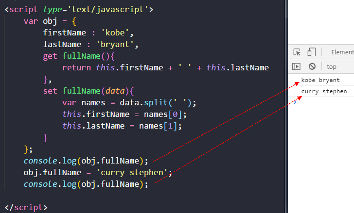
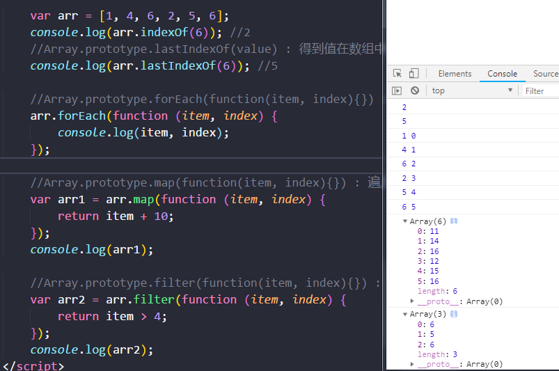

>大家好，这里是「 从零开始学 Web 系列教程 」，并在下列地址同步更新......
>
> - github：https://github.com/Daotin/Web
> - 微信公众号：[Web前端之巅](https://github.com/Daotin/pic/raw/master/wx.jpg)
> - 博客园：http://www.cnblogs.com/lvonve/
> - CSDN：https://blog.csdn.net/lvonve/
>
> 在这里我会从 Web 前端零基础开始，一步步学习 Web 相关的知识点，期间也会分享一些好玩的项目。现在就让我们一起进入 Web 前端学习的冒险之旅吧！


## 一、json对象扩展

-   把一个Json对象转换成字符串

```js
JSON.stringify(js对象/数组);
```

-   把一个json格式的字符串转换成Json对象

```js
JSON.parse(json对象/数组);
```

示例：

```html
<script type="text/javascript">
    var obj = {
        name : 'Daotin',
        age : 18
    };
    obj = JSON.stringify(obj);
    console.log( typeof obj); // string
    obj = JSON.parse(obj);
    console.log(obj);

</script>
```


## 二、Object对象扩展

### 1、方法一

**以指定原型对象创建新的对象。**

```
Object.create(prototype, [descriptors])
```

`prototype`：指定原型对象

`descriptors`：（可选）设置创建的新的对象的新属性。

示例：

```html
  <script type="text/javascript">
    var Obj1 = {
      userName: "Daotin"
    };
    var Obj2 = Object.create(Obj1);
    console.log(Obj2);
  </script>
```

打印结果：Obj2下面的`__proto__ `指向的原型对象中有Obj1的属性，**相当于继承了Obj1属性。**




当**为新创建的对象添加新属性**的时候：

添加的新属性要以对象的方式来添加，这个对象其中有四个属性来描述当前属性对象：

- `value` : 指定属性的值
- `writable` : 标识当前属性值是否是可修改的, 默认为false
- `configurable`: 标识当前属性是否可以被删除 默认为false
- `enumerable`： 标识当前属性是否能用for in 枚举 默认为false

```html
  <script type="text/javascript">
    var Obj1 = {
      userName: "Daotin"
    };
    var Obj2 = Object.create(Obj1, {
      age: {
        value: 18,
        writable: true,
        configurable: true,
        enumerable: true
      }
    });
    console.log(Obj2);
    Obj2.age = 19;
    console.log(Obj2);
    delete Obj2.age;
    console.log(Obj2);
    for (var i in Obj2) {
      console.log(i);
    }
  </script>
```


打印结果：



### 2、方法二

```
Object.defineProperties(object, descriptors)
```

**为指定对象定义扩展多个属性.**

-   `object `：指定对象
-   `descriptors`：需要扩展的属性（是一个对象）。

这个属性对象同样有：value， writable，configurable，enumerable 属性。




除了这4个属性外。还有：

-   `get` ：用来获取当前属性的回调函数。
-   `set` ：修改当前属性值得触发的回调函数，并且实参即为修改后的值。



由上图可知，**直接修改对象的值是不可以的，必须设置set属性，这样在修当前属性值的时候，会自动调用 set 。类似的，在访问当前属性的时候，会自动调用 get**


### 3、方法三

对象本身的两个方法：

-   `get propertyName(){}` ：用来得到当前属性值的回调函数
-   `set propertyName(){}` ：用来监视当前属性值变化的回调函数




## 三、数组的扩展

这些扩展的方法都在 Array 的原型对象中。

```
1. Array.prototype.indexOf(value) : 得到值在数组中的第一个下标
2. Array.prototype.lastIndexOf(value) : 得到值在数组中的最后一个下标
3. Array.prototype.forEach(function(item, index){}) : 遍历数组
4. Array.prototype.map(function(item, index){}) : 遍历数组返回一个新的数组，返回加工之后的值
5. Array.prototype.filter(function(item, index){}) : 遍历过滤出一个新的子数组， 返回条件为true的值
```





