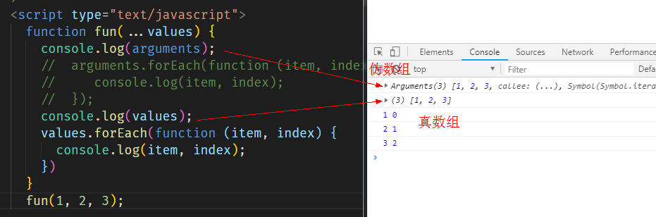
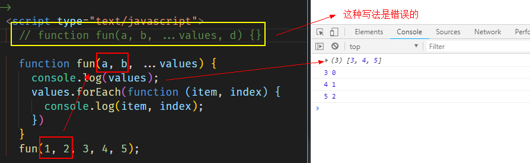

>大家好，这里是「 从零开始学 Web 系列教程 」，并在下列地址同步更新......
>
> - github：https://github.com/Daotin/Web
> - 微信公众号：[Web前端之巅](https://github.com/Daotin/pic/raw/master/wx.jpg)
> - 博客园：http://www.cnblogs.com/lvonve/
> - CSDN：https://blog.csdn.net/lvonve/
>
> 在这里我会从 Web 前端零基础开始，一步步学习 Web 相关的知识点，期间也会分享一些好玩的项目。现在就让我们一起进入 Web 前端学习的冒险之旅吧！


## 一、let

**作用：与var类似, 用于声明一个变量。**

**let和var的区别：**

-   在块作用域内有效
-   不能重复声明
-   不会预处理, 不存在提升

```html
  <script type="text/javascript">
    console.log(res); //不会预处理, 不存在提升，报错

    // 不能重复声明
    let res = 10;
    let res = 10; // 报错

  </script>
```


**应用：循环遍历加监听**

我们先开看一个例子：

```html
<body>

  <button>测试1</button>
  <button>测试2</button>
  <button>测试3</button>

  <script type="text/javascript">
    let btns = document.getElementsByTagName('button');
    for (var i = 0; i < btns.length; i++) {
      btns[i].onclick = function () {
        alert(i);
      }
    }
  </script>
</body>
```

我们分别点击按钮的时候，分别打印多少？

结果：打印的都是2。**因为回调函数的写法会进行覆盖操作**。如何解决？

**方法一：使用闭包。**

```js
for (var i = 0; i < btns.length; i++) {
   (function(){
      btns[i].onclick = function () {
        alert(i);
      }
   })(i);  
}
```

这种方式相当于，每个回调函数有个自己的区间，各个区间互不干扰。而 let 正好有这个特性。

**方法二：将 for循环的 var改为let即可。**


## 二、const

作用：定义一个常量。

特点：不能修改，其它特点同let。

```js
const uName = 'Daotin';
```


## 三、变量的解构赋值

理解：从对象或数组中提取数据, 并赋值给变量(多个)。

### 1、对象的解构赋值

之前我们要获取一个对象的属性，会定义变量然后接收对象的属性值。

```js
let obj = {name : 'kobe', age : 39};
let name = obj.name;
let age = obj.age;
console.log(name, age);
```

对象的解构赋值可以这样做：

```js
let {name, age} = obj;
console.log(name, age);
```

>   注意：
>   1、对象的解构赋值必须使用大括号 {}
>
>   2、大括号里面的变量名必须和obj里面的属性名相同
>
>   3、可以只定义一部分变量接收一部分的obj属性，不需要全部接收。


### 2、数组的解构赋值

数组没有对象的数组名，但是有下标可以使用。所以这里的变量名可以随便起。

```js
let arr = ['abc', 23, true];
let [a, b, c] = arr;
console.log(a, b, c);
```

>   注意：
>
>   1、数组的解构赋值必须使用中括号 []

**如果只想取其中的某几个值，那么变量可以使用逗号隔开。**

`let [,,a,,] = arr;`

**如果定义的变量个数比数组的个数多，多出来的变量的值为** `undefined`。


## 四、模板字符串

作用：简化字符串的拼接。

注意：

1、模板字符串必须用 ``` ` 包含；

2、变化的部分使用`${xxx}`定义

```js
let obj = {
  name: 'anverson',
  age: 41
};
// 我们之前拼接字符串用的是+
console.log('我叫:' + obj.name + ', 我的年龄是：' + obj.age);
// 使用模板字符串的方式
console.log(`我叫:${obj.name}, 我的年龄是：${obj.age}`);
```


## 五、对象的简化写法

如果有变量和对象的属性名称相同，之前的写法是赋值操作：

```js
let a = 1;
let b = 2;

let Obj = {
  a: a,
  b: b,
};
```

现在，如果变量和对象的属性名称相同，可以简写如下：

```js
let a = 1;
let b = 2;

let Obj = {
  a,
  b,
};
```

对于对象的属性，如果是个函数的话，也可以简写：

之前的写法为：

```js
let Obj = {
  foo: function(){
    //...
  }
};
```

现在的写法为：（去掉冒号和function）

```js
let Obj = {
  foo(){
    //...
  }
};
```


## 六、箭头函数

作用：**箭头函数的作用主要是定义匿名函数。**

有下面几种情况的匿名函数都可以使用箭头函数：

```js
let foo = function () {};
// 转换成箭头函数
let foo = () => {};
//------------------------------


let Obj = {
  foo: function () {  }
}
// 转换成箭头函数
let Obj = {
  foo: () => {  }
}
```


基本语法**（参数）**：

1、匿名函数没有参数：() 不能省略，占位作用。`let foo = () => {};`

2、只有一个参数：() 可以省略，也可以不省略。`let foo = a => {};`

3、多个参数，() 不能省略。`let foo = (a,b) => {};`


基本语法**（函数体）**：

1、函数体只有一条语句：可以省略{}，并且默认返回结果（不需要 return）。

```js
let foo = (x, y) => x + y;
console.log(foo(1, 2));
```

2、函数体如果有多个语句, 需要用{}包围，若有需要返回的内容，需要添加return。

```js
    let foo = (x, y) => {
      console.log(x, y);
      return x + y;
    };
    console.log(foo(1, 2));
```


**箭头函数的特点：**

1、简介

**2、箭头函数没有自己的this，箭头函数的this不是调用的时候决定的，而是在定义的时候处在的对象就是它的this。（意思：箭头函数的外层的是否有函数，如果有，箭头函数的this就是外层函数的this，如果没有，则为 window）**

```html
  <script type="text/javascript">
    let foo = () => {
      console.log(this);
    };
    foo(); // window 对象

    let Obj1 = {
      bar() {
        let foo = () => {
          console.log(this);
        };
        foo();
      }
    };
    Obj1.bar();  // Obj1 对象，箭头函数外层有函数bar，bar里面的this是Obj1.

    let Obj2 = {
      bar: () => {
        let foo = () => {
          console.log(this);
        };
        foo();
      }
    };
    Obj2.bar(); // window 对象，箭头函数外层有函数bar，bar函数也是箭头函数，bar的外层没有函数，所以bar里面的this是window，所以foo里面的this也是window。
  </script>
```


## 七、三点（可变参数）运算符

**作用：**

**1、用来取代 arguments 但比 arguments 灵活,**

arguments 是个伪数组，但是三点运算符是**真数组**，可以使用 forEach 等方法。




2、三点（可变参数）运算符只能是**最后部分形参参数。** 但是前面是可以有参数来占位的。




**3、扩展运算符**

```js
    let arr = [1, 6];
    let arr1 = [2, 3, 4, 5];

    arr = [1, ...arr1, 6];
    console.log(arr); // [1,2,3,4,5,6]
    console.log(...arr); // 1 2 3 4 5 6
```

语法：`...数组名` ：表示遍历数组的所有元素。


## 八、形参默认值

作用：当不传入参数的时候默认使用形参里的默认值。

```html
    <script type="text/javascript">
        //定义一个点的坐标
        function Point(x = 12, y = 12) { // 形参的默认值
            this.x = x;
            this.y = y;
        }

        let p = new Point();
        console.log(p);

        let point = new Point(25, 36);
        console.log(point);
    </script>
```


