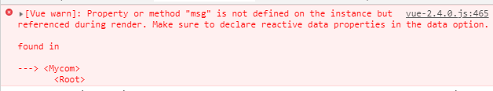
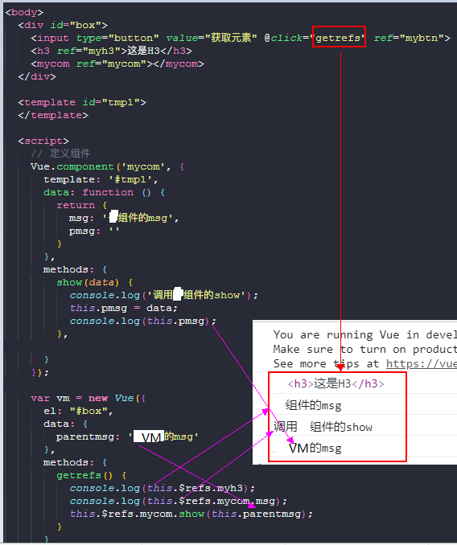

- [一、Vue组件](#%E4%B8%80vue%E7%BB%84%E4%BB%B6)
- [二、定义组件](#%E4%BA%8C%E5%AE%9A%E4%B9%89%E7%BB%84%E4%BB%B6)
  * [1、定义全局组件](#1%E5%AE%9A%E4%B9%89%E5%85%A8%E5%B1%80%E7%BB%84%E4%BB%B6)
  * [2、定义局部组件](#2%E5%AE%9A%E4%B9%89%E5%B1%80%E9%83%A8%E7%BB%84%E4%BB%B6)
- [三、动态组件](#%E4%B8%89%E5%8A%A8%E6%80%81%E7%BB%84%E4%BB%B6)
- [四、组件间传值](#%E5%9B%9B%E7%BB%84%E4%BB%B6%E9%97%B4%E4%BC%A0%E5%80%BC)
  * [1、父组件向子组件传值](#1%E7%88%B6%E7%BB%84%E4%BB%B6%E5%90%91%E5%AD%90%E7%BB%84%E4%BB%B6%E4%BC%A0%E5%80%BC)
    + [1.1、props类型验证](#11props%E7%B1%BB%E5%9E%8B%E9%AA%8C%E8%AF%81)
    + [1.2、props必填验证](#12props%E5%BF%85%E5%A1%AB%E9%AA%8C%E8%AF%81)
    + [1.3、props默认值](#13props%E9%BB%98%E8%AE%A4%E5%80%BC)
    + [1.4、props自定义匹配规则](#14props%E8%87%AA%E5%AE%9A%E4%B9%89%E5%8C%B9%E9%85%8D%E8%A7%84%E5%88%99)
    + [1.5、prop 是单项数据流](#15prop-%E6%98%AF%E5%8D%95%E9%A1%B9%E6%95%B0%E6%8D%AE%E6%B5%81)
  * [非 Prop 的特性](#%E9%9D%9E-prop-%E7%9A%84%E7%89%B9%E6%80%A7)
  * [2、子组件向父组件传值](#2%E5%AD%90%E7%BB%84%E4%BB%B6%E5%90%91%E7%88%B6%E7%BB%84%E4%BB%B6%E4%BC%A0%E5%80%BC)
  * [3、子组件之间相互传值](#3%E5%AD%90%E7%BB%84%E4%BB%B6%E4%B9%8B%E9%97%B4%E7%9B%B8%E4%BA%92%E4%BC%A0%E5%80%BC)
    + [3.1、Tips](#31tips)
- [三、组件切换](#%E4%B8%89%E7%BB%84%E4%BB%B6%E5%88%87%E6%8D%A2)
  * [1、方式一](#1%E6%96%B9%E5%BC%8F%E4%B8%80)
  * [2、方式二](#2%E6%96%B9%E5%BC%8F%E4%BA%8C)
- [四、组件传值](#%E5%9B%9B%E7%BB%84%E4%BB%B6%E4%BC%A0%E5%80%BC)
  * [1、父组件向子组件传值](#1%E7%88%B6%E7%BB%84%E4%BB%B6%E5%90%91%E5%AD%90%E7%BB%84%E4%BB%B6%E4%BC%A0%E5%80%BC-1)
  * [2、父组件向子组件传方法](#2%E7%88%B6%E7%BB%84%E4%BB%B6%E5%90%91%E5%AD%90%E7%BB%84%E4%BB%B6%E4%BC%A0%E6%96%B9%E6%B3%95)
  * [3、使用 ref 获取DOM和组件的引用](#3%E4%BD%BF%E7%94%A8-ref-%E8%8E%B7%E5%8F%96dom%E5%92%8C%E7%BB%84%E4%BB%B6%E7%9A%84%E5%BC%95%E7%94%A8)

---

## 一、Vue组件

什么是组件： 组件的出现，就是为了拆分 Vue 实例的代码量的，能够让我们以不同的组件，来划分不同的功能模块，将来我们需要什么样的功能，就可以去调用对应的组件即可；

**组件化和模块化的不同：**

- 模块化： 是从代码逻辑的角度进行划分的；方便代码分层开发，保证每个功能模块的职能单一；
- 组件化： 是从UI界面的角度进行划分的；前端的组件化，方便UI组件的重用；


## 二、定义组件

### 1、定义全局组件

通过 `Vue.component(cname,option)`函数来定义

其中cname为字符串类型 代表组件名；option用于配置组件相关属性。

相关属性：例如:data computed methods template watch等等。

```js
// main.js
import Vue from 'vue'

// 全局组件
// 全局组件的定义一定要在new Vue之前。
// 定义之后到处可以使用，并且不需再声明
Vue.component('mydiv', {
    //不能在顶层元素使用v-for，因为顶层元素只能有一个
    template: `
        <div>
            <div v-for="item in goods">{{item.name}}</div>
        </div>
    `,
    data: function() {
        return {
            goods: [
                { name: 'Daotin', age: 18 },
                { name: 'lvonve', age: 19 },
                { name: 'wenran', age: 20 }
            ]
        }
    }
});

new Vue({
    el: '#app',
    data:{}
});
```
全局组件的使用：

```html
<!DOCTYPE html>
<html lang="en">

<head>
    <meta charset="UTF-8">
    <meta name="viewport" content="width=device-width, initial-scale=1.0">
    <meta http-equiv="X-UA-Compatible" content="ie=edge">
    <title>Document</title>
</head>

<body>
    <div id="app"></div>
    <!--全局组件的使用-->
    <my-login></my-login>
</body>

</html>
```


> 注意：
>
> 0、不论是全局组件还是局部组件，组件的 template 属性指向的模板内容，必须有且只能有唯一的一个顶层元素，否则会报错。
>
> 1、使用组件的时候，双标签和单标签的方式都可以。`<my-login></my-login>` 或者 `<my-login />`
>
> 2、组件的内部除了有 `template`，还有data，methods，watch，computed等所有vue实例的属性。
>
> 3、使用 Vue.component 定义全局组件的时候，组件名称使用了 驼峰命名（如myLogin），则在调用组件的时候，需要把大写的驼峰改为小写的字母，同时在两个单词之前，使用 - 链接（`<my-login></my-login>`）；如果不使用驼峰,则直接拿名称来使用即可；
>
> 4、全局组件定义之后可以可以直接使用，不需要import引入
>
> 5、定义组件的时候，data为一个匿名函数，其返回值为一个对象。在这个返回对象里面填写需要的数据。
>
> 6、定义全局组件的时候，必须在vue初始化之前完成，也就是必须放在new Vue()代码之前。


### 2、定义局部组件

通过components : { componentname:option} 的形式注册过一个子组件后才能在当前组件内使用该组件。

定义局部组件，就是再vue实例中定义组件。

```js
// main.js
import Vue from 'vue'

// 子组件定义的时候，如果提出组件的配置（比如c），那么也要放在new Vue之前。
let c = {
    template: `
        <div>
            <div v-for="item in names">{{item.name}}</div>
        </div>
    `,
    data: function() {
        return {
            names: [
                { name: 'good1' },
                { name: 'good2' },
                { name: 'good3' }
            ]
        }
    }
};

new Vue({
    el: '#app',
    data: {
        username: 'daotin'
    },
    // 定义局部组件
    components: { 
    	goods:c
    }
});
```
子组件的使用：
```html
<!DOCTYPE html>
<html lang="en">

<head>
    <meta charset="UTF-8">
    <meta name="viewport" content="width=device-width, initial-scale=1.0">
    <meta http-equiv="X-UA-Compatible" content="ie=edge">
    <title>Document</title>
</head>

<body>
    <div id="app"></div>
    <!--局部组件的使用-->
    <goods></goods>
</body>

</html>
```

> 注意：
>
> 1、局部组件要使用的话，**在哪个组件使用，就要在哪个组件中定义**，也叫注册。
>
> 2、定义子组件的时候，如果把option提出来写，也必须放在new Vue 之前。


## 三、动态组件

定义三个子组件`Home.js, Goods.js, Users.js`

> 一般组件的文件名首字母大写。

然后创建一个主组件App.js。在main.js里面这样做：

在main.js里面定义局部组件App，然后在main.js里面也可以定义template模板。

在main.js里面定义的模板会覆盖掉index.html里面的`<div id="app"></div>`

这里main.js里面的模板就是子组件App的内容，实际上这样写的目的就是在主页显示App的内容，所有其他组件比如Home.js等在App.js引入进行显示。

```js
new Vue({
    el: '#app',
    data: {},
    template: '<App/>',
    components: { App }
});
```

看看各个文件的内容：

```js
// Home.js
export let Home = {
    template: `
        <div>
            <h2>首页</h2>
        </div>
    `
}

// Goods.js
export let Goods = {
    template: `
        <div>
            <ul>
                <li v-for="good in goods">{{good.goodsName}}</li>
            </ul>
        </div>
    `,
    data() {
        return {
            goods: [
                { goodsName: '苹果' },
                { goodsName: '香蕉' },
                { goodsName: '梨' },
            ]
        }
    },
}

//Users.js
export let Users = {
    template: `
        <div>
            <ul>
                <li v-for="user in users">{{user.name}}</li>
            </ul>
        </div>
    `,
    data() {
        return {
            users: [
                { name: 'lvonve' },
                { name: 'daotin' },
                { name: 'wenran' },
            ]
        }
    },
}

```

主组件App.js：

```js
// 主组件
import { Home } from './pages/Home'
import { Goods } from './pages/Goods'
import { Users } from './pages/Users'

export let App = {
    template: `
        <div>
            <a href="javascript:;" @click="goPage(nav.name)" v-for="nav in navs">{{nav.text}}</a>
            
            <Component :is="currentPage" />
        </div>
    `,
    data() {
        return {
            currentPage: 'Goods',
            navs: [
                { text: '首页', name: 'Home' },
                { text: '商品列表', name: 'Goods' },
                { text: '用户列表', name: 'Users' }
            ]
        }
    },
    methods: {
        goPage(pagename) {
            this.currentPage = pagename;
        }
    },
    components: { Home, Goods, Users }
}
```

在主组件先import引入其他组件，然后使用局部组件的方式进行定义，之后使用`<Component is="Home" />` 类似于`<Home />` ，由于这里需要动态显示，所以is可变，就成了`<Component :is="currentPage" />`

这样点击不同的a标签就会显示不同的内容（默认显示Goods组件内容）。


## 四、组件间传值

### 1、父组件向子组件传值

有这样一个需求，我们的Home，Goods，Users组件都需要有一个相同的头部组件Header，但是需要Header里面的内容不同，这就需要父组件Home，Goods，Users传给子组件Header不同的值来显示不同的内容。

定义一个Header组件。

```js
// Header.js
export let Header = {
    template: `
        <div>
            <h3>
                我是Header组件
            </h3>
            
        </div>
    `
}
```

父组件怎么给子组件传值呢？

使用`props`。

父组件传递的方式：在子组件中自定义一个属性，名称随意，这里叫title，属性值为Home，

```js
template: `
        <div>
            <Header title="Home"/>
            <h2>首页</h2>
        </div>
    `,
```

然后在子组件里面接收父组件传来的数据：使用props接收来自父组件的数据，接收属性为一个数组，里面的值就是传过来的属性名。

既然是数组，就可以接收多个父组件传过来的数据。

```js
export let Header = {
    // 使用props接收来自父组件的数据，接收属性为一个数组，里面的值就是传过来的属性名
    props: ['title'],
    template: `
        <div>
            <h3>我是Header组件</h3>
            <p>我来自{{title}}</p>
        </div>
    `
}
```


*(added in 20190711)*

如果想要将一个对象的所有属性一次性全部传入，有一种快捷的方式传入整个对象的属性，而不需要将对象的属性一个个的传入：


#### 1.1、props类型验证

我们上面props传递的都是字符串，如果不小心传递的是数组啊，对象啊什么的，显示的时候也只会以字符串的显示显示，如何对props传递的数据进行类型声明呢？

我们需要在子组件里面进行props声明：

```js
export let Header = {
    props: {
        obj: Object,
        title: String
    },
    template: `
        <div>
            <h3>我是Header组件</h3>
            <p>我来自{{title}}</p>
            <p>{{obj}}</p>
        </div>
    `
}
```

父组件传值的时候和之前一样：

```js
import { Header } from '../components/Header'

export let Home = {
    data() {
        return {
            title: 'Home',
            obj: {
                username: 'Daotin'
            }
        }
    },
    template: `
        <div>
            <Header :title="title" :obj="obj"/>
            <h2>首页</h2>
        </div>
    `,
    components: { Header }
}
```


*(added in 20190711)*

1、prop的类型验证可以是**多个类型**。

```js
 props: {
    handleData: {
      type: [Array,Object],
      default: () => {
      }
    },
 }

```

2、prop的类型验证 type 还可以是一个自定义的构造函数。


#### 1.2、props必填验证

还有个问题是当父组件不填写title值的时候，子组件不显示，但是不会报错。

**如何设置子组件声明的值为必填属性呢？**

子组件这样设置：

```js
export let Header = {
    props: {
        obj: Object,
        title: {
            type: String,
            required: true
        }
    },
    template: `
        <div>
            <h3>我是Header组件</h3>
            <p>我来自{{title}}</p>
            <p>{{obj}}</p>
        </div>
    `
}
```

父组件如果不写`title`属性的话，会报以下错误：


#### 1.3、props默认值

子组件：

```js
export let Header = {
    props: {
        obj: Object,
        title: {
            type: String,
            default: 'Home'
            // required: true
        }
    },
    template: `
        <div>
            <h3>我是Header组件</h3>
            <p>我来自{{title}}</p>
            <p>{{obj}}</p>
        </div>
    `
}
```

当子组件设置默认属性的时候，就不需要必填属性了，因为有了默认值肯定填写了。


#### 1.4、props自定义匹配规则

如果父组件传递的是个数组，我们想限制数组的长度怎么办？上面的属性都不可以限制，这时候就需要自定义匹配规则了。

这里我们限制传递过来的数组长度在3-10之间长度。

子组件：

```js
export let Header = {
    props: {
        obj: Object,
        title: {
            type: String,
            default: 'Default Home'
            // required: true
        },
        arr: {
            type: Array,
            required: true,
            validator: function(value) {
                // value就是父组件传递过来的数组
                if (value.length >= 3 && value.length <= 10) {
                    // 满足条件返回true
                    return true;
                } else {
                     // 不满足条件返回false
                    return false;
                }
            }
        }
    },
    template: `
        <div>
            <h3>我是Header组件</h3>
            <p>我来自{{title}}</p>
            <p>{{obj}}</p>
        </div>
    `
}
```

父组件这时传递个空数组：

```js
import { Header } from '../components/Header'

export let Home = {
    data() {
        return {
            title: 'Home',
            obj: {
                username: 'Daotin'
            },
            arr: []
        }
    },
    template: `
        <div>
            <Header :title="title" :obj="obj" :arr="arr"/>
            <h2>首页</h2>
        </div>
    `,
    components: { Header }
}
```

会报错如下，当我们传递的数组的长度满足的时候就不会报错了。


但是我觉得这个提示不明显，我们可以手动报错。

```js
export let Header = {
    props: {
        obj: Object,
        title: {
            type: String,
            default: 'Default Home'
            // required: true
        },
        arr: {
            type: Array,
            required: true,
            validator: function(value) {
                // value就是父组件传递过来的数组
                if (value.length >= 3 && value.length <= 10) {
                    return true;
                } else {
                    // return false;
                    throw new Error('数组的长度必须在3-10之间');
                }
            }
        }
    },
    template: `
        <div>
            <h3>我是Header组件</h3>
            <p>我来自{{title}}</p>
            <p>{{obj}}</p>
        </div>
    `
}
```


现在报错的信息就很明显了。

> 注意：注意那些 prop 会在一个**组件实例创建之前**进行验证，所以实例的属性 (如 data、computed 等) 在 default 或 validator 函数中是不可用的。


*(added in 20190711)*

#### 1.5、prop 是单项数据流

所有的 prop 都使得其父子 prop 之间形成了一个单向下行绑定：父级 prop 的更新会向下流动到子组件中，但是反过来则不行。这样会防止从子组件意外改变父级组件的状态，从而导致你的应用的数据流向难以理解。

额外的，**每次父级组件发生更新时，子组件中所有的 prop 都将会刷新为最新的值。**这意味着你不应该在一个子组件内部改变 prop。如果你这样做了，Vue 会在浏览器的控制台中发出警告。


*(added in 20190711)*

### 非 Prop 的特性

一个非 prop 特性是指将一个属性传向一个子组件，但是该子组件并没有相应 prop 来接收。

也就是说，子组件中没有使用props定义一个属性A，但是如果你是父组件传入了子组件一个属性A，那么属性A会自动加在**子组件的根元素**上。


最典型的是在子组件上写了一个`class=“A”`，那么子组件的根元素上就有了`class=“A”`

```js
<ChildComponent class="A" />
```

> 注意：
>
> 对于绝大多数特性来说，从外部提供给组件的值会替换掉组件内部设置好的值。所以如果传入 type="text" 就会替换掉 type="date" 并把它破坏！
>
> 庆幸的是，class 和 style 特性会稍微智能一些，即子组件内部的class值和父组件传入的class值，两边的值会被合并起来，从而得到最终的值。

如果你不想让父组件传入的属性出现在子组件根元素上，可以在子组件选项中加入：`inheritAttrs: false`

即：

```vue
Vue.component('my-component', {
  inheritAttrs: false,
  // ...
})
```


### 2、子组件向父组件传值

在此之前先介绍个插件`string-loader` ，这个插件可以让我们组件的template属性的值提出到单独的html页面，便于书写。

- 安装插件

```
npm i string-loader -D
```

- 配置config文件

```json
module: {
    rules: [
        { test: /\.html$/, loader: 'string-loader' }
    ]
},
```

这里创建一个子组件A.js和A组件的template文件A.html。

A组件如何使用外部的template呢？

```html
<!--A.html-->
<div>
    <h4>
        我说A组件。
        <span>count = {{count}}</span>
        <button @click="add">+</button>
    </h4>
</div>
```

首先要导入A.html文件才能使用，导入的方式和js一样。

```js
// A.js

import htmlA from './A.html'

export let A = {
    template: htmlA
}
```

然后用相同的方式创建B.js和B.html文件。然后在父组件Home.js引入使用A组件和B组件。

现在的代码结构如下：

```js
// A.js
import htmlA from './A.html'

export let A = {
    props: ['title'],
    template: htmlA,
    data() {
        return {
            count: 0
        }
    },
    methods: {
        add() {
            this.count++;
        }
    }
}

// B.js
import htmlB from './B.html'

export let B = {
    props: ['cCount'],
    template: htmlB
}

// Home.js
import { Header } from '../components/Header'
import { A } from '../components/A'
import { B } from '../components/B'

export let Home = {
    template: `
        <div>
            <Header :title="title"></Header>
            <h1>首页</h1>
            <A></A>
            <B></B>
        </div>
    `,
    data() {
        return {
            title: '首页的title',
            count: 0
        }
    },
    components: { Header, A, B }
}
```

A.html和B.html

```html
<!-- A.html -->
<div>
    <h4>
        我是A组件。
        <span>count = {{count}}</span>
        <button @click="add">+</button>
    </h4>
</div>

<!-- B.html -->
<div>
    <h4>
        我是B组件。
        <span>count = {{cCount}}</span>
    </h4>
</div>
```

此时的需求是点击A组件的按钮，A组件的count++，然后将count值传给Home父组件。

子组件传值给父组件使用：`子组件.$emit(事件名，发送给父组件的数据)`

```js
// A.js
import htmlA from './A.html'

export let A = {
    props: ['title'],
    template: htmlA,
    data() {
        return {
            count: 0
        }
    },
    methods: {
        add() {
            this.count++;
        }
    },
    // 监听数据的变化
    watch: {
        count() {
            this.$emit('countChange', this.count);
        }
    }
}
```

我们在watch里面监听count值的变化，然后将count值使用`this.$emit('countChange', this.count);`发送给父组件，一旦count值发生变化，就会触发countChange事件，然后将this.count发送给父组件。

这时候在父组件监听这个countChange事件，拿到子组件传过来的count：

```js
import { Header } from '../components/Header'
import { A } from '../components/A'
import { B } from '../components/B'

export let Home = {
    template: `
        <div>
            <Header :title="title"></Header>
            <h1>首页</h1>
            <A @countChange="change"></A>
            <B></B>
        </div>
    `,
    data() {
        return {
            title: '首页的title',
            count: 0
        }
    },
    methods: {
        change(count) {
            console.log(count); // 打印得到的子组件count值
            this.count = count;
        }
    },
    components: { Header, A, B }
}
```

如果想要change事件传多个值，比如还想传个一个参数为123，在第一个参数的位置，那么模板的写法就要修改：

`<A @countChange="change(123, $event)"></A>` ，第二个参数`$event` 就相当于子组件传来的数据。

其实之前不写参数的时候，就类似与`<A @countChange="change($event)"></A>`这种写法。


### 3、子组件之间相互传值

**方式一：中间人模式**

通过父组件间接传值（通过props的方式传值。）

> 子组件A --> 父组件 --> 子组件B，


**方式二：中央事件总线**

创建新的vue实例做中间人传话，分别调用emit()进行触发和on()进行监听。

创建一个`toolVue.js`文件：

```js
import Vue from 'vue'
export let media = new Vue();
```

toolVue文件只负责创建一个vue实例，然后导出组件。

A，B组件引入toolVue组件。然后A的count变化的时候触发countChange函数，在B里面调用countChange函数得到A传递的数据。

```js
// A.js
import { media } from '../toolVue'
import htmlA from './A.html'

export let A = {
    props: ['title'],
    template: htmlA,
    data() {
        return {
            count: 0
        }
    },
    methods: {
        add() {
            this.count++;
        }
    },
    watch: {
        count() {
            // 通过media组件，当count变化时触发countChange，并传入count值
            media.$emit('countChange', this.count);
        }
    },
    components: { media }
}
```

```js
// B.js
import { media } from '../toolVue'
import htmlB from './B.html'

export let B = {
    // props: ['cCount'],
    template: htmlB,
    data() {
        return {
            cCount: 0
        }
    },
    components: { media },
    mounted() {
        // 通过media，调用countChange函数，得到A的count值
        // 注意这里面的this是media并不是B，所以要用箭头函数
        media.$on('countChange', count => {
            this.cCount = count;
        })
    },
}
```

完成子组件A的count传递到子组件B。

> // 注意这里面的this是media并不是B，所以要用箭头函数
> media.$on('countChange', count => {
> ​    this.cCount = count;
> })


#### 3.1、Tips

**需要注意的是：如果是同一个页面的两个组件传递数据的时候，可能会发生接收的组件先监听事件，而后发送组件才发送数据，这样接收组件就接收不到数据了。**


解决办法：**给发送组件加个延时。**

```js
// 发送组件
setTimeout(() => {
    media.$emit('hasUser', this.user);
}, 50);
```

```js
// 接收组件
media.$on('hasUser', user => {
    this.user = user;
});
```


---

(---------下面是旧笔记---------)

## 三、组件切换

我们在登录注册一个网站的时候，经常看到两个按钮，一个登录，一个注册，如果你没有账号的话，需要先注册才能登录。我们在点击登录和注册的时候，网页会相应的切换，登录页面就是登陆组件，注册页面就是注册组件，那么点击登录和注册，如何实现组件的切换呢？


### 1、方式一

**使用`flag`标识符结合`v-if`和`v-else`切换组件**

```html
<!DOCTYPE html>
<html lang="en">

<head>
  <meta charset="UTF-8">
  <title>Document</title>
  <script src="./lib/vue-2.4.0.js"></script>
</head>

<body>
  <div id="box">
    <!-- 给a注册点击事件，切换flag状态 -->
    <a href="javascript:;" @click.prevent="flag=true">登录</a>
    <a href="javascript:;" @click.prevent="flag=false">注册</a>
    <!-- 使用v-if v-else切换组件 -->
    <login v-if="flag">
    </login>
    <register v-else="flag">
    </register>
  </div>

  <script>
    Vue.component('login', {
      template: '<h3>登录组件</h3>'
    });
    Vue.component('register', {
      template: '<h3>注册组件</h3>'
    });

    var vm = new Vue({
      el: "#box",
      data: {
        flag: true
      },
      methods: {}
    });
  </script>
</body>

</html>
```


**缺陷：**由于flag的值只有true和false，所以只能用于两个组件间 的切换，当大于两个组件的切换就不行了。


### 2、方式二

**使用 component元素的`:is`属性来切换不同的子组件**

使用 `<component :is="componentId"></component>`  来指定要切换的组件。

componentId：为需要显示的组件名称，为一个字符串，可以使用变量指定。

`componentId: 'login'`   // 默认显示登录组件。

```html
<!DOCTYPE html>
<html lang="en">

<head>
  <meta charset="UTF-8">
  <title>Document</title>
  <script src="./lib/vue-2.4.0.js"></script>
</head>

<body>
  <div id="box">
    <!-- 给a注册点击事件，切换flag状态 -->
    <a href="javascript:;" @click.prevent="componentId='login'">登录</a>
    <a href="javascript:;" @click.prevent="componentId='register'">注册</a>
    <component :is="componentId"></component>
  </div>

  <script>
    Vue.component('login', {
      template: '<h3>登录组件</h3>'
    });
    Vue.component('register', {
      template: '<h3>注册组件</h3>'
    });

    var vm = new Vue({
      el: "#box",
      data: {
        componentId: 'login'   // 默认显示登录
      },
      methods: {}
    });
  </script>
</body>

</html>
```


**为组件切换添加过渡：**

很简单，只需要**用 transition 将 component 包裹起来**即可。

```html
<transition>
  <component :is="componentId"></component>
</transition>
```

示例：

```html
<!DOCTYPE html>
<html lang="en">

<head>
  <meta charset="UTF-8">
  <title>Document</title>
  <script src="./lib/vue-2.4.0.js"></script>
  <link rel="stylesheet" href="./lib/animate.css">

  <style>
    .loginDiv {
      width: 200px;
      height: 200px;
      background-color: red;
    }

    .registerDiv {
      width: 200px;
      height: 200px;
      background-color: blue;
    }
  </style>
</head>

<body>
  <div id="box">
    <!-- 给a注册点击事件，切换flag状态 -->
    <a href="javascript:;" @click.prevent="componentId='login'">登录</a>
    <a href="javascript:;" @click.prevent="componentId='register'">注册</a>
    <transition mode="out-in" enter-active-class="animated bounceInRight" leave-active-class="animated bounceOutRight">
      <component :is="componentId"></component>
    </transition>
  </div>

  <template id="login">
    <div class="loginDiv">
    </div>
  </template>

  <template id="register">
    <div class="registerDiv">
    </div>
  </template>

  <script>
    Vue.component('login', {
      template: '#login'
    });
    Vue.component('register', {
      template: '#register'
    });

    var vm = new Vue({
      el: "#box",
      data: {
        componentId: 'login'
      },
      methods: {}
    });
  </script>
</body>

</html>
```

> `mode="out-in"`：可以设置切换组件的模式为先退出再进入。


## 四、组件传值

### 1、父组件向子组件传值

我们先通过一个例子看看子组件可不可以直接访问父组件的数据：

```html
<body>
  <div id="box">
    <mycom></mycom>
  </div>

  <template id="temp">
    <h3>子组件 --- {{msg}}</h3>
  </template>

  <script>
    var vm = new Vue({
      el: "#box",
      data: {
        msg: '父组件的msg'
      },
      methods: {},
      components: {
        mycom: {
          template: '#temp'
        }
      }
    });
  </script>
</body>
```

由于 components 定义的是私有组件，我们直接在子组件中调用父组件的msg会报错。




那么，怎么让子组件使用父组件的数据呢？

**父组件可以在引用子组件的时候， 通过 属性绑定（v-bind:） 的形式, 把需要传递给子组件的数据，以属性绑定的形式，传递到子组件内部，供子组件使用 。**

```html
<body>
  <div id="box">
    <mycom v-bind:parentmsg="msg"></mycom>
  </div>

  <template id="temp">
    <h3>子组件 --- 父组件：{{parentmsg}}</h3>
  </template>

  <script>
    var vm = new Vue({
      el: "#box",
      data: {
        msg: '父组件的msg'
      },
      methods: {},
      components: {
        mycom: {
          template: "#temp",
          // 对传递给子组件的数据进行声明，子组件才能使用 
          props: ['parentmsg']
        }
      }
    });
  </script>
</body>
```

注意：父组件绑定的**属性名称不能有大写字母**，否则不会显示，并且在命令行会有提示：


**组件data数据和props数据的区别：**

- data数据是子组件私有的，可读可写；
- props数据是父组件传递给子组件的，只能读，不能写。


**案例：发表评论功能**

父组件为评论列表，子组件为ID，评论者，内容和按钮的集合，在输入ID，评论者等内容，然后点击添加的时候，需要首先获取子组件的list列表，然后再添加新的列表项到列表中。

```html
<!DOCTYPE html>
<html lang="en">

<head>
  <meta charset="UTF-8">
  <title>Document</title>
  <script src="./lib/vue-2.4.0.js"></script>
</head>

<body>
  <div id="box">
    <mycom :plist="list"></mycom>

    <ul>
      <li v-for="item in list" :key="item.id">
        ID:{{item.id}} --- 内容：{{item.content}} --- 评论人：{{item.user}}
      </li>
    </ul>
  </div>

  <template id="tmp1">
    <div>
      <label>
        ID:
        <input type="text" v-model="id">
      </label>
      <br>
      <label>
        评论者:
        <input type="text" v-model="user">
      </label>
      <br>
      <label>
        内容:
        <textarea v-model="content"></textarea>
      </label>
      <br>
      <!-- 把父组件的数据作为子组件的函数参数传入 -->
      <input type="button" value="添加评论" @click="addContent(plist)">
    </div>
  </template>

  <script>
    var vm = new Vue({
      el: "#box",
      data: {
        list: [{
          id: Date.now(),
          user: 'user1',
          content: 'what'
        }, {
          id: Date.now(),
          user: 'user2',
          content: 'are'
        }]
      },
      methods: {},
      components: {
        mycom: {
          template: '#tmp1',
          data: function () {
            return {
              id: '',
              user: '',
              content: '',
            }
          },
          methods: {
            addContent(plist) {
              plist.unshift({
                id: this.id,
                user: this.user,
                content: this.content
              });
            }
          },
          props: ['plist']
        }
      }
    });
  </script>
</body>

</html>
```

把添加ID，评论人，内容作为子组件，把列表作为父组件，然后把添加的数据放到父组件列表上，由于要获取到父组件列表的数据，所以必然涉及到父组件向子组件传值的过程。这里还通过子组件方法参数来保存父组件的数据到子组件的数据中。


### 2、父组件向子组件传方法

既然父组件可以向子组件传递数据，那么也可以向子组件传递方法。

```html
<body>
  <div id="box">
    <mycom v-bind:parentmsg="msg" @parentfunc="show"></mycom>
  </div>

  <template id="temp">
    <div>
      <input type="button" value="调用父组件方法" @click="sonClick">
      <h3>子组件 --- 父组件：{{parentmsg}}</h3>
    </div>
  </template>

  <script>
    var vm = new Vue({
      el: "#box",
      data: {
        msg: '父组件的msg'
      },
      methods: {
        show(data1, data2) {
          console.log("这是父组件的show方法" + data1 + data2);
        }
      },
      components: {
        mycom: {
          template: "#temp",
          // 对传递给子组件的数据进行声明，子组件才能使用 
          props: ['parentmsg'],
          methods: {
            sonClick() {
              // 调用父组件的show方法
              this.$emit("parentfunc", 111, 222);
            }
          }
        }
      }
    });
  </script>
</body>
```

> 1、`@parentfunc="show"` 绑定父组件的show方法。
>
> 2、`<input type="button" value="调用父组件方法" @click="sonClick">` 点击按钮调用父组件的show方法
>
> 3、在 子组件的 sonClick 方法中使用 `this.$emit("parentfunc");` 来调用父组件的show方法
>
> 4、父组件的show方法也可以传参，在调用的时候，实参从 this.$emit 的第二个参数开始传入。
>
> **5、如果 this.$emit 的第二个参数传的是子组件的data数据，那么父组件的方法就可以获得子组件的数据，这也是把子组件的数据传递给父组件的方式。**


### 3、使用 ref 获取DOM和组件的引用

我们知道Vue不推荐直接获取DOM元素，那么在Vue里面怎么获取DOM及组件元素呢？

我们呢可以在元素上使用 `ref` 属性来获取元素。

```html
<!DOCTYPE html>
<html lang="en">

<head>
  <meta charset="UTF-8">
  <title>Document</title>
  <script src="./lib/vue-2.4.0.js"></script>
</head>

<body>
  <div id="box">
    <input type="button" value="获取元素" @click="getrefs" ref="mybtn">
    <h3 ref="myh3">这是H3</h3>
    <mycom ref="mycom"></mycom>
  </div>

  <template id="tmp1">
  </template>

  <script>
    // 定义组件
    Vue.component('mycom', {
      template: '#tmp1',
      data: function () {
        return {
          msg: '子组件的msg',
          pmsg: ''
        }
      },
      methods: {
        show(data) {
          console.log('调用子组件的show');
          this.pmsg = data;
          console.log(this.pmsg);
        },

      }
    });

    var vm = new Vue({
      el: "#box",
      data: {
        parentmsg: '父组件的msg'
      },
      methods: {
        getrefs() {
          console.log(this.$refs.myh3);
          console.log(this.$refs.mycom.msg);
          this.$refs.mycom.show(this.parentmsg);
        }
      }
    });
  </script>
</body>

</html>
```




**总结：**

1、ref 属性不仅可以获取DOM元素，也可以获取组件（无论全局还是私有组件）元素。

2、获取到组件元素后，就可以获取组件元素的data数据和methods方法。

**3、获取到组件中的方法后，可以传入VM的data数据，就可以把VM的data数据传入组件中。**


