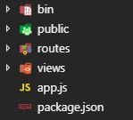

## Express 简介

Express 是一个简洁而灵活的 node.js Web应用框架。Express提供了一个轻量级模块，把Node.js的http模块功能封装在一个简单易用的接口中。Express也扩展了http模块的功能，使你轻松处理服务器的路由、响应、cookie和HTTP请求的状态。使用Express可以充当Web服务器。

使用 Express 可以快速地搭建一个完整功能的网站。


简单来说就是，之前我们每次引入静态文件的时候，都需要自己写路由来解析界面，有了 express 框架，就可以像php一样，放入的静态文件可以自动解析。

还有可以自动生成package.json等创建一个web网站基本的文件架构。总之很方便了。


## Express的安装

### 安装 express 到项目

```js
npm i express -S
```


### 安装 express 快速构建工具

```
npm i express-generator -g
```

（其实安装 express 快速构建工具就可以了，不需要安装express，我们在初始化项目的时候，会自动安装express的。）


### 快速构建项目

```js
express -e expressDemo //项目名
```

项目构建好了会自动创建如下文件：



其中就有了package.json项目依赖文件列表。我们可以看到有我们必须的express依赖。


可以看到有很多依赖项目没有的，怎么一次性下载所由需要的依赖呢？


### 初始化项目

在当前项目目录下使用指令：

```
npm install
```

就可以下载所有package.json下的所有指定版本的依赖（这也就是我之前说的不需要先下载express模块了），最后生成node_modules文件夹。


### 运行项目

在bin文件夹下有个www文件，这个就是类似我们的main.js文件，启动文件了。

我们可以直接使用node命令运行：

```
node ./bin/www
```

或者我们看到在package.json中有个`scripts`属性，其值有个start属性，对应的正是node运行项目的指令，故可以在项目目录下使用：

```
npm run start 
```

也可以将项目跑起来。


有时候我们修改了node后端的代码就需要重启服务，每次都要重启太麻烦了，有没有什么工具可以在修改完服务代码保存的时候自动重启服务呢？

答案是有的，只需要全局安装`supervisor`工具就可以了。

```
npm i supervisor -g
```

然后像node一样启动服务就可以实时监听服务代码的改动自动重启：

```
supervisor ./bin/www
```


## 案例：商品录入

要求：使用express实现商品信息录入MongoDB数据库，并且提取出来展示在列表，具有翻页排序功能。


项目代码过于复杂，略了。只把重点写一下：


`views` 文件夹下的ejs文件时渲染到页面的文件。

这个在app.js已经进行默认说明：

```js
app.set('views', path.join(__dirname, 'views')); // 默认路径为 views
app.set('view engine', 'ejs'); // 默认后缀为ejs
```


所以在我们路由路径`routes` 下的js文件中渲染到前端页面就可以直接写：

```js
res.render('input'); // 不需要写成 res.render('/views/input.ejs');
```


在路由界面，通过下面设置自己的路由文件：

```js
var indexRouter = require('./routes/index');
var usersRouter = require('./routes/users');
var ajaxRouter = require('./routes/ajax');

app.use('/', indexRouter);
app.use('/users', usersRouter);
// 新建自己的关于ajax的路由，便于分类。你非要写到index.js或者users.js谁敢说不行。
app.use('/ajax', ajaxRouter);
```

然后在路由文件里面：（以自己的ajax.js路由为例）

```js
var express = require('express');
var router = express.Router();
let dbc = require("../db");


/* GET users listing. */
// 这里的 '/' 相当于 '/ajax'
router.get('/', function (req, res, next) {
    res.send('respond with a resource');
});

router.post('/inputGoods', function (req, res, next) {
    // req.query  get请求时  通过该参数获取前端发送的数据
    // req.body  post请求时 通过该参数获取前端发送的数据 
    let data = req.body; // { name: '1', price: '2', num: '3' }
    let good = dbc("goods");
    good.insert(data, (err, info) => {
        res.json({
            code: !err ? 200 : 500,
            msg: !err ? '录入数据成功' : '录入数据失败'
        });
    });
});
router.get('/getGoods', function (req, res, next) {
    let good = dbc("goods");
    good.find().toArray((err, list) => {
        if (!err) {
            res.json({
                code: !err ? 200 : 500,
                data: !err ? list : null
            });
        }
    });
});


module.exports = router;
```


这里：`router.get('/', function (req, res, next) ` 这里的 `/` 其实就是对应的 `/ajax` 只不过这个前缀在app.js里面提前写了`app.use('/ajax', ajaxRouter);`。


上面代码中，可以看到有发起`/inputGoods` 路由的，那么我们前端是ajax发起时的地址是什么？是`/inputGoods`吗？

其实不是而是 `/ajax/inputGoods`，因为/ajax在别处写了。

```js
$.ajax({
    type: "post",
    url: "/ajax/inputGoods",
    data: inputObj,
    dataType: "json",
    success: function (res) {
        console.log(res);
    }
});
```


还有一些知识点：

> **res对象api**
>
> `res.render("pagename",data)` 将data数据注入到ejs模板代码中，并且输出到浏览器端(渲染html页面)
>
> `res.redirect(path)` 重定向到指定的路径
>
> `res.json(obj)`  向前端返回对象类型数据
>
> `res.jsonp(obj)`  向前端通过jsonp的方式进行返回数据
>
> `res.send(text)`  向前端发送数据
>
>
>
> **req 属性**
>
> `req.query`  get请求时  通过该参数获取前端发送的数据
>
> `req.body`  post请求时 通过该参数获取前端发送的数据 
>
>
>
> **使得get和post均可访问:**
>
> `render.all()`


ejs文件的一些语法：

```ejs
<!DOCTYPE html>
<html lang="zh-cn">

<head>
    <meta charset="UTF-8">
    <meta name="viewport" content="width=device-width, initial-scale=1.0">
    <meta http-equiv="X-UA-Compatible" content="ie=edge">
    <title>商品列表</title>
</head>

<body>
    <h1>商品列表</h1>
    <ul>
        
        <% list.map(goods=>{ %>
        <li>
            <h3>商品名: <span><%= goods.goodsname %></span></h3>
            <p class="price">价格: <span><%= goods.price %></span></p>
            <p class="discount">折扣: <span><%= goods.discount %></span>折</p>
            <p class="stock">库存: <span><%= goods.stock %></span>件</p>
        </li>
        <% }) %>
        
    </ul>
</body>

</html>
```

> <% 之间插入js代码 %> 
>
> <%= 之间插入变量 %> 


在ejs文件中引入自己的js代码是写在 `public/javascrips` 文件夹下的。

所以在ejs中引入自己的js代码是这样写的：

```ejs
<!-- 这里的完整地址：http://localhost:3000/javascripts/input.js -->
<!-- public就相当于http://localhost:3000 ,这个在app.js写的 -->
<script src="/javascripts/input.js"></script>
```

public就相当于http://localhost:3000 ，这个在app.js里面写好的。

```js
// public 相当于 http://localhost:3000
app.use(express.static(path.join(__dirname, 'public')));
```


## 案例：用户注册登录

注册界面：register.ejs

```ejs
<!DOCTYPE html>
<html lang="en">

<head>
    <meta charset="UTF-8">
    <meta name="viewport" content="width=device-width, initial-scale=1.0">
    <meta http-equiv="X-UA-Compatible" content="ie=edge">
    <title>Document</title>
</head>

<body>
    用户：<input type="text" id="user">
    密码：<input type="text" id="pwd">
    <button>注册</button>
</body>
<script src="http://code.jquery.com/jquery.min.js"></script>
<script>
    $("button").on("click", function () {
        $.ajax({
            type: "post",
            url: "/ajax/register",
            data: {
                name: $("#user").val(),
                pwd: $("#pwd").val()
            },
            dataType: "json",
            success: function (res) {
                console.log(res);
            }
        });
    });
</script>

</html>
```


登录界面：login.ejs

```ejs
<!DOCTYPE html>
<html lang="en">

<head>
    <meta charset="UTF-8">
    <meta name="viewport" content="width=device-width, initial-scale=1.0">
    <meta http-equiv="X-UA-Compatible" content="ie=edge">
    <title>Document</title>
</head>

<body>
    用户：<input type="text" id="user">
    密码：<input type="text" id="pwd">
    <button>登录</button>
</body>
<script src="http://code.jquery.com/jquery.min.js"></script>
<script>
    $("button").on("click", function() {
        $.ajax({
            type: "post",
            url: "/ajax/login",
            data: {
                name: $("#user").val(),
                pwd: $("#pwd").val()
            },
            dataType: "json",
            success: function({ msg }) {
                alert(msg);
            }
        });
    });
</script>

</html>
```


页面渲染：index.js

```js
router.get('/register', (req, res) => res.render('register'))
router.get('/login', (req, res) => res.render('login'))
```


登录和注册的ajax请求：ajax.js

```js
router.post('/register', function(req, res, next) {
    let data = req.body; // { name: '1', price: '2', num: '3' }
    let user = dbc("users");
    user.insert(data, (err, info) => {
        res.json({
            code: !err ? 200 : 500,
            msg: !err ? '录入数据成功' : '录入数据失败'
        });
    });
});

router.post('/login', function(req, res, next) {
    let { name, pwd } = req.body; // { name: '1', price: '2', num: '3' }
    let user = dbc("users");
    user.find({ name }).toArray((err, list) => {
        if (!err) {
            if (list.length == 0) {
                res.json({
                    msg: '用户名不存在'
                })
            } else {
                if (list[0].pwd == pwd) {
                    res.json({
                        msg: '登录成功'
                    })
                } else {
                    res.json({
                        msg: '密码错误'
                    })
                }
            }

        } else {
            console.log("数据查询失败");
        }
    });
});

```

