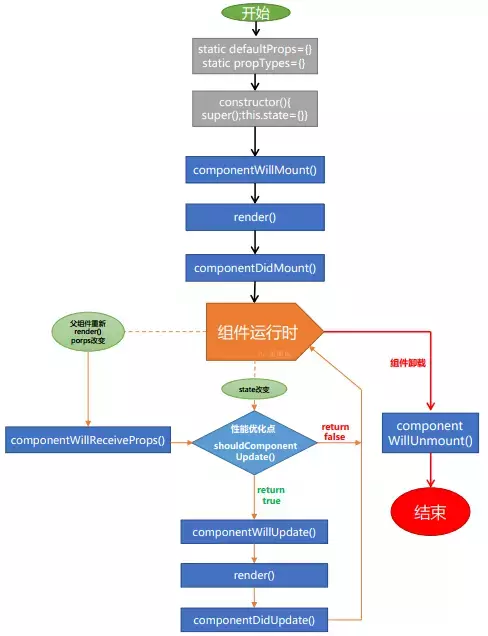

## 一、react内容插槽

定义一个slot组件，然后往这个组件中添加数据，父组件调用这个子组件：

```jsx
import { Slot } from './Slot';

ReactDOM.render(<Slot>我是插入的内容</Slot></Slot>, document.getElementById('app'));
```

slot组件：通过`this.props.children`获取插入的内容。

```jsx
export class Slot extends React.Component {
    constructor() {
        super();
    }

    render() {
        return (
            <div>{this.props.children}</div>
        );
    }
}
```


## 二、react的生命周期




react的生命周期大概分为：

加载期：

- 加载前：`componentWillMount`
- 加载后：`componentDidMount`


更新期：

- 接收props之前 `componentWillReceiveProps`  (仅在props发生变化时触发，会先于shouldComponentUpdate 触发，当接收props参数的时候。)
- 允许更新 `shouldComponentUpdate`  （以下在props和state发生变化时均会触发）

shouldComponentUpdate函数返回false表示阻止更新。

- 更新前 `componentWillUpdate`
- 更新后  `componentDidUpdate`


卸载期：

- 卸载前 `componentWillUnmount`
- （没有卸载后）


我觉得上图已经很清晰展示这些函数什么时候会被调用，当然还有个在线图表可以参考：http://projects.wojtekmaj.pl/react-lifecycle-methods-diagram/


这些函数还有参数：

`shouldComponentUpdate(props,state)`： // props和state代表即将到来的值

`componentWillUpdate(props,state)`：// props和state代表即将到来的值

`componentDidUpdate(props,state)`：// props和state代表修改前的值

`componentWillReceiveProps(willProps)` // willProps代表即将到来的值