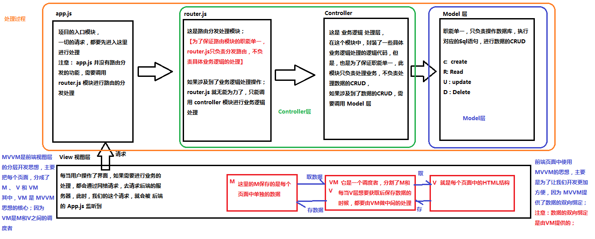

>大家好，这里是「 从零开始学 Web 系列教程 」，并在下列地址同步更新......
>
> - github：https://github.com/Daotin/Web
> - 微信公众号：[Web前端之巅](https://github.com/Daotin/pic/raw/master/wx.jpg)
> - 博客园：http://www.cnblogs.com/lvonve/
> - CSDN：https://blog.csdn.net/lvonve/
>
> 在这里我会从 Web 前端零基础开始，一步步学习 Web 相关的知识点，期间也会分享一些好玩的项目。现在就让我们一起进入 Web 前端学习的冒险之旅吧！


## 一、Vue.js 概述

### 1、什么是Vue.js

Vue.js 是目前最火的一个前端框架，React是最流行的一个前端框架（React除了开发网站，还可以开发手机App， Vue语法也是可以用于进行手机App开发的，需要借助于Weex）

Vue.js 是前端的**主流框架之一**，和Angular.js、React.js 一起，并成为前端三大主流框架！

Vue.js 是一套构建用户界面的框架，**只关注视图层**，它不仅易于上手，还便于与第三方库或既有项目整合。（Vue有配套的第三方类库，可以整合起来做大型项目的开发）。

在Vue中，一个核心的概念，就是让用户不再操作DOM元素，解放了用户的双手，让程序员可以更多的时间去关注业务逻辑；


### 2、框架和库的区别

**框架**：是一套完整的解决方案；对项目的侵入性较大，项目如果需要更换框架，则需要重新架构整个项目。

**库（插件）**：提供某一个小功能，对项目的侵入性较小，如果某个库无法完成某些需求，可以很容易切换到其它库实现需求。（比如从 jQuery 切换到 Zepto 等）


### 3、MVC 与 MVVM 区别与联系

MVC 是后端的分层开发概念；

**M 为数据层，V 视图层，C 逻辑层。**

MVVM是前端视图层的概念，主要关注于 视图层分离，也就是说：MVVM把前端的视图层，分为了 三部分 Model, View , VM ViewModel。

**其中 VM 是中间层，负责协调 V  层 和 M 层，V 层即视图层（对应的就是DOM元素），就是我们的网页 html 结构，M 层就是网页里面的数据（对应的就是JavaScript对象）。**


下图为 MVC 和 MVVM 的联系图示：




## 二、Vue.js 基本结构

Vue.js 的基本结构主要分三块：

**1、导入 Vue 的包；**

**2、body 中的设置一个被 vue 控制的区域（元素）；**

**3、在 script 中 new 一个 vue 实例，参数为一个对象，对象中一般有三个元素为 `el`，`data`，`methods`**

el 则关联 body 中被 vue 控制的元素的 id 或 类名。

data 则存放页面的数据；

methods 为页面事件对象集合。


示例：

```html
<!DOCTYPE html>
<html lang="en">

<head>
  <meta charset="UTF-8">
  <meta name="viewport" content="width=device-width, initial-scale=1.0">
  <meta http-equiv="X-UA-Compatible" content="ie=edge">
  <title>Document</title>
  <!-- 1. 导入Vue的包 -->
  <script src="./lib/vue-2.4.0.js"></script>
</head>

<body>
  <!-- 将来 new 的Vue实例，会控制这个 元素中的所有内容 -->
  <!-- Vue 实例所控制的这个元素区域，就是我们的 V  -->
  <div id="app">
    <p>{{ msg }}</p>
  </div>

  <script>
    // 2. 创建一个Vue的实例
    // 当我们导入包之后，在浏览器的内存中，就多了一个 Vue 构造函数
    //  注意：我们 new 出来的这个 vm 对象，就是我们 MVVM中的 VM调度者
    var vm = new Vue({
      el: '#app',  // 表示，当前我们 new 的这个 Vue 实例，要控制页面上的哪个区域
      // 这里的 data 就是 MVVM中的 M，专门用来保存 每个页面的数据的
      data: { // data 属性中，存放的是 el 中要用到的数据
        msg: '欢迎学习Vue'; // 通过 Vue 提供的指令，很方便的就能把数据渲染到页面上，程序员不再手动操作DOM元素了【前端的Vue之类的框架，不提倡我们去手动操作DOM元素了】
      }
    })
  </script>
</body>

</html>
```

>   {{ msg }} ：在 html 中可以直接使用 **双重大括号** 的方式使用 data 中的数据。


## 三、Vue 指令

### 1、插值表达式

插值表达式就是以**双重大括号** ，类似 ` {{ msg }}`  的形式插入到 html 代码中。


### 2、v-cloak

在 使用 `{{ msg }}` 的方式插入数据的时候，如果网速特别慢的话，  `{{ msg }}`  所代表的值不会立即显示出来，而会显示  {{ msg }} 这个字符串本身，怎么解决这个问题呢？

**使用 v-cloak 和 CSS 表达式结合，能够解决插值表达式闪烁的问题，这样会在网络未加载完时，不显示字符串本身。**

示例：

```html
<style>
  [v-cloak] {
    display: none;
  }
</style>
...
<p v-cloak> {{ msg }} </p>
```


### 3、v-text

默认 v-text 是没有闪烁问题的，但是 v-text 会覆盖元素中原本的内容，而 v-cloak 只会替换插值表达式，不会把 整个元素的内容清空。

```html
<span v-text="msg"></span>
```


### 4、v-html 

**v-text 知识插入的纯文本格式内容，而 v-html 可以插入为 html 标签的代码，并解析出来。**

```html
<span v-html="msg"></span>
...
data: {
  msg: '<h1>哈哈，我是一个大大的H1， 我大，我骄傲</h1>'
},
```


### 5、v-bind

v-bind 是 Vue中，提供的用于**绑定属性**的指令。

>   注意： `v-bind:` 指令可以被简写为` : `

```html
<input type="button" value="按钮" v-bind:title="mytitle + '123'">
...
data: {
  mytitle: '这是一个自己定义的title'
},
```

> title 里面的内容就不是字符串了，而是会将 data 中的变量进行替换得到一个字符串整体。


### 6、v-on

v-on 是 Vue 中的事件绑定机制。

>   注意：` v-on:` 指令可以被简写为`@`

```html
<input type="button" value="按钮" :title="mytitle + '123'" v-on:click="show">
...
data: {
  mytitle: '这是一个自己定义的title'
},
methods: { // 这个 methods属性中定义了当前Vue实例所有可用的方法
  show: function () {
  	alert('Hello')
  }
}
```

在点击按钮的时候，会自动调用 methods 中的 show 方法。


### 案例：字体滚动播放

```html
<!DOCTYPE html>
<html lang="en">

<head>
    <meta charset="UTF-8">
    <meta name="viewport" content="width=device-width, initial-scale=1.0">
    <meta http-equiv="X-UA-Compatible" content="ie=edge">
    <title>Document</title>
    <script src="./lib/vue-2.4.0.js"></script>
</head>

<body>

    <div id="box">
        <input type="button" value="摇起来" id="btn1" @click="move">
        <input type="button" value="停下来" id="btn2" @click="stop">
        <h2 v-text="msg"></h2>
    </div>

    <script>
        var vm = new Vue({
            el: "#box",
            data: {
                msg: "落霞与孤鹜齐飞，秋水共长天一色。",
                timeId: null
            },
            methods: {
                move: function () {
                    if (this.timeId != null) {
                        clearInterval(this.timeId);
                    }

                    var that = this;
                    this.timeId = setInterval(function () {
                        var start = that.msg.substring(0, 1);
                        var end = that.msg.substring(1);
                        that.msg = end + start;
                    }, 200);
                },
                stop: function () {
                    clearInterval(this.timeId);
                }
            }
        });
    </script>

</body>

</html>
```

>   注意：
>
>   1、在 VM 对象实例中，如果想要获取 data 上的数据，或者 想要调用 methods 中的 方法，必须通过 `this.数据属性名`  或  `this.方法名` 来进行访问，这里的 this，就表示 我们 new 出来的  VM 实例对象。
>
>   2、VM实例，会自动监听自己身上 data 中所有数据的改变，只要数据一发生变化，就会自动把最新的数据，从data 上同步到页面中去；【好处：程序员只需要关心数据，不需要考虑如何重新渲染DOM页面】


### 7、v-model

v-bind 只能实现数据的单向绑定，从 M 自动绑定到 V（即**修改 data 的数据，自动同步到 html**）， 无法实现数据的双向绑定。

使用  v-model 指令，可以实现 表单元素和 Model 中数据的双向数据绑定（**不仅可以修改 data 的数据，自动同步到 html，也可以修改 html 的代码，同步到 data 数据**）。

>   注意： v-model 只能运用在 **表单元素**中。


示例：

```html
<input type="text" style="width:100%;" v-model="msg">
...
data: {
	msg: 'hello vue.'
},
```


### 案例：简单的计算器

```html
<!DOCTYPE html>
<html lang="en">

<head>
    <meta charset="UTF-8">
    <title>Document</title>
    <script src="./lib/vue-2.4.0.js"></script>
</head>

<body>
    <div id="app">
        <input type="text" v-model="n1">

        <select v-model="opt">
            <option value="+">+</option>
            <option value="-">-</option>
            <option value="*">*</option>
            <option value="/">/</option>
        </select>

        <input type="text" v-model="n2">
        <input type="button" value="=" @click="calc">
        <input type="text" v-model="result">
    </div>

    <script>
        // 创建 Vue 实例，得到 ViewModel
        var vm = new Vue({
            el: '#app',
            data: {
                n1: 0,
                n2: 0,
                result: 0,
                opt: '+'
            },
            methods: {
                calc: function() { // 计算器算数的方法  
                    // 逻辑：
                    switch (this.opt) {
                        case '+':
                            this.result = parseFloat(this.n1) + parseFloat(this.n2)
                            break;
                        case '-':
                            this.result = parseFloat(this.n1) - parseFloat(this.n2)
                            break;
                        case '*':
                            this.result = parseFloat(this.n1) * parseFloat(this.n2)
                            break;
                        case '/':
                            this.result = parseFloat(this.n1) / parseFloat(this.n2)
                            break;
                    }
                }
            }
        });
    </script>
</body>

</html>
```


### 8、v-for

**8.1、v-for 循环普通数组**

我们之前如果要循环赋值给 p 标签 data中 list=[1,2,3,4,5,6]; 数组的话，会这样写：

```html
<body>
    <div id="app">
        <p>{{list[0]}}</p>
        <p>{{list[1]}}</p>
        <p>{{list[2]}}</p>
        <p>{{list[3]}}</p>
        <p>{{list[4]}}</p>
    </div>

    <script>
        var vm = new Vue({
            el: '#app',
            data: {
                list: [1, 2, 3, 4, 5, 6]
            },
            methods: {}
        });
    </script>
</body>
```

这样的话，就会很繁琐。而 v-for 会提供循环遍历 list 数组来给 p 标签赋值。如下：

```html
<body>
    <div id="app">
        <p v-for="(item, i) in list">索引：{{i}} --- 项：{{item}}</p>
        <!-- 索引：0 --- 项：1
          	 索引：1 --- 项：2
          	 索引：2 --- 项：3
          	 索引：3 --- 项：4
          	 索引：4 --- 项：5
          	 索引：5 --- 项：6 -->
    </div>

    <script>
        var vm = new Vue({
            el: '#app',
            data: {
                list: [1, 2, 3, 4, 5, 6]
            },
            methods: {}
        });
    </script>
</body>
```


**8.2、v-for 循环对象数组**

```html
<body>
  <div id="app">
    <p v-for="(user, i) in list">Id：{{ user.id }} --- 名字：{{ user.name }} --- 索引：{{i}}</p>
  </div>

  <script>
    var vm = new Vue({
      el: '#app',
      data: {
        list: [
          { id: 1, name: 'zs1' },
          { id: 2, name: 'zs2' },
          { id: 3, name: 'zs3' },
          { id: 4, name: 'zs4' }
        ]
      },
      methods: {}
    });
  </script>
</body>
```


**8.3、v-for 循环对象**

```html
<body>
  <div id="app">
    <!-- 注意：在遍历对象身上的键值对的时候， 除了 有  val  key  ,在第三个位置还有 一个 索引  -->
    <p v-for="(val, key, i) in user">值是： {{ val }} --- 键是： {{key}} -- 索引： {{i}}</p>
  </div>

  <script>
    var vm = new Vue({
      el: '#app',
      data: {
        user: {
          id: 1,
          name: 'Tony Stark',
          gender: '男'
        }
      },
      methods: {}
    });
  </script>
</body>
```


**8.4、v-for 循环数字**

```html
<body>
  <div id="app">
    <!-- in 后面我们放过普通数组，对象数组，对象，还可以放数字 -->
    <p v-for="count in 10">这是第 {{ count }} 次循环</p>
  </div>

  <script>
    // 创建 Vue 实例，得到 ViewModel
    var vm = new Vue({
      el: '#app',
      data: {},
      methods: {}
    });
  </script>
</body>
```

>   注意：如果使用 v-for 迭代数字的话，前面的 count 值从 1 开始。


**8.5、v-for 循环 key 属性**

key 属性可以使得每一遍历的项是唯一的。

```html
<body>
  <div id="app">

    <div>
      <label>Id:
        <input type="text" v-model="id">
      </label>

      <label>Name:
        <input type="text" v-model="name">
      </label>

      <input type="button" value="添加" @click="add">
    </div>

    <!-- 注意： v-for 循环的时候，key 属性只能使用 number或者string -->
    <!-- 注意： key 在使用的时候，必须使用 v-bind 属性绑定的形式，指定 key 的值 -->
    <!-- 在组件中，使用v-for循环的时候，或者在一些特殊情况中，如果 v-for 有问题，必须在使用 v-for 的同时，指定 唯一的 字符串/数字 类型 :key 值 -->
    <p v-for="item in list" :key="item.id">
      <input type="checkbox">{{item.id}} --- {{item.name}}
    </p>
  </div>

  <script>
    // 创建 Vue 实例，得到 ViewModel
    var vm = new Vue({
      el: '#app',
      data: {
        id: '',
        name: '',
        list: [
          { id: 1, name: '李斯' },
          { id: 2, name: '嬴政' },
          { id: 3, name: '赵高' },
          { id: 4, name: '韩非' },
          { id: 5, name: '荀子' }
        ]
      },
      methods: {
        add() { // 添加方法
          this.list.unshift({ id: this.id, name: this.name })
        }
      }
    });
  </script>
</body>
```


### 9、v-if/v-show

v-if 和 v-show 都可以控制元素的显示与否。但是实现原理不同。

**v-if：每次都会重新删除或创建元素。**

**v-show ： 每次不会重新进行DOM的删除和创建操作，只是切换了元素的 display:none 样式。**

所以，如果元素涉及到频繁的切换，最好不要使用 v-if, 而是推荐使用 v-show；

如果元素可能永远也不会被显示出来被用户看到，则推荐使用 v-if。

```html
<h3 v-if="true">这是用v-if控制的元素</h3>
<h3 v-show="true">这是用v-show控制的元素</h3>
```


## 四、事件修饰符

+ `.stop`  ：  阻止冒泡

+ `.prevent` ：    阻止默认事件（比如点击超链接，阻止跳转到默认网页）

+ `.capture`  ：  添加事件侦听器时使用事件捕获模式（与冒泡模式相反）

+ `.self`  ：只当事件在该元素本身（比如不是子元素）触发时触发回调

+ `.once`  ：事件只触发一次，之后还原标签本身的行为。


示例：

```html
    <div id="app">

        <!-- 使用  .stop  阻止冒泡 -->
        <div class="inner" @click="div1Handler">
            <input type="button" value="戳他" @click.stop="btnHandler">
        </div>

        <!-- 使用 .prevent 阻止默认行为（跳转到百度首页） -->
        <a href="http://www.baidu.com" @click.prevent="linkClick">有问题，先去百度</a>

        <!-- 使用  .capture 实现捕获触发事件的机制：跟冒泡相反，从外到里-->
        <div class="inner" @click.capture="div1Handler">
            <input type="button" value="戳他" @click="btnHandler">
        </div>

        <!-- 使用 .self 实现只有点击当前元素时候，才会触发事件处理函数 -->
        <div class="inner" @click.self="div1Handler">
            <input type="button" value="戳他" @click="btnHandler">
        </div>

        <!-- 使用 .once 只触发一次事件处理函数（如下案例只触发一次点击事件，之后还原标签本身的行为） -->
        <a href="http://www.baidu.com" @click.prevent.once="linkClick">有问题，先去百度</a>

    </div>
```


`.stop` 和 `.self` 的区别：

```html
        <!-- stop 会阻止冒泡行为 -->
        <div class="outer" @click="div2Handler">
            <div class="inner" @click="div1Handler">
                <input type="button" value="戳他" @click.stop="btnHandler">
            </div>
        </div>

        <!-- .self 只会阻止自己身上冒泡行为的触发，并不会真正阻止冒泡的行为 -->
        <div class="outer" @click="div2Handler">
            <div class="inner" @click.self="div1Handler">
                <input type="button" value="戳他" @click="btnHandler">
            </div>
        </div>
```


## 五、Vue中的样式

### 1、class 样式

```html
<!DOCTYPE html>
<html lang="en">

<head>
    <meta charset="UTF-8">
    <title>Document</title>
    <script src="./lib/vue-2.4.0.js"></script>
    <style>
        .red {
            color: red;
        }

        .thin {
            font-weight: 200;
        }

        .italic {
            font-style: italic;
        }

        .active {
            letter-spacing: 0.5em;
        }
    </style>
</head>

<body>
    <div id="app">
        <!-- <h1 class="red thin">这是一个很大很大的H1，大到你无法想象！！！</h1> -->

        <!-- 第一种使用方式，直接传递一个数组，注意： 这里的 class 需要使用  v-bind 做数据绑定 -->
        <h1 :class="['thin', 'italic']">这是一个很大很大的H1</h1>

        <!-- 在数组中使用三元表达式 -->
        <h1 :class="['thin', 'italic', flag?'active':'']">这是一个很大很大的H1</h1>

        <!-- 在数组中使用对象来代替三元表达式，提高代码的可读性 -->
        <h1 :class="['thin', 'italic', {active:flag} ]">这是一个很大很大的H1</h1>

        <!-- 在为 class 使用 v-bind 绑定 对象的时候，对象的属性是类名，由于 对象的属性可带引号，也可不带引号，所以 这里我没写引号；  属性的值 是一个标识符 -->
        <h1 :class="classObj">这是一个很大很大的H1</h1>


    </div>

    <script>
        // 创建 Vue 实例，得到 ViewModel
        var vm = new Vue({
            el: '#app',
            data: {
                flag: true,
                classObj: {
                    red: true,
                    thin: true,
                    italic: false,
                    active: false
                }
            },
            methods: {}
        });
    </script>
</body>

</html>
```

>   注意：
>
>   1、class 样式需要使用 v-bind 绑定。
>
>   2、class 类样式可以是数组和对象集合。


### 2、style 样式

可以是对象，也可以是对象数组。

```html
<body>
    <div id="app">
        <!-- 对象就是无序键值对的集合 -->
        <h1 :style="styleObj1">这是一个h1</h1>
        <h1 :style="[ styleObj1, styleObj2 ]">这是一个h1</h1>
    </div>

    <script>
        var vm = new Vue({
            el: '#app',
            data: {
                styleObj1: {
                    color: 'red',
                    'font-weight': 200
                },
                styleObj2: {
                    'font-style': 'italic'
                }
            },
            methods: {}
        });
    </script>
</body>
```

>   注意：要绑定到 style 样式。


