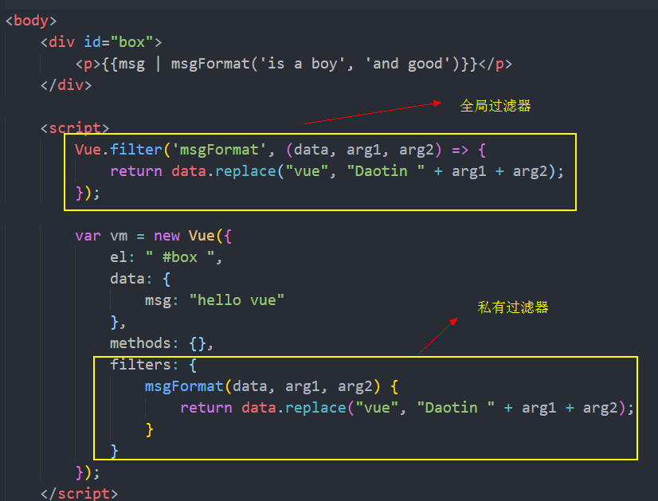

>大家好，这里是「 从零开始学 Web 系列教程 」，并在下列地址同步更新......
>
> - github：https://github.com/Daotin/Web
> - 微信公众号：[Web前端之巅](https://github.com/Daotin/pic/raw/master/wx.jpg)
> - 博客园：http://www.cnblogs.com/lvonve/
> - CSDN：https://blog.csdn.net/lvonve/
>
> 在这里我会从 Web 前端零基础开始，一步步学习 Web 相关的知识点，期间也会分享一些好玩的项目。现在就让我们一起进入 Web 前端学习的冒险之旅吧！


## 一、品牌管理案例

如下图，

1、实现输入id和name后，点击add按钮，添加到table中；

2、点击数据的del，可以删除这条数据。


代码：

```html
<!DOCTYPE html>
<html lang="en">

<head>
    <meta charset="UTF-8">
    <title>Document</title>
    <script src="./lib/vue-2.4.0.js"></script>
    <style>
        * {
            padding: 0;
            margin: 0;
            position: relative;
        }
      
		/* 实现任意无宽高盒子居中显示 */
        #app {
            position: absolute;
            left: 50%;
            top: 100px;
            transform: translateX(-50%);
        }

        .box {
            width: 500px;
            height: 40px;
            background-color: #ccc;
            display: inline-block;
            text-align: center;
            line-height: 40px;
            border: 1px solid #aaa;
            box-sizing: border-box;
            border-bottom: none;
        }

        .tb {
            width: 500px;
            text-align: center;
            border-collapse: collapse;
            border-color: #ccc;
        }
    </style>
</head>

<body>
    <div id="app">
        <div class="box">
            <label for="id">
                ID:
                <input type="text" id="id" v-model="id">
            </label>
            <label for="name">
                name:
                <input type="text" id="name" v-model="name">
            </label>
            <input type="button" value="add" @click="addClick">
        </div>

        <table border="1" cellspacing="0" class="tb">
            <tr v-for="item in list">
                <td>{{item.id}}</td>
                <td>{{item.name}}</td>
                <td>{{item.ctime}}</td>
                <td>
                    <!-- 绑定的事件是可以传参数的，这里传入需要删除的对象id -->
                    <a href="javascript:;" @click.prevent="delClick(item.id)">del</a>
                </td>
            </tr>
        </table>
    </div>


    <script>
        var vm = new Vue({
            el: "#app",
            data: {
                id: "",
                name: "",
                list: [{
                        id: 1,
                        name: 'tony',
                        ctime: new Date()
                    },
                    {
                        id: 2,
                        name: 'stark',
                        ctime: new Date()
                    }
                ]
            },
            methods: {
                addClick() {
                    // 1.获取表单数据
                    // 2.组织出一个对象
                    // 3.将对象添加到data中（不需要重新渲染页面）
                    let item = {
                        id: this.id,
                        name: this.name,
                        ctime: new Date()
                    };
                    if ((this.id != "") && (this.name != "")) {
                        this.list.push(item);
                    }
                    // 4.最后将表单清空
                    this.id = this.name = "";
                },
                delClick(id) {
                    // 1.根据id找到索引（循环查找）
                    // 2.调用数组的 splice方法删除
                    this.list.filter((item, index) => {
                        if (item.id == id) {
                            this.list.splice(index, 1);
                            return true;
                        }
                    });

                }
            }

        });
    </script>
</body>
</html>
```

>   注意：
>
>   1、事件名后面可以加括号（`@click="addClick"` 等价于 `@click="addClick()` ，这样写的话，就可以传参。）


### 1、增加搜索需求


在Query中输入字符串，如果name项中包括Query中的字符串，则显示。


分析：

如果要满足条件才显示相关行，那么 `<tr v-for="item in list">` 中的list就是一个可变的。这里我们使用一个函数，函数里面进行判断是否包含Query中的字符串，然后将包含的拷贝到新数组中，填充到list的位置：

`<tr v-for="item in search(keywords)">`


```js
methods: {
                addClick() {
                  //...
                },
                delClick(id) {
			      //...
                },
                // 添加的用于判断的函数
                search(keywords) {
                    // 定义新数组保存符合条件的项
                    let newList = [];
                    this.list.forEach((item, index) => {
                        // 包含则返回true
                        if (item.name.includes(keywords)) {
                            newList.push(item);
                        }
                    });
                    return newList;
                }
            }
```


## 二、过滤器

vue 允许自定义过滤器，可被用作一些常见的文本格式化。

过滤器只能用在两个地方：**插值表达式**和 **`v-bind`表达式** 。


### 1、全局过滤器

基本用法：

```html
<body>
    <div id="box">
        <p>{{msg | msgFormat}}</p>
    </div>

    <script>
        // 使用Vue.filter来定义一个过滤器：
        // 第一个参数：过滤器函数名称
        // 第二个参数：过滤器函数体
        // 过滤器的参数就是管道符的前面待处理的字符串。
        Vue.filter('msgFormat', (data) => {
            return data.replace("vue", "Daotin");
        });

        var vm = new Vue({
            el: " #box ",
            data: {
                msg: "hello vue"
            },
            methods: {}
        });
    </script>
</body>
```

>   1、使用 Vue.filter(); 来定义一个过滤器。
>
>   2、第一个参数：过滤器函数名称；第二个参数：过滤器函数体
>
>   3、过滤器的参数就是**管道符的前面待处理的字符串**。


**插值表达式里的过滤器函数可以带参数：**

相应的，在 Vue.filter('msgFormat', (data, arg1,arg2,...)  中msgFormat 的参数从第二位开始放置。

可以带多个参数。

```html
<body>
    <div id="box">
        <p>{{msg | msgFormat('is a boy', 'and good')}}</p>
    </div>

    <script>
        // 使用Vue.filter来定义一个过滤器：
        // 第一个参数：过滤器函数名称
        // 第二个参数：过滤器函数体
        // 过滤器的参数就是管道符的前面待处理的字符串。
        Vue.filter('msgFormat', (data, arg1, arg2) => {
            return data.replace("vue", "Daotin " + arg1 + arg2);
        });

        var vm = new Vue({
            el: " #box ",
            data: {
                msg: "hello vue"
            },
            methods: {}
        });
    </script>
</body>
```


**使用全局过滤器格式化品牌管理案例的 ctime：**

```js
<td>{{item.ctime | ctimeFormat}}</td>
...

// ctime 过滤器
Vue.filter('ctimeFormat', (data) => {
  let time = new Date(data);

  let year = time.getFullYear();
  let month = time.getMonth() + 1;
  let day = time.getDate();
  let hour = time.getHours();
  let minute = time.getMinutes();

  return `${year}-${month}-${day} ${hour}:${minute}`;
});
```


### 2、私有过滤器

全局过滤器就是如果有多个vm实例的话，所有的VM实例都可以使用。

全局过滤器书写在 script直接标签下。

而私有过滤器书写在VM对象中：



>   注意：过滤器的调用原则是**就近原则**，即先调用私有过滤器再调用全局过滤器。


**padStart和padEnd**

```js
// ctime 过滤器
Vue.filter('ctimeFormat', (data) => {
    let time = new Date(data);

    let year = time.getFullYear();
    let month = (time.getMonth() + 1).toString().padStart(2, '0');
    let day = (time.getDate()).toString().padStart(2, '0');
    let hour = (time.getHours()).toString().padStart(2, '0');
    let minute = (time.getMinutes()).toString().padStart(2, '0');
    let second = (time.getSeconds()).toString().padStart(2, '0');

    return `${year}-${month}-${day} ${hour}:${minute}:${second}`;
});
```

>   使用ES6中的字符串新方法 `String.prototype.padStart(maxLength, fillString='')` 或 `String.prototype.padEnd(maxLength, fillString='')`来填充字符串；
>
>   padStart：从开头填充
>
>   padEnd：从结尾填充
>
>   maxLength：填充后最大的长度
>
>   fillString：需要填充的字符串（fillString=''，不填则以空字符填充）


## 三、按键修饰符

我们现在有个需求就是输入ID和name后不点击add按钮，而是按下回车键也需要添加到列表中。

我们可以在name输入框中加入按键抬起事件，并且指定是enter键抬起时才触发。

```html
<label for="name">
  name:
  <input type="text" id="name" v-model="name" @keyup.enter="addClick">
```

>   `.enter` ： 就是按键修饰符。 


系统提供的按键修饰符有：

-   `.enter`
-   `.tab`
-   `.delete` (捕获“删除”和“退格”键)
-   `.esc`
-   `.space`
-   `.up`
-   `.down`
-   `.left`
-   `.right`


如果我们想自定义其他的按键怎么办呢？

通过`Vue.config.keyCodes.f2 = 113;` ；可以将f2作为按键修饰符添加到系统按键修饰符中。

具体每个按键的值是多少？下面是常见的按键的码。

```
keyCode 8 = BackSpace BackSpace
keyCode 9 = Tab Tab
keyCode 12 = Clear
keyCode 13 = Enter
keyCode 16 = Shift_L
keyCode 17 = Control_L
keyCode 18 = Alt_L
keyCode 19 = Pause
keyCode 20 = Caps_Lock
keyCode 27 = Escape Escape
keyCode 32 = space
keyCode 33 = Prior
keyCode 34 = Next
keyCode 35 = End
keyCode 36 = Home
keyCode 37 = Left
keyCode 38 = Up
keyCode 39 = Right
keyCode 40 = Down
keyCode 41 = Select
keyCode 42 = Print
keyCode 43 = Execute
keyCode 45 = Insert
keyCode 46 = Delete
keyCode 47 = Help
keyCode 48 = 0 equal braceright
keyCode 49 = 1 exclam onesuperior
keyCode 50 = 2 quotedbl twosuperior
keyCode 51 = 3 section threesuperior
keyCode 52 = 4 dollar
keyCode 53 = 5 percent
keyCode 54 = 6 ampersand
keyCode 55 = 7 slash braceleft
keyCode 56 = 8 parenleft bracketleft
keyCode 57 = 9 parenright bracketright
keyCode 65 = a A
keyCode 66 = b B
keyCode 67 = c C
keyCode 68 = d D
keyCode 69 = e E EuroSign
keyCode 70 = f F
keyCode 71 = g G
keyCode 72 = h H
keyCode 73 = i I
keyCode 74 = j J
keyCode 75 = k K
keyCode 76 = l L
keyCode 77 = m M mu
keyCode 78 = n N
keyCode 79 = o O
keyCode 80 = p P
keyCode 81 = q Q at
keyCode 82 = r R
keyCode 83 = s S
keyCode 84 = t T
keyCode 85 = u U
keyCode 86 = v V
keyCode 87 = w W
keyCode 88 = x X
keyCode 89 = y Y
keyCode 90 = z Z
keyCode 96 = KP_0 KP_0
keyCode 97 = KP_1 KP_1
keyCode 98 = KP_2 KP_2
keyCode 99 = KP_3 KP_3
keyCode 100 = KP_4 KP_4
keyCode 101 = KP_5 KP_5
keyCode 102 = KP_6 KP_6
keyCode 103 = KP_7 KP_7
keyCode 104 = KP_8 KP_8
keyCode 105 = KP_9 KP_9
keyCode 106 = KP_Multiply KP_Multiply
keyCode 107 = KP_Add KP_Add
keyCode 108 = KP_Separator KP_Separator
keyCode 109 = KP_Subtract KP_Subtract
keyCode 110 = KP_Decimal KP_Decimal
keyCode 111 = KP_Divide KP_Divide
keyCode 112 = F1
keyCode 113 = F2
keyCode 114 = F3
keyCode 115 = F4
keyCode 116 = F5
keyCode 117 = F6
keyCode 118 = F7
keyCode 119 = F8
keyCode 120 = F9
keyCode 121 = F10
keyCode 122 = F11
keyCode 123 = F12
keyCode 124 = F13
keyCode 125 = F14
keyCode 126 = F15
keyCode 127 = F16
keyCode 128 = F17
keyCode 129 = F18
keyCode 130 = F19
keyCode 131 = F20
keyCode 132 = F21
keyCode 133 = F22
keyCode 134 = F23
keyCode 135 = F24
```


示例：

```html
<input type="text" id="name" v-model="name" @keyup.f2="addClick">
  
 //...
  
<script>
    Vue.config.keyCodes.f2 = 113;
</script>
```


## 四、自定义指令

除了核心功能默认内置的指令 (`v-model` 等)，Vue 也允许注册自定义指令。自定义指令是以 `v-`开头的指令。

比如我们想让品牌管理案例中，在刚进入页面的时候，就获取 Query输入框的焦点，但是vue并没有提供这样的指令。

之前我们可以通过获取DOM元素，然后使用 `DOM元素.focus();` 方法来获取焦点。但是在vue里面不推荐获取DOM元素的方式。这时我们可以使用自定义指令的方式来达到获取焦点。

比如：我们想定义一个`v-focus` 的指令来获取焦点。

```html
<label for="sel">
  Query:
  <input type="text" id="sel" v-model="keywords" v-focus>
</label>

<script>
	// 自定义全局指令 v-focus，为绑定的元素自动获取焦点：
        Vue.directive('focus', {
            inserted: function (el) { // inserted 表示被绑定元素插入父节点时调用
                el.focus();
            }
        });
</script>
```

>   1、定义自定义指令的时候，不需要加`v-` ，使用的时候需要加。
>
>   2、注意： 在每个 函数中，第一个参数，永远是 `el` ，表示 被绑定了指令的那个元素，这个 el 参数，是一个原生的JS对象。
>
>   3、和JS行为有关的操作，最好在 `inserted` 中去执行


### 1、钩子函数

inserted 是钩子函数，类似的钩子函数还有几个，但是应用场景不同：

-   `inserted` ：被绑定元素插入DOM元素时调用一次（**从内存渲染到页面时如果绑定了 inserted 就执行**）。
-   `bind`：只调用一次，指令第一次绑定到元素时调用。在这里可以进行一次性的初始化设置（**在代码加载到内存中的时候，如果绑定了bind就执行**，比如样式style的设定，使用bind绑定）。
-   `update`：所在组件的 VNode 更新时调用，**但是可能发生在其子 VNode 更新之前**。指令的值可能发生了改变，也可能没有。


>   总结：一般：
>
>   **1、与JS行为相关的操作在inserted中执行；**
>
>   **2、与样式相关的在bind中执行。**


### 2、钩子函数参数

指令钩子函数会被传入以下参数：

- `el`：指令所绑定的元素，可以用来直接操作 DOM 。
- `binding`：一个对象，包含以下属性：
  - `name`：指令名，不包括 `v-` 前缀。
  - `value`：指令的绑定值，例如：`v-my-directive="1 + 1"` 中，绑定值为 `2`。
  - `expression`：字符串形式的指令表达式。例如 `v-my-directive="1 + 1"` 中，表达式为 `"1 + 1"`。
  - ...
- ...


我们可以为自定义指令赋值，比如我们想给Query文本框的字体颜色赋值：

```html
<label for="sel">
  Query:
  <input type="text" id="sel" v-model="keywords" v-focus v-color="'red'">
</label>
```

> 之所以使用`v-color="'red'"`，而不是`v-color="red"`，是因为如果是red字符串的话，就当做变量在vue的data中查找，而这里要表达的是字符串red。


自定义v-color指令：

```js
Vue.directive("color", {
  bind(el, binding) {
    el.style.color = binding.value;
  }
});
```

> binding：这个名称可以随意。


### 3、自定义私有指令

自定义私有指令就是在vm实例中加入 `directives` 属性，它是一个对象，其中属性为自定义指令的名称（不加 v-），值也是一个对象，对象里面是钩子函数列表。

```js
var vm = new Vue({
  el: "#app",
  data: {
    //...
  },
  methods: {
    //...
  },
  directives: {
    "color": {
      bind(el, binding) {
        el.style.color = binding.value;
      }
    }
  }
});
```


### 4、自定义指令的简写

我们之前都是在自定义指令名称的后面跟上一个对象，里面写上 bind，inserted，update的钩子函数列表。

现在简写的话，就不需要跟上一个对象了：

```js
directives: {
  "color": (el, binding) => {
    el.style.color = binding.value;
  }
}
```

自定义名称后可以直接跟上一个匿名函数，这个匿名函数就相当于bind和update的钩子函数集合。所以，如果你只需要在bind或者update中进行元素的设置的话，就可以用这种简写的方式，当然如果是inserted的话，还是要写回对象的方式。


