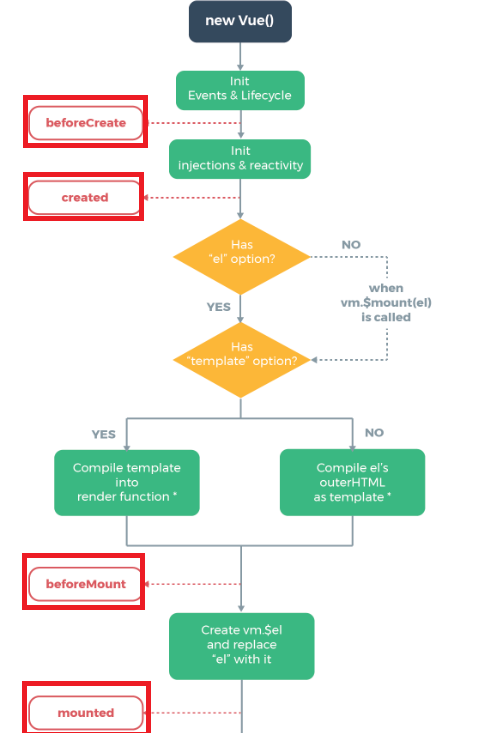
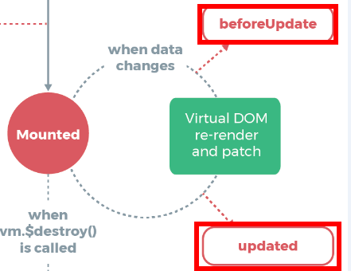
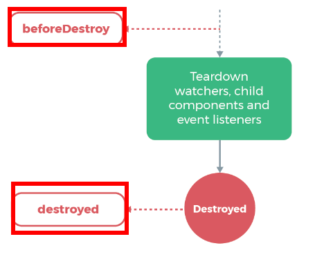

>大家好，这里是「 从零开始学 Web 系列教程 」，并在下列地址同步更新......
>
> - github：https://github.com/Daotin/Web
> - 微信公众号：[Web前端之巅](https://github.com/Daotin/pic/raw/master/wx.jpg)
> - 博客园：http://www.cnblogs.com/lvonve/
> - CSDN：https://blog.csdn.net/lvonve/
>
> 在这里我会从 Web 前端零基础开始，一步步学习 Web 相关的知识点，期间也会分享一些好玩的项目。现在就让我们一起进入 Web 前端学习的冒险之旅吧！

## 一、vue实例的生命周期

vue实例的生命周期指的是：**从Vue实例创建，运行，到销毁期间，会伴随着各种各样的事件，这些事件统称为生命周期。**

生命周期事件，也称生命周期函数，也称生命周期钩子。

## 二、生命周期函数三个阶段

**创建期间的生命周期函数**：`beforeCreate` 和 `created`，`beforeMount` 和 `mounted`。

**运行期间的生命周期函数**：`beforeUpdate` 和  `updated`

**销毁期间的生命周期函数**：`beforeDestroy` 和 `destroyed`

## 三、生命周期函数详解

**创建期间：**

- `beforeCreate`：表示实例完全被创建出来之前，会执行beforeCreate函数，这时data 和 methods 中的 数据都还没有没初始化，**如果调用data和methods的数据的话，会报错。**  
- `created`：实例已经在内存中创建OK，此时 data 和 methods 已经创建OK，此时还没有开始 编译模板。
- `beforeMount`：此时已经完成了模板的编译，但是还没有从内存挂载到页面中。

**注意：在 beforeMount 执行的时候，页面中的元素，还没有被真正替换过来，只是之前写的一些模板（比如插值表达式）还只是字符串的形式。**

- `mounted`： 此时，已经将编译好的模板，挂载到了页面指定的容器中显示。

**运行期间：**

- `beforeUpdate`：data数据更新之后，但是还未渲染到页面时执行的函数。**这时data数据已经更新，但是页面的数据还是旧的。**
- `updated`：updated 事件执行的时候，页面和 data 数据已经保持同步了，都是最新的。

**销毁期间：**

- `beforeDestroy`：实例销毁之前调用。在这一步，实例上的data，methods等仍然完全可用。
- `destroyed`：Vue 实例销毁后调用。调用后，Vue 实例指示的所有东西都会解绑定，所有的事件监听器会被移除，所有的子实例也会被销毁。

**整个生命周期的图示为：**

