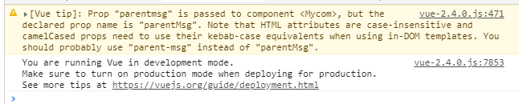
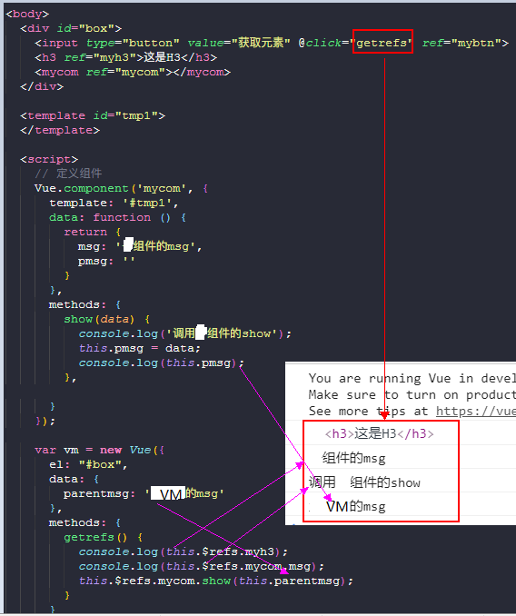

>大家好，这里是「 从零开始学 Web 系列教程 」，并在下列地址同步更新......
>
> - github：https://github.com/Daotin/Web
> - 微信公众号：[Web前端之巅](https://github.com/Daotin/pic/raw/master/wx.jpg)
> - 博客园：http://www.cnblogs.com/lvonve/
> - CSDN：https://blog.csdn.net/lvonve/
>
> 在这里我会从 Web 前端零基础开始，一步步学习 Web 相关的知识点，期间也会分享一些好玩的项目。现在就让我们一起进入 Web 前端学习的冒险之旅吧！


## 一、Vue组件

什么是组件： 组件的出现，就是为了拆分 Vue 实例的代码量的，能够让我们以不同的组件，来划分不同的功能模块，将来我们需要什么样的功能，就可以去调用对应的组件即可；

**组件化和模块化的不同：**

- 模块化： 是从代码逻辑的角度进行划分的；方便代码分层开发，保证每个功能模块的职能单一；
- 组件化： 是从UI界面的角度进行划分的；前端的组件化，方便UI组件的重用；


## 二、定义组件

### 1、定义全局组件

定义全局组件有三种方式：

1、使用 `Vue.extend` 配合 `Vue.component` 方法：

```js
// 1.使用 Vue.extend 来创建全局的Vue组件
var login = Vue.extend({
  // 通过 template 属性，指定了组件要展示的HTML结构
  template: '<h1>登录</h1>'
});

// 2.使用 Vue.component('组件的名称', 创建出来的组件模板对象) 
Vue.component('login', login);

// 3.使用组件
<div id="app">
	<!-- 如果要使用组件，直接，把组件的名称，以 HTML 标签的形式，引入到页面中即可 -->
	<login></login>
</div>
```

> 注意：
>
> 使用 Vue.component 定义全局组件的时候，组件名称使用了 驼峰命名（如myLogin），则在引用组件的时候，需要把 大写的驼峰改为小写的字母，同时在两个单词之前，使用 - 链接（`<my-login></my-login>`）；如果不使用驼峰,则直接拿名称来使用即可；

当然，上面两步可以合成一个步骤完成：

```js
Vue.component('login', Vue.extend({
  template: '<h1>登录</h1>'
}));
```


2、直接使用 Vue.component 方法：

```js
Vue.component('login', {
  template: '<div><h3>注册</h3><span>123</span></div>'
});
```

> 注意：**不论是哪种方式创建出来的组件，组件的 template 属性指向的模板内容，必须有且只能有唯一的一个根元素，否则会报错。**


3、将模板字符串，定义到 template 标签中：

```html
<!DOCTYPE html>
<html lang="en">

<head>
  <meta charset="UTF-8">
  <title>Document</title>
  <script src="./lib/vue-2.4.0.js"></script>
</head>

<body>
  <div id="box">
    <!-- 3. 使用组件 -->
    <mycom></mycom>
  </div>
  <!-- 2.在 被控制的 #box 外面,使用 template 元素,定义组件的HTML模板结构  -->
  <template id="tmp1">
    <!-- 还是需要遵从template 模板内容，必须有且只能有唯一的一个根元素 -->
    <div>
      <h3>登录</h3>
      <p>p标签</p>
    </div>
  </template>

  <script>
    // 1.定义组件
    Vue.component('mycom', {
      template: '#tmp1'
    });

    var vm = new Vue({
      el: "#box",
      data: {},
      methods: {}
    });
  </script>
</body>

</html>
```

> 注意：
>
> 1、`template: '#tmp1'` 是定义模板标签的 id ，# 别忘写了。
>
> 2、被控制的 #box 外面,使用 template 标签；
>
> 3、 template 标签里面，还是遵从只能有唯一的一个根元素的原则。


### 2、定义私有组件

定义私有组件，就是再VM实例中定义组件。

如下，box中可以使用，box2不可以使用。

```html
<!DOCTYPE html>
<html lang="en">

<head>
  <meta charset="UTF-8">
  <title>Document</title>
  <script src="./lib/vue-2.4.0.js"></script>
</head>

<body>
  <div id="box">
    <mycom></mycom>
  </div>

  <div id="box2">
    <mycom></mycom>
  </div>

  <template id="temp">
    <h3>自定义私有属性</h3>
  </template>

  <script>
    var vm = new Vue({
      el: "#box",
      data: {},
      methods: {},
      // 定义私有组件
      components: {
        mycom: {
          template: '#temp'
        }
      }
    });
    var vm2 = new Vue({
      el: "#box2",
      data: {},
      methods: {}
    });
  </script>
</body>

</html>
```


### 3、组件的data和methods属性

组件中也可以有自己的data和methods属性，可以传入template中使用。

特点：

- data属性为一个匿名函数，其返回值为一个对象。
- data 函数返回值为一个对象（**最好是新开辟的对象，否则如果多次引用组件，不是新开辟的对象给的话，对象是同一份，而我们需要每一个组件有自己的对象**），对象中可以放入数据。
- 组件中 的data和methods,使用方式,和实例中的 data 和methods使用方式完全一样

```html
<div id="box2">
  <login></login>
</div>

<template id="temp2">
  <div>
    <input type="button" value="按钮" @click="myclick">
    <h3>自定义私有属性</h3>
    <p> {{msg}} </p>
  </div>
</template>

<script>
  Vue.component('login', {
    template: '#temp2',
    data: function () {
      return {
        msg: '这是组件中的data'
      }
    }，
    methods: {
      myclick() {
        console.log("点击按钮");
      }
  }
  });
</script>
```


## 三、组件切换

我们在登录注册一个网站的时候，经常看到两个按钮，一个登录，一个注册，如果你没有账号的话，需要先注册才能登录。我们在点击登录和注册的时候，网页会相应的切换，登录页面就是登陆组件，注册页面就是注册组件，那么点击登录和注册，如何实现组件的切换呢？


### 1、方式一

**使用`flag`标识符结合`v-if`和`v-else`切换组件**

```html
<!DOCTYPE html>
<html lang="en">

<head>
  <meta charset="UTF-8">
  <title>Document</title>
  <script src="./lib/vue-2.4.0.js"></script>
</head>

<body>
  <div id="box">
    <!-- 给a注册点击事件，切换flag状态 -->
    <a href="javascript:;" @click.prevent="flag=true">登录</a>
    <a href="javascript:;" @click.prevent="flag=false">注册</a>
    <!-- 使用v-if v-else切换组件 -->
    <login v-if="flag">
    </login>
    <register v-else="flag">
    </register>
  </div>

  <script>
    Vue.component('login', {
      template: '<h3>登录组件</h3>'
    });
    Vue.component('register', {
      template: '<h3>注册组件</h3>'
    });

    var vm = new Vue({
      el: "#box",
      data: {
        flag: true
      },
      methods: {}
    });
  </script>
</body>

</html>
```


**缺陷：**由于flag的值只有true和false，所以只能用于两个组件间 的切换，当大于两个组件的切换就不行了。


### 2、方式二

**使用 component元素的`:is`属性来切换不同的子组件**

使用 `<component :is="componentId"></component>`  来指定要切换的组件。

componentId：为需要显示的组件名称，为一个字符串，可以使用变量指定。

`componentId: 'login'`   // 默认显示登录组件。

```html
<!DOCTYPE html>
<html lang="en">

<head>
  <meta charset="UTF-8">
  <title>Document</title>
  <script src="./lib/vue-2.4.0.js"></script>
</head>

<body>
  <div id="box">
    <!-- 给a注册点击事件，切换flag状态 -->
    <a href="javascript:;" @click.prevent="componentId='login'">登录</a>
    <a href="javascript:;" @click.prevent="componentId='register'">注册</a>
    <component :is="componentId"></component>
  </div>

  <script>
    Vue.component('login', {
      template: '<h3>登录组件</h3>'
    });
    Vue.component('register', {
      template: '<h3>注册组件</h3>'
    });

    var vm = new Vue({
      el: "#box",
      data: {
        componentId: 'login'   // 默认显示登录
      },
      methods: {}
    });
  </script>
</body>

</html>
```


**为组件切换添加过渡：**

很简单，只需要**用 transition 将 component 包裹起来**即可。

```html
<transition>
  <component :is="componentId"></component>
</transition>
```

示例：

```html
<!DOCTYPE html>
<html lang="en">

<head>
  <meta charset="UTF-8">
  <title>Document</title>
  <script src="./lib/vue-2.4.0.js"></script>
  <link rel="stylesheet" href="./lib/animate.css">

  <style>
    .loginDiv {
      width: 200px;
      height: 200px;
      background-color: red;
    }

    .registerDiv {
      width: 200px;
      height: 200px;
      background-color: blue;
    }
  </style>
</head>

<body>
  <div id="box">
    <!-- 给a注册点击事件，切换flag状态 -->
    <a href="javascript:;" @click.prevent="componentId='login'">登录</a>
    <a href="javascript:;" @click.prevent="componentId='register'">注册</a>
    <transition mode="out-in" enter-active-class="animated bounceInRight" leave-active-class="animated bounceOutRight">
      <component :is="componentId"></component>
    </transition>
  </div>

  <template id="login">
    <div class="loginDiv">
    </div>
  </template>

  <template id="register">
    <div class="registerDiv">
    </div>
  </template>

  <script>
    Vue.component('login', {
      template: '#login'
    });
    Vue.component('register', {
      template: '#register'
    });

    var vm = new Vue({
      el: "#box",
      data: {
        componentId: 'login'
      },
      methods: {}
    });
  </script>
</body>

</html>
```

> `mode="out-in"`：可以设置切换组件的模式为先退出再进入。


## 四、组件传值

### 1、父组件向子组件传值

我们先通过一个例子看看子组件可不可以直接访问父组件的数据：

```html
<body>
  <div id="box">
    <mycom></mycom>
  </div>

  <template id="temp">
    <h3>子组件 --- {{msg}}</h3>
  </template>

  <script>
    var vm = new Vue({
      el: "#box",
      data: {
        msg: '父组件的msg'
      },
      methods: {},
      components: {
        mycom: {
          template: '#temp'
        }
      }
    });
  </script>
</body>
```

由于 components 定义的是私有组件，我们直接在子组件中调用父组件的msg会报错。


那么，怎么让子组件使用父组件的数据呢？

**父组件可以在引用子组件的时候， 通过 属性绑定（v-bind:） 的形式, 把需要传递给子组件的数据，以属性绑定的形式，传递到子组件内部，供子组件使用 。**

```html
<body>
  <div id="box">
    <mycom v-bind:parentmsg="msg"></mycom>
  </div>

  <template id="temp">
    <h3>子组件 --- 父组件：{{parentmsg}}</h3>
  </template>

  <script>
    var vm = new Vue({
      el: "#box",
      data: {
        msg: '父组件的msg'
      },
      methods: {},
      components: {
        mycom: {
          template: "#temp",
          // 对传递给子组件的数据进行声明，子组件才能使用 
          props: ['parentmsg']
        }
      }
    });
  </script>
</body>
```

注意：父组件绑定的**属性名称不能有大写字母**，否则不会显示，并且在命令行会有提示：




**组件data数据和props数据的区别：**

- data数据是子组件私有的，可读可写；
- props数据是父组件传递给子组件的，只能读，不能写。


**案例：发表评论功能**

父组件为评论列表，子组件为ID，评论者，内容和按钮的集合，在输入ID，评论者等内容，然后点击添加的时候，需要首先获取子组件的list列表，然后再添加新的列表项到列表中。

```html
<!DOCTYPE html>
<html lang="en">

<head>
  <meta charset="UTF-8">
  <title>Document</title>
  <script src="./lib/vue-2.4.0.js"></script>
</head>

<body>
  <div id="box">
    <mycom :plist="list"></mycom>

    <ul>
      <li v-for="item in list" :key="item.id">
        ID:{{item.id}} --- 内容：{{item.content}} --- 评论人：{{item.user}}
      </li>
    </ul>
  </div>

  <template id="tmp1">
    <div>
      <label>
        ID:
        <input type="text" v-model="id">
      </label>
      <br>
      <label>
        评论者:
        <input type="text" v-model="user">
      </label>
      <br>
      <label>
        内容:
        <textarea v-model="content"></textarea>
      </label>
      <br>
      <!-- 把父组件的数据作为子组件的函数参数传入 -->
      <input type="button" value="添加评论" @click="addContent(plist)">
    </div>
  </template>

  <script>
    var vm = new Vue({
      el: "#box",
      data: {
        list: [{
          id: Date.now(),
          user: 'user1',
          content: 'what'
        }, {
          id: Date.now(),
          user: 'user2',
          content: 'are'
        }]
      },
      methods: {},
      components: {
        mycom: {
          template: '#tmp1',
          data: function () {
            return {
              id: '',
              user: '',
              content: '',
            }
          },
          methods: {
            addContent(plist) {
              plist.unshift({
                id: this.id,
                user: this.user,
                content: this.content
              });
            }
          },
          props: ['plist']
        }
      }
    });
  </script>
</body>

</html>
```

把添加ID，评论人，内容作为子组件，把列表作为父组件，然后把添加的数据放到父组件列表上，由于要获取到父组件列表的数据，所以必然涉及到父组件向子组件传值的过程。这里还通过子组件方法参数来保存父组件的数据到子组件的数据中。


### 2、父组件向子组件传方法

既然父组件可以向子组件传递数据，那么也可以向子组件传递方法。

```html
<body>
  <div id="box">
    <mycom v-bind:parentmsg="msg" @parentfunc="show"></mycom>
  </div>

  <template id="temp">
    <div>
      <input type="button" value="调用父组件方法" @click="sonClick">
      <h3>子组件 --- 父组件：{{parentmsg}}</h3>
    </div>
  </template>

  <script>
    var vm = new Vue({
      el: "#box",
      data: {
        msg: '父组件的msg'
      },
      methods: {
        show(data1, data2) {
          console.log("这是父组件的show方法" + data1 + data2);
        }
      },
      components: {
        mycom: {
          template: "#temp",
          // 对传递给子组件的数据进行声明，子组件才能使用 
          props: ['parentmsg'],
          methods: {
            sonClick() {
              // 调用父组件的show方法
              this.$emit("parentfunc", 111, 222);
            }
          }
        }
      }
    });
  </script>
</body>
```

> 1、`@parentfunc="show"` 绑定父组件的show方法。
>
> 2、`<input type="button" value="调用父组件方法" @click="sonClick">` 点击按钮调用父组件的show方法
>
> 3、在 子组件的 sonClick 方法中使用 `this.$emit("parentfunc");` 来调用父组件的show方法
>
> 4、父组件的show方法也可以传参，在调用的时候，实参从 this.$emit 的第二个参数开始传入。
>
> **5、如果 this.$emit 的第二个参数传的是子组件的data数据，那么父组件的方法就可以获得子组件的数据，这也是把子组件的数据传递给父组件的方式。**


### 3、使用 ref 获取DOM和组件的引用

我们知道Vue不推荐直接获取DOM元素，那么在Vue里面怎么获取DOM及组件元素呢？

我们呢可以在元素上使用 `ref` 属性来获取元素。

```html
<!DOCTYPE html>
<html lang="en">

<head>
  <meta charset="UTF-8">
  <title>Document</title>
  <script src="./lib/vue-2.4.0.js"></script>
</head>

<body>
  <div id="box">
    <input type="button" value="获取元素" @click="getrefs" ref="mybtn">
    <h3 ref="myh3">这是H3</h3>
    <mycom ref="mycom"></mycom>
  </div>

  <template id="tmp1">
  </template>

  <script>
    // 定义组件
    Vue.component('mycom', {
      template: '#tmp1',
      data: function () {
        return {
          msg: '子组件的msg',
          pmsg: ''
        }
      },
      methods: {
        show(data) {
          console.log('调用子组件的show');
          this.pmsg = data;
          console.log(this.pmsg);
        },

      }
    });

    var vm = new Vue({
      el: "#box",
      data: {
        parentmsg: '父组件的msg'
      },
      methods: {
        getrefs() {
          console.log(this.$refs.myh3);
          console.log(this.$refs.mycom.msg);
          this.$refs.mycom.show(this.parentmsg);
        }
      }
    });
  </script>
</body>

</html>
```




**总结：**

1、ref 属性不仅可以获取DOM元素，也可以获取组件（无论全局还是私有组件）元素。

2、获取到组件元素后，就可以获取组件元素的data数据和methods方法。

**3、获取到组件中的方法后，可以传入VM的data数据，就可以把VM的data数据传入组件中。**


