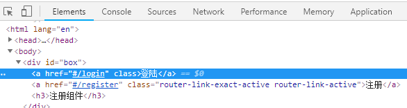
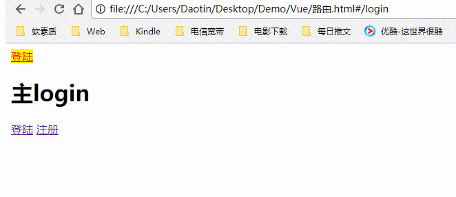

>大家好，这里是「 从零开始学 Web 系列教程 」，并在下列地址同步更新......
>
> - github：https://github.com/Daotin/Web
> - 微信公众号：[Web前端之巅](https://github.com/Daotin/pic/raw/master/wx.jpg)
> - 博客园：http://www.cnblogs.com/lvonve/
> - CSDN：https://blog.csdn.net/lvonve/
>
> 在这里我会从 Web 前端零基础开始，一步步学习 Web 相关的知识点，期间也会分享一些好玩的项目。现在就让我们一起进入 Web 前端学习的冒险之旅吧！


## 一、Vue路由

### 1、什么是路由？

**后端路由：**对于普通的网站，所有的超链接都是URL地址，所有的URL地址都对应服务器上对应的资源；

**前端路由：**对于单页面应用程序来说，主要通过URL中的hash(#号)来实现不同页面之间的切换，并不会向后端发送请求。同时，hash有一个特点：HTTP请求中不会包含hash相关的内容；所以，单页面程序中的页面跳转主要用hash实现；

在单页面应用程序中，这种**通过hash改变来切换页面**的方式，称作前端路由（区别于后端路由）；


### 2、路由的基本使用

在vue中使用路由需要用到`vue-router`的插件。

可以到 <https://unpkg.com/vue-router/dist/vue-router.js> 地址下载。


**使用步骤：**

1、导入`vue-router.js` 组件库。

```html
<script src="./lib/vue-2.4.0.js"></script>
<script src="./lib/vue-router-3.0.1.js"></script>
```

> 注意：vue-router 包的导入需要在 vue 包之后。


2、创建一个路由对象， 当 导入 vue-router 包之后，在 window 全局对象中，就有了一个 路由的构造函数，叫做 `VueRouter`，在 new 路由对象的时候，可以为 构造函数，传递一个配置对象。这个配置对象中有一个属性：`routes`，表示 **路由的匹配规则**。

```js
var routerObj = new VueRouter({
      routes: [
        {path: '/login',component: login}, 
        {path: '/register',component: register}
      ]
    });
```

> routes 属性是一个数组，数组中的每一项都是一条匹配规则。
>
> 每个路由规则，都是一个对象，这个规则对象，身上，有两个必须的属性：
>
> `path`：表示监听的路由链接地址
>
> `component`：表示如果路由是前面匹配到的 path ，则展示 component 属性对应的那个组件。


3、创建要展示的组件模板对象

```js
var login = {
  template: '<h1>登录组件</h1>'
}

var register = {
  template: '<h1>注册组件</h1>'
}
```

> 第二步中， component 属性对应的那个组件就是我们创建的模板对象。


4、将路由规则对象routerObj 注册到 vm 实例上，用来监听 URL 地址的变化，然后展示对应的组件

```js
var vm = new Vue({
  el: "#box",
  data: {},
  methods: {},
  // 将路由对象注册到vm实例
  router: routerObj
});
```


5、一旦路由规则匹配成功，就会在vue-router 提供的元素`router-view` 上显示出来，我们要将`router-view`元素写到vm控制的元素中

```html
<div id="box">
  <!-- 使用router-view在页面渲染出来-->
  <router-view></router-view>
</div>
```


6、网页的路由都是由html文件和`#/` ，再加上路由链接地址组成，例如如下的形式：

```
file:///I:/Web/Demo/Vue/test.html#/login
file:///I:/Web/Demo/Vue/test.html#/register
```

我们可以写一个 a 标签来进行 login 和 register 组件间的路由跳转：

```html
<div id="box">
  <!-- 通过点击a链接切换路由 -->
  <a href="#/login">登录</a>
  <a href="#/register">注册</a>
  <!-- 5、使用 vue-router 提供的元素router-view在页面渲染出来-->
  <router-view></router-view>
</div>
```

> 注意：a链接的href属性一定是`#/ + 路由链接地址`。


**示例完整代码：**

```html
<!DOCTYPE html>
<html lang="en">

<head>
  <meta charset="UTF-8">
  <title>Document</title>
  <script src="./lib/vue-2.4.0.js"></script>
  <!-- 1.引入vue-router文件 -->
  <script src="./lib/vue-router-3.0.1.js"></script>
</head>

<body>
  <div id="box">
    <!-- 通过点击a链接切换路由 -->
    <a href="#/login">登录</a>
    <a href="#/register">注册</a>
    <!-- 5、使用 vue-router 提供的元素router-view在页面渲染出来-->
    <router-view></router-view>
  </div>

  <script>
    // 3、创建组件模板对象
    var login = {
      template: '<h3>登录组件</h3>'
    };

    var register = {
      template: '<h3>注册组件</h3>'
    };


    // 2、创建路由对象
    var routerObj = new VueRouter({
      routes: [{
        path: '/login',
        component: login
      }, {
        path: '/register',
        component: register
      }]
    });

    var vm = new Vue({
      el: "#box",
      data: {},
      methods: {},
      // 4、将vm实例和路由对象联系起来
      router: routerObj
    });
  </script>
</body>

</html>
```


示例代码的逻辑是这样的：

**当我们点击超链接的时候，会修改url地址，在此之前，我们已经把路由注册到vm对象身上，这时候路由就会监听到路由地址的改变，于是就会进行路由规则path的匹配，当匹配成功的时候，就会展示path规则对应的component对应的组建模板对象，那么要展示在什么位置呢，这个展示在 router-view 上。**


### 3、router-link属性

我们之前的超链接是由a标签代替的，并且每次href属性都要加上#，这样太麻烦。

vue-router官方提供了一个`router-link` 的属性可以实现路由的跳转。

```html
<router-link to="/login">登陆</router-link>
<router-link to="/register">注册</router-link>
```

我们通过检查可以知道，router-link 会默认渲染为一个a 标签。




但是我们也可以将其改变成别的标签，使用 `tag="span"`  属性可以将默认的a标签转换成span标签：

```html
<router-link to="/login" tag="span">登陆</router-link>
```


### 4、路由redirect重定向

不知道你们发现没有，当刚进入页面的时候，由于页面时根路径，所以不显示任何组建，这样就不合理，我们希望刚进入页面的时候展示登陆组建怎么做呢？

当然，我们可以在路由匹配规则里面加上一条 `{path:'/', component:login}` ，但是不推荐这么做，因为根路径下的界面和登陆下的界面一致，可是url不同，可能导致用户困惑，

那么，我们可以使用 **路由redirect重定向** 来解决这个问题。

```js
{ path: '/', redirect: '/login'}
```

这样就把根路径重定向到了login组建，当再刚进入主页面的时候，会自动跳转到login路由地址，也就不会展示根路径。


### 5、路由高亮显示

我们在点击登陆和注册链接的时候，可不可以让被点击的链接高亮显示呢？

**方式一：**

我们可以看到在激活的路由上面，会使用一个叫做`router-link-active` 的类，我们通过修改这个类的属性就可以让这个链接高亮显示了。

```css
.router-link-active {
  color: red;
  background-color: yellow;
}
```


**方式二：**

可以通过路由的构造选项 `linkActiveClass` 来全局配置需要激活的路由样式。

```js
var routerObj = new VueRouter({
  routes: [{
    path: '/',
    redirect: '/login'
  }, {
    path: '/login',
    component: login
  }, {
    path: '/register',
    component: register
  }],
  // 自定义路由构造选项 linkActiveClass
  linkActiveClass: 'myClass'
});
```


### 6、路由切换添加动画效果

既然 router-view 是显示组件的，那么我们可以给 router-view 来添加动画效果：

```html
<style>
  .v-enter,
  .v-leave-to {
    opacity: 0;
  }

  .v-enter-active,
  .v-leave-active {
    transition: opacity 0.5s ease;
  }
</style>

<transition mode="out-in">
  <router-view></router-view>
</transition>
```


### 7、给路由传递参数

我们可以在路由中，使用查询字符串的方式给路由传递参数。

```html
<router-link to="/login?id=10&name=daotin">登录</router-link>
```

给路由传递参数后，我们并**不需要修改路由匹配规则**。

我们给路由传递参数就是为了拿到参数，那么如何获取参数呢？

**方式一：**

在我们的组件模板对象里面，可以使用`this.$route.query` 的方式获取我们传入的参数对象。

```js
var login = {
template: '<h3>登录组件 --- {{$route.query.id}}  --- 	{{$route.query.name}}</h3>',
}; // 登录组件 --- 10 --- daotin
```


**方式二：**

可以在路由匹配规则中，使用占位符代替路由传递时的参数。

path 中的 `:id` 表示以后路由中后面跟着的是个id值，`:name` 也一样。

```html
<router-link to="/login/20/Daotin">登陆</router-link>

var routerObj = new VueRouter({
routes: [
	{path: '/', redirect: '/login'}, 
	{path: '/login/:id/:name',component: login}, 
	{path: '/register',component: register}
],
});
```

在获取参数的时候，不是用query了，而是params。

```js
var login = {
    template: '<h3>登录组件 --- {{$route.params.id}}  --- {{$route.params.name}}</h3>',
};
```


### 8、路由嵌套

什么是路由嵌套？

我们的登陆和注册都是平级的关系，那么我们登陆和注册的组件里面可不可以嵌套其他的组件呢？当然可以。

使用 `children` 属性，实现子路由。

```js
var router = new VueRouter({
      routes: [
        {
          path: '/account', component: account,
          // 使用 children 属性，实现子路由，同时，子路由的 path 前面，不要带 / ，否则永远以根路径开始请求。
          children: [
            { path: 'login', component: login },
            { path: 'register', component: register }
          ]
        }
        // 下面是错误的
        // { path: '/account/login', component: login },
        // { path: '/account/register', component: register }
      ]
    })
```

> 注意：子路由的匹配规则前面不要加 `/` 。


**完整示例：**

```html
<!DOCTYPE html>
<html lang="en">

<head>
  <meta charset="UTF-8">
  <title>Document</title>
  <script src="./lib/vue-2.4.0.js"></script>
  <!-- 1.引入vue-router文件 -->
  <script src="./lib/vue-router-3.0.1.js"></script>
  <style>
    .myClass {
      color: red;
      background-color: yellow;
    }

    .v-enter,
    .v-leave-to {
      opacity: 0;
    }

    .v-enter-active,
    .v-leave-active {
      transition: opacity 0.5s ease;
    }
  </style>
</head>

<body>
  <div id="box">
    <router-link to="/login">登陆</router-link>
    <router-link to="/register">注册</router-link>
    <router-view></router-view>
  </div>

  <template id="login">
    <div>
      <h2>主login</h2>
      <router-link to="/login/login1">登陆</router-link>
      <router-link to="/login/register1">注册</router-link>

      <router-view></router-view>
    </div>
  </template>

  <script>
    // 3、创建组件模板对象
    var login = {
      template: '#login',
    };

    var register = {
      template: '<h3>注册组件</h3>'
    };

    var login1 = {
      template: '<h3>登录子组件</h3>',
    };

    var register1 = {
      template: '<h3>注册子组件</h3>'
    };


    // 2、创建路由对象
    var routerObj = new VueRouter({
      routes: [
          { path: '/', redirect: '/login' }, 
          {
            path: '/login', component: login,
            children: [
              { path: 'login1', component: login1 },
              { path: 'register1', component: register1 }
            ]
          }, 
          { path: '/register', component: register }],
        
      linkActiveClass: 'myClass'
    });

    var vm = new Vue({
      el: "#box",
      data: {},
      methods: {},
      // 4、将vm实例和路由对象联系起来
      router: routerObj
    });
  </script>
</body>

</html>
```

在 login 下面有两个子组件 login1 和 register1，使用 children 来匹配子路由的规则，进行显示，而不会让之前主login显示的受到影响。




### 9、命名视图实现经典布局

**什么是命名视图？**

我们之前的 router-view 都是没有名字的，现在我们可以为其指定名称，就是命名视图。

我们要实现的目标是显示标题，侧边栏和主体三部分的经典视图，类似如下的布局：


那么既然要显示三部分，就需要三个 router-view，怎么让每个 router-view显示不同的内容呢？这就需要用到命名视图。

语法：

```html
 <router-view name="view1"></router-view>
```

只需要指定一个name属性即可。


**经典布局示例：**

```html
<!DOCTYPE html>
<html lang="en">

<head>
  <meta charset="UTF-8">
  <title>Document</title>
  <script src="./lib/vue-2.4.0.js"></script>
  <!-- 1.引入vue-router文件 -->
  <script src="./lib/vue-router-3.0.1.js"></script>
  <style>
    body,
    html,
    h1,
    h2,
    h3 {
      margin: 0;
      padding: 0;
    }

    .header {
      width: 100%;
      height: 80px;
      background-color: red;
    }

    .left {
      float: left;
      width: 20%;
      height: 500px;
      background-color: green;
    }

    .right {
      float: left;
      width: 80%;
      height: 500px;
      background-color: blue;
    }
  </style>
</head>

<body>
  <div id="box">
    <router-view></router-view>
    <router-view name="leftBanner"></router-view>
    <router-view name="rightBanner"></router-view>
  </div>

  <script>
    // 3、创建组件模板对象
    var header = {
      template: '<h1 class="header">顶部</h1>',
    };

    var left = {
      template: '<h3 class="left">左边侧栏</h3>'
    };

    var right = {
      template: '<h3 class="right">右边主体</h3>',
    };

    // 2、创建路由对象
    var router = new VueRouter({
      routes: [{
        path: '/',
        // component 要显示的组件为一个对象，default为默认显示的组件
        // leftBanner表示router-view显示名称为leftBanner的组件
        // rightBanner表示router-view显示名称为rightBanner的组件
        components: {
          'default': header,
          'leftBanner': left,
          'rightBanner': right
        }
      }]
    });

    var vm = new Vue({
      el: "#box",
      data: {},
      methods: {},
      // 4、将vm实例和路由对象联系起来
      router
    });
  </script>
</body>

</html>
```

> 1、首先创建三个组件模板对象，分别用于显示头部，侧边栏，和主体三个部分。
>
> 2、在匹配规则里面， **component 变成了 components**，并且展示多个组件。其中：
>
> default为默认显示的组件；
>
> leftBanner表示router-view显示名称为leftBanner的组件
>
>  rightBanner表示router-view显示名称为rightBanner的组件。
>
> 3、为 router-view 指定 components 中显示不同组件的名称。
>
> 4、为显示的不同组件添加样式，形成经典布局样式。


