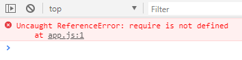

## Browserify模块化使用教程

区别Node与Browserify

	Node.js运行时动态加载模块(同步)
	Browserify是在转译(编译)时就会加载打包(合并)require的模块


### 操作步骤

1、创建项目结构
```
|-js
  |-dist //打包生成文件的目录
  |-src //源码所在的目录
    |-module1.js
    |-module2.js
    |-module3.js
    |-app.js //应用主源文件
|-index.html
|-package.json
  {
    "name": "browserify-test",
    "version": "1.0.0"
  }
```


2、下载插件browserify

```
npm install browserify -g
npm install browserify --save-dev
```


3、定义模块代码
* module1.js
  ```js
  module.exports = {
    foo() {
      console.log('moudle1 foo()')
    }
  }
  ```
* module2.js
  ```js
  module.exports = function () {
    console.log('module2()')
  }
  ```
* module3.js
  ```js
  exports.foo = function () {
    console.log('module3 foo()')
  }

  exports.bar = function () {
    console.log('module3 bar()')
  }
  ```
* app.js (应用的主js)
  ```js
  //引用模块
  let module1 = require('./module1')
  let module2 = require('./module2')
  let module3 = require('./module3')

  let uniq = require('uniq')

  //使用模块
  module1.foo()
  module2()
  module3.foo()
  module3.bar()

  console.log(uniq([1, 3, 1, 4, 3]))
  ```


* 打包处理js:

```
browserify js/src/app.js -o js/dist/bundle.js
```

**（为什么不直接在html中引入app.js 呢？**

**答案：因为浏览器无法识别 require。）**




- 页面使用引入:

```html
<script src="js/dist/bundle.js"></script> 
```
