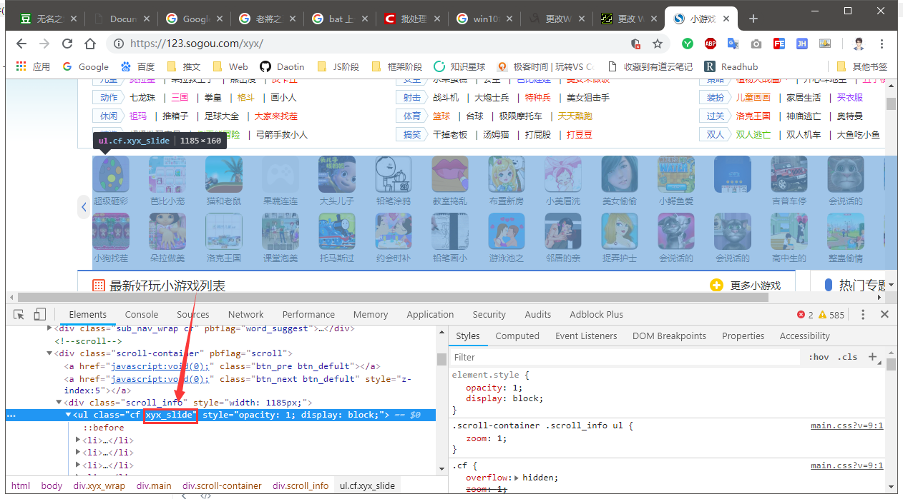
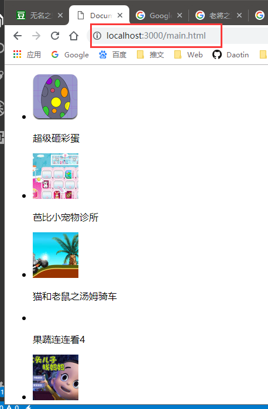

## 1、内置模块的应用

### 1.1、node 路由

在 `http.createServer((req, res) => {});`中

通过 `req.url`可以获取客户端传递的路由地址。

通常，http.createServer函数至少执行两次，一次是根路径`/` ，一次是`/favicon.ico` 

当我们访问 `http://localhost:3000` 的时候，默认的是主路径和图标路径。

如果有路由的时候，比如：`http://localhost:3000/other` 的时候，我们希望访问的是`other.html`，此时`req.url` 的地址为`/other` 和 `/favicon.ico` 。


所以，我们可以根据不同的路由地址来跳转到不同的页面。

我们先封装一个模块用来获取页面的内容：

```js
// rf.js
let rf = require("fs");

module.exports = (url, fn) => {
    rf.readFile(url, "utf-8", (err, data) => {
        if (!err) {
            fn(data);
        }
    });
}
```

然后我们在开启服务界面进行调用：

```js
let http = require("http");
let rf = require("./rf"); // 自己的rf.js文件（注意自定义的模块需要加路径）

let server = http.createServer((req, res) => {

    res.writeHead(200, {
        "Content-Type": "text/html; charset=utf-8"
    });
    let path = req.url; // 获取路由地址
    let url = "";
    switch (path) {
        case "/":
        case "/home":
            // rf("index.html", (data) => {
            //     res.end(data);
            // });
            url = "index.html";
            break;
        case "/other":
            // rf("other.html", (data) => {
            //     res.end(data);
            // });
            url = "other.html";
            break;

        default:
            // rf("404.html", (data) => {
            //     res.end(data);
            // });
            url = "404.html";
            break;
    }
    // 根据不同的路由，获取不同的页面内容进行显示
    rf(url, (data) => {
        res.end(data);
    });

});

server.listen(3000, () => {
    console.log("server running at http://localhost:3000");
});
```

> 注意：自定义的模块需要加路径


我们把大量逻辑代码写到服务主界面显得特别乱，所以关于路由的操作，我们封装成一个模块叫`router.js`。

```js
// router.js
let rf = require("./rf");

module.exports = {
    home(req, res) {
        rander("index.html", req, res);
    },
    other(req, res) {
        rander("other.html", req, res);
    },
    err(req, res) {
        rander("404.html", req, res);
    },
    // 由于插入的图片的格式不同，所以写法也有差异
    img(req, res) {
        res.writeHead(200, {
            "Content-Type": "image/jpeg"
        });
        rf("../img/s1.jpg", (data) => {
            res.end(data, "binary");
        }, "binary");
    }
}

function rander(url, req, res) {
    res.writeHead(200, {
        "Content-Type": "text/html; charset=utf-8"
    });
    rf(url, (data) => {
        res.end(data);
    });
}
```


由于插入图片的形式，读取文件的模块也有改变 

```js
let rf = require("fs");

module.exports = (url, fn, ecode = "utf-8") => {
    rf.readFile(url, ecode, (err, data) => {
        if (!err) {
            fn(data);
        }
    });
}
```

增加 ecode参数，设置ES6中默认参数为 “utf-8”.

然后在主服务模块中，只需要调用router对象中的函数。

```js
let http = require("http");
let router = require("./router");

let server = http.createServer((req, res) => {

    let path = req.url;
    path = path.substring(1); // 把路由的/去掉

    if (router[path]) {
        router[path](req, res); // 直接获取router的函数即可显示不同的界面
    } else {
        router["err"](req, res);
    }
});

server.listen(3000, () => {
    console.log("server running at http://localhost:3000");
});
```


### 1.2、前端通过ajax和node交互

- get请求

首先是前端发起ajax请求。

```html
<!DOCTYPE html>
<html lang="en">

<head>
    <meta charset="UTF-8">
    <meta name="viewport" content="width=device-width, initial-scale=1.0">
    <meta http-equiv="X-UA-Compatible" content="ie=edge">
    <title>Document</title>
</head>

<body>
    <h1>首页</h1>
    <div>
        i d: <input type="text" id="user">
        pwd: <input type="text" id="pwd">
    </div>
    <button id="btn">发送ajax请求</button>
</body>
<!-- <script src="../js/jquery-1.12.4.js"></script> -->
<script src="https://code.jquery.com/jquery-1.12.4.min.js"></script>

<script>
    // 当点击button的时候，像服务器发出ajax请求
    $("button").on("click", () => {
        $.ajax({
            type: "get",
            url: "/ajax",
            data: {
                user: $("#user").val(),
                pwd: $("#pwd").val()
            },
            dataType: "json",
            success: function (response) {
                console.log(response); // {code:200,msg:"成功"}
            }
        });
    });
</script>

</html>
```


由于是get请求，所以路由地址不纯净，需要处理，才能进行路由操作。

```js
let http = require("http");
let router = require("./router");
let url = require("url");
let qs = require("querystring");

let server = http.createServer((req, res) => {

    // 由于是get请求，所以获取到的req.url为/ajax?user=daotin&pwd=111
    // 通过url模块，可以获取ajax请求的路由地址
    let path = url.parse(req.url,true,true).pathname;

    path = path.substring(1);

    if (router[path]) {
        router[path](req, res);
    } else {
        if (path === "") {
            router["home"](req, res);
        } else {
            router["err"](req, res);
        }
    }
});

server.listen(3000, () => {
    console.log("server running at http://localhost:3000");
});
```

服务器的具体实现模块router的操作如下：

```js
let rf = require("./rf");

module.exports = {
    home(req, res) {
        rander("index.html", req, res);
    },
    other(req, res) {
        rander("other.html", req, res);
    },
    err(req, res) {
        rander("404.html", req, res);
    },
    img(req, res) {
        res.writeHead(200, {
            "Content-Type": "image/jpeg"
        });
        rf("../img/s1.jpg", (data) => {
            res.end(data, "binary");
        }, "binary");
    },
    // 获取客户端针对/ajax路由的请求，然后返回给客户端{code:1,msg:"成功"}
    ajax(req, res) {
        // 获取客户端传过来的数据
        let data = url.parse(req.url, true).query; // 收到客户端的数据后，这里没有处理直接返回客户端成功。
        res.writeHead(200, {
            "Content-Type": "text/x-www-form-urlencoded"
        });
        let msg = {
            code: 200,
            msg: "成功"
        }
        res.end(JSON.stringify(msg));
    }
}

function rander(url, req, res) {
    res.writeHead(200, {
        "Content-Type": "text/html; charset=utf-8"
    });
    rf(url, (data) => {
        res.end(data);
    });
}
```

当服务器收到路由为 `/ajax` 的路由请求时，就会回复一个对象形式的字符串，客户端收到后就会显示出来。

这就完成了客户端和服务器的数据交流操作。


- post请求

post请求的数据在 `req.url` 是获取不到的。我们知道在`http.createServer((req, res) => {}` 中req和res也是输入流和输出流，那么就可以像数据流一样来获取数据。


我们在router.js里面获取，而不主程序获取。


```js
// index.html
$("button").on("click", () => {
        $.ajax({
            type: "post",
            url: "/ajax",
            data: {
                user: $("#user").val(),
                pwd: $("#pwd").val()
            },
            dataType: "json",
            success: function (response) {
                console.log(response); // {code:1,msg:"成功"}
            }
        });
    });
```

index.html只是将type由get改成post。


主程序里面：

```js
// main.js
let http = require("http");
let router = require("./router");
let url = require("url");

let server = http.createServer((req, res) => {
    let path = url.parse(req.url,true,true).pathname;
    path = path.substring(1);

    if (router[path]) {
        router[path](req, res);
    } else {
        if (path === "") {
            router["home"](req, res);
        } else {
            router["err"](req, res);
        }
    }
});

server.listen(3000, () => {
    console.log("server running at http://localhost:3000");
});
```


由于ajax的路由地址只有 `/ajax` 所以不用处理。主要的数据获取在router.js里面处理。

```js
// router.js
let rf = require("./rf");
let url = require("url");

module.exports = {
    home(req, res) {
        rander("index.html", req, res);
    },
    other(req, res) {
        rander("other.html", req, res);
    },
    err(req, res) {
        rander("404.html", req, res);
    },
    img(req, res) {
        res.writeHead(200, {
            "Content-Type": "image/jpeg"
        });
        rf("../img/s1.jpg", (data) => {
            res.end(data, "binary");
        }, "binary");
    },
    // 获取客户端针对/ajax路由的请求，然后返回{code:1,msg:"成功"}
    ajax(req, res) {
        // 由于是get请求，所以获取到的req.url为/ajax?user=daotin&pwd=111
        // 通过url模块，可以获取ajax请求的路由地址
        // let data = url.parse(req.url, true).query;
        let str = "";
        req.on("data", chunk => {
            str += chunk.toString();
        });
        req.on("end", () => {
            console.log(str); //user=11&pwd=22
            
            res.writeHead(200, {
                "Content-Type": "text/x-www-form-urlencoded"
            });
            let msg = {
                code: 200,
                msg: "成功"
            }
            res.end(JSON.stringify(msg));
            });
    }
}

function rander(url, req, res) {
    res.writeHead(200, {
        "Content-Type": "text/html; charset=utf-8"
    });
    rf(url, (data) => {
        res.end(data);
    });
}
```

于是，post形式的ajax也可以和node进行数据交互。


### 1.3、爬取网站的数据到自己网站

我们这里爬的是“搜狗小游戏”的一个列表，如下图：


其实，http模块除了可以作为服务器返回数据之外，还可以作为客户端发出请求。

我们通过get的方式获取“https://123.sogou.com/xyx/”的网页源代码。

```js
// httpRequestGames.js
let https = require("https");

module.exports = (url) => {
    // "https://123.sogou.com/xyx/"
    https.get(url, res => {
        let html = "";

        res.on("data", chunk => {
            html += chunk;
        });

        res.on("end", () => {
            console.log(html)
            });
        })
    });
}
```

> 注意：有得网络协议是http，有的是https。


获取到的源代码很杂乱，怎么处理呢？

用正则表达式的话，也会写很多，太复杂了。

所以，这里有一个插件`cheerio` ，这个插件特别强大，这个插件可以把这个源代码当做jquery来操作。

这个插件需要先用`npm i cheerio -S` 先下载再引入。

```js
let https = require("https");
let cheerio = require("cheerio");

module.exports = (url, fn) => {
    // "https://123.sogou.com/xyx/"
    https.get(url, res => {
        let html = "";

        res.on("data", chunk => {
            html += chunk;
        });

        res.on("end", () => {
            // 使用cheerio.load将获得到html注入进去，就得到整个源代码对象，这里用 $ 表示。
            let $ = cheerio.load(html);

            let games = [];
            // $(".xyx_slide")是源代码中ul这个类似DOM的元素，然后找下面的li元素，整个
            // 操作非常类似jquery。
            // 我们把名字，图片地址，下载地址保存到一个数组中。
            // 最后给外界回调函数使用
            $(".xyx_slide").find("li").each((index, item) => {
                let game = {
                    name: $(item).find("span").text(),
                    href: $(item).find("a").attr("href"),
                    imgSrc: $(item).find("a img").attr("src")
                }

                games.push(game);
            });

            fn(games);
        })
    });
}
```



这就相当于我们获取了核心数据。


这个时候，我们需要自己的架子来插入这些数据了。

这里我们新建一个 `main.html` 文件作为架子。

```html
<!DOCTYPE html>
<html lang="en">

<head>
    <meta charset="UTF-8">
    <meta name="viewport" content="width=device-width, initial-scale=1.0">
    <meta http-equiv="X-UA-Compatible" content="ie=edge">
    <title>Document</title>
</head>

<body>
    <ul class="gameUL">
        <li>
            <a href="javascript:;">
                
            </a>
            <p>123</p>
        </li>
    </ul>
</body>

</html>
```

要把这个架子中插入数据，也是用到`cheerio` 的操作。

先要把所有的架子源代码读出来，这里写一个`readFile.js`插件，然后还有把数据插入架子的插件`mixture.js` 。

```js
// readFile.js
let fs = require("fs");

// 需要获取源代码的html文件，这里就是main.html
module.exports = (url, fn) => {
    let rs = fs.createReadStream(url);
    let html = "";
    rs.on("data", chunk => {
        html += chunk;
    })

    rs.on("end", () => {
        fn(html)
    });
}
```


```js
// mixture.js
let cheerio = require("cheerio");

// html就是架子
// data就是核心代码
module.exports = (html, data) => {
    let $ = cheerio.load(html);

    let ul = $(".gameUL");
    let li = ul.find("li");
    ul.empty();
	
    // 注意：这里的item是类DOM元素，而不是类jQuery元素
    data.map((item) => {
        let newLi = li.clone(false);
        newLi.find("a").attr("href", item.href);
        newLi.find("img").attr("src", item.imgSrc);
        newLi.find("p").text(item.name);

        ul.append(newLi);
    });
	// 返回整个html源代码
    return $.html();
}
```

所有的准备工作都做好了，那么我们就将它们渲染到页面吧：

```js
// httpResponseMain.js

let http = require("http");
let readHtml = require("./readHtml");
let requestDate = require("./httpRequestGames");
let mixture = require("./mixture");

http.createServer((req, res) => {
    res.writeHead(200, {
        "content-Type": "text/html; charset=utf-8"
    });

    // 读取架子和读取核心数据应该套在一起，因为都是异步操作。
    readHtml("./main.html", (html) => {
        requestDate("https://123.sogou.com/xyx/", data => {
            let newHTML = mixture(html, data);
            // 最后发送到页面显示
            res.end(newHTML);
        });
    });

}).listen(3000, () => {
    console.log("server running at http://localhost:3000");
});
```


于是我们的main.html显示如下：

