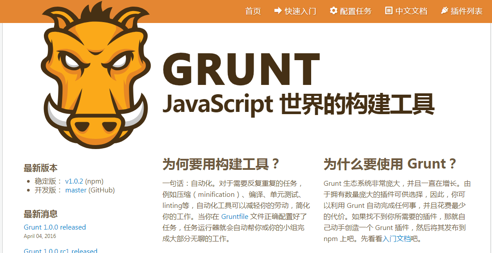
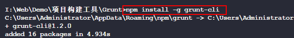
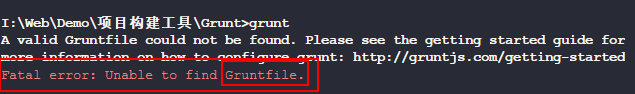
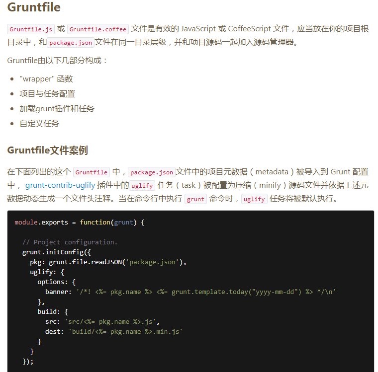
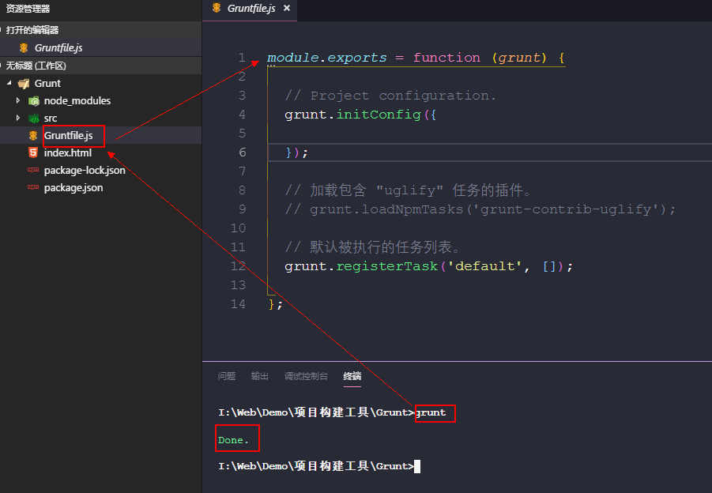
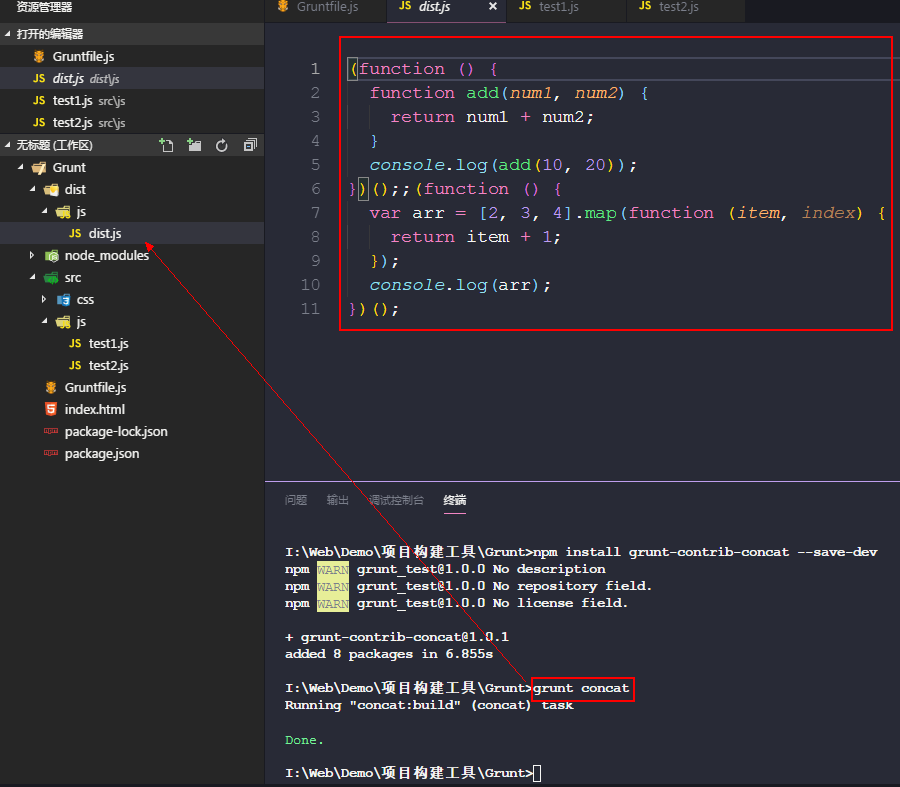
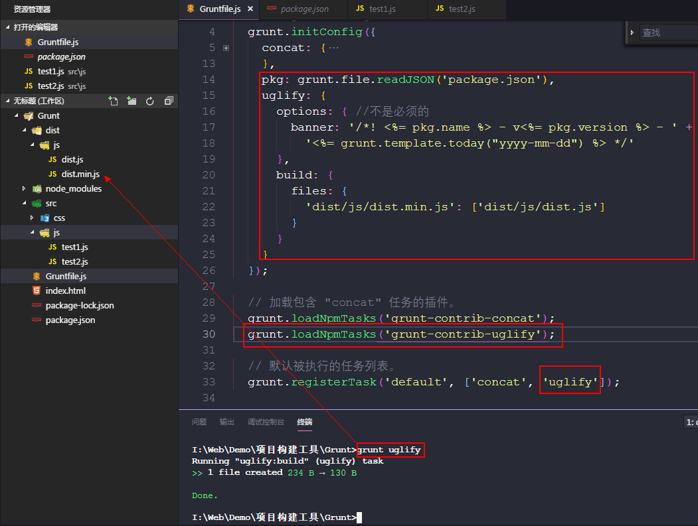
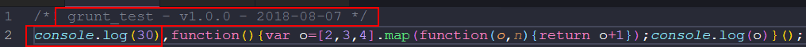
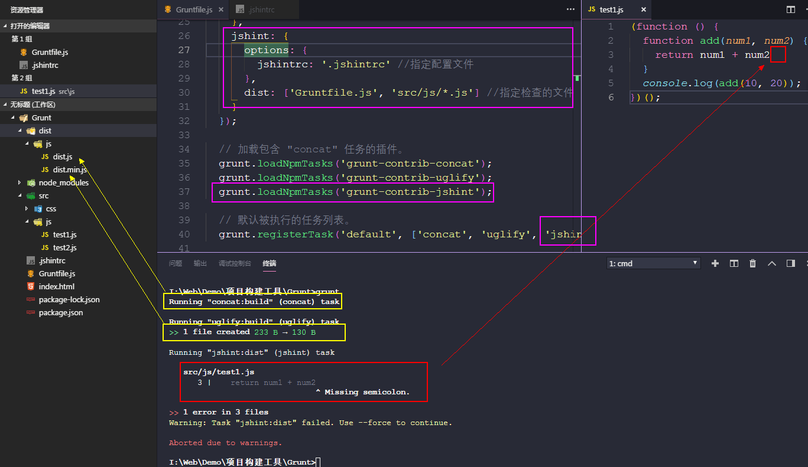
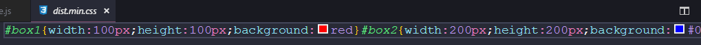

>大家好，这里是「 从零开始学 Web 系列教程 」，并在下列地址同步更新......
>
> - github：https://github.com/Daotin/Web
> - 微信公众号：[Web前端之巅](https://github.com/Daotin/pic/raw/master/wx.jpg)
> - 博客园：http://www.cnblogs.com/lvonve/
> - CSDN：https://blog.csdn.net/lvonve/
>
> 在这里我会从 Web 前端零基础开始，一步步学习 Web 相关的知识点，期间也会分享一些好玩的项目。现在就让我们一起进入 Web 前端学习的探索之旅吧！


## 一、Grunt介绍

Grunt 中文主页 : http://www.gruntjs.net/



Grunt 是一套前端**自动化构建**工具，一个基于nodeJs的命令行工具。

它是一个**任务运行器**, 配合其丰富强大的**插件**

**注意：Grunt 不支持 ES6 语法。如果要使用，需要先转化成 ES5 语法，再使用 Grunt。**


**常用功能:**

* **合并文件**(js/css)
* **压缩文件**(js/css)
* **语法检查**(js)
* **less/sass预编译处理** 
* 其它...


## 二、Grunt 使用步骤

**1、安装nodejs**
```
// 查看版本
node -v
```
**2、创建一个简单的应用 grunt 项目。**

下面是目录的结构：

```
|- build----------构建生成的文件所在的文件夹
|- src------------源码文件夹   
    |- js---------------js源文件夹
    |- css--------------css源文件夹
|- index.html-----页面文件
|- Gruntfile.js---grunt配置文件(注意首字母大写)
|- package.json---项目包配置文件
    {
      "name": "grunt_test",
      "version": "1.0.0"   
    }
```
> 注意：package.json 中 name 的值 只能包含小写字母数字和中划线，如果为空则使用项目文件夹名称代替。

**3、安装 grunt**

此命令会自动生成 node-modules 文件夹。

- 全局安装 grunt-cli

```
npm install -g grunt-cli 
```
* 项目安装 grunt

```
npm install grunt --save-dev
```




*为什么全局安装 grunt 后还要局部安装 grunt？*

**全局安装的 gulp 是在命令行中用的，项目中的 gulp 是调用 插件 或者自身的命令用的，名称相同，作用不同，缺一不可。**


**package.json和package-lock.json的区别：**

自npm 5.0版本发布以来，npm istall的规则发生了三次变化:

1.npm 5.0.x版本，不管package.json怎么变，npm install时都会根据package-lock.json下载；

2.npm 5.1.0版本后，npm install会无视package-lock.json,下载最新的版本；

3.npm 5.4.2版本后，

如果package.json与package-lock.json不一致，npm install会根据package.json去下载版本，并更新package-lock.json；

如果package.json与package-lock.json一致，npm install会根据package-lock.json去下载。


**4、运行构建项目命令**

```
grunt
```
提示：`Fatal error: Unable to find Gruntfile.` 说明我们没有添加 `Gruntfile.js` 文件，在执行 grunt 命令的时候，会先找 Gruntfile.js 文件，这文件里面描述的是要执行什么任务。




**5、配置文件: Gruntfile.js**

* 此配置文件本质就是一个node函数类型模块

* 配置编码包含3步:
  1. 初始化插件配置
  2. 加载插件任务
  3. 注册构建任务

* 基本编码（下面是以 uglify 插件为例），**grunt 的任务执行其实并不是本身执行任务，而是调用旗下各种插件来执行各种任务。grunt  就像一个大脑一样，只是起到指挥作用**:
  ```js
  module.exports = function(grunt) {

    // 1、初始化插件配置
    grunt.initConfig({
      pkg: grunt.file.readJSON('package.json'),
      uglify: {
        options: {
          banner: '/*! <%= pkg.name %> <%= grunt.template.today("yyyy-mm-dd") %> */\n'
        },
        build: {
          src: 'src/<%= pkg.name %>.js',
          dest: 'build/<%= pkg.name %>.min.js'
        }
      }
    });

    // 2、加载任务的插件。
    grunt.loadNpmTasks('grunt-contrib-uglify');

    // 3、注册构建任务
    grunt.registerTask('default', ['uglify']);

  };
  ```

此配置可以在官网找到：




再次执行命令: `grunt`  -------- 提示成功, 但没有任何效果(还没有使用插件定义任务，我们将其注释掉了)




## 三、Grunt插件

grunt官网的插件列表页面 http://www.gruntjs.net/plugins 

**插件分类:**
* grunt团队贡献的插件 : 插件名大都以`contrib-`开头
* 第三方提供的插件 : 大都不以contrib-开头

**常用的插件:**
* `grunt-contrib-clean`——清除文件(打包处理生成的)
* `grunt-contrib-concat`——合并多个文件的代码到一个文件中
* `grunt-contrib-uglify`——压缩js文件
* `grunt-contrib-jshint`——javascript语法错误检查；
* `grunt-contrib-cssmin`——压缩/合并css文件
* `grunt-contrib-htmlmin`——压缩html文件
* `grunt-contrib-imagemin`——压缩图片文件(无损)
* `grunt-contrib-copy`——复制文件、文件夹
* `grunt-contrib-requirejs`——合并压缩requirejs管理的所有js模块文件
* `grunt-contrib-watch`——实时监控文件变化、调用相应的任务重新执行


## 四、JS 插件使用

### 1、合并js

**注意：每个插件在使用的时候，都需要单独下载。**

下面以**合并js**: 使用concat插件为例：

**1、下载concat插件:**
```
npm install grunt-contrib-concat --save-dev
```
**2、编写两个js文件:**

src/js/test1.js
```js
(function () {
  function add(num1, num2) {
    return num1 + num2;
  }
  console.log(add(10, 20));
})();
```
src/js/test2.js
```js
(function () {
  var arr = [2,3,4].map(function (item, index) {
    return item+1;
  });
  console.log(arr);
})();
```
**3、配置: Gruntfile.js**

配置任务:（这个可以在官网查到插件的使用，然后进行适当路径的修改）
```js
concat: {
  options: { //可选项配置
    separator: ';'   //使用;连接合并
  },
  build: { //此名称任意
    src:  ["src/js/*.js"],  //合并哪些js文件
    dest: "build/js/built.js" //输出的js文件
  }
}
```
加载插件:
```
grunt.loadNpmTasks('grunt-contrib-concat');
```
注册任务
```
grunt.registerTask('default', ['concat']);
```
执行命令:

```
grunt concat（或者直接使用grunt，会按顺序自动执行任务列表的任务。）
```




### 2、压缩js

**1、下载uglify插件**
```
npm install grunt-contrib-uglify --save-dev
```
**2、配置: Gruntfile.js**

配置任务:
```js
pkg : grunt.file.readJSON('package.json'),
uglify : {
  options: {  //不是必须的
    banner: '/*! <%= pkg.name %> - v<%= pkg.version %> - ' +
    '<%= grunt.template.today("yyyy-mm-dd") %> */'
  },
  build: {
    files: {
      'build/js/built-<%=pkg.name%>-<%=pkg.version%>.min.js': ['build/js/built.js']
    }
  }
}
```
加载任务:
```
grunt.loadNpmTasks('grunt-contrib-uglify');
```
注册任务:
```
grunt.registerTask('default', ['concat', 'uglify']);
```
执行任务: 
```
grunt uglify（或者直接使用grunt，会按顺序自动执行任务列表的任务。先执行 concat，再执行uglify）
```


压缩后的文件：




上面的注释就是 uglify 里面的 options 对应的输出内容。

可以看到，我们的test1.js 直接压缩成了 console.log(30);厉害了！


**需要注意的是：直接使用grunt，会按顺序自动执行任务列表的任务。先执行 concat，再执行uglify，这就说明 Grunt 是同步执行任务的。**


### 3、js语法检查

**1、下载jshint插件:** 
```
npm install grunt-contrib-jshint --save-dev
```
**2、依赖文件:** `.jshintrc`

由于 js 语法检查，是需要指定一些规则的，这些规则都写在 `.jshintrc`中，所以我们要先编写好 `.jshintrc`文件。

```json
{
  "curly": true,
  "eqeqeq": true,
  "eqnull": true,
  "expr" : true,
  "immed": true,
  "newcap": true,
  "noempty": true,
  "noarg": true,
  "regexp": true,
  "browser": true,
  "devel": true,
  "node": true,
  "boss": false,
  
  //不能使用未定义的变量
  "undef": true,
  //语句后面必须有分号
  "asi": false,
  //预定义不检查的全局变量
  "predef": [ "define", "BMap", "angular", "BMAP_STATUS_SUCCESS"]
}
```
> 注意：最后的注释要去掉，因为 json 里面不允许有注释。


**3、修改src/js/test1.js**

```js
(function () {
  function add(num1, num2) {
    return num1 + num2
  }
  console.log(add(10, 20));
})();
```
**4、配置 : Gruntfile.js**

配置任务:
```js
jshint : {
  options: {
    jshintrc : '.jshintrc' //指定配置文件
  },
  build : ['Gruntfile.js', 'src/js/*.js'] //指定检查的文件
}
```
加载任务:
```
grunt.loadNpmTasks('grunt-contrib-jshint');
```
注册任务:
```
grunt.registerTask('default', ['concat', 'uglify', 'jshint']);
```
执行命令: 
```
grunt   //提示语句后未加分号 -->修改后重新编译
```



## 五、CSS 插件使用

### 1、合并压缩css

**1、下载cssmin插件:**
```
npm install grunt-contrib-cssmin --save-dev
```
**2、先编写好两个css文件:** 

test1.css
```css
#box1 {
  width: 100px;
  height: 100px;
  background: red;
}
```
test2.css
```css
#box2 {
  width: 200px;
  height: 200px;
  background: blue;
}
```
​

**3、配置 : Gruntfile.js**

配置任务:
```js
cssmin:{
  options: {
    shorthandCompacting: false,
    roundingPrecision: -1
  },
  build: {
    files: {
        'build/css/output.min.css': ['src/css/*.css']
    }
  }
}
```
加载任务:
```
grunt.loadNpmTasks('grunt-contrib-cssmin');
```
注册任务:
```
grunt.registerTask('default', ['concat', 'uglify', 'jshint', 'cssmin']);
```
执行任务: 
```
grunt    //在dist/css/下生成dist.min.css
```



**我们可以发现：cssmin 其实不止进行了压缩操作，还进行了合并操作。**


## 六、使用watch插件 

之前，我们每次修改js 或者css文件之后，都会进行一次`grunt` 指令的操作，这样太麻烦了，有没有一种方法可以在我们丢改了js 或者css文件之后，自动进行 grunt 的操作呢？watch 插件可以做到真正的自动化构建项目。

**1、下载watch插件:** 

```
npm install grunt-contrib-watch --save-dev
```

**2、配置 : Gruntfile.js**

配置任务:

`files`：表示监视的是哪些文件

`tasks`：表示这些文件改变后，应该执行哪些任务

`options`：一些配置。spawn : false；表示变量更新，只对那些修改了的源文件执行任务，而不需要把所有的任务重新执行一遍，相当于C语言单文件编译和全部编译的区别。

```
watch : {
  scripts : {
    files : ['src/js/*.js', 'src/css/*.css'],
    tasks : ['concat', 'jshint', 'uglify', 'cssmin'],
    options : {spawn : false}  
  }
}
```
加载任务:
```
grunt.loadNpmTasks('grunt-contrib-watch');
```
注册任务:
```
grunt.registerTask('default', ['concat', 'uglify', 'jshint', 'watch']);
```
上面这种写法会在cmd下一直等待源文件的改变，无法停止。而我们在需要项目上线的时候，只需要执行一次任务即可，所以我们可以专门定义一个任务来监听源文件的改变，而对于需要上线的项目，只需要像之前default任务一样执行一次就好了。

改进写法：

```
grunt.registerTask('default', ['concat', 'uglify', 'jshint']);
grunt.registerTask('mywatch', ['default','watch']);
```
> 注意：在执行监视任务的时候，一定要先执行default的任务，否则无法完成监视任务。

  执行命令：

  ```
 grunt mywatch //控制台提示watch已经开始监听, 修改源文件保存后会自动编译处理
  ```


