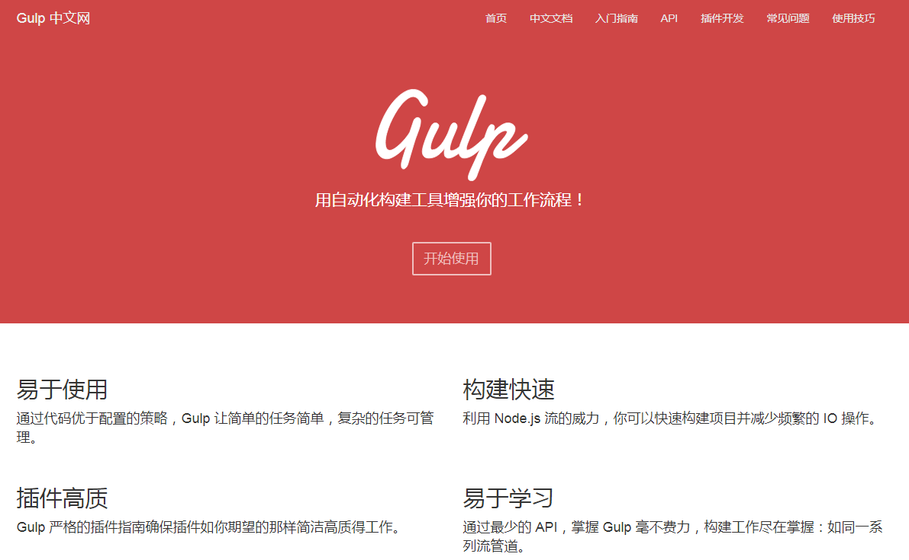
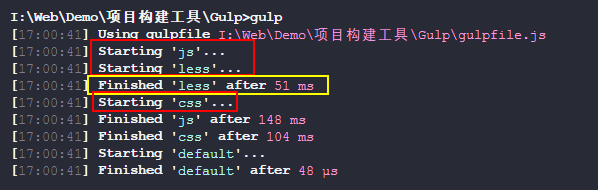
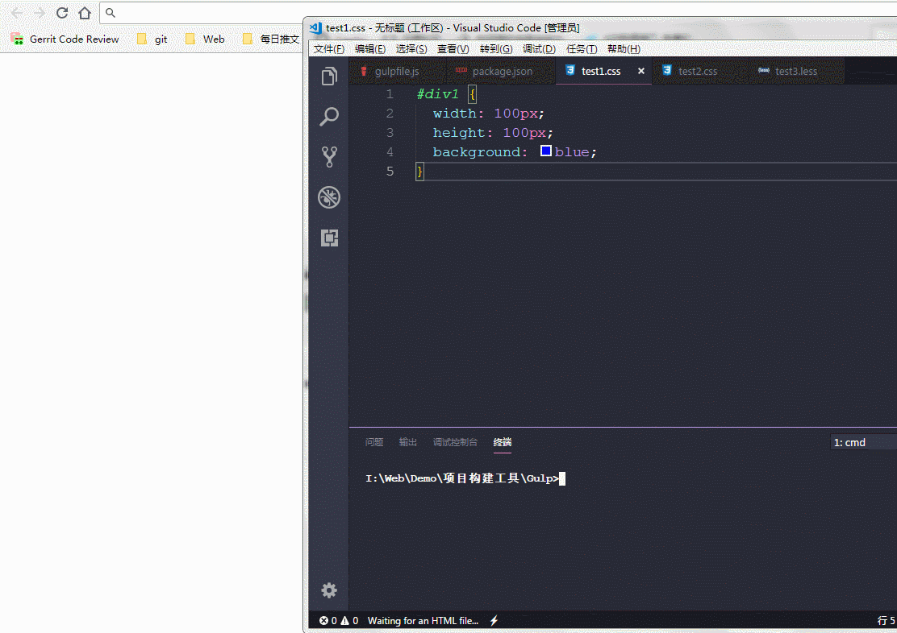

>大家好，这里是「 从零开始学 Web 系列教程 」，并在下列地址同步更新......
>
> - github：https://github.com/Daotin/Web
> - 微信公众号：[Web前端之巅](https://github.com/Daotin/pic/raw/master/wx.jpg)
> - 博客园：http://www.cnblogs.com/lvonve/
> - CSDN：https://blog.csdn.net/lvonve/
>
> 在这里我会从 Web 前端零基础开始，一步步学习 Web 相关的知识点，期间也会分享一些好玩的项目。现在就让我们一起进入 Web 前端学习的探索之旅吧！


## 一、Gulp介绍

Gulp 中文主页: http://www.gulpjs.com.cn/



gulp是与grunt功能类似的**前端项目构建**工具, 也是基于Nodejs的**自动任务运行器** 。能自动化地完成 javascript/coffee/sass/less/html/image/css 等文件的合并、压缩、检查、监听文件变化、浏览器自动刷新、测试等任务。

gulp比Grunt更加高效，Gulp是基于**异步多任务**的处理方式，而 Grunt 则是同步的任务处理方式。使得Gulp 更易于使用。

**注意：Gulp 也不支持 ES6 语法。**


## 二、Gulp使用步骤

由于 Gulp 也是基于 node.js 的，所以首先要确保安装了 node.js.

**1、安装 nodejs,**

查看版本: `node -v`

**2、创建一个简单的应用 gulp_test**

下面为gulp_test项目的目录结构：

```
|- dist   ---- 存放项目上线的文件
|- src
  |- js
  |- css
  |- less
|- index.html
|- gulpfile.js-----gulp配置文件
|- package.json
  {
    "name": "gulp_test",
    "version": "1.0.0"
  } 
```

**3、安装gulp**

* 全局安装gulp
  ```
  npm install gulp -g
  ```
* 局部安装gulp
  ```
  npm install gulp --save-dev
  ```


**4、配置编码:gulpfile.js**

> 注意：gulpfile.js 不需要首字母大写，而 Gruntfile.js 需要首字母大写。

  ```js
//引入gulp模块
var gulp = require('gulp');
//定义默认任务
gulp.task('任务名', function() {
  // 将你的任务的任务代码放在这
});
gulp.task('default', ['任务'])//异步执行
  ```

**5、构建命令**

```
gulp 任务名
```


## 三、Gulp插件

Gulp 同 Grunt 一样，Culp 本身是不会执行任务的，执行任务的都是小弟，也就是gulp下的插件。

注意：查找gulp的插件，需要**切换到gulp国外官网**，然后点击 `plugins` 选项，才可以查看查找相关插件。


**相关插件:**

* `gulp-concat` : 合并文件(js/css)
* `gulp-uglify` : 压缩js文件
* `gulp-rename `: 文件重命名
* `gulp-less` : 编译less
* `gulp-clean-css` : 压缩css
* `gulp-livereload` : 实时自动编译刷新


**重要API**

* `gulp.src(filePath/pathArr)` : 指向指定路径的所有文件, 返回文件流对象。用于读取文件。
* `gulp.dest(dirPath/pathArr)` ：指向指定的所有文件夹。用于向文件夹中输出文件。
* `gulp.task(name, [deps], fn) ` ：定义一个任务
* `gulp.watch() ` ：监视文件的变化


## 四、插件使用

### 1、合并压缩js

**1、创建js文件**
* src/js/test1.js
  ```js
  (function () {
    function add(num1, num2) {
      return num1 + num2;
    }
    console.log(add(10, 30));
  })();
  ```
* src/js/test2.js
  ```js
  (function () {
    var arr = [2,3,4].map(function (item, index) {
        return item+1;
    });
    console.log(arr);
  })();
  ```


**2、下载相应插件:**

```
npm install gulp-concat gulp-uglify gulp-rename --save-dev
```

**3、配置 gulpfile.js**

```js
// 引入gulp模块
var gulp = require("gulp");
//引入gulp插件
var concat = require("gulp-concat");
var uglify = require("gulp-uglify");
var rename = require("gulp-rename");

gulp.task('js', function () {
  return gulp.src('src/js/*.js')  // 引入js源文件
    .pipe(concat('build.js'))      // 合并为临时js文件build.js
    .pipe(gulp.dest('dist/js/'))   // 输出到dist/js目录下
    .pipe(uglify())               // 将临时js文件压缩
    .pipe(rename({                // 将压缩后的js文件添加.min后缀（重命名为build.min.js）
      suffix: '.min'
    }))
    .pipe(gulp.dest('dist/js/'));  // 再将最终的build.min.js输出到dist/js目录下
});

gulp.task('default', ['js']);
```
> 1、插件的引入不同于gulp模块的引入，gulp 的引入之后，gulp是个对象，可以点出task等任务，但是插件引入之后是个方法，既然是方法，就可以直接加括号来调用，此为区别，需要注意。
>
> 2、gulp.src 引入源文件的时候，如果 js目录 下面还有目录，这个目录里面也有js文件，如果想递归引入src里面所有的js可以这样写：`src/js/**/*.js` ，给 js 目录下面套上一个 `**` 目录就递归查找 js目录下所有的js文件。
>
> 3、`.pipe` 是管道操作，用来链接任务的执行流。
>
> 4、rename 方法里面可以直接填写 `build.min.js`  来指定文件名，也可以使用一个对象，其键为 `suffix` 表示后缀名的意思，值为 `.min` 表示后缀名为 .min，但是这里面的后缀名是除开 `.js` 后缀的，最后在文件名的最后还会加上`.js`的。
>
> **5、return 的作用：使得grup的任务执行为异步的，就这一点，非常重要。**


**4、页面引入 js 浏览测试** 

```html
<script type="text/javascript" src="dist/js/built.min.js"></script>
```


### 2、合并压缩css/less

**1、创建less/css文件**
* src/css/test1.css
  ```css
  #div1 {
    width: 100px;
    height: 100px;
    background: green;
  }
  ```
* src/css/test2.css
  ```css
  #div2 {
    width: 200px;
    height: 200px;
    background: blue;
  }
  ```
* src/less/test3.less
  ```less
  @base: yellow;
  .index1 { color: @base; }
  .index2 { color: green; }
  ```


**2、下载插件**

```
npm install gulp-less gulp-clean-css --save-dev 
```

**3、配置gulpfile.js**

  ```js
  var less = require('gulp-less');
  var cleanCSS = require('gulp-clean-css');

  //less处理任务
  gulp.task('lessTask', function () {
    return gulp.src('src/less/*.less')
        .pipe(less()) 
        .pipe(gulp.dest('src/css/'));
  })
  //css处理任务, 指定依赖的任务
  gulp.task('cssTask',['lessTask'], function () {
    return gulp.src('src/css/*.css')
        .pipe(concat('built.css'))
        .pipe(gulp.dest('dist/css/'))
        .pipe(rename({suffix: '.min'}))
        .pipe(cleanCSS({compatibility: 'ie8'})) // 为了兼容IE8浏览器
        .pipe(gulp.dest('dist/css/'));
  });

  gulp.task('default', ['minifyjs', 'cssTask']);
  ```

> 有个问题：
>
> 1、我们知道，grup是异步执行的，那么上面的 less任务和 css任务会异步执行，但是有这个情况就是 less任务量非常大，事件消耗长，而css任务很小，那么有可能 css执行完了 less还没有执行完，也就没有生成 css 任务需要的 css文件，这个时候 css的任务执行就没有包括 less生成的 css文件，相当于 less的任务白做了。
>
> 2、所以，为了保证任务的执行先后，grup也可以同步执行，在gulp.task中传入一个数组，里面是处理当前任务所要依赖的任务，只有依赖的任务完成之后，才会执行当前任务。
>
> 3、所以，grup其实可以同步可以异步，但是它的异步才是它最大的卖点。



**4、页面引入css测试**

  ```
<link rel="stylesheet" href="dist/css/built.min.css">
<div id="div1" class="index1">div1111111</div>
<div id="div2" class="index2">div2222222</div>
  ```


### 3、压缩html

**1、下载插件**
```
npm install gulp-htmlmin --save-dev
```

**2、配置gulpfile.js**

```js
var htmlmin = require('gulp-htmlmin');
//压缩html任务
gulp.task('htmlMinify', function() {
    return gulp.src('index.html')
        .pipe(htmlmin({collapseWhitespace: true})) // 去除多余的空格
        .pipe(gulp.dest('dist/'));
});
gulp.task('default', ['minifyjs', 'cssTask', 'htmlMinify']);
```


**3、修改页面引入路径**

```html
<link rel="stylesheet" href="css/built.min.css">
<script type="text/javascript" src="js/built.min.js"></script>
```


### 4、半自动编译

我们在 grunt 中有个watch插件，可以实时监视源文件的变化，那么在 gulp中也有类似的插件，叫做`gulp-livereload` 。


**1、下载插件**

```
npm install gulp-livereload --save-dev
```


**2、配置gulpfile.js**

```js
var livereload = require('gulp-livereload');
          
//每个任务的最后都应该加上下面这一句
.pipe(livereload());

gulp.task('watch', ['default'], function () {
  //开启监视
  livereload.listen();
  //监视指定的文件, 并指定对应的处理任务
  gulp.watch('src/js/*.js', ['minifyjs'])
  gulp.watch(['src/css/*.css','src/less/*.less'], ['cssTask','lessTask']);
});
```
> 注意：
>
> 1、watch 任务执行代码，一定要先执行  default 任务，也就是要把 default 作为 watch 任务的依赖。
>
> 2、在default里的每个任务的最后要接一个管道`.pipe(livereload());`来保证源文件修改后执行watch任务后，重新刷新到页面。


### 5、全自动编译

上面半自动编译的过程，我们可以看到在我们对源码编译保存后，还需要手动刷新浏览器，能不能在我修改源文件保存后自动刷新到浏览器显示呢？


**1、下载插件gulp-connect**

```
npm install gulp-connect --save-dev
```

**2、配置 gulpfile.js**

```js
var connect = require("gulp-connect");

//每个任务的最后都应该加上下面这一句
.pipe(connect.reload());

// 全自动任务
gulp.task('server', ['default'], function () {
  connect.server({
    // 最后要生成的源文件的路径
    root: 'dist/',
    // 开启实时刷新
    livereload: true,
    // 开启服务器的端口号
    port: 1000
  });

  // 监视的源文件
  gulp.watch('src/js/*.js', ['js']);
  gulp.watch(['src/css/*.css', 'src/less/*.less'], ['css']);
});
```



问题：每次我还是要复制链接`http://localhost:1000/` 到浏览器打开网页查看，还是很麻烦哦，能不能自动打开网页？^_^

0.o 额你也太懒了....不过我还是有办法解决的。


**1、下载插件：open**

```
npm install open --save-dev
```


**2、配置（只需要加上一句open(你的链接);）**

```js
var open = require("open");

gulp.task('server', ['default'], function () {
  connect.server({
    // 最后要生成的源文件的路径
    root: 'dist/',
    // 开启实时刷新
    livereload: true,
    // 开启服务器的端口号
    port: 1000
  });

  // 自动打开链接
  open("http://localhost:1000/");

  // 监视的源文件
  gulp.watch('src/js/*.js', ['js']);
  gulp.watch(['src/css/*.css', 'src/less/*.less'], ['css']);

});
```


## 五、插件打包加载

插件打包加载的好处是，我们不需要每次在 gulpfile.js 的开始定义插件的方法，而是用一个对象，这个对象的属性中包含所有用到的插件的方法。


**1、将所有需要的插件都下载好。**

```
npm install gulp-concat gulp-uglify gulp-rename gulp-clean-css gulp-connect gulp-htmlmin gulp-less gulp-livereload open --save-dev
```

**2、下载打包插件： gulp-load-plugins**

```
npm install gulp-load-plugins --save-dev
```

**3、在gulpfile.js引入**

```js
var $ = require('gulp-load-plugins')();
```

注意：引入的插件是个方法，调用之后的返回值就是我们需要的对象，这个对象中包含之前引入的所有插件的方法，以后用到哪个插件的方法，直接使用 `$.方法` 的方式即可。

```js
var gulp = require("gulp");
var $ = require("gulp-load-plugins")();

// var concat = require("gulp-concat");
// var uglify = require("gulp-uglify");
// var rename = require("gulp-rename");
// var less = require("gulp-less");
// var cleanCss = require("gulp-clean-css");
// var htmlmin = require("gulp-htmlmin");
// var livereload = require("gulp-livereload");
// var connect = require("gulp-connect");
var open = require("open");

// 合并压缩js
gulp.task('js', function () {
  return gulp.src('src/js/*.js')
    .pipe($.concat('build.js'))
    .pipe(gulp.dest('dist/js/'))
    .pipe($.uglify())
    .pipe($.rename({
      suffix: '.min'
    }))
    .pipe(gulp.dest('dist/js/'))
    .pipe($.livereload())
    .pipe($.connect.reload());
});

// less编译为css
gulp.task('less', function () {
  return gulp.src("src/less/*.less")
    .pipe($.less())
    .pipe(gulp.dest("src/css/"))
    .pipe($.livereload())
    .pipe($.connect.reload());
});

// css合并压缩
gulp.task('css', ['less'], function () {
  return gulp.src('src/css/*.css')
    .pipe($.concat("build.css"))
    .pipe(gulp.dest('dist/css/'))
    .pipe($.cleanCss({
      compatibility: 'ie8'
    }))
    .pipe($.rename({
      suffix: '.min'
    }))
    .pipe(gulp.dest('dist/css/'))
    .pipe($.livereload())
    .pipe($.connect.reload());
});

// html压缩
gulp.task('html', function () {
  return gulp.src('index.html')
    .pipe($.htmlmin({
      collapseWhitespace: true
    }))
    .pipe(gulp.dest('dist/'))
    .pipe($.livereload())
    .pipe($.connect.reload());
});

// 半自动编译
gulp.task('watch', ['default'], function () {
  $.livereload.listen();
  gulp.watch('src/js/*.js', ['js']);
  gulp.watch(['src/css/*.css', 'src/less/*.less'], ['css']);
});

// 全自动编译
gulp.task('server', ['default'], function () {
  $.connect.server({
    // 最后要生成的源文件的路径
    root: 'dist/',
    // 开启实时刷新
    livereload: true,
    // 开启服务器的端口号
    port: 1000
  });

  // 自动打开链接
  open("http://localhost:1000/");

  // 监视的源文件
  gulp.watch('src/js/*.js', ['js']);
  gulp.watch(['src/css/*.css', 'src/less/*.less'], ['css']);

});

gulp.task('default', ['js', 'less', 'css', 'html']);
```

> 注意：
>
> 1、gulp-load-plugins 中没有 open 方法，open插件需要单独引入。
>
> 2、`$` 包含的方法有个规律，就是它的方法的命名一般都是插件的除去grup的剩下单词的组合，比如 gulp-rename 插件对应的方法，在`$`对象中就是 `$.less`  ，gulp-clean-css 插件比较特殊，因为后面两个单词，所以在 `$` 中的方法遵循驼峰命名法，就是 `$.cleanCss` 。


