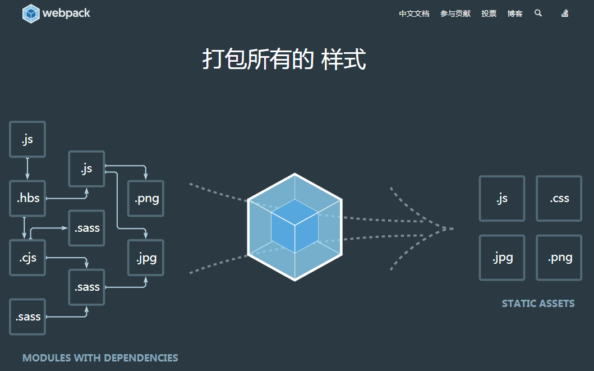
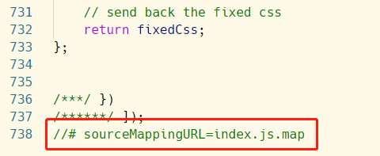
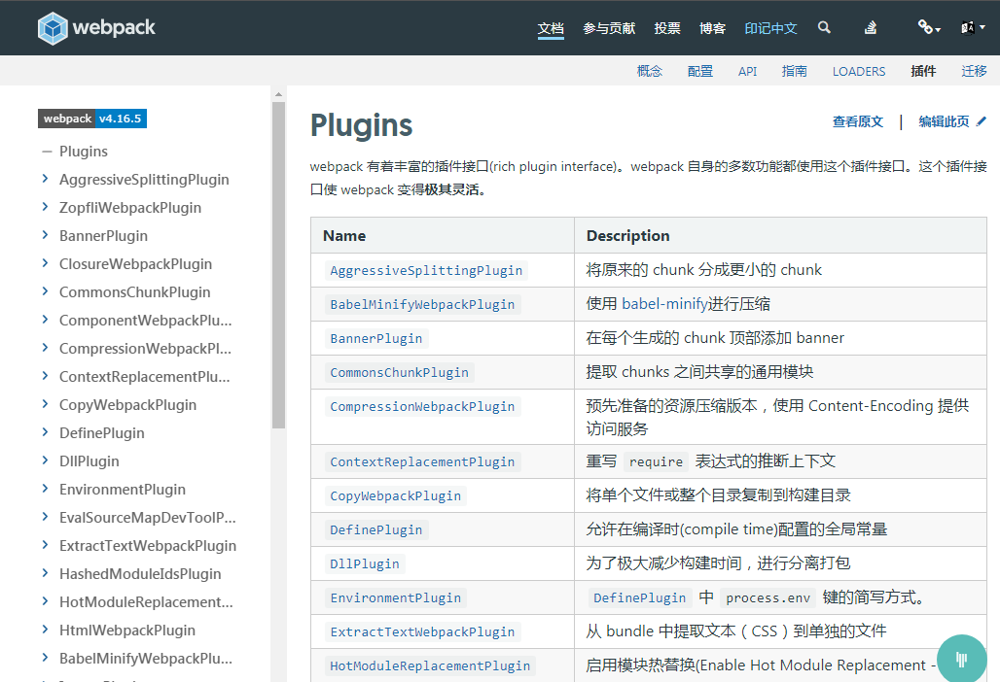

##一、Webpack介绍

Webpack 中文官网 https://www.webpackjs.com/




### 1、什么是webpack?

Webpack是一个**模块打包器(bundler)**。


但是，webpack的**核心功能**是：

> 把模块化规范的代码，比如commonJS等编译成浏览器能识别的代码输出出来(也叫作前端模块化)

**我们知道在之前，commonJS规范的代码只能在node后端中运行（node是原生支持commonJS模块化的），如果在前端使用的话，会报一个错误：‘require is not defined’ 找不到require，这就是模块化规范的代码不能在浏览器中解析运行，如果想运行，达到前端模块化的功能，就要使用自动化构建工具，webpack就是其中的一种。**


webpack的**辅助功能**才是对源代码的打包，压缩，混淆处理等。

所以一定要搞清楚主次关系。


在Webpack看来, 前端的所有资源文件(js/json/css/img/less/...)都会作为模块处理，每一个资源文件都是一个模块。它将根据模块的依赖关系进行静态编译，生成对应的静态资源。


webpack所有的配置都会写在项目根目录下的`webpack.config.js` 文件下。

webpack如何配置，你需要先理解四个**核心概念**：

- 入口(entry)
- 输出(output)
- loader
- 插件(plugins)


**入口**

指示 webpack 应该使用哪个模块作为主模块来构建静态资源，一般打包的时候只引入主模块，而在主模块中会引入其他的模块，这样我们就只需要打包一份主模块就够了。


**Loader**

Webpack 本身只能加载`JS/JSON`模块，如果要加载其他类型的文件(模块)，就需要使用对应的loader 进行转换/加载
* Loader 本身也是运行在 node.js 环境中的 JavaScript 模块
* 它本身是一个函数，接受源文件作为参数，返回转换的结果
* loader 一般以 xxx-loader 的方式命名，xxx 代表了这个 loader 要做的转换功能，比如 json-loader。
* 配置文件(默认)
* webpack.config.js : 是一个node模块，返回一个 json 格式的配置信息对象


* 插件

  插件件可以完成一些loader不能完成的功能。

  插件的使用一般是在 webpack 的配置信息 plugins 选项中指定。

  CleanWebpackPlugin: 自动清除指定文件夹资源

  HtmlWebpackPlugin: 自动生成HTML文件并

  UglifyJSPlugin: 压缩js文件


## 二、webpack初体验

### 1、安装webpack

由于现在webpack版本在2018年8月份的时候更新到 webpack 4+ 了，但是市面上用的最多的还是webpack3+，所以下面所有的示例均已webpack3+来演示。

如果想要使用 webpack3+ 的版本的话，在全局安装和局部安装的时候需要注意，需要在webpack后面加上`@3` ，表示安装webpack3+ 的版本。

```js
//全局安装
npm install webpack@3.11.0 -g  
//局部安装
npm install webpack@3.11.0 -D
```

> 全局安装时为了能够使用webpack指令来进行项目的编译等，
>
> 项目安装是为了使用webpack模块的内容。


### 2、初始化项目

使用`npm init -y` 初始化项目。

> `-y`的目的是不提示项目名等等提示信息，直接全部使用默认的配置创建package.json文件。


创建src目录，目录下建一个主模块main.js，在主模块中调用sayHello.js文件

```js
// sayHello.js
module.exports = name => {
    console.log(name);
}

// main.js
let say = require('./sayHello');
say('lvonve');
```


创建主页面

将来webpack打包生成的js文件是dist目录下的index.js文件

```html
<!DOCTYPE html>
<html lang="en">

<head>
    <meta charset="UTF-8">
    <meta name="viewport" content="width=device-width, initial-scale=1.0">
    <meta http-equiv="X-UA-Compatible" content="ie=edge">
    <title>Document</title>
</head>

<body>
    <div>真的</div>
</body>
<script src="index.js"></script>

</html>
```


### 3、编译运行

```
webpack main.js index.js
```

然后就可以在浏览器中查看打印出‘lvonve’


## 三、webpack打包

有的时候我们希望将编译好的js文件放到指定的dist目录，但是我们又不想手工创建，有没有办法呢？

`webpack.config.js`配置文件可以解决。


1、新建一个`webpack.config.js`文件：

```js
module.exports = {
    entry: __dirname + '/src/main.js',
    output: {
        path: __dirname + '/dist',
        filename: 'index.js'
    }
}
```

> `__dirname` 表示当前项目的根路径。
>
> `entry` 入口模块
>
> `output` 输出的目标文件的路径和文件名


2、使用指令进行编译：

```js
webpack
```

之后我们会在项目更目录下发现一个dist目录，目录下有个index.js文件，就是我们的目标文件。


## 四、热加载（自动编译）

每次在我们修改源文件后，都需要进行webpack指令进行打包才可以生成目标文件，才能在页面展示使用。

有没有在源代码修改保存后，自动~~编译成目标位文件~~刷新页面呢？

这就是`webpack-dev-server`模块。webpack-dev-server模块会自动开启个本地web服务器来运行我们的程序，一旦源文件被修改，会自动同步到浏览器中。

webpack-dev-server模块原理：

webpack-dev-server 其实就是个微服务器，在执行 webpack-dev-server 命令的时候，也会首先从  webpack.config.js 中找到任务，然后在其自己内部进行打包，打包好了之后，并不会输出到本地，而是在其内存中有一份 index.js ，我们通过 `http://localhost:3000/` 访问的其实就是其内存中的文件，这时候即使我们删除本地 index.js 也不会影响页面的显示。

并且 webpack-dev-server 会自动寻找文件的路径，所以我们不需要指定 index.js 和 大图的路径，这也是其智能的地方。


> **但是需要注意的是，webpack-dev-server模块不会生成目标文件，也就是不会生成dist文件夹和里面的目标文件，webpack-dev-server会将编译运行放在内存的目标文件，而不会生成到项目中。而webpack指令才可以生成目标文件。**


1、安装 webpack-dev-server模块

```js
npm i webpack-dev-server@2.9.7 -g
```

> 注意安装2.9.7版本的。


2、在webpack.config.js中进行配置：

```js
// 安装的webpack-dev-server模块配置信息
devServer: {
    contentBase: __dirname + '/dist', // 指定本地web服务器根路径
    port: 3000,
    inline: true // 当源文件改变后，自动在浏览器页面刷新
}
```


3、运行指令

```
webpack-dev-server --inline --open
```

这时候，编译完成会自动访问`http://localhost:3000` 地址，就不用再打开浏览器了，如果项目源代码有修改，保存后，浏览器会自动进行刷新显示。


4、这个命令太长了，package.json就用到了。

```json
"scripts": {
        "start": "webpack-dev-server --inline --open",
        "build": "webpack"
}
```

以后直接使用指令：

```
npm run start
```

想生成dist文件的时候：

```
npm run build
```


## 五、html-webpack-plugin插件

我们之前编译的dist文件夹只有index.js目标文件，其实我们在项目上线的时候，除了有js文件还应该有index.html

主文件，所以我们应该把html文件放到dist目录下。但是由于一般dist下的文件不建议修改，我们希望的是修改了源文件中的html就自动复制一份到dist中，`html-webpack-plugin` 插件就给我们提供了帮助。


1、安装html-webpack-plugin插件

```
npm i html-webpack-plugin -D
```


2、修改webpack.config.js配置文件

```js
let Hwp = require('html-webpack-plugin');

//..

// 安装的html-webpack-plugin模块的配置
plugins: [
    new Hwp({
        template: __dirname + '/src/index.html', // 源文件index.html路径
        filename: 'index.html', // 由于生成路径output已配置，这里只写生成的文件名
        inject: true // 在index.html中自动引入需要的就js,css文件
    })
]
```

> html-webpack-plugin插件还有个额外功能就是 `inject: true`，它可以自动识别需要引入的script和link文件，特别好使。


3、重启服务


## 六、打包css到js

项目还存在css文件怎么办？可以把css样式打包到js中。


1、安装模块 css-loader和style-loader

```
npm i css-loader style-loader -D
```

> css-loader：作用是读取css文件
>
> style-loader：作用是将css注入到js中


2、配置config

```js
module: {
    rules: [{
        test: /\.css$/, // 解析以.css结尾的文件
        loader: 'style-loader!css-loader' //解析以.css结尾的文件需要用到的模块（注意：书写顺序是先使用的写后面）
    }]
}
```

> 注意：loader: 'style-loader!css-loader'  中书写的顺序，先需要用到的写到后面。


3、在入口js引入css文件

```js
// main.js
require('./style/base.css');
```


4、重启服务

```js
npm run start
```


## 七、打包图片文件到js

1、安装插件

```js
// 图片相关插件（url-loader是对象file-loader的上层封装，使用时需配合file-loader使用。）
npm install file-loader url-loader -D
```


2、修改配置文件

```json
module: {
    rules: [
        { test: /\.(png|jpg|gif)$/, use: [{ loader: 'url-loader', options: { limit: 8192 } }] } // 限制转换的图片大小为8Kb

    ]
},
```


3、在css中插入图片

```css
div {
    width: 200px;
    height: 200px;
    background: url(../img/1.jpg);
}
```


4、重新编译

我们发现dist中没有图片，但是图片显示了，说明图片注入到了css中。我们可以查看生成的index.css看出来，图片是以base64的形式存在的：

```css
div {
    width: 200px;
    height: 200px;
    background: url(data:image/jpeg;base64,/9j/4AAQSkZJRgABAQAASABIAAD/4QBYRXhpZgAATU0AKgAAAAgAAgESAAMAAAABAAEAAIdpAAQAAAABAAAAJgAAAAAAA6ABAAMAAAABAAEAAKACAAQAAAABAAAAmKADAAQAAAABAAAAmAAAAAD/7QA4UGhvdG9zaG9wIDMuMAA4QklNBAQAAAAAAAA4QklNBCUAAAAAABDUHYzZjwCyBOmACZjs+EJ+/8AAEQgAmACYAwEiAAIRAQMRAf/EAB8AAAEFAQEBAQEBAAAAAAAAAAABAgMEBQYHCAkKC//EALUQAAIBAwMCBAMFBQQEAAABfQECAwAEEQUSITFBBhNRYQcicRQygZGhCCNCscEVUtHwJDNicoIJChYXGBkaJSYnKCkqNDU2Nzg5OkNERUZHSElKU1RVVldYWVpjZGVmZ2hpanN0dXZ3eHl6g4SFhoeIiYqSk5SVlpeYmZqio6Slpqeoqaqys7S1tre4ubrCw8TFxsfIycrS09TV1tfY2drh4uPk5ebn6Onq8fLz9PX29/j5+v/EAB8BAAMBAQEBAQEBAQEAAAAAAAABAgMEBQYHCAkKC//EALURAAIBAgQEAwQHBQQEAAECdwABAgMRBAUhMQYSQVEHYXETIjKBCBRCkaGxwQkjM1LwFWJy0QoWJDThJfEXGBkaJicoKSo1Njc4OTpDREVGR0hJSlNUVVZXWFlaY2RlZmdoaWpzdHV2d3h5eoKDhIWGh4iJipKTlJWWl5iZmqKjpKWmp6ipqrKztLW2t7i5usLDxMXGx8jJytLT1NXW19jZ2uLj5OXm5+jp6vLz9PX29/j5+v/bAEMABgYGBgYGCgYGCg4KCgoOEg4ODg4SFxISEhISFxwXFxcXFxccHBwcHBwcHCIiIiIiIicnJycnLCwsLCwsLCwsLP/bAEMBBwcHCwoLEwoKEy4fGh8uLi4uLi4uLi4uLi4uLi4uLi4uLi4uLi4uLi4uLi4uLi4uLi4uLi4uLi4uLi4uLi4uLv/dAAQACv/aAAwDAQACEQMRAD8A+qKXNV5ZCPlXioVlYHk5qlG5LlYvUU0HIzTqkoKKilfYOO9VfNkznNUo3E5JF+jpTEbcuaUsAMnipGgzS5rk7DxRb6rfXEenAPZ2nE10zYQv2VPX3bp0xnNVdS8b+HdPRnkvY5GXokJ8xj+XH5kCmkDZ224UZHeuRj8Wada6bHe65KljJIvmeQzbpFU8gbRyTjGeODXFWvi268Y+KLPTNOV4bC3fz5SeHkEfILY6LuwNv5+gTQHsmaKbkCqryMTgHimlcTdi5RVSKRt21jVuhqwJ3Cig1WmkIO0cUkgbsWKWqKyuvU5p/wBpquRiUkf/0Pp6ZDndUaozHGKvYoxVKViHHW4gGBinUUVJZBMhZeO1VcN0xWjTapSsS43OZ1jxTonhyLGozgSEbhEnzSEeuOw9yQPevIPFvxQj1TS5NN0yGS3Ex2vI7Lkx4OQAucbuM89Misv4geKxqOozaZprBLONishTjz3XqWPdR0UdOM+mPLSqFtx5+tSzVRNL+0LiS1WzaVjCpLiPPyBj1OOmcAc9e1NkneUgyMWwoUH2HSqWcCk8wdqC7Fwyk5LdT1Oa6rwz4wn8LJO1jbQyTT4Bkk3EhR/CACMc5J9fwriPMpokxQFkz3TR/isse641xZ5pX6RwqixRr7ZfcxPqTx0+u5ZfET+29Ri0zQrFy8rcvMwARB95iF3ZwPcc4HevnVHQsN+QmfmOM4FfQnwtuvCqWZis5QNSk4mEuA5x2j9UHXj6ntTTsROCPVoUYkFu3tV6m5FOobuZpWCqsyHO4VapKE7A1coBGfjFO+zGruKWq5xKJ//R+qaKhklCcd6jWfnkU1FibRaoozmikMQ9K47x1rv9geHLi7ibbPKPJhx13vxkf7oy34V17uEGTXzn8W5NXvI4tRmXyLCCQxQRsf3kjFSWkK9hxgZ5x25p2Bb2PJru5jnuGliXYpxgdTwMHP161Wznk1WBwOa0ClzeIzxqv7tVLYG35cgdu5JqW0tzoS6EXyquWOB0pGxsLp82PT2/rXv1j8IvDMduBqBnuZZAHfdJtXfjsFAwB2Ga831LwoumQ3U8Yb9zdeW+Tn5HQFDz+RrP2qvYrkZxEatNgxDduGRjvxmmSARqjb1YuC2FOSuDjDf571u6lo7aZb2lwq4hu41df9nPDD6Z5HsfaufntpZCDAMmMM5H+woy35CtE0JxY0SH863PD+r2ul6klxf2sd5bsQkscihsrnOVJ6MOoIPt3Nc43GatabeLY30F26K6wyK7I4DKygjKkHggjimQz7l0yayubCC409g1vIivGQcgqRkda0a5zw9p0GkWxs7FibRmMsKE58sSfMUH+zk5H1xXR0GIUUVDJIE6daEgJqKqrPz8wqXzk96rlYuZH//S+nJgQ5J71F14FaBUN1pAir0FWp6EOGtxV6CnUmKWoZZXnHAPpXj3xihaTwmkq8iO5jJPsQy/zIr2gjjmvOviPoMmseHbp/PaOO0ia48tB/rHjBI3E5+UDPA7854qlIVtbnyQPuMw7A/pXqHgfSk1PSNakxl4ngC+oVW3kfjgV5ZFMkfniU8If0YD/wCvXo2jWviPQdKbUH+12lldBGEiS28AfjA3eZk8jpWNU6ovU+nSQTnOc1xPiPTEOj6nI/8AGsbD3MS9f6fhXk2meLtVvLlI9I1C6llzxHLdWsgbH+wUUn8K9Hm8c6LGjaV4ujk0y5XaXhdS6yL/AHlaPcCpxg/lzXM4mt7FTxDoKzeBrKORP3lskTH1w33h+tcP4O0QX2t3CTLmOC3m3/VhsH8z+VdlrvijUdd0iWTQrSRNOZsG9kaKMSKp5MYk6DI4Yg15hpWuCN3trO8uY7qU4kMN3bKsjZP95cHr69elaK9rBc4m8gNpdy2TdYiV/I4qbR9Mm1nUoNLgYLJO21SemcE/lxWl4osNQ03VC+sRSxS3KmTMuwsw3dcxkg+/Sr/w2DSeM7CfaTClxsZ/4VZ0bYCffnH0rpjsYSPqbwjLLc+HtNllG1/s8auD1DKoVgffINddUMUMUK7IlCrknA9zk/rU1Nu5zpBVKYENmrtIVB60RdgauZ3XpTvLNXQiqcgU7FU5EKB//9P6poprOqjJpizIxwKLCuS0UUUDCsvWYpLjSLy2hXfJLBIir6llIA/M1pEgDJqMzJnFFgbPlXxL8OItFsLowyO0lqgmdsddyRg49t/mEewxXpGj6PpmpW2n3upyB57S0a0CSEBdrD5ZEU/dkwQNw7Z9jW/4+mWwjtL2RzHb3Mn2O4YDdhZQSjFe+xh+RNXvDcYXR4Ebadq7BjlRt4+Unqp6r7HFc9VtHXT1VzhvDfge10aYi7ltpbdVJTkNKsmV2sshUMoUL0z1JJr0Ozidru4u5gGQ7Y4zjqi5PpxyT/nFaYRR0AH4U7/CsVI0epzsVhbNbvp2qBGhSVmSNsbGTOVB4xgHt6jniuC0DwNBo+o+ZO1nJZkSBo5WEzMGUqoO5Bgc5YA4Jr144PXmk2JnIUZ+lJyBaHzT4n8PLe6zpXhvTJXa2jH2NZ3JbcWYvJtPPypvwAOBwK9R+HGg6dFP4gMCAwrqSxR+32ZVKnjuGJpdY223iSK6eQfaJfLsrRAOVklfcSBjkIvzufoBXoWj6PaaCLqK04juJzPt7hmRVP1yVz+NdVK7RzVbI3gKdTEkV+lPrUxCiims6oMmgB1FRLMjHAp+5fWnYLn/1PpyX79R59KuvGHFRrAFOSc1opaEON2TL90Zp1JilrMsrz9Kq1oMoYYNQC3GeTmrjLQiUblK50231JIBdjcLeZZ0H+3HypP0PNeZ+H7h9F8Xar4VmJEEsn2mzz0XzBueMH25IHsa9hxgYFee+N9Ae70y91Oy3fbY1glhMfDh7ZnYEH1Kuw/HvWVRcyNqcrM6NnVELscBQST6YrNM2j6jtfzo5SoKrtf5hu6jg55qLSdV+2IsNxgT7QcjgSD1X+orXZAwwp2nPUAGuFnbtuVYrywWVbCGVC6jARTkgKP0qe6uYLO2ku7lgkUSM7segVetPd44UaWQhFUZYngYHrXnHiIXvjDbouns0du5Lt2MixjvnoMkYHfr7U4q7FLa5b8OeHptZ+w+Mb3i5kvXvEV+dlsyNGka/gQ3ua9KYkk57VbhijhiSCJdqRgKo9ABgClaINz3r0IWiefO8itETvGKv1EkQT3qWnJ3YoqyCqc3L81cqN4w4pRdhyVyiOOlOy3rVlYADk81LtX0q3NEKDP/1fqmikJx1oDA9KAFooooAKKTNVbq+tLGBrm9lSGJOWd2CqPqTQBbqCdgsTsegUn9K464+Ifha3R5XnkKIMllglK/ntrPt/HWl+KUm03w6s08jqUeUx7Y4gw5Zi2CcDoAOTRKLSuwjrsYFtvNpbmUFH8qNsdCDtGDn1FbsfiGeGPZPF5rDowbGfrkdfpW/dabbXKKjArsGAV64FVE0HT1bc4Z/Zjx+Qrzup6znBrVGG39peIZFyohtlOcdRkdyeNx9Owrc0/TLbT9WtjGGYvFMm4nvlDk/hnpWuiqihVAAHYVSv5TaJHqIVn+yP5jqvJMZBV8DvgHdj/Zq6fxGFR+7ZHV0tcFbfEnwldYaO5kEZJHmNDIEyOuTt4x78V2dveWt3CtzaypLE4yrowZT9CK73Fo8+5aopAQelLSGFFFISB1oAWikDA9DS0Af//W+npmJbbUIO3kValiLHcvWqc8sNpC1zeSpDCgyzuwVQPdjwK0TVjNp3NEHimtIqqWY7QOSTwBXmeq/EOCPMOiQmZv+e0oKRj6L95vyUe9eQ63rWra/cCC7uHnUN9z7sQK8n5Vwu1OM5yScDOM1cMPKWoSqpHsWr/EbTone00Vftkqfek5WFc9Pmxlz3wuRjuK8w1C/vdWmFzqUzTMpyi9I0/3EBwPqcn3NZ8USQp5a/UnH3j3Jx3NSV30qEYo5pVHI0NI0i217VodJvN32d1eSUIcFljx8u7qAWIzivVrKzs9K1pLKxhSCGSz+RUGBmN+fqfmHXNef+DUlfxABBIqS/Zpdqt918MmVPpx3HIxnkcV2eqarFHeWdzJHLFNaTeXLG68iOYeXkc/Mu7bgjI/GvMx3M526Hfhrcp2QpKqi9hwSyyJ6742GPxxirCurqHQhgehFeW0dg6qeokDTrknp5Mn/oJqd54I2KvIoI7ZFYPiLU7eDQryRWJzGUyFYjLfL1xjvTitQv3POdf0S00yLTtWsU8o3sSxzquQrSLGGV8dmwCD6/WsnT76+0mY3GlTfZ2b7y4zHJ/vpwD9Rhveut8ZzSNpulr5TQxeeRGsg2uwSFhux/CPQHk9wK4j619BhFzUrSPJxDtLQ9U0r4i6eZI4NbX7E7nb5md0LN/v4yv/AAIAe5r01Jo5FEkbBlYZBByDXy4wLIUBK5HBHb354qhpGo32gzmO0me0wwz5TEIpY8HYcqyN7g7Tx0pVcLr7ooVbbn1tmqkzHdtHSvKtM+It7ERFq9uJ1HWSH5H/ABRjg/gw+lei6fqum65AbnTZllC8MOjKfRlOCD9RXK4OD95G3MpLQtg7TkU/z2pyxEnBqTyVouiUmf/X+nry7t7G1lu7ptkUSl3Y9AAMmvnXVtVvtduzfagxGGJhhz8kKn7vHQvj7zdc8DArv/iLqxPk6HE2NwE8+P7oOI1/FgT/AMB968vPWu/C0dOdnPWnbRFG8uDDDhGIdwTuH8Kj7zfXsPen2cTQQBHGCedvZPYf1Pc5qq//AB8TrMjsX2bdibgYxg/T72c8+lMkN+4488j0Ajj/AFJJrsOexr4NLg9O9Yko1SZQq2wAUY+e4Iz9Qg5/Os5f7UhvPJS0sw+eCC+eVLdTk0+YrlPQNBljg1/TzNwkkphz6GVSqkeh3Yr13XdO/tPSLi0uYxNJGjbGI/eRSY+VlPBIzg54OPcV80yNdQRExxvY3C4eMo2+F3Qhlwf4WyvGcc+tfWkEwvrO31SywTLGsi/7SOAwX8eoPY152LXvXOiizl9Flvr7S7a9tbxJTNErGO5X5g2PmAdcZwQeSp+ta4j1ocrDa9O0rYz3/wCWdU/DW2C71LSWOUinM0SMPuxXA3YA9m3Aiuo+yWuc+Un/AHyK4XBHUps58RaupIla0tUPcFpDn6fuxWLq9pavd6bGXkuZnuVk8yTO1UhG87FA2jkAcDPOM133lRhgwVcjgHHNcrbA6j4rubmZcJpsKwxg84eb53PpnaF/ChQS1E5tnnvj+eaXW7O1mbJht5JSvZfNYKv44Ruf6VxJkjzguv5irXjYzzeMNTkRGuH3RRrHvKRqscaHLHv8zHiuKuH1qCVFezsj5px09wOv417NDSCOGprI67B6jvVe5heaIon3h0B5Vh/db2P/ANesmH+0okZfsMID/e8qbb/McfnU0MkqFg9vdR5GPvrKo9x8x5/CtWzIsWE29fJbOUHybj820HaR9UPyn8D3rYtLm5sbpL+ybZPEQQem4ZyUb1RuhH49ea5qa5tIIlmVm82Nt5V1Ku+7hhggDJHp3Are+tJpNWY07an0lpGpQavp0Oo22dky5weqt0Kn3Ugg/StOvJ/hvqBWW70lzwcXEY+vyyAfjtP1Y16xmvIqQ5ZWO6Mrq5//0NLVr/8AtTVLrUQdyzStsP8A0zQ7E/NVB/Gs6oLT/j0h/wBwfyFT17VJWgjgk9RQe1FIP8/lRWhIGsuf5dTjJ7mP9VkX/CtM9DWbdf8AIRh+kf8A6E1TMaNN0SRTHKNynGR9OR+te5eAblrnwnZBzloA8B/7ZOUH6AV4iOlexfDf/kXD/wBfVx/6Ga5MYvdTOihuamoEaf4msL7GI75Hs5D/ALQ/eRfyYfjXVVyvif8A1ujf9hGH/wBAeuq/z+leadAcd+lcx4U/fWE+qEfNf3Ms/wDwHOyP/wAcUV0rfdb6f0rm/Bv/ACK+n/8AXBf5U0B4tryuPEeqqTuJuj+XlpxXLXwVru1DMBySPc7lwK6zW/8AkadT/wCvk/8AouOuM1D/AI/LP/e/9nFexS+BHDPds2gKCBThSN3rYhi5J6mjNJ2FJSsBveGb02HiCxuAflaTyX91lG3/ANC2mvoD7Sn+cV82af8A8hGy/wCvq3/9GpX0BXFXgnM3hJ2P/9k=);
}
```


> 注意：当我们设置的图片大小超过限时时，会在dist中产生一个图片，而不是base64形式的。

比如我把 limit: 1024 之后，重新webpack生成后会在dist下生成一个990384cd91d73b43929679287541587e.jpg图片，然后在css中引入的是这个图片，而不是base64。

```css
div {
    width: 200px;
    height: 200px;
    background: url(990384cd91d73b43929679287541587e.jpg);
}
```


## 七、开启地图资源模式

之前把所有的js和css都编译到一个js里面之后，如果我们代码有运行错误，排错非常麻烦，因为生成的js文件非常长，可能报错的位置是在一万多行的位置，但是 实际上我们代码的位置只是在几十行的位置。这个该如何处理？

这就需要我们开启地图资源模式。

开启的方式很简单，只需要在配置文件中加上下面一句话即可。

```js
// 开启地图资源模式
devtool: 'source-map'
```

此时，当我们使用`webpack` 生成目标文件的时候，会自动多出一个map文件，比如index.js.map

这个就是一个源文件和编译后目标文件的一个映射文件，当程序有错误的时候，提示的就是源文件的行号而不是目标文件的行号，方便错误定位。


我们可以在目标文件的最后发现有个映射文件的声明的注释，这个注释不能删除，否则就无法实现映射功能。




## 八、多入口文件

之前的目标文件只有一个index.js，如何生成多个目标文件？

我们需要在配置文件的entry属性配置成一个对象，这个对象有多个属性，分别对应多个目标文件。

```json
entry: {
    index: __dirname + '/src/main.js',
    goods: __dirname + '/src/goods.js'
}, 
output: {
    path: __dirname + '/dist',
    filename: '[name].js'
},
```

> entry中每个属性即为目标文件名，输出文件的[name].js中的name即为entry的属性名。


但是，现在一般都是单页面应用，所以像这种对入口文件的形式很少见了。


## 九、打包Less,Scss等

下面以less为例。


1、安装loader

```js
npm i less-loader less -D
```


2、设置配置文件

```js
module: {
    rules: [
        {test: /\.css$/,loader: 'style-loader!css-loader'},
        {test: /\.less$/, loader: 'style-loader!css-loader!less-loader' }
    ]
},
```

> 也是要注意书写顺序。


3、重启服务。


## 十、提取样式文件

之前我们是把css样式打包到js文件中的，而js是使用script标签引入的页面的。

link标签与script的区别：

link标签的加载时异步的，而script的加载会阻塞程序的运行，影响用户体验，所有有必要将css文件提取出来。


1、安装插件

```
npm i extract-text-webpack-plugin -D
```


2、修改配置

```json
let Ext = require('extract-text-webpack-plugin');

module: {
    rules: [
        { test: /\.css$/, loader: Ext.extract('css-loader') },
        { test: /\.less$/, loader: Ext.extract('css-loader!less-loader') }
    ]
},
plugins: [
    new Hwp({
        template: __dirname + '/src/index.html', // 源文件index.html路径
        filename: 'index.html', // 由于生成路径output已配置，这里只写生成的文件名
        inject: true // 在index.html中自动引入需要的就js,css文件
    }),
    new Ext('index.css')
],
```

由于不需要注入到js中了，所以style-loader就去掉了，但读取less和css还是需要的，顺序也是需要的。

在plugins中也要new Ext，参数为生成的css目标文件名。


## 十一、ES6转换成ES5

很多时候我们需要将ES6语法转换成ES5的，因为很多浏览器比如政府网站都比较老旧，不支持ES6语法。所以需要将ES6转换成ES5。


1、安装插件

```
npm i babel-loader@7.1.5 babel-core babel-preset-env -D
```

> 这三个插件：
>
> babel-loader@7.1.5 ：是一个babel工具
>
> babel-core ：是工具的依赖
>
> babel-preset-env：专门用来解析ES6到ES5的


2、修改配置文件

```json
module: {
    rules: [
        { test: /\.css$/, loader: Ext.extract('css-loader') },
        { test: /\.less$/, loader: Ext.extract('css-loader!less-loader') },
        { test: /\.js$/, exclude: /node_modules/, loader: 'babel-loader?presets[]=env' }
    ]
},
```

> exclude:除去node-modules文件夹里面的js文件

我们在`loader:babel-loader`中加了参数`?presets[]=env`，这只是临时写法。

一般写法是在项目根目录新建一个文件`.babelrc`:

```json
{
    "presets":["env"]
}
```

和上面是等价的。


如果使用到ES6的高级语法，比如展开符`...`时，上面的插件就满足不了了，需要另一个插件：

```
npm i babel-preset-stage-2 -D
```

然后修改`.babelrc` :

```json
{
    "presets":["env", "stage-2"]
}
```


3、在main.js书写测试代码

```js
let obj = { name: 'daotin', age: 18 }
let { name: user, age } = obj;

console.log(user, age);
```


4、重启服务


## 十二、使用jquery

方式一：在线cdn

方式二：下载jq，然后在html引入

方式三：安装插件


1、安装jq插件

```js
npm i jquery -S
```


2、然后那个js文件需要，直接require引入

```js
let $ = require('jquery');
```

> 这种方式有个缺陷就是，只能本文件使用jq，其他文件要使用，还得require一次，很多文件使用jq就得很多文件require，可不可以只引入一次所有的js都可用呢？


3、设置jq全局作用域

```json
let webpack = require('webpack');

plugins: [
    new webpack.ProvidePlugin({ $: 'jquery' })
],
```


4、重启服务即可。


##十二、其他插件

**webpack 插件：**

https://www.webpackjs.com/plugins/ 

https://webpack.docschina.org/plugins/




### 1、常用的插件

* 使用`html-webpack-plugin`根据模板html生成新的html文件，并自动引入js文件到页面
* 使用`clean-webpack-plugin`清除dist文件夹
* 使用`uglifyjs-webpack-plugin`压缩打包的js文件


### 2、使用步骤

**1、下载**

```
npm install --save-dev  html-webpack-plugin clean-webpack-plugin uglifyjs-webpack-plugin
```


**2、配置**

```js
const HtmlWebpackPlugin = require('html-webpack-plugin');
const CleanWebpackPlugin = require('clean-webpack-plugin');
const UglifyJsPlugin = require('uglifyjs-webpack-plugin');


module.exports = {
  entry: './src/js/entry.js', // 入口文件
  output: {
    // 略
  },
  module: {
    // 略
  },
  devServer: {
    // 略
  },
  plugins: [
    // template 表示模板的意思，表示以 './index.html' 为模板创建一个html文件
    // 新创建的html文件默认会生成在dist/js目录下，并自动引入bundle.js文件到页面
    new HtmlWebpackPlugin({template: './index.html'}),
    // 在打包的时候，先清空dist目录下的所有文件再生成相关文件
    new CleanWebpackPlugin(['dist']),
    // 将生成的bundle.js压缩
    new UglifyJsPlugin()
  ]
};
```


**3、打包运行项目**

```
webpack
```


结果在 dist/js下自动生成index.html文件，并且自动引入bundle.js文件。


