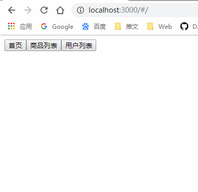
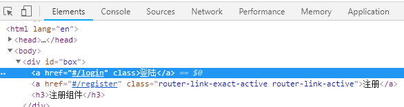
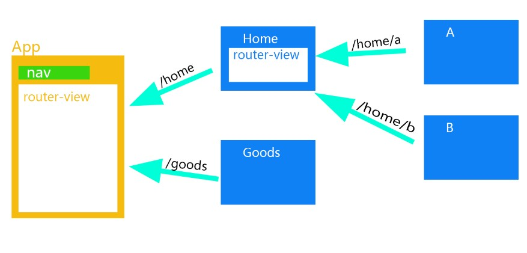
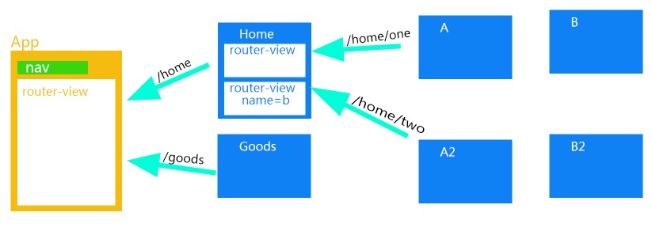
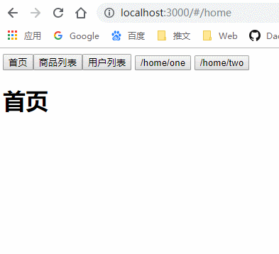
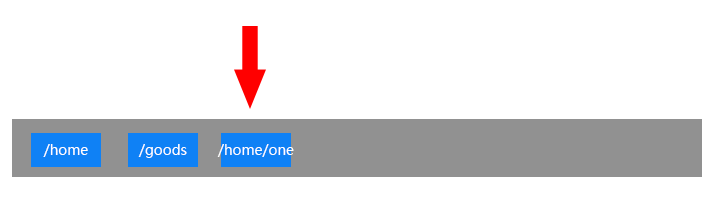
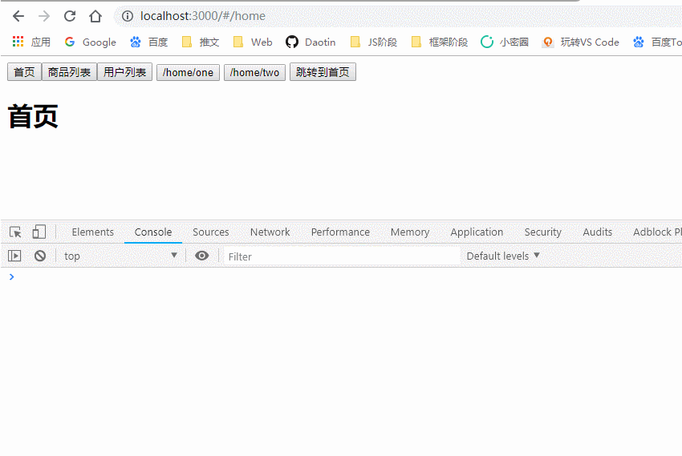
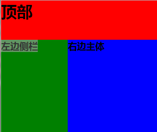

示例文件接到 **Vue的组件**

---


## 一、Vue路由

### 1、什么是路由？

**后端路由：**对于普通的网站，所有的超链接都是URL地址，所有的URL地址都对应服务器上对应的资源；

**前端路由：**对于单页面应用程序来说，主要通过URL中的hash(#号)来实现不同页面之间的切换，并不会向后端发送请求。同时，hash有一个特点：HTTP请求中不会包含hash相关的内容；所以，单页面程序中的页面跳转主要用hash实现；

在单页面应用程序中，这种**通过hash改变来切换页面**的方式，称作前端路由（区别于后端路由）；


承接到**Vue的组件**的示例文件：👇

现在有Home，Goods和Users子组件，我们在点击跳转按钮的时候，页面通过`<Component :is="currentPage" />` 改变了，但是地址url没变，这就是单页面应用。

这样有一个问题就是没法分享给他人，因为地址是相同的，但是看到的内容不同。还有一点就是没有回退功能。

如何解决这个问题？及用到了vue的路由。


### 2、路由的基本使用

在vue中使用路由需要用到`vue-router`的插件。


1、按照vue-router插件

```html
npm i vue-router -S
```

2、引入并注入路由到vue

```js
import Router from 'vue-router'

Vue.use(Router);
```

3、创建一个路由实例，参数为一个对象，这个配置对象中有一个属性：`routes`，表示 **路由的匹配规则**。

```js
let router = new Router({
    routes : [
        { path: '/home', component: Home }, //当地址为/home时，显示Home组件
        { path: '/goods', component: Goods },
        { path: '/users', component: Users }
    ]
});
```

> routes 属性是一个数组，数组中的每一项都是一条匹配规则。
>
> 每个路由规则，都是一个对象，这个规则对象，身上，有两个必须的属性：
>
> `path`：表示监听的路由链接地址
>
> `component`：表示如果路由是前面匹配到的 path ，则展示 component 属性对应的那个组件。

4、将路由规则对象router注册到vue实例

```js
new Vue({
  el: "#box",
  data: {},
  methods: {},
  // 将路由对象注册到vue实例
  router
});
```

5、一旦路由规则匹配成功，就会在vue-router 提供的标签`router-view` 上显示出来，这个标签就是匹配路由成功后component对应的组件应该显示的位置。

```html
<div>
    <button @click="goPage(nav.name)" v-for="nav in navs">{{nav.text}}</button>
    <router-view></router-view>
</div>
```

然后来看看界面：




### 3、router-link属性

我们之前的超链接是由a标签代替的，如果要跳转那么并且每次href属性都要加上#，这样太麻烦。

vue-router官方提供了一个`router-link` 的属性可以实现路由的跳转。

```html
<!--app.html-->
<div>
    <router-link tag="button" :to="nav.name" v-for="nav in navs">{{nav.text}}</router-link>
    <router-view></router-view>
</div>
```

我们通过检查可以知道，router-link 会默认渲染为一个a 标签。




但是我们也可以将其改变成别的标签，使用 `tag="span"`  属性可以将默认的a标签转换成span标签：

```html
<router-link to="/login" tag="span">登陆</router-link>
```


### 4、路由嵌套

我们现在想在/home路径下再接子路由a和b，形成嵌套路由/home/a或者/home/b形式的路由。



在路由配置规则数组中使用 `children` 属性，实现子路由功能。

```js
let router = new Router({
    routes: [
        // 路由重定向
        { path: '/', redirect: '/home' },
        {
            path: '/home',
            component: Home,
        	// 使用children实现子路由
            children: [
                { path: 'a', component: A },
                { path: 'b', component: B }
            ]
        },
        { path: '/goods', component: Goods },
        { path: '/users', component: Users }
    ]
});
```

> 注意：子路由的匹配规则前面不要加 `/` 。

然后在Home的template中加入`<router-view></router-view>`即可。

来看现象：


**给路由起别名**

我们还可以给路由起个别名，这样在有些路由特别长的时候就很方便。

起别名的方式就是往路由匹配规则加个`name`属性即可。

```js
let router = new Router({
    routes: [
        { path: '/', redirect: '/home' },
        {
            path: '/home',
            component: Home,
            name: 'h',
            children: [
                { path: 'a', component: A, name: 'a' },
                { path: 'b', component: B, name: 'b' }
            ]
        }, //当地址为/home时，显示Home组件
        { path: '/goods', component: Goods, name: 'g' },
        { path: '/users', component: Users, name: 'u' }
    ]
});
```

那么我们在使用router-link跳转的时候，属性to就是动态的：

```html
<router-link tag="button" :to="{name:'a'}" v-for="nav in navs">{{nav.text}}</router-link>
```

然后重定向redirect也可以使用name：

```js
{ path: '/', redirect: {name:'h'} },
```


### 5、多视图路由

之前我们是在Home中加载A，B组件，现在有如下需求：



我们在加载/home/one路由的时候，没有名字的router-view加载A组件，有名字的router-view加载B组件；

在加载/home/two路由的时候，没有名字的router-view加载A2组件，有名字的router-view加载B2组件；

这种在Home中显示多个router-view的方式就叫做多视图路由。


首先在Home的template中添加router-view：

```html
<div>
    <h1>首页</h1>
    <router-view></router-view>
    <router-view name="b"></router-view>
</div>
```

接着配置路由：

```:arrow_down:
let router = new Router({
    routes: [
        { path: '/', redirect: '/home' },
        {
            path: '/home',
            component: Home,
            name: 'h',
            children: [{
                    path: 'one',
                    components: {
                        b: B,
                        default: A
                    },
                    name: 'a'
                },
                {
                    path: 'two',
                    components: {
                        b: B2,
                        default: A2
                    },
                    name: 'b'
                }
            ]
        }, //当地址为/home时，显示Home组件
        { path: '/goods', component: Goods, name: 'g' },
        { path: '/users', component: Users, name: 'u' }
    ]
});
```

由于一个router-view要加载的有两个路由，所以component变成components，复数，然后是个对象，有name=b的就是b：B组件，没有name的就是default：A组件。

演示：




### 6、编程式导航

编程式导航就是通过js来实现页面跳转（之前都是通过标签router-link来跳转的），比如如果用户登录成功跳转道首页，这个判断的功能只能通过js来实现。

我在app.html添加一个按钮：

```js
<button @click='goHome'>跳转到首页</button>
```


然后在app.js里面实现点击事件：

通过`父组件.$router.push('路由地址')` 或者是`父组件.$router.push({name:'路由别名'})`的方式进行跳转。

```js
methods: {
    goHome() {
        this.$router.push('/home');
        this.$router.push({ name: 'h' });
    }
},
```

> `this.$router.push`和`this.$router.replace`的区别:
>
> push会保留跳转前的地址，而replace不会。通过名字也可以看出端倪。
>
> 还有`this.$router.go(1)` 执行浏览指针的前进或者后退次数。




### 7、路由高亮显示

我们在点击登陆和注册链接的时候，可不可以让被点击的链接高亮显示呢？

**方式一：**

我们可以看到在激活的路由上面，会使用一个叫做`router-link-active` 的类，我们通过修改这个类的属性就可以让这个链接高亮显示了。

```css
.router-link-active {
  color: red;
  background-color: yellow;
}
```


**方式二：**

可以通过路由的构造选项 `linkActiveClass` 来全局配置需要激活的路由样式。

```js
var routerObj = new VueRouter({
  routes: [{
    path: '/',
    redirect: '/login'
  }, {
    path: '/login',
    component: login
  }, {
    path: '/register',
    component: register
  }],
  // 自定义路由构造选项 linkActiveClass
  linkActiveClass: 'myClass'
});
```


### 8、路由切换添加动画效果

既然 router-view 是显示组件的，那么我们可以给 router-view 来添加动画效果：

```html
<style>
  .v-enter,
  .v-leave-to {
    opacity: 0;
  }

  .v-enter-active,
  .v-leave-active {
    transition: opacity 0.5s ease;
  }
</style>

<transition mode="out-in">
  <router-view></router-view>
</transition>
```


### 9、给路由传递参数


#### 方式一：问号传参

我们可以在路由中，使用查询字符串的方式给路由传递参数。

```html
<div>
    <h1>商品列表页面</h1>
    <ul>
        <router-link tag='li' :to="{name:'d',query:{gid:goods.goodsID}}" v-for="goods in list">
            <h4>商品名:{{goods.name}}</h4>
            <p>价格:{{goods.price}}</p>
        </router-link>
    </ul>
</div>
```

当然上面传递的方式就类似于传统的问号传参方式。比如 `/detail?gid=4` 这样的方式传递，如果想写在to里面就用上面的方式。


给路由传递参数后，我们并**不需要修改路由匹配规则**。

我们给路由传递参数就是为了拿到参数，那么如何获取参数呢？

在我们的组件模板对象里面，可以使用`this.$route.query` 的方式获取我们传入的参数对象。

```js
export let Detail = {
    template : require("./index.html"),
    data(){
        return {
            goodsid : 0
        }
    },
    // 加载后获取路由参数
    mounted(){
        let goodsid = this.$route.query.gid
        this.goodsid = goodsid
    }
} 
```


#### 方式二：路径传参

首先在路由匹配规则中，使用占位符代替路由传递时的参数。

path 中的 `:newGid`表示如果以后路由后面跟内容了，那么内容的属性就是gid。

```html
{path : '/detail/:newGid',component:Detail,name:"d"},
```

然后在传递参数时，就不是用query了，而是params。

```html
<div>
    <h1>商品列表页面</h1>
    <ul>
        <router-link tag='li' :to="{name:'d',params:{newGid:goods.goodsID}}" v-for="goods in list">
            <h4>商品名:{{goods.name}}</h4>
            <p>价格:{{goods.price}}</p>
        </router-link>
    </ul>
</div>
```

这时候，传过去时就不是问号的形式，而是路径的形式，如：`/detail/4`

获取的时候也不是query而是params，`this.$route.params`。

```js
export let Detail = {
    template : require("./index.html"),
    data(){
        return {
            goodsid : 0
        }
    },
    // 加载后获取路由参数
    mounted(){
        let newGoodsid = this.$route.params.newGid;
        this.goodsid = newGoodsid;
    }
} 
```


#### 方式三：编程式导航传参

上面的路由传参都是采用to传参，也就是标签传参，怎么使用编程式导航传参？

其实和to是一样的：

```js
this.$router.push({name:'d',query:{gid:goods.goodsID}})
this.$router.push({name:'d',params:{newGid:goods.goodsID}})
```


### 10、vue路由守卫

什么是路由守卫？简单来说就是路由在跳转之前的验证，当满足条件时才会进行跳转。

路由守卫也称导航守卫，分为`全局守卫`，`路由守卫`和`组件守卫`


#### 10.1、全局守卫

注册全局守卫应该在路由模块暴露出去之前定义，使用`router.beforeEach(function(to,from,next){})`来注册一个全局守卫。

参数：

- to：代表目标路径对象

- from：来源路径对象

- next：用于决定是否继续进行跳转。该方法参数有三种情况：

  当next()函数不传参数或者传入true的时候 则允许正常跳转；

  当next()函数传入false时 会中断跳转(阻止跳转)；

  当next()函数中**传入路径**时或者**对象**时(比如:{name:'xxx'})则会重定向到指定路径。

> 定义在router上的路由守卫 ，全局范围内有效，只要有路径跳转就会触发该守卫。

假如我现在从首页/home跳转到/home/two，根据随机数是否大于0.5决定是否跳转：

```js
import Vue from 'vue'
import Router from 'vue-router'

import { Home } from './pages/Home'
import { Goods } from './pages/Goods'
import { Users } from './pages/Users'

import { A } from './components/A'
import { B } from './components/B'
import { A2 } from './components/A2'
import { B2 } from './components/B2'

Vue.use(Router);

let router = new Router({
    routes: [
        { path: '/', redirect: '/home' },
        {
            path: '/home',
            component: Home,
            name: 'h',
            children: [{
                    path: 'one',
                    components: {
                        b: B,
                        default: A
                    },
                    name: 'a'
                },
                {
                    path: 'two',
                    components: {
                        b: B2,
                        default: A2
                    },
                    name: 'b'
                }
            ]
        }, //当地址为/home时，显示Home组件
        { path: '/goods', component: Goods, name: 'g' },
        { path: '/users', component: Users, name: 'u' }
    ]
});

// 当有路由跳转的时候，就会执行这个函数
router.beforeEach(function(to, from, next) {
    console.log(to, from);
    let num = Math.random();
    console.log(num);
    next(num > 0.5 ? true : false);
});

export { router };
```


可以看到只有随机数大于0.5的时候，页面才真正发生了变化，跳转到了/home/two:



我们把路径对象展开可以看到所有有关路径的信息：


全局守卫还有一个`router.afterEach(function(to,from){})` ，还是在路由跳转之前执行，它在决定跳转后 以及真正跳转前执行，其中形参 to from同上。


#### 10.2、路由守卫

路由守卫就是针对单个路由对象配置的守卫。

假如我在users组件配置路由守卫，那么只有跳转到users路由时才会触发该守卫，跳转到其他路由时不会触发该守卫。

路由守卫的注册写在路由匹配规则数组里面：

```js
let router = new Router({
    routes: [
        //...
        {
            path: '/users',
            component: Users,
            name: 'u',
            beforeEnter: (to, from, next) => {
                next(confirm('Entey Users?'));
            }
        }
    ]
});
```

示例：


#### 10.3、组件守卫

组件守卫是针对单个组件进行监听，在访问到该组件时才会触发。

既然是组件守卫就写在组件里面，这里以进入Home组件为例：

```js
export let Home = {
    template: `
        <div>
            <h1>首页</h1>
            <router-view></router-view>
            <router-view name="b"></router-view>
        </div>
    `,
    // 在路由跳转时,如果会访问到当前组件,则会触发该守卫
    beforeRouteEnter(to, from, next) {
        next(confirm('Enter Home?'));
    },
    // 在路由跳转时,如果离开当前组件,则会触发该守卫
    beforeRouteLeave (to, from, next) {
        next(confirm('Leave Home?'));
    },
    // 在当前路径下,当路由的参数发生变化时，才会触发该路由守卫
    beforeRouteUpdate(to, from, next) {
        console.log(to.params.path);
    }
}
```


### 命名视图实现经典布局

**什么是命名视图？**

我们之前的 router-view 都是没有名字的，现在我们可以为其指定名称，就是命名视图。

我们要实现的目标是显示标题，侧边栏和主体三部分的经典视图，类似如下的布局：




那么既然要显示三部分，就需要三个 router-view，怎么让每个 router-view显示不同的内容呢？这就需要用到命名视图。

语法：

```html
 <router-view name="view1"></router-view>
```

只需要指定一个name属性即可。


**经典布局示例：**

```html
<!DOCTYPE html>
<html lang="en">

<head>
  <meta charset="UTF-8">
  <title>Document</title>
  <script src="./lib/vue-2.4.0.js"></script>
  <!-- 1.引入vue-router文件 -->
  <script src="./lib/vue-router-3.0.1.js"></script>
  <style>
    body,
    html,
    h1,
    h2,
    h3 {
      margin: 0;
      padding: 0;
    }

    .header {
      width: 100%;
      height: 80px;
      background-color: red;
    }

    .left {
      float: left;
      width: 20%;
      height: 500px;
      background-color: green;
    }

    .right {
      float: left;
      width: 80%;
      height: 500px;
      background-color: blue;
    }
  </style>
</head>

<body>
  <div id="box">
    <router-view></router-view>
    <router-view name="leftBanner"></router-view>
    <router-view name="rightBanner"></router-view>
  </div>

  <script>
    // 3、创建组件模板对象
    var header = {
      template: '<h1 class="header">顶部</h1>',
    };

    var left = {
      template: '<h3 class="left">左边侧栏</h3>'
    };

    var right = {
      template: '<h3 class="right">右边主体</h3>',
    };

    // 2、创建路由对象
    var router = new VueRouter({
      routes: [{
        path: '/',
        // component 要显示的组件为一个对象，default为默认显示的组件
        // leftBanner表示router-view显示名称为leftBanner的组件
        // rightBanner表示router-view显示名称为rightBanner的组件
        components: {
          'default': header,
          'leftBanner': left,
          'rightBanner': right
        }
      }]
    });

    var vm = new Vue({
      el: "#box",
      data: {},
      methods: {},
      // 4、将vm实例和路由对象联系起来
      router
    });
  </script>
</body>

</html>
```

> 1、首先创建三个组件模板对象，分别用于显示头部，侧边栏，和主体三个部分。
>
> 2、在匹配规则里面， **component 变成了 components**，并且展示多个组件。其中：
>
> default为默认显示的组件；
>
> leftBanner表示router-view显示名称为leftBanner的组件
>
>  rightBanner表示router-view显示名称为rightBanner的组件。
>
> 3、为 router-view 指定 components 中显示不同组件的名称。
>
> 4、为显示的不同组件添加样式，形成经典布局样式。


