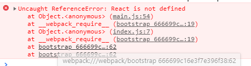

## 一、react项目概述

React 起源于 Facebook 的内部项目，因为该公司对市场上所有 JavaScript MVC 框架，都不满意，就决定自己写一套，用来架设 Instagram 的网站。做出来以后，发现这套东西很好用，就在2013年5月开源了。

由于 React的设计思想极其独特，属于革命性创新，性能出众，代码逻辑却非常简单。所以，越来越多的人开始关注和使用，认为它可能是将来 Web 开发的主流工具。

这个项目本身也越滚越大，从最早的UI引擎变成了一整套前后端通吃的 Web App 解决方案。衍生的 React Native 项目，目标更是宏伟，希望用写 Web App 的方式去写 Native App。如果能够实现，整个互联网行业都会被颠覆，因为同一组人只需要写一次 UI ，就能同时运行在服务器、浏览器和手机。

React主要用于构建UI。你可以在React里传递多种类型的参数，如声明代码，帮助你渲染出UI、也可以是静态的HTML DOM元素、也可以传递动态变量、甚至是可交互的应用组件。


特点：

1.声明式设计：React采用声明范式，可以轻松描述应用。
2.高效：React通过对DOM的模拟，最大限度地减少与DOM的交互。
3.灵活：React可以与已知的库或框架很好地配合。


### 1、Tips:

设置vscode beautify 不格式化jsx语法，并且使得jsx中html可以自动补全：

在设置中：

```json
"emmet.includeLanguages": {"javascript": "javascriptreact"},
"emmet.triggerExpansionOnTab": true,
// 设置对象一行显示
// 参考链接：https://github.com/beautify-web/js-beautify/issues/315#issuecomment-397524391
"beautify.config": {
    "brace_style": "collapse,preserve-inline"
},
```


## 二、react项目构建

还是使用webpack来构建项目：

使用`npm init -y` 生成package.json文件，安装可能使用到的模块。其内容如下：

```js
{
    "name": "reactdemo",
    "version": "1.0.0",
    "description": "",
    "main": "index.js",
    "scripts": {
        "start": "webpack-dev-server --inline",
        "build": "webpack",
        "test": "echo \"Error: no test specified\" && exit 1"
    },
    "keywords": [],
    "author": "",
    "license": "ISC",
    "devDependencies": {
        "babel-core": "^6.26.3",
        "babel-loader": "^7.1.5",
        "babel-preset-env": "^1.7.0",
        "babel-preset-react": "^6.24.1",
        "babel-preset-stage-2": "^6.24.1",
        "css-loader": "^2.1.0",
        "extract-text-webpack-plugin": "^3.0.2",
        "file-loader": "^3.0.1",
        "html-webpack-plugin": "^3.2.0",
        "less": "^3.9.0",
        "less-loader": "^4.1.0",
        "string-loader": "0.0.1",
        "url-loader": "^1.1.2",
        "webpack": "^3.11.0"
    }
}
```


编写config配置文件，由于和vue相同，这里直接放源码：

```js
let Hwp = require("html-webpack-plugin")
let Ext = require("extract-text-webpack-plugin")

module.exports = {
    entry: __dirname + "/src/main.js",
    output: {
        path: __dirname + "/dist/",
        filename: "app.js"
    },
    devtool: "source-map",
    devServer: {
        contentBase: __dirname + "/dist/",
        port: 3000,
        inline: true,
        // proxy: {
        //     "/assets": {
        //         target: "http://localhost:3000"
        //     }
        // }
    },
    resolve: {
        alias: {
            "vue": "vue/dist/vue.js"
        }
    },
    module: {
        rules: [
            { test: /\.css$/, loader: Ext.extract("css-loader") },
            { test: /\.less$/, loader: Ext.extract("css-loader!less-loader") },
            { test: /\.html$/, loader: "string-loader" },
            { test: /\.js$/, exclude: /node_modules/, loader: "babel-loader" },
            { test: /\.(png|jpg|gif)$/, use: [{ loader: 'url-loader', options: { limit: 8192 } }] }
        ]
    },
    plugins: [
        new Hwp({
            template: "index.html",
            filename: "index.html",
            inject: true
        }),
        new Ext("app.css")
    ]
}
```


由于是react项目所以还需要安装react模块：

```
npm i react react-dom -S
```

然后新建入口文件：`main.js`，这里面将进行我们第一个react示例。


## 三、第一个react示例

```jsx
import ReactDOM from 'react-dom';
import React from 'react';

// 参数一：要渲染的DOM
// 参数二：渲染到的元素
ReactDOM.render(<h1>第一个react示例</h1>, document.getElementById('app'));
```


### 1、jsx语法

上面代码第一个参数是一个html标签，和js混合在了一起，这种写法叫做`jsx`语法。

但是浏览器默认是不认识jsx语法的，所以需要插件对jsx代码进行编译解析。

这个插件就是`babel-preset-react`：

安装插件：

```
npm i babel-preset-react -D
```

修改`.babelrc`

```json
{
    "presets":["env","stage-2","react"]
}
```

之后编译运行，会报错说 React 找不到：



我们先看看原来的代码编译之后的样子：


由于会用到React对象，所以要先引入React模块：

```js
import React from 'react'
```


### 2、定义组件

#### 2.1、定义完整组件

举例：定义Box组件

```jsx
import ReactDOM from 'react-dom';
import React from 'react';

class Box extends React.Component {
    // 有些类似于vue的template
    render() {
        let username = 'Daotin';
        return (
            // 顶层元素，只能有一个
            <div>
                <p>{username}</p>
            </div>
        );
    }
}
// 渲染Box组件
ReactDOM.render(<Box />, document.getElementById('app'));
```

> 1、定义的组件必须继承自React.Component；
>
> 2、html代码中的`{}` 表示开辟一个js代码空间，可以书写js代码，一般用来插入变量。
>
> 3、render的返回值类似于vue的template（一般使用`()`包裹起来），**而且顶层元素只有一个。**


#### 2.2、state数据模型

react的数据模型书写在组件的构造函数中：

```jsx
class Box extends React.Component {
    constructor() {
        super();
        // 数据模型
        this.state = {
            username: 'lvonve'
        }
    }
    
    render() {
        return (
            <div>
                <p>{this.state.username}</p>
            </div>
        );
    }
}
```

在html模板中插入数据模型需要前缀：`this.state`

如果觉得麻烦，可以事先解构赋值出来：

```jsx
render() {
    let { username } = this.state;
    return (
        <div>
            <p>{username}</p>
        </div>
    );
}
```


#### 2.3、绑定事件

绑定事件采用类似 `onClick={this.点击事件名}` 的方式进行事件绑定。

比如点击按钮，age自加：

```jsx
render() {
    let { username, age } = this.state;
    return (
        <div>
            <p>{username}</p>
            <p>{age}</p>
            <button onClick={this.myClick}>按钮</button>
        </div>
    );
}
myClick() {
    // this.state.age++;
    this.setState({
        age: this.state.age + 1
    });
}
```

在操作数据模型的时候，类似于vuex，不能直接操作,而是要借助 `setState` 方法才可以。

> 有的时候看到有人直接 this.state.age++;，之后`this.forceUpdate();` 强制更新视图，也可以改变age的值，但是不推荐这样做！！！

由于此时的`this.setState` 的this不是Box了，所以要重新制定this的指向。

可以在Box初始化的时候就制定好事件的this指向。

```jsx
constructor() {
    super();
    // 数据模型
    this.state = {
        username: 'lvonve',
        age: 18
    };

    this.myClick = this.myClick.bind(this);
}
```

或者在html中指定：

```html
<button onClick={this.myClick.bind(this)}>按钮</button>
```

但是这中方式只在本次有效，下次绑定这个方法的时候就无效了。

 

##### 事件传递参数

还是刚才的点击按钮事件，不过这次age加的是我们传入的参数。

```jsx
render() {
    let { username, age } = this.state;
    return (
        <div>
            <p>{username}</p>
            <p>{age}</p>
            <button onClick={this.myClick(10)}>按钮</button>
        </div>
    );
}
myClick(num) {
    // this就是Box
    return (function () {
        this.setState({
            age: this.state.age + num
        });
    }).bind(this);
}
```

在绑定的事件后面传递参数。

由于onClick需要的是函数体，所以在myClick里面返回值就是一个函数体。

> 不过需要注意的是，在myClick内部，this就是Box类，所以不需要在构造函数中绑定this，而是在返回的函数体中绑定this。


#### 2.4、定义简单组件

简单组件**仅用来显示父组件传递来的数据**，无法进行事件绑定等操作。

```jsx
let Box2 = function (props) {
    return (
        <h3>{props.title}</h3>
    );
}
// 渲染Box组件
ReactDOM.render(<Box2 title="BBB" text="AAA" />, document.getElementById('app'));
```

> props为父组件传递给子组件所有数据的对象集合。


### 3、组件间传值

#### 3.1、父传子

子组件使用`this.props`接收父组件传递的数据。

```jsx
import ReactDOM from 'react-dom';
import React from 'react';

class Box extends React.Component {
    constructor() {
        super();
        this.state = {};
    }
    render() {
        return (
            <div>
                {/* 接收到父组件传递的参数 */}
                <p>接收到父组件传递的参数：{this.props.title}</p>
                <p>接收到父组件传递的参数：{this.props.text}</p>
            </div>
        );
    }
}
// 渲染Box组件
ReactDOM.render(<Box title="BBB" text="AAA" />, document.getElementById('app'));
```


如果需要在构造函数中使用的话，就需要在构造函数的参数中注入props.

```jsx
class Box extends React.Component {
    // 构造函数中注入props
    constructor(props) {
        super(props);
        this.state = {
            title: this.props.title,
            text: this.props.text,
        };
    }
    render() {
        return (
            <div>
                {/* 接收到父组件传递的参数 */}
                <p>接收到父组件传递的参数：{this.state.title}</p>
                <p>接收到父组件传递的参数：{this.state.text}</p>
            </div>
        );
    }
}
```


#### 3.2、参数的类型验证

首先需要引入`prop-types`模块，这个模块是在react安装的时候自动生成的。

```js
import propTypes from 'prop-types'
```

设置传入参数的类型有两种方式：

##### 方式一

在子组件class的外面定义：

```jsx
class Box extends React.Component {
    // ...
}
Box.propTypes = {
    title: propTypes.string,  // 规定title为string类型
    text: propTypes.string  // 规定text为string类型
}
ReactDOM.render(<Box title="BBB" text="AAA" />, document.getElementById('app'));
```

##### 方式二

在子组件class的内部定义：

```jsx
import propTypes from 'prop-types'

class Box extends React.Component {
    constructor(props) {
        super(props);
        this.state = {
            title: this.props.title,
            text: this.props.text,
        };
    }
    render() {
        return (
            <div>
                {/* 接收到父组件传递的参数 */}
                <p>接收到父组件传递的参数：{this.state.title}</p>
                <p>接收到父组件传递的参数：{this.state.text}</p>
            </div>
        );
    }
    // 定义在class内部
    static propTypes = {
        title: propTypes.string,  // 规定title为string类型
        text: propTypes.string  // 规定text为string类型
    }
}
ReactDOM.render(<Box title="BBB" text="AAA" />, document.getElementById('app'));
```


如果还要加一个必填属性，只需在规则后面加上：`isRequired`即可。

```jsx
static propTypes = {
    title: propTypes.string.isRequired,  // 规定title为string类型
    text: propTypes.string.isRequired  // 规定text为string类型
}
```

大部分类型的规则如下：

```jsx
import propTypes from 'prop-types'

//...

static propTypes = {
    // 你可以将属性声明为以下 JS 原生类型
    optionalArray: PropTypes.array,
    optionalBool: PropTypes.bool,
    optionalFunc: PropTypes.func,
    optionalNumber: PropTypes.number,
    optionalObject: PropTypes.object,
    optionalString: PropTypes.string,
    optionalSymbol: PropTypes.symbol,

    // 任何可被渲染的元素（包括数字、字符串、子元素或数组），意思就是不是一个对象。
    optionalNode: PropTypes.node,

    // 一个 React 元素
    optionalElement: PropTypes.element,

    // 你也可以声明属性为某个类的实例，这里使用 JS 的
    // instanceof 操作符实现。
    optionalMessage: PropTypes.instanceOf(Message),

    // 你也可以限制你的属性值是某个特定值之一
    optionalEnum: PropTypes.oneOf(['News', 'Photos']),

    // 限制它为列举类型之一的对象
    optionalUnion: PropTypes.oneOfType([
        PropTypes.string,
        PropTypes.number,
        PropTypes.instanceOf(Message)
    ]),

    // 一个指定元素类型的数组
    optionalArrayOf: PropTypes.arrayOf(PropTypes.number),

    // 一个指定类型的对象
    optionalObjectOf: PropTypes.objectOf(PropTypes.number),

    // 一个指定属性及其类型的对象
    optionalObjectWithShape: PropTypes.shape({
        color: PropTypes.string,
        fontSize: PropTypes.number
    }),

    // 你也可以在任何 PropTypes 属性后面加上 `isRequired` 
    // 后缀，这样如果这个属性父组件没有提供时，会打印警告信息
    requiredFunc: PropTypes.func.isRequired,

    // 任意类型的数据
    requiredAny: PropTypes.any.isRequired,

    // 你也可以指定一个自定义验证器。它应该在验证失败时返回
    // 一个 Error 对象而不是 `console.warn` 或抛出异常。
    // 不过在 `oneOfType` 中它不起作用。
    customProp: function(props, propName, componentName) {
        if (!/matchme/.test(props[propName])) {
            return new Error(
                'Invalid prop `' + propName + '` supplied to' +
                ' `' + componentName + '`. Validation failed.'
            );
        }
    },
}
```

说说最后一个：自定义属性验证，看一下这三个参数到底是什么？

```jsx
static propTypes = {
    title: function (props, propName, componentName) {
        console.log(props, propName, componentName); // {title: "BBB", text: "AAA"} "title" "Box"
    }
}
```

> props：所有参数集合对象
>
> propName：当前参数
>
> componentName：当前组件

明白了三个参数的含义，下面书写自定义规则：

```jsx
static propTypes = {
    title: function (props, propName, componentName) {
        if (props[propName] == 'Daotin') {
            // 成功必须返回null
            return null;
        } else {
            // 失败需要返回一个错误对象
            return new Error('title的值不为Daotin！');
        }
    }
}
```

然后就可以收到错误提示：`Warning: Failed prop type: title的值不为Daotin！in Box`


#### 3.3、子传父

在react中没有自定义事件，所以不能使用子组件emit事件，父组件on来监听事件。

但是可以通过：

> 父组件像子组件传递参数的时候，传递的是函数，子组件执行这个函数，然后通过这个函数的参数传递到父组件上实现子传父的功能。

示例：

```jsx
export class Home extends React.Component {
    constructor() {
        super();
        this.receive = this.receive.bind(this);
    }
    render() {
        return (
            <div>
                <Box sendFun={this.receive} />
            </div>
        );
    }
    receive(data) {
        // data即是子组件传来的数据
        console.log(data);
    }
}

class Box extends React.Component {
    constructor(props) {
        super(props);
        this.state = {
            name: '我是子组件'
        }
        this.send = this.send.bind(this);
    }
    render() {
        return (<div>
            <button onClick={this.send}>发送</button>
        </div>)
    }
    send() {
        // 调用父组件的方法，将子组件数据通过父组件函数参数传给父组件
        this.props.sendFun(this.state.name);
    }
}
```


